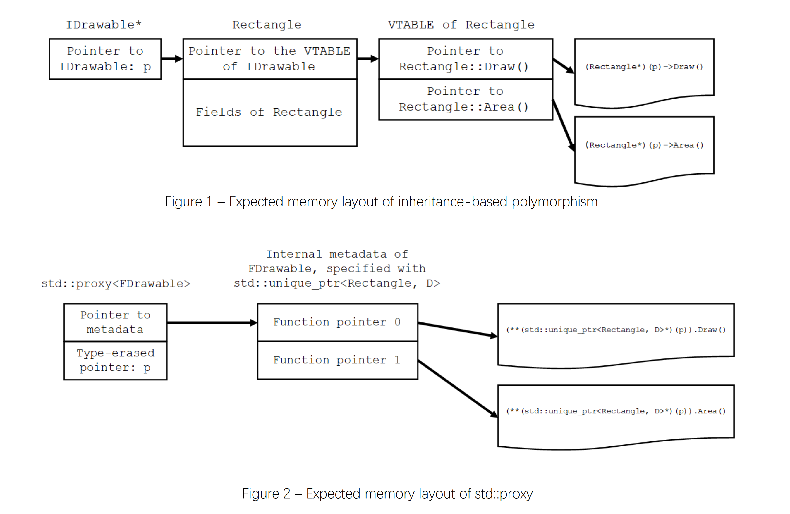

# ［C++］WG21月次提案文書を眺める（2022年02月）

文書の一覧

- [JTC1/SC22/WG21 - Papers 2022 mailing2022-02](http://www.open-std.org/jtc1/sc22/wg21/docs/papers/2022/#mailing2022-02)

全部で66本あります（SG22のWG14からのものは除きます）。

[:contents]

### [N4903 PL22.16/WG21 agenda: 7 February 2022, Virtual Meeting](http://www.open-std.org/jtc1/sc22/wg21/docs/papers/2022/n4903.html)

2022年2月7日（北米時間）に行われたWG21全体会議のアジェンダ。

C++23のための4回目の全体会議です。

### [N4904 WG21 admin telecon meetings: 2022 summer and autumn (revision 1)](http://www.open-std.org/jtc1/sc22/wg21/docs/papers/2022/n4904.pdf)

次回以降のWG21の各作業部会の管理者ミーティング。

次は2022年7月11日（北米時間）に予定されています。

### [N4905 WG21 2022-01 Admin telecon minutes](http://www.open-std.org/jtc1/sc22/wg21/docs/papers/2022/n4905.pdf)

WG21の各作業部会の管理者ミーティング。

前回から今回の会議の間のアクティビティの報告がされています。

### [N4906 Transactional Memory TS2](http://www.open-std.org/jtc1/sc22/wg21/docs/papers/2022/n4906.pdf)

P2066の最小トランザクショナルメモリのTechnical Specifications。

P2066R2については以前の記事を参照

- [P2066R2 Suggested draft TS for C++ Extensions for Minimal Transactional Memory - ［C++］WG21月次提案文書を眺める（2020年05月）](https://onihusube.hatenablog.com/entry/2020/06/01/001003#P2066R2--Suggested-draft-TS-for-C-Extensions-for-Transaction-Memory-Light)
- [P2066R3 Suggested draft TS for C++ Extensions for Minimal Transactional Memory - ［C++］WG21月次提案文書を眺める（2020年09月）](https://onihusube.hatenablog.com/entry/2020/10/09/221025#P2066R3--Suggested-draft-TS-for-C-Extensions-for-Transaction-Memory-Light)
- [P2066R4 Suggested draft TS for C++ Extensions for Minimal Transactional Memory - ［C++］WG21月次提案文書を眺める（2020年10月）](https://onihusube.hatenablog.com/entry/2020/11/02/221657#P2066R4-Suggested-draft-TS-for-C-Extensions-for-Minimal-Transactional-Memory)
- [P2066R5 Suggested draft TS for C++ Extensions for Minimal Transactional Memory - ［C++］WG21月次提案文書を眺める（2021年02月）](https://onihusube.hatenablog.com/entry/2021/03/12/225547#P2066R5-Suggested-draft-TS-for-C-Extensions-for-Minimal-Transactional-Memory)
- [P2066R6 Suggested draft TS for C++ Extensions for Minimal Transactional Memory - ［C++］WG21月次提案文書を眺める（2021年03月）](https://onihusube.hatenablog.com/entry/2021/04/10/222356#P2066R6-Suggested-draft-TS-for-C-Extensions-for-Minimal-Transactional-Memory)
- [P2066R7 Suggested draft TS for C++ Extensions for Minimal Transactional Memory - ［C++］WG21月次提案文書を眺める（2021年05月）](https://onihusube.hatenablog.com/entry/2021/06/13/165215#P2066R7-Suggested-draft-TS-for-C-Extensions-for-Minimal-Transactional-Memory)
- [P2066R8 Suggested draft TS for C++ Extensions for Minimal Transactional Memory - ［C++］WG21月次提案文書を眺める（2021年07月）](https://onihusube.hatenablog.com/entry/2021/08/14/213339#P2066R8-Suggested-draft-TS-for-C-Extensions-for-Minimal-Transactional-Memory)
- [P2066R9 Suggested draft TS for C++ Extensions for Minimal Transactional Memory - ［C++］WG21月次提案文書を眺める（2021年09月）](https://onihusube.hatenablog.com/entry/2021/10/03/193523#P2066R9-Suggested-draft-TS-for-C-Extensions-for-Minimal-Transactional-Memory)
- [P2066R10 Suggested draft TS for C++ Extensions for Minimal Transactional Memory - ［C++］WG21月次提案文書を眺める（2021年10月）](https://onihusube.hatenablog.com/entry/2021/11/13/193322#P2066R10-Suggested-draft-TS-for-C-Extensions-for-Minimal-Transactional-Memory)

### [N4907 WG21 2022-02 Virtual Meeting Minutes of Meeting](http://www.open-std.org/jtc1/sc22/wg21/docs/papers/2022/n4907.pdf)

2022年2月7日（北米時間）に行われた、WG21全体会議の議事録。

CWG/LWG/LEWGの投票の様子などが記載されています。

### [P0009R15 MDSPAN](http://www.open-std.org/jtc1/sc22/wg21/docs/papers/2022/p0009r15.html)
### [P0323R12 std::expected](http://www.open-std.org/jtc1/sc22/wg21/docs/papers/2022/p0323r12.html)
### [P0447R19 Introduction of std::hive to the standard library](http://www.open-std.org/jtc1/sc22/wg21/docs/papers/2022/p0447r19.html)
### [P0561R6 An RAII Interface for Deferred Reclamation](http://www.open-std.org/jtc1/sc22/wg21/docs/papers/2022/p0561r6.html)
### [P0792R7 function_ref: a non-owning reference to a Callable](http://www.open-std.org/jtc1/sc22/wg21/docs/papers/2022/p0792r7.html)
### [P0792R8 function_ref: a non-owning reference to a Callable](http://www.open-std.org/jtc1/sc22/wg21/docs/papers/2022/p0792r8.html)
### [P0957R5 Proxy: A Polymorphic Programming Library](http://www.open-std.org/jtc1/sc22/wg21/docs/papers/2022/p0957r5.pdf)

静的な多態的プログラミングのためのユーティリティ、"Proxy"の提案。

多態性（*Polymorphism*）はプログラムコンポーネントを分離し、拡張性を向上させるために不可欠です。ただし、そのコストとして実行時のパフォーマンスを低下させます。

現在の標準には仮想関数による継承ベースの方法とライブラリのポリモルフィックラッパ型（`std::function, std::any, std::pmr::polymorphic_allocator`など）の2つの多態性サポートがありますが、ライブラリのポリモルフィックラッパ型は特定の用途のために拡張性が制限されており、多態的なプログラミングには通常継承ベースの方法の使用が避けられません。

この提案の"Proxy"は自由に拡張可能で効率的な多態性を実現するためのユーティリティであり、多くの部分を静的に解決することによって従来のC++におけるOOPとFPの使いやすさとパフォーマンスの制限を取り払うことを目指すものです。

図形クラスによるサンプル。

```cpp
// Drawableのインターフェースクラス
class IDrawable {
public:
  virtual void Draw() const = 0;    // 図形の描画
  virtual double Area() const = 0;  // 面積の取得
};

// 長方形クラス
class Rectangle : public IDrawable {
public:
  void Draw() const override;
  void SetWidth(double width);
  void SetHeight(double height);
  void SetTransparency(double);
  double Area() const override;
};

// 円クラス
class Circle : public IDrawable {
public:
  void Draw() const override;
  void SetRadius(double radius);
  void SetTransparency(double transparency);
  double Area() const override;
};

// 点クラス
class Point : public IDrawable {
public:
  void Draw() const override;
  double Area() const override { return 0; }
};

// Drawableな対象を操作する
void DoSomethingWithDrawable(IDrawable* p) {
  printf("The drawable is: ");
  p->Draw(); // .Draw()の呼び出し
  printf(", area = %f\n", p->Area());  // .Area()の呼び出し
}

// 文字列による指定からDrawableを構築する
auto MakeDrawableFromCommand(const std::string&) -> std::unique_ptr<IDrawable>;

int main() {
  std::unique_ptr<IDrawable> p;

  p = MakeDrawableFromCommand("Rectangle 2 3");
  DoSomethingWithDrawable(p.get());

  p = MakeDrawableFromCommand("Circle 1");
  DoSomethingWithDrawable(p.get());

  p = MakeDrawableFromCommand("Point");
  DoSomethingWithDrawable(p.get());
}
```

このよくある継承ベースのポリモルフィズムのサンプルは、Proxyによって次のように書くことができます。

```cpp
#include <proxy>

// Drawableに要求される2つの操作の定義（図形の描画と面積の取得）
struct Draw : std::dispatch<
    void(), [](const auto& self) { self.Draw(); }> {};
struct Area : std::dispatch<
    double(), [](const auto& self) { return self.Area(); }> {};

// DrawableのFacadeクラスの定義
struct FDrawable : std::facade<Draw, Area> {};

// 長方形クラス
class Rectangle {
 public:
  void Draw() const
      { printf("{Rectangle: width = %f, height = %f}", width_, height_); }
  void SetWidth(double width) { width_ = width; }
  void SetHeight(double height) { height_ = height; }
  void SetTransparency(double);
  double Area() const { return width_ * height_; }

 private:
  double width_;
  double height_;
};

// 円クラス
class Circle {
 public:
  void Draw() const { printf("{Circle: radius = %f}", radius_); }
  void SetRadius(double radius) { radius_ = radius; }
  void SetTransparency(double);
  double Area() const { return std::numbers::pi * radius_ * radius_; }

 private:
  double radius_;
};

// 点クラス
class Point {
 public:
  Point() noexcept { puts("A point was created"); }
  ~Point() { puts("A point was destroyed"); }
  void Draw() const { printf("{Point}"); }
  constexpr double Area() const { return 0; }
};

// Drawableな対象をstd::proxy経由で呼び出す
void DoSomethingWithDrawable(std::proxy<FDrawable> p) {
  printf("The drawable is: ");
  p.invoke<Draw>(); // .Draw()の呼び出し
  printf(", area = %f\n", p.invoke<Area>());  // .Area()の呼び出し
}

// 文字列による指定からDrawableを構築する
auto MakeDrawableFromCommand(const std::string&) -> std::proxy<FDrawable>;

int main() {
  std::proxy<FDrawable> p;

  p = MakeDrawableFromCommand("Rectangle 2 3");
  DoSomethingWithDrawable(std::move(p));

  p = MakeDrawableFromCommand("Circle 1");
  DoSomethingWithDrawable(std::move(p));

  p = MakeDrawableFromCommand("Point");
  DoSomethingWithDrawable(std::move(p));
}
```

この提案のProxyの中核は、`std::dispatch, std::facade, std::proxy`の3つのクラスです。

`std::dispatch`は関数型と関数呼び出し可能なもの（*Callable*）をテンプレートパラメータに受け取る空のクラスで、第二引数の*Callable*にはディスパッチ処理を記述します（ここでは、メンバ関数`Draw(), Area()`の呼び出し）。`std::facade`は`std::dispatch`によって定義されたディスパッチ要件の列を受け取る空のクラスです。この2つのクラス定義ではこれ以外のことをする必要はありません（多分`using`でもいいはず）。

`std::proxy`は`std::dispatch, std::facade`によって定義した要件にアダプトした任意の型のオブジェクトを保持する型消去ラッパーです。テンプレートパラメータにディスパッチ要件を指定した`std::facade<...>`を受け取ります。構築及び代入では柔軟な変換によって任意のオブジェクトを受け取り（`std::any`の振る舞いに近い）、`.invoke<D>()`メンバ関数によって保持するオブジェクトを使用して`std::dispatch`（`D`）に指定した方法によって関数の呼び出しを行います。`.invoke<D>()`は追加の引数を受け取って呼び出される関数まで転送することもできます。

`std::proxy`はポリモルフィックなオブジェクトを外部から受け取って内部に保持するもので、そのオブジェクトの構築は任意に行うことができます。それによって、それらポリモルフィックなオブジェクトのライフタイム管理の戦略をも柔軟にカスタマイズすることができます。例えば、上記例の`MakeDrawableFromCommand()`は次のように実装されます。

```cpp
std::proxy<FDrawable> MakeDrawableFromCommand(const std::string& s) {
  // 引数をパースする（ParseCommandは別に定義されているとする）
  std::vector<std::string> parsed = ParseCommand(s);

  if (!parsed.empty()) {
    if (parsed[0u] == "Rectangle") {
      if (parsed.size() == 3u) {
        // polymorphic_allocatorとプールによるアロケートとライフタイムのカスタマイズ
        static std::pmr::unsynchronized_pool_resource rectangle_memory_pool;
        std::pmr::polymorphic_allocator<> alloc{&rectangle_memory_pool};

        auto deleter = [alloc](Rectangle* ptr) mutable { 
          alloc.delete_object<Rectangle>(ptr);
        };

        Rectangle* instance = alloc.new_object<Rectangle>();
        std::unique_ptr<Rectangle, decltype(deleter)> p{instance, deleter};

        p->SetWidth(std::stod(parsed[1u]));
        p->SetHeight(std::stod(parsed[2u]));
        
        return p; // unique_ptr -> proxyへ暗黙変換（unique_ptrを内部で保持することで間接所有する）
      }
    } else if (parsed[0u] == "Circle") {
      if (parsed.size() == 2u) {
        // ローカル（スタック）変数
        Circle circle;
        circle.SetRadius(std::stod(parsed[1u]));

        return std::make_proxy<FDrawable>(circle); // コピーして直接保持、SBO（Small Buffer Optimization）が適用される
      }
    } else if (parsed[0u] == "Point") {
      if (parsed.size() == 1u) {
        // グローバルシングルトンオブジェクト
        static Point instance;

        return &instance; // ポインタを保持
      }
    }
  }
  throw std::runtime_error{"Invalid command"};
}
```

このような柔軟で安全かつ効率的（SBOによる）なライフタイム管理は、従来の継承ベースの手法では困難だったものです。`std::proxy`はここにさらにインターフェースのディスパッチサポートが追加されていることで、継承ベースの手法と同等の多態性サポートを行うとともに、安全性と効率性や使いやすさを向上させています。

継承ベースと`std::proxy`のメモリレイアウトの比較図



- [my-stl/proxy.h - Github](https://github.com/mingxwa/my-stl/blob/cb79714c7f4332e302edcd1ec34535acf5b50b67/main/p0957/proxy.h)
- [my-stl/demo/p0957 - Github](https://github.com/mingxwa/my-stl/tree/cb79714c7f4332e302edcd1ec34535acf5b50b67/demo/p0957)
- [P0957 進行状況](https://github.com/cplusplus/papers/issues/306)

### [P1018R15 C++ Language Evolution status - pandemic edition – 2022/01-2022/02](http://www.open-std.org/jtc1/sc22/wg21/docs/papers/2022/p1018r15.html)
### [P1202R4 Asymmetric Fences](http://www.open-std.org/jtc1/sc22/wg21/docs/papers/2022/p1202r4.pdf)
### [P1223R3 `find_last`](http://www.open-std.org/jtc1/sc22/wg21/docs/papers/2022/p1223r3.pdf)

指定された値をシーケンスの後ろから探索する`find_last`アルゴリズムの提案。

これは`std::find`の逆を行うものです。現在それを書こうとすると、単純なループか`std::reverse_iterator`を使用するかのどちらかになるでしょう。

```cpp
template<std::bidirectional_iterator I, typename T>
  requires std::indirect_binary_predicate<ranges::equal_to, I, const T*>
auto find_last1(I first, I it, const T& x) {
  // ループを使った探索
  while (it-- != first) {
    if (*it == x) {
      // Use it here...
    }
  }

  return it;
}

template<std::bidirectional_iterator I, typename T>
  requires std::indirect_binary_predicate<ranges::equal_to, I, const T*>
auto find_last1(I first, I it, const T& x) {
  // reverse_iteratorとfindを使った探索
  auto rfirst = std::make_reverse_iterator(it);
  auto rlast = std::make_reverse_iterator(first);
  
  auto it2 = std::find(rfirst, rlast, x);
  // Use it here...

  return it2;
}
```

しかし、やりたい事の単純さと比較してこれらの記法はどちらも煩わしさがあります。理想的には次のようにかけるといいはずです。

```cpp
auto it2 = std::find_last(first, it, x);
```

この提案はこの`find_last`をはじめとした各種ファミリー（`find_last_if, find_last_if_not`）の標準ライブラリへの追加を目指すものです。

```cpp
namespace std::ranges {
  // イテレータペアを受け取る
  template<forward_iterator I, sentinel<I> S, class T, class Proj = identity>
    requires indirect_binary_predicate<ranges::equal_to, projected<I, Proj>, const T*>
  constexpr I find_last(I first, S last, const T& value, Proj proj = {});

  // rangeを受け取る
  template<forward_range R, class T, class Proj = identity>
    requires indirect_binary_predicate<ranges::equal_to, projected<iterator_t<R>, Proj>, const T*>
  constexpr borrowed_iterator_t<R> find_last(R&& r, const T& value, Proj proj = {});

}
```

現在の提案ではこれらの関数は全て対象の要素を発見した位置のイテレータを返すようになっていますが、`find_last()`はその実行に際してまず範囲の終端を求める必要があります（`range`を受け取る方の場合）。したがって（その他のアルゴリズム、特に`ranges`版がそうであるように）、その有用な情報をユーザーに返す必要があります。そこで、`subrange`を返すように変更することが議論されています。

```cpp
namespace std::ranges {
  // イテレータペアを受け取る
  template<forward_iterator I, sentinel<I> S, class T, class Proj = identity>
    requires indirect_binary_predicate<ranges::equal_to, projected<I, Proj>, const T*>
  constexpr subrange<I> find_last(I first, S last, const T& value, Proj proj = {});

  // rangeを受け取る
  template<forward_range R, class T, class Proj = identity>
    requires indirect_binary_predicate<ranges::equal_to, projected<iterator_t<R>, Proj>, const T*>
  constexpr borrowed_subrange_t<R> find_last(R&& r, const T& value, Proj proj = {});
}
```

この場合、指定されたものを見つけたら`[it, last)`の`subrange`を、何も見つからなかったら`[last, last)`の`subrange`を返します。

この設計の問題点は、この戻り値が`find`などと一貫していないこと、多くの場合ユーザーは終端情報（`last`）を使用しないので捨てるべき余分な情報が増えるだけと思われることです。しかし、筆者の方はこれを改善であると認識していて、その方向で議論が進んでいるようです。

- [P0957 進行状況](https://github.com/cplusplus/papers/issues/149)

### [P1478R7 Byte-wise atomic memcpy](http://www.open-std.org/jtc1/sc22/wg21/docs/papers/2022/p1478r7.html)
### [P1664R7 reconstructible_range - a concept for putting ranges back together](http://www.open-std.org/jtc1/sc22/wg21/docs/papers/2022/p1664r7.html)
### [P1774R6 Portable assumptions](http://www.open-std.org/jtc1/sc22/wg21/docs/papers/2022/p1774r6.pdf)
### [P1839R3 Accessing Object Representations](http://www.open-std.org/jtc1/sc22/wg21/docs/papers/2022/p1839r3.pdf)

`reinterpret_cast<char*>`によるオブジェクト表現へのアクセスを未定義動作とならないようにする提案。

この提案の解決する問題は、キャストとポインタ演算という2つの操作によって発生します。

```cpp
int a = 420;

char b = *reinterpret_cast<char*>(&a);  // UB
```

この`reinterpret_cast<char*>(&a)`は`static_cast<char*>(static_cast<void*>(&a))`と同じ効果となり（[[expr.reinterpret.cast]/7](http://eel.is/c++draft/expr.reinterpret.cast#7)）、そのような`static_cast`の指定するところ（[[expr.static.cast]/13](http://eel.is/c++draft/expr.static.cast#13)）によってそのポインタ値（アドレス値）は変化しません。そのため、このキャスト後のポインタは元のオブジェクトを指しています。

この時、`b`の初期化式に*lvalue-to-rvalue conversion*を適用するとその結果は`int`の値（`420`）となり、それは`char`で表現できる値ではないので未定義動作となります（[[expr.pre]/4](http://eel.is/c++draft/expr.pre#4)）。もしこの時、`char`にその表現が存在する場合でも、[[basic.types]/4](http://eel.is/c++draft/basic.types#general-4)の規定するところのオブジェクト表現は配列ではなく`unsgined char`のオブジェクトの列となってしまい、現在のオブジェクトモデルの下ではポインタ演算に適していません。

この問題はC++17でP0137R1が採択されたことによって発生した問題のようです。この提案では、ポインタが単なるメモリのアドレス表現ではなくオブジェクトを指すものという形でポインタの動作方法の変更を行なっており、そこでは、ポインタを介してオブジェクトのオブジェクト表現へアクセスする方法についての考慮がおろそかになっていたようです。

この提案では、次のような変更によってこの問題の解決を図ります。

- ある型のオブジェクト表現が連続したストレージを占有している場合、そのオブジェクト表現は`unsigned char`の配列とみなされるようにする
- `unsigned char, char, std::byte`のオブジェクトとその配列は、それ自身のオブジェクト表現とする（定義の再帰防止）
- `unsigned char, char, std::byte`以外の型のオブジェクト表現の各要素の値は未規定であり、`unsigned char, char, std::byte`のオブジェクト表現の要素の値はそれらのオブジェクト表現の値とする
- オブジェクト表現へのポインタを、`unsigned char, char, std::byte`への（ポインタ）キャストによって取得できるようにする
- オブジェクト表現へのポインタは、キャストを用いて元のオブジェクトへのポインタに戻せるようにする
- `std::launder`が、オブジェクト表現の要素ではないオブジェクトへのポインタを返すことを優先するように規定
    - 複数のオブジェクトが同じストレージを占めている時、そのような領域へのポインタに対する`std::launder`が返すポインタはプログラム定義のオブジェクトを指すものとする
    - おそらく、その時生存期間内にあるオブジェクトへのポインタを返すことを意図していると思われる、たぶん・・・
- 式の型が`unsigned char*, char*, std::byte*`の場合、オブジェクト表現の要素に対してポインタ演算できるようにする

これらの変更は新しい機能を導入するものではなく、既存の慣行を標準化するものです。


<table>
<tr>
<th>現在</th>
<th>この提案</th>
</tr>
<tr>
<td valign="top">

```cpp
using T = unsigned char*;
int a = 0;
T b = reinterpret_cast<T>(&a);
// ポインタ値は変更されない
// bはaを指す

T c = ++b;
// UB、式の型は要素型と異なる
```

</td>
<td valign="top">

```cpp
using T = unsigned char*;
int a = 0;
T b = reinterpret_cast<T>(&a);
// bはa(int)のオブジェクト表現の
// 最初の要素（unsigned char）を指す

T c = ++b;
// cはa(int)のオブジェクト表現の2番目の要素を指す

++(*c); // OK
```

</pre>
</td>
</tr>
</table>

<table>
<tr>
<th>現在</th>
<th>この提案</th>
</tr>
<tr>
<td valign="top">

```cpp
using T = unsigned char*;
int a[5]{};
T b = reinterpret_cast<T>(&a);
// ポインタ値は変更されない
// bはaを指す

for (int i = 0; i < sizeof(int) * 5; ++i){
  b[i] = 0; // UB、式の型は要素型と異なる
}
```

</td>
<td valign="top">

```cpp
using T = unsigned char*;
int a[5]{};
T b = reinterpret_cast<T>(&a);
// bはa(int[5])のオブジェクト表現の
// 最初の要素（unsigned char）を指す

for (int i = 0; i < sizeof(int) * 5; ++i){
  b[i] = 0; // OK
}
```

</pre>
</td>
</tr>
</table>

- [P1839 進行状況](https://github.com/cplusplus/papers/issues/592)

### [P1841R3 Wording for Individually Specializable Numeric Traits](http://www.open-std.org/jtc1/sc22/wg21/docs/papers/2022/p1841r3.pdf)
### [P1885R10 Naming Text Encodings to Demystify Them](http://www.open-std.org/jtc1/sc22/wg21/docs/papers/2022/p1885r10.pdf)
### [P2093R13 Formatted output](http://www.open-std.org/jtc1/sc22/wg21/docs/papers/2022/p2093r13.html)
### [P2214R2 A Plan for C++23 Ranges](http://www.open-std.org/jtc1/sc22/wg21/docs/papers/2022/p2214r2.html)
### [P2416R2 Presentation of requirements in the standard library](http://www.open-std.org/jtc1/sc22/wg21/docs/papers/2022/p2416r2.pdf)
### [P2438R2 std::string::substr() &&](http://www.open-std.org/jtc1/sc22/wg21/docs/papers/2022/p2438r2.html)
### [P2441R2 views::join_with](http://www.open-std.org/jtc1/sc22/wg21/docs/papers/2022/p2441r2.html)
### [P2446R2 views::as_rvalue](http://www.open-std.org/jtc1/sc22/wg21/docs/papers/2022/p2446r2.html)
### [P2448R2 Relaxing some constexpr restrictions](http://www.open-std.org/jtc1/sc22/wg21/docs/papers/2022/p2448r2.html)
### [P2452R0 2021 October Library Evolution and Concurrency Polls on Networking and Executors](http://www.open-std.org/jtc1/sc22/wg21/docs/papers/2022/p2452r0.html)
### [P2453R0 2021 October Library Evolution Poll Outcomes](http://www.open-std.org/jtc1/sc22/wg21/docs/papers/2022/p2453r0.html)
### [P2458R1 2022 January Library Evolution Polls](http://www.open-std.org/jtc1/sc22/wg21/docs/papers/2022/p2458r1.html)
### [P2459R0 2022 January Library Evolution Poll Outcomes](http://www.open-std.org/jtc1/sc22/wg21/docs/papers/2022/p2459r0.html)
### [P2465R2 Standard Library Modules std and std.compat](http://www.open-std.org/jtc1/sc22/wg21/docs/papers/2022/p2465r2.pdf)
### [P2467R1 Support exclusive mode for fstreams](http://www.open-std.org/jtc1/sc22/wg21/docs/papers/2022/p2467r1.html)
### [P2472R1 make function_ref more functional](http://www.open-std.org/jtc1/sc22/wg21/docs/papers/2022/p2472r1.html)
### [P2495R0 Interfacing `stringstream`s with `string_view`](http://www.open-std.org/jtc1/sc22/wg21/docs/papers/2022/p2495r0.pdf)

`std::stringstream`が`std::string_view`を受けとれるようにする提案。

`std::stringstream`は`std::string`による文字列を受け取ってその文字列によるストリームを構成するものです。C++20から`.view()`メンバ関数によってストリームの中身への`std::string_view`を取得することができるようになっていますが、ストリームの最初の内容をコンストラクタで指定する際には`std::string`しか渡せません。また、C++20から`.str()`メンバ関数によって後からストリームの中身を置き換えることができるようになっていますが、ここでも`std::string`しか渡せません。

`std::stringstream`に文字列リテラルおよび`std::string_view`を渡そうとすると、`std::string`の一時オブジェクトを作成してからそれをコンストラクタに渡さなければなりません。しかも、`std::stringstream`はそこからさらに内部の`std::string`を構築するために、コピー/ムーブすることになります。

この提案はこの問題を解決するために、コンストラクタと`.str()`の両方が`std::string_view`を受けとれるようにするものです。

その際問題となるのが、文字列リテラルを渡した時に`std::string`を受け取るオーバーロードと`std::string_view`を受けとるオーバーロードで曖昧になることです。いくつかの解決が考えられますが、この提案では文字列リテラル用のオーバーロード（`const char*`を受け取る）も同時に追加することでそれを解消しています。

この提案による変更の例

```cpp
const ios_base::openmode mode;
const allocator<char> alloc;
const string str;
// mystringはstring_viewに暗黙変換可能だとする
const mystring mstr;

stringstream s0{""};                  // ok
stringstream s1{"", alloc};           // ng -> ok
stringstream s2{"", mode, alloc};     // ng -> ok

stringstream s3{""sv};                // ng -> ok
stringstream s4{""sv, alloc};         // ng -> ok
stringstream s5{""sv, mode, alloc};   // ng -> ok

stringstream s6{""s};                 // ok
stringstream s7{""s, alloc};          // ok
stringstream s8{""s, mode, alloc};    // ok

stringstream s9{str};                 // ok
stringstream s10{str, alloc};         // ok
stringstream s11{str, mode, alloc};   // ok

stringstream s12{mstr};               // ng -> ok
stringstream s13{mstr, alloc};        // ng -> ok
stringstream s14{mstr, mode, alloc};  // ng -> ok

stringstream s15;
s15.str("");      // ok
s15.str(""sv);    // ng -> ok
s15.str(""s);     // ok
s15.str(str);     // ok
s15.str(mstr);    // ng -> ok
```

- [`std::basic_stringstream` - cppreference](https://en.cppreference.com/w/cpp/io/basic_stringstream)
- [P2495 進行状況](https://github.com/cplusplus/papers/issues/1190)

### [P2502R1 std::generator: Synchronous Coroutine Generator for Ranges](http://www.open-std.org/jtc1/sc22/wg21/docs/papers/2022/p2502r1.pdf)
### [P2505R1 Monadic Functions for std::expected](http://www.open-std.org/jtc1/sc22/wg21/docs/papers/2022/p2505r1.html)
### [P2506R0 `std::lazy`: a coroutine for deferred execution](http://www.open-std.org/jtc1/sc22/wg21/docs/papers/2022/p2506r0.pdf)

コルーチンによるタスクを表現するための`std::lazy`の提案。

`std::lazy`はC#などの他の言語では`Task`という名前のクラスであることが多いものです。

これはコルーチンによって非同期処理の実行と待機、継続処理の実行を自動化するためのユーティリティ型で例えば次のように使用します。

```cpp
// 何かのデータ型
struct record {
  int id;
  std::string name;
  std::string description;
};

// recordをどこかから読み出す非同期処理
std::lazy<record> load_record(int id);
// recordをどこかに保存する非同期処理
std::lazy<> save_record(record r);

// recordの更新処理
std::lazy<void> modify_record() {
  // これらの処理はこの順番に実行される
  record r = co_await load_record(123);     // 1. レコードの読み出し
  r.description = “Look, ma, no blocking!”; // 2. 1の実行後rが初期化されてから実行
  co_await save_record(std::move(r));       // 3. レコード保存。2の実行後に実行される
  std::cout << "modify end.\n";             // 4. 3の実行が完了してから実行される
}
```

この`modify_record()`をコルーチンではなく`future`とコールバックによって同じ実行順となるように書くと次のようになります

```cpp
// modify_record()の非コルーチン版
void modify_record_async() {
  auto f1 = load_record_async(123, [](record r) {
    r.description = “Look, ma, no blocking!”;
    auto f2 = save_record_async(std::move(r), [](){
      std::cout << "modify end.\n"
    });

    f2.wait();
  });

  f1.wait();
  // f1, f2はstd::future相当のものとする
}
```

このコールバックコードで手動でやっているようなことを、`co_await`構文を使用することで隠蔽・自動化するためのコルーチン制御を担っているのが`std::lazy`型です。

`std::lazy`は元々は別の著者によって別の提案（[P1056R1](http://www.open-std.org/jtc1/sc22/wg21/docs/papers/2022/p2506r0.pdf)）で議論されていましたが、そちらは長期間止まっていたため、この提案が引き取った形です。そのため、ほとんどの部分の設計は変更されていません。筆者の方は、`std::lazy`を含めた基本的なコルーチンユーティリティがC++20に含まれていないのは間違いであり、C++23に含まれないのはもっと間違いだ、と述べていますが、この提案は今の所C++23に向けたものではありません（C++23の設計フェーズはすでに終了しているため）。

`std::lazy`は次のようなとてもシンプルで小さいクラスです

```cpp
template<class T, class Allocator = void>
class [[nodiscard]] lazy {
public:
  lazy(lazy&& that) noexcept;
  ~lazy();

  unspecified operator co_await();

  T sync_await();
};
```

おそらくこれらのメンバ関数を明示的に呼び出すことはないでしょう。テンプレートパラメータ`T`はコルーチンから返す値の型（`move_constructible`であること）を指定し、何も返さない場合は`void`を指定することができます。2つ目の`Allocator`は、コルーチンステートのために必要となるヒープアロケーションをカスタマイズするために指定します。

`std::lazy`はコルーチンとその呼び出し元の境界で暗黙的に使用されるものであって、上記サンプルコードにあるように、呼び出し側の`co_await`を除いてコルーチン側でもこの型に対して何か明示的な操作をする必要はありません。

C++26 Executorライブラリ（[P2300](http://www.open-std.org/jtc1/sc22/wg21/docs/papers/2022/p2300r4.html)）（予定）では、`sender`とコルーチンの相互変換などの仕組みが用意されており、`std::lazy`も別の提案によって後ほどP2300にアダプトする作業が行われる予定です。

なお、`std::lazy`が`std::task`という名前ではないのは、`std::task`という名前をここで消費してしまうことを嫌ってのことのようです。

- [P2470R0 Slides for presentation of P2300R2: `std::execution` (`sender/receiver`)](http://www.open-std.org/jtc1/sc22/wg21/docs/papers/2021/p2470r0.pdf)
- [P2495 進行状況](https://github.com/cplusplus/papers/issues/1190)

この部分の7割は以下の方のご指摘によって成り立っています。

- [@yohhoyさん](https://twitter.com/yohhoy/status/1497086762895609857)

### [P2513R1 char8_t Compatibility and Portability Fix](http://www.open-std.org/jtc1/sc22/wg21/docs/papers/2022/p2513r1.html)
### [P2521R1 Contract support -- Working Paper](http://www.open-std.org/jtc1/sc22/wg21/docs/papers/2022/p2521r1.html)
### [P2528R0 C/C++ Identifier Security using Unicode Standard Annex 39](http://www.open-std.org/jtc1/sc22/wg21/docs/papers/2022/p2528r0.html)
### [P2529R0 generator should have T&& reference_type](http://www.open-std.org/jtc1/sc22/wg21/docs/papers/2022/p2529r0.html)
### [P2530R0 Why Hazard Pointers should be in C++26](http://www.open-std.org/jtc1/sc22/wg21/docs/papers/2022/p2530r0.pdf)
### [P2531R0 C++ Standard Library Issues to be moved in Virtual Plenary, Feb. 2022](http://www.open-std.org/jtc1/sc22/wg21/docs/papers/2022/p2531r0.html)
### [P2532R0 Removing exception_ptr from the Receiver Concepts](http://www.open-std.org/jtc1/sc22/wg21/docs/papers/2022/p2532r0.html)
### [P2533R0 Core Language Working Group "ready" Issues for the February, 2022 meeting](http://www.open-std.org/jtc1/sc22/wg21/docs/papers/2022/p2533r0.html)
### [P2534R0 Slides: function_ref in the wild (P0792R7 presentation)](http://www.open-std.org/jtc1/sc22/wg21/docs/papers/2022/p2534r0.pdf)
### [P2535R0 Message fences](http://www.open-std.org/jtc1/sc22/wg21/docs/papers/2022/p2535r0.pdf)
### [P2536R0 Distributing C++ Module Libraries with dependencies json files.](http://www.open-std.org/jtc1/sc22/wg21/docs/papers/2022/p2536r0.pdf)
### [P2537R0 Relax va_start Requirements to Match C](http://www.open-std.org/jtc1/sc22/wg21/docs/papers/2022/p2537r0.html)
### [P2538R0 ADL-proof std::projected](http://www.open-std.org/jtc1/sc22/wg21/docs/papers/2022/p2538r0.html)
### [P2540R0 Empty Product for certain Views](http://www.open-std.org/jtc1/sc22/wg21/docs/papers/2022/p2540r0.html)
### [P2542R0 views::concat](http://www.open-std.org/jtc1/sc22/wg21/docs/papers/2022/p2542r0.html)
### [P2544R0 C++ exceptions are becoming more and more problematic](http://www.open-std.org/jtc1/sc22/wg21/docs/papers/2022/p2544r0.html)
### [P2545R0 Why RCU Should be in C++26](http://www.open-std.org/jtc1/sc22/wg21/docs/papers/2022/p2545r0.pdf)
### [P2546R0 Debugging Support](http://www.open-std.org/jtc1/sc22/wg21/docs/papers/2022/p2546r0.html)
### [P2547R0 Language support for customisable functions](http://www.open-std.org/jtc1/sc22/wg21/docs/papers/2022/p2547r0.pdf)
### [P2549R0 std::unexpected should have error() as member accessor](http://www.open-std.org/jtc1/sc22/wg21/docs/papers/2022/p2549r0.html)
### [P2550R0 ranges::copy should say output_iterator somewhere](http://www.open-std.org/jtc1/sc22/wg21/docs/papers/2022/p2550r0.html)
### [P2551R0 Clarify intent of P1841 numeric traits](http://www.open-std.org/jtc1/sc22/wg21/docs/papers/2022/p2551r0.pdf)
### [P2552R0 On the ignorability of standard attributes](http://www.open-std.org/jtc1/sc22/wg21/docs/papers/2022/p2552r0.pdf)
### [P2553R0 Make mdspan size_type controllable](http://www.open-std.org/jtc1/sc22/wg21/docs/papers/2022/p2553r0.html)
### [P2554R0 C-Array Interoperability of MDSpan](http://www.open-std.org/jtc1/sc22/wg21/docs/papers/2022/p2554r0.html)
### [P2555R0 Naming improvements for std::execution](http://www.open-std.org/jtc1/sc22/wg21/docs/papers/2022/p2555r0.html)
### [P2557R0 WG21 2022-02 Virtual Meeting Record of Discussion](http://www.open-std.org/jtc1/sc22/wg21/docs/papers/2022/p2557r0.pdf)
