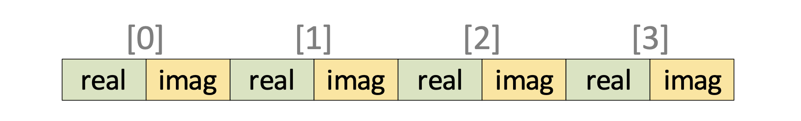

# ［C++］WG21月次提案文書を眺める（2022年09月）

文書の一覧

- [JTC1/SC22/WG21 - Papers 2022 mailing2022-09](http://www.open-std.org/jtc1/sc22/wg21/docs/papers/2022/#mailing2022-09)

全部で80本あります。

[:contents]

### [N4923 Working Draft, Extensions to C++ for Transactional Memory Version 2](https://www.open-std.org/jtc1/sc22/wg21/docs/papers/2022/n4923.pdf)

P2066ベースの最小トランザクショナルメモリのTechnical Specifications。

差分は下の方のP2682R0の項を参照。

### [P0592R5 To boldly suggest an overall plan for C++26](https://www.open-std.org/jtc1/sc22/wg21/docs/papers/2022/p0592r5.html)

C++26に向けて、具体的に取り組むべき項目についての文書。

P2000はC++の大まかな方向性を指し示すような文書ですが、これはより具体的に次の3年間の作業項目（の内最高優先度のもの）をリストアップするものです。

C++26に向けて取り組むべきものとしては次のものが挙げられています

- C++26入りを目指すもの
    - Execution（[P2300](https://www.open-std.org/jtc1/sc22/wg21/docs/papers/2022/p2300r5.html)）
    - Rangesの改善（[P2214](https://www.open-std.org/jtc1/sc22/wg21/docs/papers/2021/p2214r1.html)）
    - Reflection（[P2237](https://www.open-std.org/jtc1/sc22/wg21/docs/papers/2020/p2237r0.pdf)）
- C++26作業期間中に進捗させるもの
    - 契約
    - パターンマッチ

コルーチンのライブラリサポートはExecutionに含まれており、ネットワークはExecutionとの親和性などの問題から一旦ストップしています。また、特別に優先されてはいませんが線形代数ライブラリの提案も順調に進行しています。

### [P0876R11 `fiber_context` - fibers without scheduler](https://www.open-std.org/jtc1/sc22/wg21/docs/papers/2022/p0876r11.pdf)

スタックフルコルーチンのための`fiber_context`の提案。

C++20で導入されたコルーチンはスタックレスコルーチンのための言語基盤とライブラリ機能のみでした。この提案はそれに加えてスタックフルコルーチンを導入しようとするものです。

コルーチンではコルーチンの中断・再開のためにコルーチンフレームという保存領域を必要とします。ここにはコルーチン引数やコルーチン内部の自動変数が保存されており、コルーチンが終了しコルーチンハンドルが解放されるまで複数回の中断・再開を跨いで1つの状態を維持しています。

スタックレスコルーチンではコルーチンフレームにコールスタックが保存されていないことから、コルーチン内部でネストした関数呼び出し内部からコルーチンを中断することができません（スタックレスコルーチンは、コルーチンフレームに状態を維持してそれを利用していること以外は通常の関数呼び出しと同じように処理されています）。対してスタックフルコルーチンは、コルーチンフレームに加えてコールスタックも独自に保持していることによって、コルーチン内部でネストした関数呼び出し内からでも中断することができます。

これによって、スタックフルコルーチンは任意のタイミングでコルーチンを中断/再開することができるようになり利便性が増しますが、デメリットとして呼び出しに伴うスタックをほぼ全て自前で用意し利用するため、生成や維持が高コストになります。また、スタックフルコルーチンはその特性から言語機能を必要とせずにライブラリ機能として実装可能で、この提案もコア言語に対する追加・変更を含んでいません。

ここで導入しようとしてるのは`fiber_context`というクラス型のみで、これはBoost.Contextに相当するスタックフルコルーチン（提案の用語では専らファイバー（*fiber*））アプリケーションのための基盤となる機能です。ちょうど、C++20でスタックレスコルーチンの基盤となる言語とライブラリ機能のみが整備されたのと同じ感じです。

```cpp
// fiber_contextの宣言例
namespace std::experimental::inline concurrency_v2 {
  class fiber_context {
  public:
    fiber_context() noexcept;

    template<typename F>
    explicit fiber_context(F&& entry);

    ~fiber_context();

    fiber_context(fiber_context&& other) noexcept;
    fiber_context& operator=(fiber_context&& other) noexcept;
    fiber_context(const fiber_context& other) noexcept = delete;
    fiber_context& operator=(const fiber_context& other) noexcept = delete;

    fiber_context resume() &&;

    template<typename Fn>
    fiber_context resume_with(Fn&& fn) &&;

    // stop token handling
    [[nodiscard]] stop_source get_stop_source() noexcept;
    [[nodiscard]] stop_token get_stop_token() const noexcept;
    bool request_stop() noexcept;

    bool can_resume() noexcept;
    explicit operator bool() const noexcept;
    bool empty() const noexcept;

    void swap(fiber_context& other) noexcept;

  private:
    stop_source ssource; // exposition only
  };
}
```

`fiber_context`はコンテキストスイッチ（すなわち、コルーチンの中断と再開）のための最小限の機能を持つクラスです。どのようにコンテキストスイッチを行うかという部分はこれを用いてユーザーが指定するものであるため、スケジューラの機能も含まれてはいません。また、`fiber_context`は内部でスタックフルコルーチンのためのスタック等を保持しているためコピーは危険であり、ムーブオンリーなクラスとされています。

基本的には`.resume()`によって操作します。あるコルーチン中で`fc.resume()`を呼ぶと現在のコルーチンは中断し`fc`のコルーチンが再開します。

さらに、[`std::jthread`](https://cpprefjp.github.io/reference/thread/jthread.html)と同様の[`std::stop_source`](https://cpprefjp.github.io/reference/stop_token/stop_source.html)/[`std::stop_token`](https://cpprefjp.github.io/reference/stop_token/stop_token.html)による協調的キャンセル機構を備えていることで、そのコンテキスト上の処理のキャンセルを行うことができます（ただし、実際にそれを行うのは処理を定義するユーザーの責任です）。

提案文書より、STLアルゴリズムを使用する例

```cpp
int maine() {
  // 生成された値をやり取りする中間変数
  int a;

  autocancel consumer, generator;

  // フィボナッチ数列を生成する
  generator = autocancel{[&a, &consumer, &generator](std::fiber_context&& m){
    a = 0;
    int b = 1;

    while (! generator.stop_requested()){
      // generatorを中断し、consumerを再開する
      generator.resume(consumer);
      
      // フィボナッチ数列の計算
      int next = a+b;
      a = b;
      b = next;
    }

    return std::move(m);
  }};

  // generatorが生成した値を出力する
  consumer = autocancel{[&a, &consumer, &generator](std::fiber_context&& m){
    std::vector<int> v(10);

    // vectorに生成した値を保存する、数はこの範囲の長さ=10
    std::generate(v.begin(), v.end(), [&a, &consumer, &generator]() mutable {
      // consumerを中断し、generatorを再開する
      consumer.resume(generator);
      return a;
    });

    std::cout << "v: ";

    for (auto i: v) {
      std::cout << i << " ";
    }

    std::cout << "\n";

    return std::move(m);
  }};

  // consumerの開始
  consumer.resume();
}
```

出力

```
v: 0 1 1 2 3 5 8 13 21 34
```

ここで使用されている`autocancel`は、`fiber_context`によって次のように実装されています

```cpp
// fiber_context上の処理を自動停止し、安全に終了させるためのRAIIラッパー
class autocancel{
private:
  std::fiber_context f_;

public:
  autocancel() = default;

  template <typename Fn>
  autocancel(Fn&& entry_function)
    : f_{std::forward<Fn>(entry_function)}
  {}

  autocancel& operator=(autocancel&& other) = default;
  
  ~autocancel() {
    // キャンセル要求を送ってから
    f_.request_stop();

    // 実行終了（fiber_contextが空になるの）を待機
    // fiber_contextが空になる=そのコンテキスト上の処理が実行中
    // request_stop()を通知しているので、その処理はそこで終了する（はず
    // fiber_contextのoperator bool()は、!f_.empty() と等価
    while (f_) {
      resume(*this);
    }
  }

  // 処理をキャンセルする
  bool stop_requested() const noexcept {
    return f_.get_stop_source().stop_requested();
  }

  // 初回に処理を開始するためのresume()
  std::fiber_context resume() {
    // これによって、一旦this->f_は空になる
    return std::move(f_).resume();
  }

  // 別のautocancelを受け取り、自身を中断しそれを再開する
  void resume(autocancel& ac) {
    // 別のautocancel（ac）を再開する
    std::move(ac.f_).resume_with([this](std::fiber_context&& f) -> std::fiber_context {
      // このラムダは、ac.f_のコンテキスの最初（再開直前）に呼ばれる
      // ここでfに渡ってくるのはthis->f_だったもの、コンテキストスイッチ時に適切に保存する
      f_ = std::move(f);

      // 空のfiber_contextを返す（これは上記例では捨てられる）
      return {};
    });
  }
};
```

あるスタックフルコルーチンが実行中である場合そのスタックフルコルーチンの`fiber_context`は空の状態（`f_.empty() == true`）になっています。`autocancel::resume()`の処理は、制御フローが予測可能でない場合に適切に`fiber_context`を伝播するためのパターンです。

`fiber_context`を用いることで、Boost.CoroutineやBoost.fiberなどのより高機能なスタックフルコルーチンアプリケーションを記述することができるようになります。[提案内にそのリスト](https://www.open-std.org/jtc1/sc22/wg21/docs/papers/2022/p0876r11.pdf#page=17&zoom=100,79,444)があり、これらのアプリケーションの存在こそがスタックフルコルーチンを標準でサポートするべき理由であり、また、この`fiber_context`のようなクラスは標準C++の範囲で移植可能なように実装することは不可能であるためこの機能を標準に用意しておくことには価値がある、と述べられています。

- [C++20 コルーチン - cpprefjp](https://cpprefjp.github.io/lang/cpp20/coroutines.html)
- [20分くらいでわかった気分になれるC++20コルーチン](https://www.docswell.com/s/yohhoy/L57EJK-cpp20coro)
- [Coroutines introduction - C++ - Panic Software](https://blog.panicsoftware.com/coroutines-introduction/)
- [Boost.Contextでファイバーライブラリを実装してみた - yohhoyの日記（別館）](https://yohhoy.hatenablog.jp/entry/2012/04/10/003735)
- [P0876 進行状況](https://github.com/cplusplus/papers/issues/117)

### [P0987R2 polymorphic_allocator instead of type-erasure](https://www.open-std.org/jtc1/sc22/wg21/docs/papers/2022/p0987r2.pdf)
### [P1061R3 Structured Bindings can introduce a Pack](https://www.open-std.org/jtc1/sc22/wg21/docs/papers/2022/p1061r3.html)
### [P1068R6 Vector API for random number generation](https://www.open-std.org/jtc1/sc22/wg21/docs/papers/2022/p1068r6.pdf)
### [P1083R7 Move resource_adaptor from Library TS to the C++ WP](https://www.open-std.org/jtc1/sc22/wg21/docs/papers/2022/p1083r7.pdf)
### [P1385R7 A proposal to add linear algebra support to the C++ standard library](https://www.open-std.org/jtc1/sc22/wg21/docs/papers/2022/p1385r7.pdf)
### [P1673R10 A free function linear algebra interface based on the BLAS](https://www.open-std.org/jtc1/sc22/wg21/docs/papers/2022/p1673r10.html)
### [P1709R3 Graph Library](https://www.open-std.org/jtc1/sc22/wg21/docs/papers/2022/p1709r3.pdf)

グラフアルゴリズムとデータ構造のためのライブラリ機能の提案。

グラフデータ構造は機械学習などの科学分野やビジネスやゲームをはじめとする一般的なプログラミングにおいて非常によく使用されますが、現在のC++の標準にはグラフデータ構造とそれを利用するアルゴリズムのサポートがほぼ皆無です。機械学習の一分野であるAIが近年大きく注目を集めるなど、グラフデータ構造を扱える標準ライブラリの必要性は増しています。

この提案はグラフデータ構造とそのアルゴリズムのためのライブラリの統一的なインターフェースを提示するもので、概念実証のような段階です。

ここで提案されているAPIはおおよそ次のような感じで使用することができるものです

```cpp
using G = … <graph definition>
G g(...); // グラフの構築

for (auto& u : g) { // グラフGの頂点をイテレーション
  for (auto& uv : edges(g, u)) { // 頂点uのエッジをイテレーション
    ...; // uとuvを用いた処理
  }
}

for (auto& uv : edges(g)) { // グラフの全てのエッジをイテレーション
  auto& u = in_vertex(g, uv);  // エッジuvの頂点の一方
  auto& v = out_vertex(g, uv); // エッジuvの頂点のもう一方
  ...; // uv, u, vを用いた処理
}
```

グラフとは頂点の範囲であり、頂点はエッジの範囲を持ちます（あるいは、範囲の範囲です）。エッジに焦点を当てる場合、グラフとは2つの頂点を持つエッジの範囲でもあります。

グラフには有向グラフと無向グラフがあり、このAPIではそれらを統一的に扱うことにも重点を置いています。APIは無向グラフを基本として整備されており、有向グラフに対しては`out_`付のものを使用するようになっています。ただし、それはエイリアスによってほぼ自動で処理されており、例えば上記例の`edges(g, u)`は有向グラフに対しては`out_edges(g, u)`のエイリアスとなります。

この提案のAPIは、グラフのプロパティを問い合わせる各種エイリアステンプレートとフリー関数テンプレートを用いて構成されています。

[Wikipediaの幅優先探索のページ](https://ja.wikipedia.org/wiki/幅優先探索)にある「ドイツの都市間の接続を示した例」のグラフを構築するサンプル。

```cpp
// グラフのデータ型
struct route {
  string from;
  string to;
  int km = 0;

  route(string const& from_city, string const& to_city, int kilometers)
    : from(from_city), to(to_city), km(kilometers) {}
};

std::vector<route> routes{
  {"Frankfürt", "Mannheim", 85}, {"Frankfürt", "Würzburg", 217},
  {"Frankfürt", "Kassel", 173}, {"Mannheim", "Karlsruhe", 80},
  {"Karlsruhe", "Augsburg", 250}, {"Augsburg", "München", 84},
  {"Würzburg", "Erfurt", 186}, {"Würzburg", "Nürnberg", 103},
  {"Nürnberg", "Stuttgart", 183}, {"Nürnberg", "München", 167},
  {"Kassel", "München", 502}
};

// グラフコンテナ型
using G1 = adjacency_list<name_value, weight_value, empty_value,
                          edge_type_undirected, edge_link_double,
                          map_vertex_set_proxy>;

// グラフコンテナの構築
auto g1 = create_adjacency_list<G1>();

// グラフの構築
for (auto& r : routes) {
  create_edge(g, r.from, r.to, r.km);
}
```

これを用いて、深さ優先探索するサンプル

```cpp
dfs_vertex_range rng(g, g.find_vertex("Frankfürt"));

for (vertex_iterator_t<G> u = rng.begin(); u != rng.end(); ++u) {
  std::cout << std::string(u.depth() * 2, ' ') << u->name << std::endl;
}
```
```
Frankfürt
  Mannheim
  Karlsruhe
    Augsburg
      München
  Würzburg
    Erfurt
    Nürnberg
      Stuttgart
  Kassel
```

幅優先探索するサンプル

```cpp
bfs_vertex_range bfs_vtx_rng(g, begin(g) + 2); // Frankfürt

for (auto u = bfs_vtx_rng.begin(); u != bfs_vtx_rng.end(); ++u) {
  std::cout << std::string(u.depth() * 2, ' ') << u->name << std::endl;
}
```
```
Frankfürt
Mannheim
Würzburg
Kassel
  Karlsruhe
  Erfurt
  Nürnberg
  München
    Augsburg
    Stuttgart
```

エッジに注目して深さ優先探索するサンプル

```cpp
dfs_edge_range rng(g, begin(g) + 2); // Frankfürt

for (vertex_edge_iterator_t<G> uv = rng.begin(); uv != rng.end(); ++uv) {
  vertex_iterator_t<G> u = out_vertex(g, *uv);
  vertex_key_t<G> u_key = vertex_key(g, *u);

  if (uv.is_back_edge()) {
    std::cout << std::string(uv.depth() * 2, ' ')
              << "view " << uv.back_vertex()->name << std::endl;
  } else {
    vtx_iter_t v = out_vertex(g, *uv); // or vertex(g, *uv)
    std::cout << std::string(uv.depth() * 2, ' ') << "travel " << u->name
              << " --> " << v->name << " " << uv->weight << "km" << std::endl;
  }
}
```

```
travel Frankfürt --> Mannheim 85km
  travel Mannheim --> Karlsruhe 80km
  travel Karlsruhe --> Augsburg 250km
  travel Augsburg --> München 84km
view München
  travel Frankfürt --> Würzburg 217km
  travel Würzburg --> Erfurt 186km
    view Erfurt
  travel Würzburg --> Nürnberg 103km
  travel Nürnberg --> Stuttgart 183km
    view Stuttgart
  travel Nürnberg --> München 167km
travel Frankfürt --> Kassel 173km
travel Kassel --> München 502km
```

提案されているグラフアルゴリズムには、ダイクストラ/ベルマンフォード法、各種連結成分の抽出、関節点や推移平方の抽出のほか、`std::erase/std::erase_if`などがあります。

- [P1709 進行状況](https://github.com/cplusplus/papers/issues/476)

### [P1759R4 Native handles and file streams](https://www.open-std.org/jtc1/sc22/wg21/docs/papers/2022/p1759r4.html)
### [P1928R1 Merge data-parallel types from the Parallelism TS 2](https://www.open-std.org/jtc1/sc22/wg21/docs/papers/2022/p1928r1.pdf)

`std::simd<T>`をParallelism TS v2から標準ライブラリへ移す提案。

`std::simd<T>`を含むParallelism TS v2は2018年に発行されました。その後GCC9リリースの後、`std::simd<T>`の完全な実装（ただしGCC専用）が行われ、GCC11以降はlibstdc++の一部となっています。そして、Parallelism TS v2発行後`std::simd<T>`に対する十分なフィードバックが寄せられています。

この提案は、それらのフィードバックを`std::simd<T>`に適用しつつ、`std::simd<T>`をC++26を目指してワーキングドラフトにマージしようとするものです。

- [P2638R0 Intel's response to P1915R0 for std::simd parallelism in TS 2 - WG21月次提案文書を眺める（2022年09月）](https://onihusube.hatenablog.com/entry/2022/10/09/021557#P2638R0-Intels-response-to-P1915R0-for-stdsimd-parallelism-in-TS-2)
- [VcDevel/std-simd - Github](https://github.com/VcDevel/std-simd)
- [jfalcou/eve EVE - the Expressive Vector Engine](https://github.com/jfalcou/eve)
- [libstdc++ : simd.h](https://gcc.gnu.org/onlinedocs/gcc-12.1.0/libstdc++/api/a01088_source.html)
- [P1928 進行状況](https://github.com/cplusplus/papers/issues/670)

### [P1967R9 #embed - a simple, scannable preprocessor-based resource acquisition method](https://www.open-std.org/jtc1/sc22/wg21/docs/papers/2022/p1967r9.html)
### [P2000R4 Direction for ISO C++](https://www.open-std.org/jtc1/sc22/wg21/docs/papers/2022/p2000r4.pdf)

C++26に向けて、C++の標準化の方向性を示す文書。

この文書の内容を念頭に、各種提案の優先順位づけや新しい機能についての議論が行われることになります。

このリビジョンでの大きな変更は、中期目標（3~10年）としてより安全なC++に向けてのセクションが追加されたことです。

### [P2019R2 Usability improvements for std::thread](https://www.open-std.org/jtc1/sc22/wg21/docs/papers/2022/p2019r2.pdf)
### [P2047R4 An allocator-aware optional type](https://www.open-std.org/jtc1/sc22/wg21/docs/papers/2022/p2047r4.html)
### [P2164R7 views::enumerate](https://www.open-std.org/jtc1/sc22/wg21/docs/papers/2022/p2164r7.pdf)
### [P2248R6 Enabling list-initialization for algorithms](https://www.open-std.org/jtc1/sc22/wg21/docs/papers/2022/p2248r6.html)
### [P2263R1 A call for a WG21 managed chat service](https://www.open-std.org/jtc1/sc22/wg21/docs/papers/2022/p2263r1.html)
### [P2392R2 Pattern matching using is and as](https://www.open-std.org/jtc1/sc22/wg21/docs/papers/2022/p2392r2.pdf)
### [P2505R5 Monadic Functions for std::expected](https://www.open-std.org/jtc1/sc22/wg21/docs/papers/2022/p2505r5.html)
### [P2527R1 std::variant_alternative_index and std::tuple_element_index](https://www.open-std.org/jtc1/sc22/wg21/docs/papers/2022/p2527r1.html)
### [P2530R1 Why Hazard Pointers should be in C++26](https://www.open-std.org/jtc1/sc22/wg21/docs/papers/2022/p2530r1.pdf)
### [P2539R2 Should the output of std::print to a terminal be synchronized with the underlying stream?](https://www.open-std.org/jtc1/sc22/wg21/docs/papers/2022/p2539r2.html)
### [P2539R3 Should the output of std::print to a terminal be synchronized with the underlying stream?](https://www.open-std.org/jtc1/sc22/wg21/docs/papers/2022/p2539r3.html)
### [P2545R1 Why RCU Should be in C++26](https://www.open-std.org/jtc1/sc22/wg21/docs/papers/2022/p2545r1.pdf)
### [P2546R2 Debugging Support](https://www.open-std.org/jtc1/sc22/wg21/docs/papers/2022/p2546r2.html)
### [P2548R1 copyable_function](https://www.open-std.org/jtc1/sc22/wg21/docs/papers/2022/p2548r1.pdf)
### [P2561R1 An error propagation operator](https://www.open-std.org/jtc1/sc22/wg21/docs/papers/2022/p2561r1.html)
### [P2581R2 Specifying the Interoperability of Built Module Interface Files](https://www.open-std.org/jtc1/sc22/wg21/docs/papers/2022/p2581r2.pdf)
### [P2592R2 Hashing support for std::chrono value classes](https://www.open-std.org/jtc1/sc22/wg21/docs/papers/2022/p2592r2.html)
### [P2614R1 Deprecate numeric_limits::has_denorm](https://www.open-std.org/jtc1/sc22/wg21/docs/papers/2022/p2614r1.pdf)
### [P2630R1 Submdspan](https://www.open-std.org/jtc1/sc22/wg21/docs/papers/2022/p2630r1.html)
### [P2632R0 A plan for better template meta programming facilities in C++26](https://www.open-std.org/jtc1/sc22/wg21/docs/papers/2022/p2632r0.pdf)

C++26及びそれ以降に向けて、テンプレートメタプログラミングサポート改善のための機能を入れていくための計画表。

ここでは主に、コア言語の拡張によって既存のテンプレートメタプログラミングテクニックの問題（専門知識が必要、コンパイル時間増大、使いづらい、など）を解決するべく、そのような機能の列挙と関連する提案についての優先順位付を行うものです。

- Tier 1
    - Pack Indexing : [P1858R2](https://wg21.link/P1858R2)
    - Member Pack : [P1858R2](https://wg21.link/P1858R2)
    - Pack Aliases : [P1858R2](https://wg21.link/P1858R2)
    - Unpacking structured types : [P1858R2](https://wg21.link/P1858R2)
    - `constexpr` structured bindings : [P1481R0](https://wg21.link/P1481R0)
    - `static_assert(false)` : [P2593R0](https://wg21.link/P2593R0)
    - `constexpr`/pack ternary 
    - Expansion statements : [P1306R1](https://wg21.link/P1306R1)
- Tier 2
    - Reflection : [P1240R2](https://wg21.link/P1240R2)
    - Packs in structured bindings : [P1061R2](https://wg21.link/P1061R2)
    - Generalized structural types : [P2484R0](https://wg21.link/P2484R0)
    - Integer sequences in the core language 
    - Deducing forwarding reference : [P2481R1](https://wg21.link/P2481R1)
    - Pack Slicing : [P1858R2](https://wg21.link/P1858R2)
    - Universal template parameters : [P1985R1](https://wg21.link/P1985R1)
    - Variable template template params 
    - Concept template template params 
    - Deleting variable templates : [P2041R1](https://wg21.link/P2041R1)
    - Packs outside of templates : [P1858R2](https://wg21.link/P1858R2)、[P2277R0](https://wg21.link/P2277R0)
    - Non-trailing parameter packs deduction : [P2347R2](https://wg21.link/P2347R2)
    - `std::forward` in the language : [P0644R1](https://wg21.link/P0644R1)
    - Simplified structured bindings protocol : [P2120R0](https://wg21.link/P2120R0)
    - `std::is_structured_type`
    - `static_assert` with expression as message
    - `static_assert` packs 
- Tier 3
    - Packs as return value
    - Destructuring aggregates/C-arrays : [P2141R0](https://wg21.link/P2141R0)、[P2580R0](https://wg21.link/P2580R0)
    - Pack literals
    - Meta algorithms on packs (unique, etc)
- Tier 4
    - Multiple levels of pack expansions
    - Language variants/tuples
    - Pack of variables declaration
    - Step for pack slicing
    - Member traits(Dot syntax on types/enums)

Tier1の機能は理解が進んでおりコストメリットが高く、相互に独立して標準化することができるものです。Tier2の機能はTier1と比較すると複雑さが増したり有用性が低いものです。この2つのグループはC++26をターゲットにしています。

Tier3の機能は便利である可能性があるもののリスクがありさらに研究が必要なものです。Tier4の機能は他の機能と重複していたりコストメリットが低いものです。

これらの機能の一部、特にTier1/2の機能のほとんどはCircleによる実装経験があります。

提案ではそれぞれの機能についての簡単な解説が行われています。

- [P2632 進行状況](https://github.com/cplusplus/papers/issues/1315)

### [P2636R1 References to ranges should always be viewable](https://www.open-std.org/jtc1/sc22/wg21/docs/papers/2022/p2636r1.html)
### [P2637R1 Member visit](https://www.open-std.org/jtc1/sc22/wg21/docs/papers/2022/p2637r1.html)
### [P2640R1 Modules: Inner-scope Namespace Entities: Exported or Not?](https://www.open-std.org/jtc1/sc22/wg21/docs/papers/2022/p2640r1.pdf)
### [P2641R1 Checking if a union alternative is active](https://www.open-std.org/jtc1/sc22/wg21/docs/papers/2022/p2641r1.html)
### [P2642R1 Padded mdspan layouts](https://www.open-std.org/jtc1/sc22/wg21/docs/papers/2022/p2642r1.html)
### [P2644R0 Get Fix of Broken Range-based for Loop Finally Done](https://www.open-std.org/jtc1/sc22/wg21/docs/papers/2022/p2644r0.pdf)

範囲`for`文の13年間放置されているバグを修正する提案。

これは以前にP2012で提案されていたのを再提案するものです。

範囲`for`文はシンタックスシュガーであり、イテレータを用いたループに書き換えられて実行されていますが、そのせいで見えづらいダングリング参照/イテレータが発生することがあります。

この問題は少なくとも13年前から知られていましたが解決されることなく今に至っています。C++23に向けて[P2012](https://wg21.link/p2012)がこの問題の解決を目指していましたが、問題の解決の必要性では合意されたものの局所的な解決よりもより広範な解決策が望まれたこともあり、P2012はC++23に間に合いませんでした。

結局その後それを補うような提案が出てくることはなかったため、この提案は改めてP2012で提案していたことを提案し直すものです。

提案する内容はシンプルで、範囲`for`文で暗黙的に導入されるオブジェクトの生存期間について特別扱いするもので、その生存期間は範囲`for`文終了までというように規定しようとしています。

このアプローチは範囲`for`の動作を変更するものではないため、一時オブジェクトの寿命についてのより広範な解決策が後から提案されたとしてもそれを妨げることはありません。

|問題のあるコード|現在|この提案後|
|---|---|---|
|`for (auto e : getTmp().getRef())`|UB|OK|
|`for (auto e : getVector()[0]) `|UB|OK|
|`for (auto valueElem : getMap()["key"])`|UB|OK|
|`for (auto e : get<0>(getTuple()))`|UB|OK|
|`for (auto e : getOptionalColl().value())`|UB|OK|
|`for (char c : get<string>(getVariant()))`|UB|OK|
|`for (auto s : std::span{arrOfConst()}.last(2))`|UB|OK|
|`for (auto e : std::span(getVector().data(), 2))`|UB|OK|
|`for (auto e: co_await coroReturningRef())`|UB|OK|
|`getValue()`が参照を返すとして</br>`for (char c : getData().value)` </br> `for (char c : getData().getValue())`|</br>OK</br>UB|</br>OK</br>OK|

- [P2012R0 Fix the range-based for loop, Rev0ix the range-based for loop](https://onihusube.hatenablog.com/entry/2020/12/06/015108#P2012R0-Fix-the-range-based-for-loop-Rev0ix-the-range-based-for-loop)
- [P2644 進行状況](https://github.com/cplusplus/papers/issues/1316)

### [P2646R0 Explicit Assumption Syntax Can Reduce Run Time](https://www.open-std.org/jtc1/sc22/wg21/docs/papers/2022/p2646r0.pdf)

`[[assume(expr)]]`の利点についての理論的な面と実験結果を記述した文書。

`[[assume(expr)]]`はC++23で追加される、関数内での仮定をコンパイラに通知することで最適化を促進しようとするものです。

実際それがどれほど効果があるのかや細心のプラットフォームで再現可能な研究はあまりありませんでした。この文書は、まず`[[assume(expr)]]`がどのようなものでどういう時に効果的なのかを説明し、その効果の実証のためのベンチマークフレームワークを紹介します。最後に、それをもちいて一部の場合における`[[assume(expr)]]`の効果を測定しその結果を記載しています。

例えば、`[[assume(expr)]]`は次のような場合に効果を発揮します

- 条件分岐の削除
- ループ展開
- ベクトル化
- エイリアスの仮定
    - 異なるポインタが同じアドレスを指さないことを仮定、など
- 浮動小数点演算
    - `NaN`にならないことを仮定、など
- 符号付整数の演算

文書ではこの条件分岐の削除の場合についての測定結果が示されており、複数のコンパイラ（gcc/clang/msvc）で効果が得られる（少なくとも悪くはならない）ことが示されいます。また、実行時間だけでなく、コンパイル時間やバイナリサイズに対しても有利な影響がある事も示されています。

- [P1774R4 Portable assumptions - WG21月次提案文書を眺める（2021年11月）](https://onihusube.hatenablog.com/entry/2021/12/11/220126#P1774R4-Portable-assumptions)

### [P2647R0 Permitting static constexpr variables in constexpr functions](https://www.open-std.org/jtc1/sc22/wg21/docs/papers/2022/p2647r0.html)

関数スコープの`static constexpr`変数を`constexpr`関数内で使用可能にする提案。

例えば次のような関数があるとします

```cpp
// 数値を文字に変換する
char xdigit(int n) {
  static constexpr char digits[] = "0123456789abcdef";
  return digits[n];
}
```

この関数はコンパイル可能で実行時には正しい結果を得ることができます。ただ、ここに`constexpr`を付加するととたんにコンパイルエラーになります。

```cpp
constexpr char xdigit(int n) {
  // エラーになる
  static constexpr char digits[] = "0123456789abcdef";  // constexpr関数内でstatic変数宣言できない
  return digits[n];
}
```

この提案は、`constexpr`関数内で`static constexpr`変数の宣言を許可することでこの問題を解決しようとするものです。

元々C++11から、`constexpr`関数内で`static`変数を宣言することは禁止されていました。C++23で[P2242R3](https://wg21.link/p2242r3)によって、コンパイル時に初期化に到達しなければ許可されるようにはなりましたが、関数内`static`変数をコンパイル時に使用することはできませんでした。

これは`static`変数の初期化が任意のコードを実行できるための規制ですが、`static constexpr`変数の初期化はコンパイル時に行われるためいつどのような初期化が行われるかは問題とならないはずです。

提案ではシンプルに、定数式に現れてはならないものリストから`static constexpr`変数の初期化を除外しています。

- [P2647 進行状況](https://github.com/cplusplus/papers/issues/1318)

### [P2648R0 2022-10 Library Evolution Polls](https://www.open-std.org/jtc1/sc22/wg21/docs/papers/2022/p2648r0.html)

2022年の10月に予定されている、LEWGでの全体投票の予定表。

次の提案が、LWGに進むための投票にかけられます。

- C++23
    - [P2539R3 print To Terminal Synchronization](https://wg21.link/P2539R3)
- C++26
    - [P2631R0 Publish The Library Fundamentals v3 Technical Specification Now](https://wg21.link/P2631R0)
    - [P1083R6 resource_adaptor](https://wg21.link/P1083R6)
    - [P2587R3 to_string Or Not to_string](https://wg21.link/P2587R3)
    - [P2495R1 Interfacing stringstreams With string_view](https://wg21.link/P2495R1)
    - [P2510R3 Formatting Pointers](https://wg21.link/P2510R3)
    - [P2572R0 std::format Fill Character Allowances](https://wg21.link/P2572R0)
    - [P2511R2 Beyond operator(): NTTP Callables In Type-Erased Call Wrappers](https://wg21.link/P2511R2)
    - [P2592R2 Hashing Support For chrono Value Classes](https://wg21.link/P2592R2)
    - [P0543R2 Saturation Arithmetic](https://wg21.link/P0543R2)
    - [P0870R4 is_convertible_without_narrowing](https://wg21.link/P0870R4)
    - [P2614R1 Deprecate numeric_limits::has_denorm](https://wg21.link/P2614R1)

### [P2652R0 Disallow user specialization of `allocator_traits`](https://www.open-std.org/jtc1/sc22/wg21/docs/papers/2022/p2652r0.html)

`std::allocator_traits`のユーザーによる特殊化を禁止する提案。

[`std::allocator_traits`](https://cpprefjp.github.io/reference/memory/allocator_traits.html)は主に次の2つの目的をもってC++11で導入されました

1. アロケータのデフォルト実装を提供することで、アロケータの要件を最小限にする
2. 将来的に、アロケータ要件を変更せずに（既存アロケータを変更せずに）アロケータインターフェースを拡張できる仕組みを提供する

ただし、2つ目の目標はユーザーが`std::allocator_traits`の特殊化を定義することが許可されているために損なわれています。ユーザーが`std::allocator_traits`を特殊化する場合は標準のものと同じインターフェースを備えることを要求していますが、`std::allocator_traits`が拡張されるとそのユーザー定義特殊化は損なわれてしまいます。

このことは既に悪影響を及ぼしており、C++23で追加された`std::allocate_at_least()`は本来`std::allocator_traits`の拡張となるはずでしたが、この問題を考慮した結果無関係なフリー関数として追加されています。

この提案は、このような問題を解決するために`std::allocator_traits`のユーザーによる特殊化を禁止しようとするものです。

この提案では次のどちらかを選択することによってこの問題を解決することを提案しています

1. `std::allocator_traits`のユーザーによる特殊化を禁止する
2. `std::allocator_traits`を廃止し、アロケータのインターフェース関数を文書で指定する
      - アロケータインターフェースの全てを`std::allocate_at_least()`と同様に指定する

この提案は主として1の解決策を推していますが、これは稀であると考えられるものの破壊的変更を伴うため、合意が取れなかった場合の次善の策として2の解決策を提案しています。どちらにせよ、アロケータインターフェースの更なる拡張が行われる前にこの方向性を決定する必要がある、と述べています。

- [P0401R4 Providing size feedback in the Allocator interface - WG21月次提案文書を眺める（2020年11月）](https://onihusube.hatenablog.com/entry/2020/12/06/015108#P0401R4-Providing-size-feedback-in-the-Allocator-interface)
- [P2652 進行状況](https://github.com/cplusplus/papers/issues/1320)

### [P2653R0 Update Annex E based on Unicode 15.0 UAX 31](https://www.open-std.org/jtc1/sc22/wg21/docs/papers/2022/p2653r0.pdf)

ユニコードのUAX#31への準拠の文面を更新する提案。

ユニコード15で更新されたガイダンスに従った更新とのことです。

- [P1949R3 : C++ Identifier Syntax using Unicode Standard Annex 31 - WG21月次提案文書を眺める（2020年04月）](https://onihusube.hatenablog.com/entry/2020/05/01/194425#P1949R3--C-Identifier-Syntax-using-Unicode-Standard-Annex-31)
- [P1949R5 : C++ Identifier Syntax using Unicode Standard Annex 31 - WG21月次提案文書を眺める（2020年08月）](https://onihusube.hatenablog.com/entry/2020/09/18/222444#P1949R5--C-Identifier-Syntax-using-Unicode-Standard-Annex-31)
- [P2653 進行状況](https://github.com/cplusplus/papers/issues/1321)

### [P2655R0 common_reference_t of reference_wrapper Should Be a Reference Type](https://www.open-std.org/jtc1/sc22/wg21/docs/papers/2022/p2655r0.html)

`std::reference_wrapper<T>`と`T&`の間の`common_reference`が`T&`になるようにする提案。

[`std::common_reference`](https://cpprefjp.github.io/reference/type_traits/common_reference.html)はC++20で追加されたもので、二つの型の間の共通の参照型を求めるものです。

`std::reference_wrapper<T>`は`T`の参照となるクラス型で、ほぼ`T&`と同様の働きをし、相互に変換することができます。

```cpp
int i = 1;
std::reference_wrapper<int> jr = j; // ok、暗黙変換
int & ir = std::ref(i);             // ok、暗黙変換

int j = 2;
int & r = false ? i : std::ref(j); // error!
```

ただ、2つの型が相互変換可能であるために条件演算子では型を1つに絞ることができずにエラーとなります。`std::common_reference`は、`std::basic_common_reference`が特殊化されていないとこの最後の条件演算子の結果型としてそれを求めようとし、それもだめなら`std::common_type`に頼ります。

その結果、`std::common_type_t<T, std::reference_wrapper<T>>`が`common_reference`として選択され、この型は`T`となります。

`std::reference_wrapper<T>`と`T/T&`の間の`common_reference`の決定過程は単なる偶然であり、このような振る舞いは`std::reference_wrapper<T>`の意義とそぐわないとして、これを`T&`になるようにしようとする提案です。

提案では、`std::basic_common_reference`の特殊化を通じてこれを実現しようとしています。

```cpp
namespace std {
  template<class T, template<class> class TQual, template<class> class UQual>
  struct basic_common_reference<T, reference_wrapper<T>, TQual, UQual> {
      using type = common_reference_t<TQual<T>, T&>;
  };

  template<class T, template<class> class TQual, template<class> class UQual>
  struct basic_common_reference<reference_wrapper<T>, T, TQual, UQual> {
      using type = common_reference_t<UQual<T>, T&>;
  };
}
```

この恩恵は`std::common_reference`を内部で使用しているところ、特に一部のRangeアダプタで得られるはずです。

```cpp
// views::join_withの例
class MyClass {
  vector<vector<Foo>> foos_;
  Foo delimiter_;

 public:
  void f() {
    auto r = views::join_with(foos_, 
               views::single(std::ref(delimiter_)));
    for (auto&& foo : r) {
      // 現在 : fooは要素をコピーした一時オブジェクト（Foo&&）
      // 提案 : fooは要素への参照（Foo&）
    }
  }
};


// views::concatの例
class MyClass {
  vector<Foo> foo1s_;
  Foo foo2_;

 public:
  void f() {
    auto r = views::concat(foo1s_, 
               views::single(std::ref(foo2_)));
    for (auto&& foo : r) {
      // 現在 : fooは要素をコピーした一時オブジェクト（Foo&&）
      // 提案 : fooは要素への参照（Foo&）
    }
  }
};
```

この例の2つのRangeアダプタ（`join_with`と`concat`）は複数の範囲を受けて1つの範囲に変換するタイプの`view`であるため、結果の要素型の参照型（`std::iter_reference_t`）を決定するために`std::common_reference`を使用しています。上述した問題のため、この結果の範囲の要素への参照型は*prvalue*（ここでは`Foo`）となるため、範囲`for`で受けている要素は要素をコピーした一時オブジェクトになってしまっています。

この挙動は明らかに直感的ではなく`std::reference_wrapper<T>`を用いている意味がありません。この提案による変更後は、結果範囲の参照型は意図通りに`T&`（ここでは`Foo&`）となるようになります。

- [P2655 進行状況](https://github.com/cplusplus/papers/issues/1322)

### [P2656R0 C++ Ecosystem International Standard](https://www.open-std.org/jtc1/sc22/wg21/docs/papers/2022/p2656r0.html)

C++実装（コンパイラ）と周辺ツールの相互のやり取りのための国際規格を発効する提案。

ここで提案しているのは特定のツールを標準化することや特定のツールを指定することではなくツールの周辺環境を整備することで、主に次の3点を含めることを目標にしています

1. Definitions
    - 言葉の定義。コンパイラ・リンカ・パッケージマネージャなどの共通言語の規定
2. Format Specifications
    - ツールが生成・消費するデータのフォーマットの規定
3. Operation Specifications
    - あるデータがどのように生成・消費されるかの規定

ツールとはコンパイラや静的アナライザを含みますが、どうやら主眼に置いているのはビルドシステムとパッケージマネージャの相互運用性に主眼を置いているようです。

これらのことはC++標準ではなく、別の標準規格として発効しようとしています。

- [P2656 進行状況](https://github.com/cplusplus/papers/issues/1323)

### [P2657R0 C++ is the next C++](https://www.open-std.org/jtc1/sc22/wg21/docs/papers/2022/p2657r0.html)

C++言語機能として静的解析を組み込む提案。

C++プログラマやその利用者はC++をより安全にしたいと考えており、一部のC++プログラマは新しい言語やプリプロセッサを開発しています。この提案は、あくまでC++言語自体をより安全かつシンプルにするために、静的解析を標準化しようとするものです。

この提案では、モジュール宣言の属性指定によって静的解析を有効化します。

```cpp
// プライマリモジュールインターフェース単位で有効化、自動的にこのモジュール内全域に適用
export module some_module_name [[static_analysis("...")]];

// もしくは、実装単位で有効化
module some_module_name [[static_analysis("...")]];
```

`static_analysis`属性を用いて静的解析をモジュール毎に有効化することを指定し、その引数によって有効化する静的解析の種類を指定します。静的解析の種類としては大きく次の2つのものを提案しています。

|静的解析の種類|効果|
|---|---|
|`[[static_analysis("safer")]]`|メモリ関連の安全性についての静的解析|
|`[[static_analysis("modern")]]`|`safer`を含めて、モダンC++的観点でのコード品質担保のための静的解析|

`mdoern`は`safer`を包含しています。

これら静的解析に引っかかったものはエラーとなります。これらは安全性が重要なC++プログラマや企業などのためのものです。

また、`mdoern`は`safer`を包含しているように、この二つの静的解析器はどちらも多数のサブ静的解析器で構成されており、C++標準の進化とともにサブの静的解析器を追加・廃止していくことができます。その場合、言語バージョンが上がるとそれまで問題なかった項目がエラーになる可能性があり、それはコードを修正するまで解消されなくなります。

提案では、理想的にはエラーの詳細についてのリンクがエラーメッセージに含まれ、そこにはバージョンごとの解析器の仕様などが記載されており、それらはC++教育グループやコアガイドラインの著者、コンパイラ開発者などによって管理されるようになっていることが望ましいと書かれています。

提案では、サブの静的解析器と構造として次のように例があります

- `modern`
    - `safer`
      - `use_lvalue_references`
      - `no_unsafe_casts`
      - `no_union`
      - `no_mutable`
      - `no_new_delete`
      - `no_volatile`
      - `no_c_style_variadic_functions`
    - `no_deprecated`
    - `use_std_array`

提案では理想として

- この静的解析器指定文字列をなんからの形でコンパイラに渡すことができること
- その方法（コマンドライン引数名など）の標準化
- 静的解析結果の機械可読なレポートの生成
- その内容の標準化
- 静的解析器の名前

などを標準化できれば良いと書かれています。

- [P2657 進行状況](https://github.com/cplusplus/papers/issues/1324)

### [P2658R0 temporary storage class specifiers](https://www.open-std.org/jtc1/sc22/wg21/docs/papers/2022/p2658r0.html)

一時オブジェクトのための記憶域指定を追加する提案。

これは、[P2623](https://www.open-std.org/jtc1/sc22/wg21/docs/papers/2022/p2623r2.html)のオブジェクト生存期間の延長を明示的に行おうとするものです。基本的なモチベーションなどはそちらと共通しているので、以前の記事を参照してください。

- [P2623R0 implicit constant initialization - WG21月次提案文書を眺める（2022年07月）](https://onihusube.hatenablog.com/entry/2022/08/11/193828#P2623R0-implicit-constant-initialization)

この提案では、一時オブジェクトが生成されているところにストレージ指定を行うことで、P2623で提案されている2つの寿命延長を手動で有効化します。

```cpp
int main() {
  // 現在、UB
  std::string_view sv1 = "hello world"s;

  // この提案、OK
  std::string_view sv2 = constinit "hello world"s;
}
```

この例の場合、`sv1`は`std::string`の一時オブジェクトを参照してダングリングになっていますが、`sv2`は定数初期化され静的ストレージにある`std::string`オブジェクトを参照しておりダングリングになっていません。

これはP2623の提案している一時オブジェクト寿命延長方法のうちの1つです。もう一つ、一時オブジェクトの寿命を囲むスコープに紐づけることは`block_scope`という指定によって行うことができます。

```cpp
// 文字列結合関数
// 戻り値はstd::stringの一時オブジェクト
std::string operator+ (std::string_view s1, std::string_view s2) {
  return std::string{s1} + std::string{s2};
}

int main() {
  std::string_view sv = "hi";

  // 現在、UB
  sv = sv + sv;

  // この提案、OK
  sv = block_scope sv + sv;
}
```

ここでの1つ目の`sv`は`+`の戻り値の`std::string`一時オブジェクトを参照しておりダングリングとなっていますが、2つ目の`sv`ではそれは囲むブロックスコープにまで寿命延長されており、ダングリングになりません。

この2つを含めた4つの指定子を追加することを提案しています

- `constinit` : 定数初期化によって、一時オブジェクトを静的記憶域期間に昇格させる
- `variable_scope` : 一時オブジェクトが代入されているオブジェクト、もしくは囲むブロックスコープ（`block_scope`相当）のどちらか長い方に合わせて寿命を延長する
- `block_scope` : Cの複合リテラル相当の寿命延長（囲むブロックスコープまで）を行う。C互換のためのもの
- `statement_scope` : それを含む完全式の終わりまでの寿命延長。現在のC++の一時オブジェクトの寿命と同等
    - デフォルトであり、下位互換のためのもの。一時オブジェクトのマーカーとしての利用など

これらの指定は一時オブジェクトが生成されているところにつけて回る必要があり、冗長な多くの作業が伴います。そのため、モジュール単位でこのデフォルトを変更できるようにする属性も同時に提案されています

- `[[default_temporary_scope(variable)]]` : `variable_scope`をデフォルトにする
- `[[default_temporary_scope(block)]]` : `block_scope`をデフォルトにする
- `[[default_temporary_scope(statement)]]` : `statement_scope`をデフォルトにする
    - 何も指定しない場合のデフォルト

モジュール宣言に対してこれらの属性が指定されている場合、そのモジュール内で一時オブジェクトが生成されるところでは、`default_temporary_scope`属性の引数に指定された指定子が指定されているかのように扱われます。なお、これらのデフォルトは、個別の指定によって上書き可能です。

- [P2658 進行状況](https://github.com/cplusplus/papers/issues/1325)

### [P2659R0 A Proposal to Publish a Technical Specification for Contracts](https://www.open-std.org/jtc1/sc22/wg21/docs/papers/2022/p2659r0.pdf)

契約プログラミング機能に関するTechnical Specificationを発効する提案。

ここでのContracts TSは以前にC++20から削除された契約機能とその提案（[P0542R5](https://wg21.link/p0542r5), [P1323R2](https://wg21.link/P1323R2),）、およびその後C++20で契約が削除される前に議論されていた追加の機能（[P1607R1](https://wg21.link/P1607R1), [P1344R1](https://wg21.link/P1344R1)）をベースとしたもので、現在議論の主流であるMVPによるものではないようです。

これらの部分にはある程度の実装経験があり、TSとして発効することで実装がユーザーに開かれこれまでなかなか集めづらかったユーザーからのフィードバックを得られるようになることで、本当にC++ユーザーにとって有用となるような契約プログラミング機能についてのコンセンサスを得られるようにすることが目的です。それによって、C++26で有用な契約プログラミング機能を導入するための議論を前進させることが期待されています。

- [P2659 進行状況](https://github.com/cplusplus/papers/issues/1326)

### [P2660R0 Proposed Contracts TS](https://www.open-std.org/jtc1/sc22/wg21/docs/papers/2022/p2660r0.pdf)

↑で提案されているContracts TSの暫定文書。

ここで提案されているContractは以前にC++20で導入されたものと非常に近く、属性構文によって契約を指定します。契約属性には、`pre, post, assert`の3つがあります。

```cpp
// 事前条件
int f(int n) [[pre : n != 0]];

// 事後条件
int f(char * c) [[post res: res > 0 && c != nullptr]];

int f(double d) {
  // アサーション
  [[assert : not std::isnan(d)]]
}
```

契約条件においての副作用は許可されており、契約条件の評価が例外を投げる場合は`std::terminate()`が呼ばれます。

各契約属性には契約の振る舞いを追加で指定でき、次の4つが用意されています

- `ignore` : 契約条件は評価されない
- `assume` : 契約条件は評価されない
    - 契約違反時（契約条件が`false`となる場合）は未定義動作
- `enforce` : 契約違反時に`std::terminate()`で終了する
- `observe` : 契約条件違反時にも継続する

```cpp
// 事前条件
int f(int n) [[pre assume : n != 0]];

// 事後条件
int f(char * c) [[post enforce res: res > 0 && c != nullptr]];

int f(double d) {
  // アサーション
  [[assert observe : not std::isnan(d)]]
}
```

事後条件（`post`）においては関数引数を参照することができますが、この引数が参照型ではなく関数本体内で変更される場合、未定義動作となります。

```cpp
int f(int x) [[post enforce r: r == x]]
{
  return ++x; // undefined behavior
}

void g(int * p) [[post enforce: p != nullptr]]
{
  *p = 42; // OK, pは変更されていない
}
```

契約違反が起きた際のハンドラ（*violation handler*）は用意されていますが、それはユーザーが変更可能なものではなく実装が用意し呼び出すものです。ハンドラの振る舞いとしては、`std::contract_violation`クラスのメンバに保存された情報（違反が起きた場所など）を出力することが推奨されています。

- [P2660 進行状況](https://github.com/cplusplus/papers/issues/1327)

### [P2661R0 Miscellaneous amendments to the Contracts TS](https://www.open-std.org/jtc1/sc22/wg21/docs/papers/2022/p2661r0.pdf)

Contracts TSに対する修正と機能追加の提案。

- `assume`属性と同等の仮定のための契約
    - `[[pre assume : expr]]`は`[[assume(expr)]]`と同等とする
- 契約条件が何回評価されるかを不定とする
    - 契約条件の副作用に依存したプログラムを書きづらくする
- `std::contract_violation`に`std::source_location`アクセス関数を追加
    - TS（P2660R0）の定義を全面変更
- `std::contract_violation::contract_behavior()`を追加
    - 指定された契約の振る舞い（`ignore, enforce`など）の情報を取得
- 契約条件はSFINAEのコンテキストではないことを規定
    - 契約違反によってSFINAEできなくする
- 事後条件における非`const`非参照の関数引数へのアクセスをコンパイルエラーにする
- `default/delete`関数に対する契約の影響を明確化
    - `delete`された関数は契約を持てない
    - `default`定義された関数は契約を持たない

などです。

- [P2661 進行状況](https://github.com/cplusplus/papers/issues/1328)

### [P2662R0 Pack Indexing](https://www.open-std.org/jtc1/sc22/wg21/docs/papers/2022/p2662r0.pdf)

パラメータパックにインデックスアクセスできるようにする提案。

これは元々P1858R2で提案されていたもので、この提案はそれを標準に導入するための文言を含むものです。P1858R2及びその前身の提案では、`std::tuple`や`std::variant`をより効率的に定義するために欠けているパックの操作としてパックのインデックスアクセスの必要性を説いていました。

提案するパックのインデックスアクセスは`pack...[index]`のような構文を用います

```cpp
template <typename... T>
constexpr auto first_plus_last(T... values) -> T...[0] {
  return T...[0](values...[0] + values...[sizeof...(values)-1]);
}

int main() {
  //first_plus_last(); // ill-formed
  static_assert(first_plus_last(1, 2, 10) == 11);
}
```

このサンプルの`T...[0]`はパラメータパック`T`の1つ目の要素を引き当てており、その結果は型です。`values...[0]`はパラメータパック`values`の1つ目の要素を引き当てており、その結果は値です。見づらいですが、`first_plus_last()`の内部ではパックの展開は行われていません。また、空のパックはインデックスアクセスすることができず、コンパイルエラーになります。

この提案のインデックスアクセスでは、パラメータパックの先頭からのインデックス付けのみがサポートされており、パック末尾からのインデックスアクセスは行えません。

この構文は将来的に次のような拡張を想定しています

- 構造化束縛等パックに依存せずに導入されたパックのインデックスアクセス
- テンプレートテンプレートパラメータパックのインデックスアクセス
- パックの末尾からのインデックスアクセス
- パックのスライス
- ユニバーサルテンプレートパラメータのパック

この提案の構文はCircleで実装されたものをベースにしており、clangによるテスト実装が既になされているようです。

- [P2662 進行状況](https://github.com/cplusplus/papers/issues/1329)

### [P2663R0 Proposal to support interleaved complex values in `std::simd`](https://www.open-std.org/jtc1/sc22/wg21/docs/papers/2022/p2663r0.pdf)

`std::simd`で`std::complex`をサポートできるようにする提案。

複素数は科学計算の様々なところで使用されており、それを受けて近年のCPUは複素数値を直接扱う命令を持っていることがあります（AVX512 FP16やARM NEON v8.3）。`std::simd<T>`は`T`の配列に対する演算を環境のSIMD命令にマッピングすることで処理を高速化し、かつそれをポータブルにするためのものであり、`std::simd<T>`が`T`に`std::complex`を受けられるようにするとより有用である可能性があります。

この提案は、`std::simd`が要素型として複素数型をサポートするようにしようとするものです。

`std::complex`をはじめとして、ほとんどの場合複素数型は浮動小数点数型`T`のペアとして実装されます。したがって、複素数型の配列はメモリ上で実部の値と虚部の値が交互に並ぶレイアウトを取ります。これはC++だけに限ったことではなく、多くのプログラミング言語やソフトウェアコンポーネントにおいて共通しており、この形式は複素数値データのデフォルトレイアウトとして認識されています。

  
複素数型配列のメモリレイアウト

intel及びARMのSIMD命令における複素数値サポートでは、このデータレイアウトをそのまま扱って（再配置の必要なく）効率的な複素数計算を可能としています。

そのため、`std::complex<T>`はそのまま`std::simd`の要素型として使用できるため、そうすることを提案しています。

```cpp
std::simd<std::complex<float>, ABI> myIntrlvValue;
```

環境のCPUがこのような複素数レイアウトの取り扱いをネイティブにサポートしていない場合でも、複数の通常SIMD命令の組み合わせによって複素数計算を合成するのはそれほど難しくはありません。

- [P2663 進行状況](https://github.com/cplusplus/papers/issues/1330)

### [P2665R0 Allow calling overload sets containing T, constT&](https://www.open-std.org/jtc1/sc22/wg21/docs/papers/2022/p2665r0.pdf)

値渡しの関数と`const`参照渡しの関数がオーバーロード候補としてある時、コンパイラがその環境で最適な方を選択するようにする提案。

現在、値渡しの関数と`const`参照渡しの関数が共にオーバーロード候補にある時、多くの場合はオーバロード解決が曖昧になるためコンパイルエラーになります。

```cpp
f(int);
f(const int&);

f(1); // ng
```

この提案は、この場合にコンパイラがその環境で（ABIや呼び出し規約等の意味で）最適な方を選択することを許可しようとするもので、この目的は偏に関数呼び出しの最適化のためです。

関数テンプレートでは入力の型に何がわたってくるのかわからないため、引数型をとりあえず`const T&`や`T&&`にすることがよく行われます。しかし、コピーコストが軽い一部の型、特に組み込み型を渡す場合は参照渡しよりも値渡しの方が効率的となります。その事情は環境によって変化しうるため、コンパイラに環境固有の事情を考慮してもらった上で最適な方を選択して貰えれば、最適な関数の選択を自動化できます。

これは特に、関数に`const`左辺値か右辺値を渡す場合に起こります。

提案では追加で、右辺値参照を受けるオーバーロードも対象にしています。これら3つ全て、あるいはどれか2つの間でオーバーロードが曖昧になる時に、コンパイラに最適なオーバーロードを選択してもらいます。

```cpp
f(int);
f(int&&);
f(const int&);

f(1); // ok、最適なオーバロードをコンパイラが選択する
```

提案では例として、`std::vector<T>::push_back()`を上ています

```cpp
class std::vector<T> {
  void push_back(const T&); // #1, 左辺値からのみ呼び出される
  void push_back(T&&);      // #2, 右辺値からのみ呼び出される
  void push_back(T);        // #3 (New!), 左辺値/右辺値どちらからでも呼び出される
};
```

この場合、引数の値カテゴリによって3つのオーバロードのうちどれか2つの間で曖昧となり、その際にパフォーマンス的に最適となりうるものをコンパイラに選択してもらいます。

- [P2665 進行状況](https://github.com/cplusplus/papers/issues/1331)

### [P2666R0 Last use optimization](https://www.open-std.org/jtc1/sc22/wg21/docs/papers/2022/p2666r0.pdf)

関数に渡す引数がそれ以降使われない場合にその受け渡しの最適化を許可する提案。

関数の`return`においてのRVO/NRVOやコピー省略などの最適化はC++11以降継続的に整備され、一般的なものになっています。この提案はそれらとは逆に入り口部分、すなわち関数の引数渡しに関して同様の最適化を許可しようとするものです。この提案では、そのような最適化のことを*Last use optimization*（LUO）と呼んでいます。

また、このような最適化を義務付けることで、`std::move()/std::forward()`忘れによるバグを回避できるようになります。

```cpp
void add_member(const std::string& first, const std::string& last) {
  auto row = std::format("First name: {}, Last name: {}", first, last);
  members.push_back(row); // move()忘れ
}
```

この例では、`push_back(row)`においてローカル変数の`row`を`std::move()`していないため、本来不要なコピーが発生しています。

関数引数の評価順序が不定なために`std::move()`できない例

```cpp
template<typename T1, typename T2> auto concat(T1&& lhs, T2&& rhs) {
  return std::forward<T1>(lhs) + std::forward<T2>(rhs);
}

std::string twice(std::string word) {
  return concat(word, word);  // move()したくてもできない・・・
}
```

`std::move()/std::forward()`を正しい場所に全て追加するのは面倒で冗長になり、コードの可読性を低下させます。また、必要なところに追加するのを忘れたり、コードが複雑になると関数渡しにおいてムーブすべきかどうかを判断することが難しくなります。さらに、テンプレートなコードで`std::forward()`を使用する必要性を理解するのは簡単ではありません。LUOが許可あるいは義務化されればこれらについて考えなくても良くなり、上記の例における不要なコピーが解消されます。

この提案のLUOでは、暗黙のオブジェクトパラメータ（`this`パラメータ）に対しても適用されます

```cpp
struct A {
  void f() const & { std::cout << "lvalue f"; }
  void f() const && { std::cout << "rvalue f"; }
};

void g(A&& a) {
  a.f(); // LUOが適用され、const &&の方がよばれる
}
```

この提案のいうLast useとは、単に変数が最後に使用される場所だけではなく、その値（オブジェクト）が最後に使用される場所も含んでいます。そのため、`name = toUpper(name)`のように変数の値を更新する場合もLUOの適用対象です。

LUOは主に次のようなものに対して適用されます

- ローカルの値変数
- 値渡しされた引数
- 右辺値参照引数
- 最後に使用された値を持つローカル変数へのローカル参照
- 最後に使用された値を持つローカル変数を指していることが確実なローカルポインタのデリファレンス
- 右辺値修飾メンバ関数内でのメンバ変数

これら対象のものが別の関数に渡されていて、渡しているところがその値（オブジェクト）の最後の使用であることが分かる時、LUOによって暗黙ムーブ/コピー省略が適用されます。

LUOの問題点として、コンパイラの実装が(N)RVOほど簡単ではないこと、(N)RVO同様にコンストラクタの呼び出しが変わることによって暗黙的に副作用が変化すること、などが挙げられています。

- [P2666 進行状況](https://github.com/cplusplus/papers/issues/1332)

### [P2667R0 Support for static and SBO vectors by allocators](https://www.open-std.org/jtc1/sc22/wg21/docs/papers/2022/p2667r0.pdf)

`std::vector`で静的ストレージとSBOをサポートするためのアロケータの提案

`static_vector`（[P0843R5](https://www.open-std.org/jtc1/sc22/wg21/docs/papers/2022/p0843r5.html)）や`sbo_vector`（Small Buffer Optimaizationが適用されたもの）は長年標準ライブラリに求められてきた機能です。`static_vector`に関しては`std::vector`とは別の一つのクラスとして議論が進行しています。

しかし、C++23で`std::alocate_at_least()`が導入されたことによって、アロケータのカスタマイズのみでそれらのカスタム`std::vector`を構成できるようになっています。ただし、現在の`std::vector`の規定では`std::alocate_at_least()`を使うようになっておらず、`std::vector`がそれを用いる場合のメモリ割り当て戦略に関しての保証がありません。

それを有効化したとしても、そのようなカスタム`std::vector`ではムーブの振る舞いが変化します。さらに、バッファの最大値が固定されたこれらのバッファではバッファのアドレスや使用サイズ、キャパシティなどのメンバ変数を使用サイズのみに減らすことができ、その値も8ビットや16ビットに収まる程度の整数値になります。これを実現するには、新しい`std::allocator_traits`が必要になります。

そのようにアロケータをカスタムすることによって構成された`static_vector`や`sbo_vector`の利点は、`std::vector`の特殊化を期待する既存コードをそのまま使用できるところです。さらに、この提案の内容が適用された場合、`std::vector`によるアロケータカスタマイズはさらに柔軟になり、カスタムアロケータによる`std::vector`の構成可能性を向上させることができます。

この提案は、`std::vector`のアロケータカスタマイズによって`static_vector`等のカスタム`std::vector`を作成可能にするために、`std::vector`の規定を変更し、必要なアロケータを導入しようとするものです。

まず前述のように、`std::vector`がメモリの確保に`std::alocate_at_least()`を使用し、キャパシティをその戻り値を使用して更新するように変更します。`std::alocate_at_least(a, n)`はアロケータ`a`を用いて最低`n`要素分のメモリを確保し、戻り値には実際に確保したサイズが返されます。

これを用いることで、最初のアロケーション要求時にアロケータ（ここでは`static/sbo`目的のために単一固定バッファを内蔵するもの）のもつバッファの全サイズを取得し、それによって最大キャパシティを知ることができます。現在の`std::allocator_traits::allocate(a, n)`では、実際に確保したサイズを知ることができず、確保した領域は要求値`n`個分としか扱うことができません。通常のアロケータ使用時にも同様に処理すれば問題なく、メモリ再確保を行うのはそのように取得した最大キャパシティを超える領域が必要になった時に行うようにすることで、現在の振る舞いとの一貫性を保つことができます。

`static_vector`等の固定バッファによる`std::vector`ではムーブの仕方が異なり、メンバ関数のうち不要なものを削減することも可能となります。そのハンドリングのために、アロケータの性質の問い合わせのための2つの変数テンプレートを追加します。

```cpp
namespace std::allocator_info {
  // アロケータの内部バッファ最大キャパシティを取得
  template<typename Alloc>
  constexpr size_t buffer_capacity = 0;

  // アロケータが実際に動的確保を行うかどうかを取得
  template<typename Alloc>
  constexpr bool can_allocate = true;
}
```

`std::vector`のムーブ構築/代入時（`src` -> `dst`）、`src.size()`が`src`のアロケータ型`Alloc`による`std::allocator_info::buffer_capacity<Alloc>`の値よりも小さい場合、ポインタの交換ではなく要素のムーブによってコンテナのムーブを行う必要があります。

```cpp
bool move_elements = src.capacity() <= std::allocator_info::buffer_capacity<SrcAlloc>;
```

通常のアロケータでは`std::allocator_info::buffer_capacity`の値をカスタムしない（`0`にしておく）ことで、現在の振る舞いを維持します。

`std::allocator_info::buffer_capacity<Alloc>`を用いてこれらのことを判定し行うように`std::vector`のムーブの規定を変更します。

`std::allocator_info::can_allocate`が`true`となる場合、固定長バッファを前提としたあらゆる最適化は不可能であり、現在の`std::vector`の振る舞いを維持しなければなりません。`std::allocator_info::can_allocate`が`false`となる場合はアロケータは次の保証を提供します

1. `std::allocator_info::buffer_capacity`よりも要求メモリ量が小さい間、`std::allocate_at_least()`は内部バッファポインタと`std::allocator_info::buffer_capacity`を返す
2. `std::allocator_info::buffer_capacity`よりも要求メモリ量が大きい場合、`std::allocate_at_least()`はオーバーフロー時の適切な処理を行う
3. `allocate()`は内部バッファへのポインタを返す
4. `deallocate()`は何もしない

これらの保証によって、そのようなアロケータによって特殊化されて`std::vector`では、アロケータオブジェクト以外のストレージを要素数（サイズメンバ1つ）まで削減することができます。

- `.data()`は`allocate(0)`を返す
- `.capacity()`は`std::allocator_info::buffer_capacity`を返す

サイズメンバは、`std::allocator_info::buffer_capacity`の値からその適切な幅を判定することができ、さらに`std::vector`のサイズを削減できます。

そして、`static/sbo vector`を実装するためのアロケータとそのアダプタクラスを追加します。

```cpp
namespace std {
  // 固定バッファによる動的確保を行わないアロケータ

  // 最大キャパシティを超えるとstd::terminate()する
  template<typename T> 
  struct terminating_allocator;

  // 最大キャパシティを超えるとstd::bad_alloc例外を投げる
  template<typename T> 
  struct throwing_allocator;

  // 最大キャパシティを超えるとnullptrが返る
  template<typename T> 
  struct unchecked_allocator;

  
  // 上記アロケータを`std::allocator`と同等にするためのアダプタ
  template<typename T, size_t SZ, typename Backing = allocator<T>>
  class buffered_allocator;
}
```

そして、これらを用いた設定済みエイリアスを提供します。

```cpp
namespace std {
  template<typename T, size_t SZ, typename Backing = std::allocator<T>>
  using sbo_vector = vector<T, buffered_allocator<T, SZ, Backing>>;
  
  template<typename T, size_t SZ>
  using static_vector_throw = sbo_vector<T, SZ, throwing_allocator<T>>;
  
  template<typename T, size_t SZ>
  using static_vector_terminate = sbo_vector<T, SZ, throwing_allocator<T>>;
  
  template<typename T, size_t SZ>
  using static_vector_unchecked = sbo_vector<T, SZ, unchecked_allocator<T>>
}
```

- [`std::allocate_at_least` - cppreference](https://en.cppreference.com/w/cpp/memory/allocate_at_least)
- [P2667 進行状況](https://github.com/cplusplus/papers/issues/1333)

### [P2668R0 Role based parameter passing](https://www.open-std.org/jtc1/sc22/wg21/docs/papers/2022/p2668r0.pdf)

限定された型の集合を表す`type_set`構文の提案。

ある特定の型のグループ（例えば整数型や浮動小数点数型など）だけを対象とした関数テンプレートを書くことはよくあります。しかし、それを想定する型以外で呼び出せないようにするのは大変で、コンセプトを用いても必ずしも簡易に書くことはできません。

この提案は、特定かつ少数の型のグループを表現する構文を導入することで、そのような関数の記述を簡易にしようとするものです。

提案文書より、サンプル

```cpp
// 1. type_setによるsin関数宣言
auto sin(<float, double, const long double&> x) { ... }

// 2. type_setに名前を付ける
type_set floats = <float, double, const long double&>;

// 3. 名前を付けたtype_setを用いた関数宣言
auto cos(floats x) { ... }
auto tan(floats x) { ... }

// 4. 9種類（3x3パターン）の関数宣言をまとめる
auto floating_multiply(floats a, floats b) { return a * b; }

// 5. type_set関数のオーバーロード（特殊化）
double floating_multiply(float a, float b) { return double(a) * b; }

// 6. type_setテンプレート
template<typename T>
type_set fwd = <const T&, T&&>;

// 7. type_setテンプレートの使用例
//    f(type_set T name)のように指定してtyps_setテンプレートをTで特殊化
void set_name(fwd std::string name) {
  // decltype(name)はconst std::string& or std::string&&
  m_name = std::forward<decltype(name)>(name);
}

// 8. 関数テンプレートのペアを宣言
//    ここでのT&&はT&を意味しない
template<typename T>
void use_value(fwd T value);

// 上記と同等の宣言、短縮構文
void use_value2(fwd auto value);

// 9. コンセプトによる制約
template<std::regular T>
void use_value3(fwd T value);

// 上記と同等の宣言、短縮構文
void use_value4(fwd std::regular auto value);

// 10. 1要素からなるtype_set
//     フォワーディングリファレンスを無効化する
template<typename T>
void only_rvalue(<T&&> rvalue);

template<typename T>
void only_reference(<T&> lvalue);


class Test {

  // 11. type_setによる修飾、暗黙のthisパラメータ（ポインタ型）に影響する
  void give_contents(Taker& taker) fwd {
    // この関数内でメンバは、右辺値修飾関数の左辺値となり、常にコピーする
    // fwdのどちらに対しても、m_contentsを正しくstd::forwardできない
    taker.take(std::forward<decltype(m_contents)>(m_contents));
  }

  // 12. Deducing thisでのtype_setの使用
  void give_contents2(this fwd Test self, Taker& taker) {
    // 上記問題を回避できる
    taker.take(std::forward<decltype(self.m_contents)>(self.m_contents));
  }
};
```

`type_set`を使用して関数を宣言すると、`type_set`に含まれる型によるオーバーロードが暗黙に生成されます。オーバーロード解決は、この暗黙に生成されている関数群に対して行われるため、そのルールはほぼこれまでと同一です。

関数の定義もそれに従い、暗黙に生成された関数宣言ごとに1つの定義が存在します。すなわち、暗黙に生成した以降は通常の非テンプレート関数と同じ性質を持っており、同じ扱いを受けます。

この提案ではさらに、上記`fwd`のようによく使用すると思われる`type_set`を事前定義して提供しています。

```cpp
namespace std::inline namespace type_set_templates {
  // P2665によって、値渡しと参照渡しを自動選択する
  template<typename T>
  type_set in = <const T, const T&>;

  // 非const参照渡し用
  template<typename T>
  type_set ref = <T&>;

  // 関数戻り値の型が入力に依存する場合にdeducng thisと組み合わせて使用する
  template<typename T>
  type_set dual = <const T&, T&>;

  // T&&のように振舞うが、Tを渡すと値渡しになる
  template<typename T>
  type_set fwd = <T, const T&, T&&>;

  // 内部でムーブすることを意図する場合のT&&として使用できる
  template<typename T>
  type_set mv = <T, T&&>;
}
```

- [Parameter passing -> guaranteed unified initialization and unified value-setting - hsutter/708 - Github](https://github.com/hsutter/708/blob/main/708.pdf)
- [P2668 進行状況](https://github.com/cplusplus/papers/issues/1334)

### [P2669R0 Deprecate changing kind of names in class template specializations](https://www.open-std.org/jtc1/sc22/wg21/docs/papers/2022/p2669r0.pdf)

クラステンプレートの明示的特殊化において、名前の種類の変更を禁止する提案。

クラステンプレートのメンバ型を使用する場合、一部の箇所では`typename`キーワードを付加する必要があります。これは、構文からは（静的）メンバ変数との区別がつかないため、それをプログラマが指定するためのものです。

```cpp
#include <vector>

template<typename T>
void f() {
  typename std::vector<T>::value_type* x; // value_typeはメンバ型である（はず
}
```

この例においては、`std::vector`の定義はこの場所で見えているため、`value_type`がメンバ型であってメンバ変数ではないことはコンパイラにはわかっているはずです。にもかかわらず`typename`が必要となるのは、一部の`T`について別の定義、すなわち明示的特殊化が追加されている可能性があるためです。

```cpp
#include <vector>

template<typename T>
void f() {
  typename std::vector<T>::value_type* x; // value_typeはメンバ型である（はず
}

struct my_class {};

template<>
class std::vector<my_class> {
  static int value_type = ...;
};

f<my_class>();  // std::vector<my_class>::value_typeは変数
```

この可能性を常に考慮する必要があるため、このような場合における`typename`は省略不可能となっています。

この提案は、このようにクラステンプレートのプライマリテンプレートの定義が見えていて、依存名からそのメンバ型を使用する時、`typename`省略を妨げる上記のような問題が起こらないようにするために、クラステンプレートの明示的特殊化においてプライマリテンプレートのメンバ名の種類の変更を禁止しようとするものです。

```cpp
#include <vector>

template<typename T>
void f() {
  /*typename*/ std::vector<T>::value_type* x; // value_typeはメンバ型
}

struct my_class {};

template<>
class std::vector<my_class> {
  static int value_type = ...;  // ng、名前の種類が変わっている（型 -> 変数）
};
```

筆者の方の調査によれば、この提案の変更によってこのような場合の`typename`使用の75%が削減できる、としています。

ただし、この提案の変更は明らかに既存のコードを壊していると思われます。

この提案では、3つのレベルでの名前（以下、クラステンプレートにおけるメンバのものとする）の明示的特殊化における種類変更の禁止を挙げています

1. 全ての名前の種類変更の禁止
2. ある名前の種類変更がされている特殊化の定義が見えている時、その名前の使用を禁止
3. 名前の種類変更が行われるテンプレートの特殊化の禁止（名前の種類変更は行われないと仮定する）

```cpp
template<typename T>
struct template_name {
  using name = T*;
};

// nameの種類を変更する特殊化
template<>
struct template_name<int> {
  static const char* name = "Nisse"; // 1ではエラー
};

template<typename T> int f() {
  template_name<T>::name x; // 2ではエラー
  return 0;
}

int a = f<int>(); // 3ではエラー、`template_name<T>::name`は想定する種類（型）と異なる
std::cout << template_name<int>::name; // 2と3ではOK、1の場合は宣言でエラー
```

実装難易度やコンパイル時間等のコストを考慮して、どの段階での禁止とするのかを選択することを意図しています。

- [P2669 進行状況](https://github.com/cplusplus/papers/issues/1335)

### [P2670R0 Non-transient constexpr allocation](https://www.open-std.org/jtc1/sc22/wg21/docs/papers/2022/p2670r0.html)

定数式で確保したメモリ領域を実行時に持ち越すことをできるようにする提案。

C++20で定数式における動的メモリ確保が許可されましたが、確保した領域を実行時に持ち越すことは許可されていません。

```cpp
constexpr auto f() -> int {
  std::vector<int> v = {1, 2, 3}; // ok
  return v.size();
}
static_assert(f() == 3);  // ok

constexpr std::vector<int> v = {1, 2, 3}; // ng
```

現状では、コンパイル時に確保したメモリ領域は全てコンパイル時に解放されなければなりません。これを一時的な割り当て（*transient constexpr allocation*）と呼び、持ち越す場合を非一時的な割り当て（*Non-transient constexpr allocation*）と呼びわけます。

非一時的な割り当てが許可されていないのは、クラス型の`const`性伝播が不完全であることから定数式で確保したメモリ領域を実行時に解放できてしまう場合があるためです。

```cpp
constexpr unique_ptr<unique_ptr<int>> ppi(new unique_ptr<int>(new int(1)));

int main() {
  // ppiはconstであり、この呼び出しはコンパイルエラー
  ppi.reset(new unique_ptr<int>(new int(2))); // ng

  // しかし、これはできる・・・
  ppi->reset(new int(3)); // ok!?
}
```

`std::unique_ptr`オブジェクトに対する`const`指定はそのオブジェクトそのものには当然適用されていますが（すなわち、ポインタそのものは`const`ですが）、ポインタの指す先にあるオブジェクトには伝播しません。それによって、定数式で確保したメモリ領域を実行時に解放することができてしまいます。非一時的な割り当てによる領域は実行時には静的ストレージに昇格されており、これを`delete`しようとするとそれは失敗し、おそらくプログラムはそこで落ちます。

C++20に対する議論の時間もなかったことから、C++20の仕様としては非一時的な割り当ては禁止されました。

この提案は、改めてそれを許可しようとするものです。ただし、このリビジョンでは、既に提案されている2つのソリューションを紹介し、そのうちの1つを採用するべきと推奨しているに過ぎません。

この2つのソリューションはどちらも、入れ後になった`std::unique_ptr`のようなケースを拒否することを目的としていました。

```cpp
constexpr unique_ptr<int> pi(new int(1));                                   // ok（としたい
constexpr unique_ptr<unique_ptr<int>> ppi(new unique_ptr<int>(new int(2))); // error（としたい

constexpr std::vector<int> vi = {1, 2, 3};                              // ok（としたい
constexpr std::vector<std::vector<int>> vvi = {{1, 2}, {3, 4}, {5, 6}}; // ok（としたい
constexpr std::vector<std::string> vs = {"this", "should", "work"};     // ok（としたい
```

#### `std::mark_immutable_if_constexpr`

1つ目は、C++20で定数式におけるメモリ確保を導入した提案に当初含まれていたものです。上記の理由により、これは最終的に削除されました。

当初の非一時的な割り当ては

- `constexpr`変数の初期化で行われていて
- その変数のデストラクタを評価すれば初期化時に確保された領域を全て解放することができる
    - 実際にデストラクタが呼ばれるわけではない

場合にのみ認められていました。すなわち、非一時的な割り当てを含む`constexpr`変数を初期化後に、別の定数式中からその変数を操作して確保し直すようなことはできません、

この場合問題となるのは、コンストラクタの実行からデストラクタの実行時点（コンパイル終了時点など）までの間に非一時的な割り当て領域を指しているポインタが変更可能な場合です。それが起こると、コンパイル時に確保されたまま解放されない領域が存在してしまいます。

それを回避するために、非一時的な割り当てを行なっている初期化式中で`std::mark_immutable_if_constexpr(p)`とすることで動的確保した領域を指す`p`の不変性を宣言します。そして、定数式中のデストラクタにおいて読み取られる動的確保領域は、`const`であるかこの関数によってマークされている必要がある、と規定していました。

例えば、`std::vector`ではコンストラクタの最後などでこれを行うようにすることで、そのオブジェクトの`const`性に関わらずデストラクタ実行時点で必ずどちらかの条件を満たします。一方、`std::unique_ptr`はそれを行わないため、ネストしていない`const`なもの以外はこの条件を満たせません。これによって、ネストした`std::unique_ptr`のようなケースを拒否できます。

```cpp
// ok: 領域を指すポインタはconst
constexpr std::unique_ptr<int> a(new int(1));

// error: ネストしたstd::unique_ptr<int>のポインタ（int*）は非constでマークもされていない
constexpr std::unique_ptr<std::unique_ptr<int>> b(new std::unique_ptr<int>(new int(2)));

// ok: ネストしたstd::unique_ptr<int>のポインタ（const int*）はマークされていないが、const
constexpr std::unique_ptr<std::unique_ptr<int> const> c(new std::unique_ptr<int>(new int(3)));

// ok: 領域を指すポインタはconst
constexpr std::vector<int> v = {3, 4, 5};

// ok: ネストしたstd::vector<int>のポインタはconstではないが、マークされている
constexpr std::vector<std::vector<int>> vv = {{6}, {7}, {8}};
```

すなわち、`std::mark_immutable_if_constexpr()`はdeep constな型において、ユーザーが手動でそれを宣言するためのものです。ただし、このアプローチは型が実際にdeep constであるかを保証しないため、`unique_ptr`と同等の自作クラスのコンストラクタで`std::mark_immutable_if_constexpr()`を領域ポインタに対して行うことができます。`std::mark_immutable_if_constexpr()`の使用が適切かどうかを判断するのはユーザーの責任です。

#### `propconst`

2つ目は、C++20策定後に改めて考案しなおされた方法です。

`propconst`は新しい修飾子で、ポインタに対しても`const`性の伝播を行うものです。deep constなクラスではこれを用いて確保領域を指すポインタを保存しておくことで、deep constであることを保証できるようになります。したがって、上記の`const`伝播の問題が起こらないことをコンパイラが認識できます。

例えば、`std::vector`ではその領域を指すポインタに`propconst`を付加しておくだけです。

```cpp
// ok: 領域を指すポインタはconst
constexpr std::unique_ptr<int> a(new int(1));

// error: std::unique_ptr<int>へのポインタはpropconstではない（const伝搬が途切れている）
constexpr std::unique_ptr<std::unique_ptr<int>> b(new std::unique_ptr<int>(new int(2)));

// ok: ネストしたstd::unique_ptr<int>のポインタ（const int*）はconst
constexpr std::unique_ptr<std::unique_ptr<int> const> c(new std::unique_ptr<int>(new int(3)));

// ok: 領域を指すポインタはconst
constexpr std::vector<int> v = {3, 4, 5};

// ok: メンバのポインタはstd::vector<int>*ではなく、propconst std::vector<int>*であり
//     const std::vector<int>*と同等に動作する
constexpr std::vector<std::vector<int>> vv = {{6}, {7}, {8}};
```

2つの方法による`std::vector`実装の比較

<table>
<tr>
<th>mark_immutable_if_constexpr</th>
<th>propconst</th>
</tr>
<tr>
<td valign="top">

```cpp
template <typename T>
class vector {
  T* ptr_;
  size_t size_;
  size_t capacity_;

public:
  constexpr vector(std::initializer_list<T> elems) {
    ptr_ = new T[xs.size()];
    size_ = xs.size();
    capacity_ = xs.size();
    std::copy(xs.begin(), xs.end(), ptr_);

    std::mark_immutable_if_constexpr(ptr_); // <==
  }

  constexpr ~vector() {
    delete [] ptr_;
  }
}
```

</td>
<td valign="top">

```cpp
template <typename T>
class vector {
  T propconst* ptr_; // <==
  size_t size_;
  size_t capacity_;

public:
  constexpr vector(std::initializer_list<T> elems) {
    ptr_ = new T[xs.size()];
    size_ = xs.size();
    capacity_ = xs.size();
    std::copy(xs.begin(), xs.end(), ptr_);
  }


  constexpr ~vector() {
    delete [] ptr_;
  }
}
```

</td>
</tr>
</table>

`propconst`は型システムを変更するため、その影響は言語全体に広く伝播します。良し悪しはともかく、全く無関係なコードにおいてその存在を考慮する必要が出てきます。`mark_immutable_if_constexpr`は非常に限定的なもので、ライブラリ内の特定の型のうちの一部だけで使用し、それ以外のところには影響がありません。一方で、`mark_immutable_if_constexpr`はその目的や意味、使うべきところと使ってはいけないところを理解しなければならない、あるいは理解されないで使用されてしまう、という危険性があります。shallow constな型で誤って使用されてしまってもすぐには問題にならないかもしれません。

潜在的に危険であったとしても、`mark_immutable_if_constexpr`が使用されるのは限られた数箇所だけであるためその妥当性チェックにかかるコストは小さく、非一時的な割り当ての必要性は明らかであるため、すぐにでも導入可能な`mark_immutable_if_constexpr`によるアプローチをまず導入すべき、と提案しています。

とはいえ、これはまだ具体的な文言を含んではいません。

- [C++20 可変サイズをもつコンテナのconstexpr化 - cpprefjp](https://cpprefjp.github.io/lang/cpp20/more_constexpr_containers.html)
- [P1974R0 : Non-transient constexpr allocation using propconst - WG21月次提案文書を眺める（2020年5月）](https://onihusube.hatenablog.com/entry/2020/06/01/001003#P1974R0--Non-transient-constexpr-allocation-using-propconst)
- [P2670 進行状況](https://github.com/cplusplus/papers/issues/1335)

### [P2671R0 Syntax choices for generalized pack declaration and usage](https://www.open-std.org/jtc1/sc22/wg21/docs/papers/2022/p2671r0.html)

より一般的に使用可能なパラメータパックの構文についての提案。

この提案は、[P1858R2](https://wg21.link/P1858R2)で提案されていたパラメータパック周りの次の機能について、その構文を検討するものです。

1. より多くの場所でパックを宣言可能にする
    - メンバパック
    - エイリアスパック
    - ローカル変数パック
2. パックの追加機能（インデックスアクセスとスライス）
    - 先頭からのアクセス
    - 後ろからのアクセス
3. タプルの追加機能（インデックスアクセスとパック展開）

このうち、2と3の構文について検討し、次の2つのオプションを提案しています

|機能|Option1|Option2|
|---|---|---|
|パックのインデックスアクセス（最初の要素）|`pack...[0]`|`pack![0]`|
|パックのインデックスアクセス（最後の要素）|`pack...[std::from_end{1}]`|`pack![std::from_end{1}]`|
|パックのスライス取得|`pack...[1..]...`|`pack![1..]~...`|
|タプルのインデックスアクセス|`tuple.[0]`|`tuple.[0]`|
|タプルのパック展開|`tuple.[1..]...`|`tuple.[1..]~...`|
|タプルのパック展開（全要素）|`tuple.[..]...`|`tuple~...`|

`pack`は型パックとパックオブジェクトの両方で共通ですが、`tuple`は`std::tuple`のオブジェクトのみです。

これらの構文の意味論については、[P1858R2](https://wg21.link/P1858R2)のものを踏襲しています。

- [P2277R0 Packs outside of Templates - WG21月次提案文書を眺める（2021年01月）](https://onihusube.hatenablog.com/entry/2021/02/11/153333)
- [P2671 進行状況](https://github.com/cplusplus/papers/issues/1337)

### [P2672R0 Exploring the Design Space for a Pipeline Operator](https://www.open-std.org/jtc1/sc22/wg21/docs/papers/2022/p2672r0.html)

パイプライン演算子（`|>`）の考えられる設計について比較検討する文書。

この提案のパイプライン演算子（`|>`）は、以前にP2011で提案されていたものです。

- [P2011R1 : A pipeline-rewrite operator](https://onihusube.hatenablog.com/entry/2020/05/01/194425#P2011R1--A-pipeline-rewrite-operator)

P2011の演算子は、`x |> f(y)`を`f(x, y)`と書き換えるものでした。しかし、そのような書き換えには他にも選択肢があります。この文書はそれら潜在的な設計の紹介と、長所短所の比較を行うものです。

潜在的には4つの設計が考えられます

1. Left-Threading
    - P2011のモデル
2. Inverted Invocation
3. Placeholder
4. Language Bind

1と2は、現在のP2011のように、左辺の式で右辺のしきを書き換えるものです。

|式|Left-Threading|Inverted Invocation|
|---|---|---|
|`x |> f(y)`|`f(x, y)`|`f(y)(x)`|
|`x |> f()`|`f(x)`|`f()(x)`|
|`x |> f`|ill-formed|`f(x)`|
|`x |> f + g`|ill-formed|`(f + g)(x)`|

3と4は、プレースホルダー（ここでは`%`）を置くことで書き換えの方法を制御できるようにするものです。

|式|Placeholder|Language Bind|
|---|---|---|
|`x |> f`|ill-formed|`f(x)`|
|`x |> f(y)`|ill-formed|`f(y)(x)`|
|`x |> f(%, y)`|`f(x, y)`|`f(x, y)`|
|`x |> f(y, %)`|`f(y, x)`|`f(y, x)`|
|`x |> y + %`|`y + x`|`y + x`|
|`x |> f(y) + g(%)`|`f(y) + g(x)`|`f(y) + g(x)`|
|`x |> f + g`|ill-formed|`(f + g)(x)`|
|`x |> co_await %`|`co_await x`|`co_await x`|
|`x |> f(1, %, %)`|`f(1, x, x)`|`f(1, x, x)`|

Language Bindモデルは、`|>`を言語サポートのある`std::bind`のように見るもので、プレースホルダを伴う`f(y, %)`は部分適用された単項関数だと思うものです。そのため、上2つの例や`f + g`の場合に、それを単項関数として左辺の値を渡しています。これはプレースホルダを伴うInverted Invocationモデルでもあります。

このうち、Inverted InvocationモデルはF#などで採用されていて理解しやすく実装も簡単ではありますが、C++にはそぐわない部分があります。

この演算子の目的は`<ranges>`におけるパイプライン演算子の諸問題を解決するためでした。

```cpp
// |>は2のモデルによるとすると
r |> views::transform(f) |> views::filter(g);

// こう書き換えられる
views::filter(g)(views::transform(f)(r));
```

この書き換え後のコードは現在のRangeアダプタにおいても有効ですが、これを可能とするための追加の複雑なコードが必要となり、まさにそれは`|>`によって削減できるはずのものです。これを回避しようとすると、また小さくはないラッピングコードを書かなければならなくなります。結局、Inverted InvocationモデルはC++においてはあまり旨味がありません。

Placeholderモデルは、この演算子の柔軟性を向上させます。渡したいパラメータが関数の第1引数とは限らない場合があり、`<ranges>`にもそのようなRangeアダプタが存在しています。

```cpp
r1 |> zip_transform(f, %, r2);

some_tuple |> apply(f, %);

some_variant |> visit(f, %);
```

ただし、必然的にLeft-Threadingと比べると冗長な記述になってしまいます

```cpp
// left-threading
r |> views::transform(f)
  |> views::filter(g)
  |> views::reverse();

// placeholder
r |> views::transform(%, f)
  |> views::filter(%, g)
  |> views::reverse(%);
```

`<ranges>`及びC++26`<excution>`において圧倒的に一般的なのは、左辺の値を最初の引数に渡すことです。Left-Threadingモデルでは構文上のオーバーヘッドはほぼありませんが、Placeholderモデルでは現状よりも1つのチェーンごとに4文字長くなります。

ただ、Left-Threadingモデルだと冗長になるケースがあり、その場合はPlaceholderモデルの方が簡潔になります。

```cpp
// HTMLタグの中身を抽出する
auto filter_out_html_tags(std::string_view sv) -> std::string {
  auto angle_bracket_mask =
    sv |> std::views::transform([](char c){ return c == '<' or c == '>'; });

  return std::views::zip_transform(
      std::logical_or(),
      angle_bracket_mask,
      angle_bracket_mask |> rv::scan_left(std::not_equal_to{})
    |> std::views::zip(sv)
    |> std::views::filter([](auto t){ return not std::get<0>(t); })
    |> std::views::values()
    |> std::ranges::to<std::string>();
}
```

この例では、`zip_transform`がLeft-Threadingモデルの2つの制限（最初のパラメータ以外に渡せない、複数の箇所に渡せない）の両方に該当しています。`zip_transform`に同じ入力`range`（`angle_bracket_mask`）を2回渡したいために、`angle_bracket_mask`をまず別に作成してから、それを手動で指定する必要があります。

これをPlaceholderモデルによって書くと次のようになります

```cpp
auto filter_out_html_tags(std::string_view sv) -> std::string {
  return sv
    |> std::views::transform(%, [](char c){ return c == '<' or c == '>'; })
    |> std::views::zip_transform(std::logical_or{}, %, % |> rv::scan_left(%, std::not_equal_to{}))
    |> std::views::zip(%, sv)
    |> std::views::filter(%, [](auto t){ return not std::get<0>(t); })
    |> std::views::values(%)
    |> std::ranges::to<std::string>(%);
}
```

Placeholderモデルでは1つの入力を複数回使用可能であるため、`angle_bracket_mask`が不要になります。

Language Bindモデルでは、ここからさらに2つ`%`を削減できます。

```cpp
auto filter_out_html_tags(std::string_view sv) -> std::string {
  return sv
    |> std::views::transform(%, [](char c){ return c == '<' or c == '>'; })
    |> std::views::zip_transform(std::logical_or{}, %, % |> rv::scan_left(%, std::not_equal_to{}))
    |> std::views::zip(%, sv)
    |> std::views::filter(%, [](auto t){ return not std::get<0>(t); })
    |> std::views::values             // ここと
    |> std::ranges::to<std::string>;  // ここ
}
```

Left-Threadingモデルの構文を分離して共存させると（例えば`\>`）、ここからさらに18文字削減できます

```cpp
auto filter_out_html_tags(std::string_view sv) -> std::string {
  return sv
    \> std::views::transform([](char c){ return c == '<' or c == '>'; })
    |> std::views::zip_with(std::logical_or{}, %, % \> rv::scan_left(std::not_equal_to{}))
    \> std::views::zip(sv)
    \> std::views::filter([](auto t){ return not std::get<0>(t); })
    |> std::views::values
    |> std::ranges::to<std::string>;
}
```

PlaceholderとLanguage Bindの構文上の違いは、右辺の式が単項呼び出しの場合にプレースホルダ（`%`）を省略できるかどうかです。

2つのモデルが同じ記法となる別の例を考えます。

```cpp
auto squares() -> std::generator<int> {
  std::views::iota(0)
    |> std::views::transform(%, [](int i){ return i * i; })
    |> co_yield std::ranges::elements_of(%);
}
```

どちらのモデルでもこれ（特に3行目）は単に式の書き換えを行うだけです。Language Bindモデルが単純に言語サポートのある`std::bind`だと思うと、3行目の式は別の関数にラップされてそこで実行されそうに思えます（スタックレスコルーチンではそれはできない）。

このように、Language BindモデルはPlaceholderモデルと比較して3文字削減できる代わりに、少し複雑なモデルとなっています。

この文書では、プレースホルダとして`%`を用いていますが、これはプレースホルダのプレースホルダです。なるべく簡潔であり既存の操作と混同しづらい記号として、次の候補が挙げられています

|プレースホルダ|備考|
|---|---|
|`%`|`printf`のプレースホルダとの共通性、剰余演算と衝突|
|`%%`|剰余演算との衝突が緩和|
|`^`|`xor`と衝突|
|`^^`|`xor`との衝突が緩和|
|`#`|C++の演算子ではないが、プリプロセッサと衝突しうる|
|`__`|予約されたトークン、`_`と近いが見づらい|
|`$`|BashやAWKなどにおけるプレースホルダ、新しいトークンであり衝突しない|
|`$$`|新しいトークンであり衝突しない|
|`@`|新しいトークンであり衝突しない|
|`@@`|新しいトークンであり衝突しない|

筆者の方は、2文字よりは1文字の方がよく、`$`を押しているようです。

余談であり文書でもそう前置されていますが、Language Bindモデルは簡潔なラムダ式としてプレースホルダラムダへの道を開く可能性があります。

プログラミング言語において、ラムダ式の構文には3つのアプローチがあります

1. 部分適用の言語サポート
2. プレースホルダ式
3. 短縮関数宣言

パラメータが負であるかをチェックする単項述語を各言語のラムダ式による記述で比較してみます。

1の言語では次のようになります

|式|言語|
|---|---|
|`(<0)`|Haskell|
|`(<) 0`|F#|

3を採用する言語では次のようになり、C++もここに含まれます

|式|言語|
|---|---|
|`|e| e < 0`|Rust|
|`e -> e < 0`|Java|
|`e => e < 0`|C# 3, JavaScript, Scala|
|`\e -> e < 0`|Haskell|
|`{ |e| e < 0 }`|Ruby|
|`{ e in e < 0 }`|Swift|
|`{ e -> e < 0 }`|Kotlin|
|`fun e -> e < 0`|F#, OCaml|
|`lambda e: e < 0`|Python|
|`fn e -> e < 0 end`|Elixir|
|`[](int e){ return e < 0; }`|C++|
|`func(e int) bool { return e < 0 }`|Go|
|`delegate (int e) { return e < 0; }`|C# 2|

ここで注目すべきは、2のプレースホルダ式によるラムダ式です

|式|言語|
|---|---|
|`_ < 0`|Scala (and Boost.HOF)|
|`_1 < 0`|Boost.Lambda (and other Boost libraries)|
|`#(< % 0)`|Clojure|
|`&(&1 < 0)`|Elixir|
|`{ $0 < 0 }`|Swift|
|`{ it < 0 }`|Kotlin|

`|>`におけるLanguage Bindモデルによる意味論とプレースホルダは、このプレースホルダによるラムダ式と非常に近しいものがあります。つまり、`x |> % < 0`という一連の式はLanguage Bindモデルによれば途中で`[](auto x) -> bool { return x < 0; }`のような部分適用を既に行なっていると思うことができ、この部分だけを抽出すればプレースホルダによるラムダ式が実現できそうです。

ただ、`x |> % < 0`そのものからラムダを生成するのはこの文書のそもそもの目的であるパイプライン演算子と衝突し、右辺だけを特別扱いするのは難しそうです。結局、上記他言語プレースホルダ式によるラムダの表の下4つのように、ラムダ式の境界を示すトークンが必要になります。しかし、プレースホルダーラムダも外部の変数をキャプチャする必要がありその方法を指定できなければなりません。すると、C++においてのプレースホルダラムダ式の構文は、ラムダ導入子`[]`の後にプレースホルダラムダであることを示す何らかの記号（`:` or `=>`など）が来て、その後にプレースホルダ式を記述するものになりそうです。

先ほどまでの例を実装すると

```cpp
[]: % < 0;
[]: %1 < 0;
```

`%`と`%1`の差は、何番目の引数を参照するかを指定するかどうかだけで、この例では等価です。

あるいは、Elixirに近い構文を採用すると

```cpp
[] %(%1 < 0);
```

のようにもできます。

これらによって、パラメータが負であるかをチェックする例は、現在の26文字必要なところから9~11文字で記述することができるようになります。

`|>`の話に戻ると、結局筆者の方の結論は

- Placeholderモデルを採用
- `|>`の優先度はとても低く、代入と同等
- プレースホルダの複数回の使用時には、左辺を一回評価した後その結果の右辺値を渡す
- プレースホルダとしては`$`が望ましい

そして、より簡潔なラムダ式の構文としてプレースホルダラムダを検討すべき、としています。

- [P2672 進行状況](https://github.com/cplusplus/papers/issues/1338)

### [P2673R0 Common Description Format for C++ Libraries and Packages](https://www.open-std.org/jtc1/sc22/wg21/docs/papers/2022/p2673r0.pdf)

モジュールベースC++ライブラリを扱うための情報を記述する、共通のフォーマット標準化のための作業グループの立ち上げを要請する提案。

C++20でモジュールが導入されたことで、C++のライブラリ（パッケージ）提供者と消費者はモジュールベースライブラリを扱うための情報を記述する方法を策定する必要性に迫れています。C++コミュニティは長年これらの仕組みの構築を怠ってきたため、コンパイラ・ビルドシステム・パッケージマネージャ・リポジトリメンテナ間の相互運用性に欠ける複数のソリューションを生み出してしまいました。

モジュールの登場によりそのような仕組みの重要性は高まっており、今行動しないと同じことがまた繰り返され、C++コミュニティに新たな分断を招く可能性があります。

この提案は、それらの懸念から、C++のライブラリ（パッケージ）を取り扱うための情報を記述するフォーマット仕様を策定すべく、それにフォーカスした作業グループを設立することをC++標準化委員会に要請するものです。このグループの成果はC++パッケージ記述に関する技術報告（*Technical Report*）のための入力として使用されるものであり、他の作業部会と並行して行われるべき、と述べています。

- [P2673 進行状況](https://github.com/cplusplus/papers/issues/1339)

### [P2674R0 A trait for implicit lifetime types](https://www.open-std.org/jtc1/sc22/wg21/docs/papers/2022/p2674r0.pdf)

*implicit lifetime type*を識別するための型特性、`is_implicit_lifetime<T>`の提案。

C++20にて、*implicit lifetime type*と呼ばれる型のカテゴリが追加されました。これは、その生存期間が暗黙的に開始される（構築を明示する必要がない）型で、`malloc()`などによる動的メモリ確保における未定義動作を回避するための仕組みです。

しかしそれは、スカラ型や配列型、クラス型では集成体型やトリビアルなコンストラクタ/デストラクタを持つ型、とされていて特定の指定された型ではありません。*implicit lifetime type*ではない型に対してはC++23で導入される`std::start_lifetime_as<T>()`を使用する必要があるなど、プログラマが*implicit lifetime type*を識別できる必要がありますがC++23時点でもその手段は提供されていません。

他にも、自作のクラス型が当初は*implicit lifetime type*だったものの変更の過程でその性質が失われた場合、静かに未定義動作を引き起こすことになります。これを静的に検査できればそのようなバグをコンパイルエラーとして報告することができます。

これらの問題の解決のために、`std::is_implicit_lifetime<T>`型特性（メタ関数）を導入することで*implicit lifetime type*を識別する方法を提供しようとする提案です。

```cpp
namespace std {
  template<class T>
  struct is_implicit_lifetime;

  template<class T>
  inline constexpr bool is_implicit_lifetime_v = is_implicit_lifetime<T>::value;
}
```

C++20時点の規定であれば、この型特性をユーザーが定義することが可能です。しかし、C++23で*implicit lifetime type*なクラス型の定義が変更（集成体型 -> ユーザー定義デストラクタを持たない集成体型）される予定であり、この場合はデストラクタがユーザー定義されているかを検出する方法がないため、コンパイラマジックに頼らざるを得なくなります。このことはまた、標準ライブラリの機能としてこれが必要である理由の一つでもあります。

- [P2590R0 Explicit lifetime management - WG21月次提案文書を眺める（2022年05月）](https://onihusube.hatenablog.com/entry/2022/06/11/191943#P2590R0-Explicit-lifetime-management)
- [CWG Isssue 2605 Implicit-lifetime aggregates](https://wg21.cmeerw.net/cwg/issue2605)
- [P2674 進行状況](https://github.com/cplusplus/papers/issues/1340)

### [P2675R0 LWG3780: The Paper (format's width estimation is too approximate and not forward compatible)](https://www.open-std.org/jtc1/sc22/wg21/docs/papers/2022/p2675r0.pdf)

`std::format`の文字幅の規定を改善する提案。

出力先がユニコード文字列である場合の`std::format`において文字幅を考慮する必要があるオプションが指定された時、ある文字の文字幅は特定の文字が2、それ以外が1として推定されます。

具体的には次のユニコードのコードポイント範囲の文字が文字幅2として推定されます

- `U+1100` – `U+115F`
- `U+2329` – `U+232A`
- `U+2E80` – `U+303E`
- `U+3040` – `U+A4CF`
- `U+AC00` – `U+D7A3`
- `U+F900` – `U+FAFF`
- `U+FE10` – `U+FE19`
- `U+FE30` – `U+FE6F`
- `U+FF00` – `U+FF60`
- `U+FFE0` – `U+FFE6`
- `U+1F300` – `U+1F64F`
- `U+1F900` – `U+1F9FF`
- `U+20000` – `U+2FFFD`
- `U+30000` – `U+3FFFD`

これ以外の文字は文字幅1となります。例えばほとんどの漢字やひらがなは幅2になり、Ascii範囲の文字は全て幅1になります。

規格書においてもこのように指定されていますが、この指定には次のような問題があります

- このコードポイント範囲の選択基準が不透明
- 将来のUnicode仕様との前方互換性が不十分
    - このリストは時間の経過とともに意味のないものになるか、Unicodeのバージョンアップの度にメンテナンスが必要になる
- これらコードポイント範囲の一部は未割り当てか予約されている

この提案は、これらの問題の解決のためにこの規定を修正しようとするものです。

次のような変更を提案しています

- これらコードポイント範囲はUAX-11を参照するようにする
- これを導入した提案（[P1868R1](https://www.open-std.org/jtc1/sc22/wg21/docs/papers/2019/p1868r1.html)）の意図と既存の慣行を踏襲したコードポイント範囲を選択し、それを明確化するためにその名称を追加する

多くの絵文字は`East_Asian_Width="W"`というカテゴリに含まれるため、まずこれを文字幅2として指定します。そして、C++20との互換性のために、一部の範囲を維持し、それを名称によっても指定するようにします。

これによって、文字幅2として推定されるのは次のコードポイント範囲の文字になります

- `East_Asian_Width="W"`であるコードポイント
- `East_Asian_Width="F"` Derived Extracted Property（UAX-44）に該当するコードポイント
- `U+4DC0` – `U+4DFF` (Yijing Hexagram Symbols)
- `U+1F300` – `U+1F5FF` (Miscellaneous Symbols and Pictographs)
- `U+1F900` – `U+1F9FF` (Supplemental Symbols and Pictographs)

この変更によって、8477個のコードポイント（主に`Tangut Ideographs`、西夏文字）が幅2として推定されるようになり、未割り当ての85個のコードポイントが幅1と推定されるようになります。

また、ユニコードではワイドとみなされていない（`East_Asian_Width="W"`ではない）8個の文字（`U+3248` - `U+324F`）の幅を2から1に変更しています。ただし、これはどうすべきか不明なのでユニコードの指定に合わせたもので、Open Questionとされています

```
U+3248 ~ U+324Fの文字
㉈㉉㉊㉋㉌㉍㉎㉏
```

- [LWG Issue 3780. format's width estimation is too approximate and not forward compatible](https://cplusplus.github.io/LWG/issue3780)
- [P2675 進行状況](https://github.com/cplusplus/papers/issues/1341)

### [P2676R0 The Val Object Model](https://www.open-std.org/jtc1/sc22/wg21/docs/papers/2022/p2676r0.pdf)

プログラミング言語`Val`で実装された、値セマンティクスに基づくオブジェクトモデルを紹介する文書。

ソフトウェアの安全性に関する懸念は産業界などで高まっており、もはやC++は安全な言語であるとはみなされておらず、より安全な言語への移行が推奨されるような状況になっています。C++にとっても安全性の向上は急務であり、標準化委員会でもその対応が検討されています。

C++のようなシステムプログラミング言語においてメモリ安全性を達成するには、非現実的なプログラム全体の解析やライフタイム注釈の追加などを意味していました。この文書は、プログラミング言語`Val`で実装された、C++に既に深く浸透している値セマンティクスに基づくオブジェクトモデルによる別の方法ついて紹介するものです。

値セマンティクスに全力投球（*going all in*）することで、次のメリットが得られます

- 構成的なメモリ安全性
- 構成的なスレッドセーフ性（Rustの*fearless concurrency*のような）
- 有用な診断によるシンプルで強力なプログラミングモデル

Valモデルは、独立性（*independence*）を値のセマンティクスが持つ重要なプロパティとして認識する事から出発します。独立性とは、ある変数への変更が別の変数に影響を与えない、という事です。

C++は3つの方法でこの独立性を提供します

- 値渡し。呼び出し先に独立した値を与える
- 値の`return`。戻り値は呼び出し側で独立している
- 変更可能な状態を共有しないために、コピーや代入操作を記述できる

一方で、C++には独立性を損なている部分もあります

- 値の変更は、他の可変参照（ポインタ）のエイリアスを作成可能な`this`ポインタを介して発生する（`const`伝播の断絶？）
- 値渡しはコピーが発生するため、参照渡しが好まれる

Valモデルの背後にある重要なアイデアは、独立性を完全に維持しながら（嫌われるがちな）コピーを排除することです。

`const &`による引数渡しは、"効率的な値渡し"として使用されがちで、C++に深く根付いています。それは不変ではあるものの参照であるため、変数の独立性を損ねます。

<table>
<tr>
<th>非効率</th>
<th>効率的・間違い</th>
</tr>
<tr>
<td valign="top">

```cpp
// xに2*deltaを足す
void offset2(BigNum& x, BigNum delta) {
  x += delta
  x += delta
}

void main() {
  BigNum x = 3;
  offset2(x, x);
  std::cout << x << std::endl; // Prints 9
}
```

</td>
<td valign="top">

```cpp
// xに2*deltaを足す
void offset2(BigNum& x, BigNum const& delta) {
  x += delta
  x += delta
}

void main() {
  BigNum x = 3;
  offset2(x, x);
  std::cout << x << std::endl; // Prints 12
}
```

</td>
</tr>
</table>

右側のコードを正しくすることを保証する唯一の方法は、追加の独立性要件を要求し、ユーザーがそれを満足することを期待することです。

```cpp
// xに2*deltaを足す
// Requires: x と delta は異なるオブジェクトであること
void offset2(BigNum& x, BigNum const& delta) {
  x += delta
  x += delta
}

void main() {
  BigNum x = 3;
  offset2(x, BigNum(x)); // 明示的なコピー
  std::cout << x << std::endl; // Prints 9
}
```

このような要件が明示されることはほぼありません。実際には、可変参照で参照されるオブジェクトが他の全ての変数の値から独立していることを要求する**排他性の法則（*Law of Exclusivity*）**が暗黙的に存在しています。そしてこれは、すべてのC++プログラマのメンタルモデルに組み込まれているはずです。なぜなら、上記例のような意図しない変更は一般的に使う方（呼び出し側）の問題とみなされており、このようなことが起こらないようにする合理的な方法が他にないためです。

また、このことはC++標準の各所でも要件や例として見ることができます。

<table>
<tr>
<th>未定義動作</th>
<th>未規定の動作</th>
</tr>
<tr>
<td valign="top">

```cpp
#include <algorithm>
#include <vector>

int main() {
  std::vector v = { 0, 1 };
  std::ranges::sort(
    v, [&v](int x, int y) {
      v.push_back(2); return y < x;
    });
}

```

</td>
<td valign="top">

```cpp
#include <algorithm>
#include <vector>
#include <iostream>

int main() {
  std::vector v = { 0, 1, 2, 1, 2 };
  std::ranges::replace(v, v[1], v[2]);
  for (auto x: v) { std::cout << x; }
}
```

</td>
</tr>
</table>

どちらの例もコンパイルは通りますが、左の例は未定義動作（述語オブジェクトが副作用と状態を持つ）であり、右の例は注意深く標準を読むと未規定の動作であることがわかります。どちらも、暗黙の排他性の法則を満たしていないからです。

Val言語では、そのオブジェクトモデルの基礎となる4つの引数渡し規則をサポートしています。

|構文|意味|C++|保証|
|---|---|---|---|
|`x: let T`|`const`値渡し|`const T&`|参照は真に不変|
|`x: inout T`|可変な借用|`T&`|`x`の値は`x`を通してのみアクセス可能|
|`x: sink T`|所有権の移動|`T&&`（右辺値参照）|呼び出し先は`x`のオブジェクトの破棄責任を持つ|
|`x: set T`|初期化|placement `new`|事後条件 : `x`は初期化済み|

デフォルト（`x: T`）は`let`とみなされます。`let`はコピーされない値渡しであり、呼び出し先内では`x`の独立性が保証されています。すなわち、`x`は不変であり、`x`のオブジェクトをほかの手段（非表示の参照）によって変更することはできません。

Val言語では、関数内からの引数の変更は`inout`引数を通してのみ行えます。`inout`は、呼び出し元が完全に所有する独立した値であり、その引数を介してのみアクセス可能です。これは、呼び出し側で`&`をマークすることで排他性の法則を維持し、独立性を保証します。

```cpp
swap(&x.a, &x.b)  // OK : ただし、x.aとa.bが異なる場合のみ
&v.remove(v[2])   // ERROR : vはv[2]とオーバーラップする。代わりにv[2].copy()を渡す
swap(&x[i], &x[j])  // ERROR: x[i] と x[j] はオーバーラップしうる。代わりにi != jを保証したうえでindex_swap()を使用
&x.index_swap(i, j) // OK : i == j ではないことは実行時に検査される
```

`sink`は引数の消費を意味しています。C++における参照渡しとの違いは、無意味な抜け殻を残すのではなく、左辺値引数が呼び出し元でアクセスできなくなり、破棄の責任が値の予所有権とともに呼び出し先に渡されることです。

```cpp
// 関数宣言
fun consume(_ x: sink Int) {}

var a = 1, b = 1
consume(a) // OK : aの最後の使用
consume(b) // ERROR　: bはこの後で使用されている。代わりに、b.copy()を使用
print(b) // bの最後の使用
```

Val言語においてバインディング（`var`で宣言されている変数）の寿命は最後に使用されるまでです。そのため、左辺値は`std::move`のような明示的なマーキングなしで`sink`引数に渡すことができます。

なお、これらの例で見られるように、Val言語ではコピーが明示的です。ただし、これはこのオブジェクトモデルの基本ではありません。

Valにおけるバインディング（参照への束縛）はC++における変数宣言と同等の構文で、3種類提供されています。

|構文|規則|保証|
|---|---|---|
|`var x = expr`|`sink`|`x`は変数。`expr`の左辺値は以降他の方法でアクセスできない|
|`let x = expr`|`let`|`x`および`expr`の左辺値は、`x`の生存期間中真に不変。コピーされていない|
|`inout x = expr`|`inout`|`expr`及びそれに含まれるすべてのものは、`x`の生存期間中アクセスできない|

それぞれの形式は、バインディングがその最後の使用時点までのコードによって形成された継続（例えばラムダ式）への引数であるかのように理解することができ、その意味は引数渡し規則に対応しています。左辺値（の一部）に対する`let/inout`バインディングはその生存期間中、独立性を維持するためにその左辺値の使用を制限します。

```cpp
fun use<T>(_ x: T) {}

fun test(_ inout x: (first: Int, second: Int)) { // xは2つのフィールドをもつタプル
  let y = x.first
  print(x)      // OK
  x.first += 1  // ERROR: `x.first`は`y`によって`let`バインディングされている
  use(y)

  inout z = x.first
  z += 1    // OK
  print(x)  // ERROR: `x`は`z`によって`inout`バインディングされている
  use(z)    // zの生存期間の最後
  print(x)  // OK; `x`はどこからもバインディングされていない
}
```

（文書にはもう一つ*Projection*（オブジェクトの一部の参照）が説明されていますが省略・・・）

文書では、型システムの拡張なしで、局所的な安全性向上と動的な安全性検査を受け入れることは、すべてのプログラムの安全性を静的に証明する言語機能を追加するよりも良いかもしれない、と述べています。

また、この文書はこれらのことをC++に導入する提案ではなく、C++が安全性の向上策を検討する際の参考にしてほしい、というものです。

- [Val | The Val Programming Language](https://www.val-lang.dev/)
- [Rust with Fearless Concurrency - κeenのHappy Hacκing Blog](https://keens.github.io/slide/rust_with_fearless_concurrency/)

### [P2677R0 Reconsidering concepts in-place syntax](https://www.open-std.org/jtc1/sc22/wg21/docs/papers/2022/p2677r0.pdf)

`auto`による簡易関数宣言構文において、型名を取得可能にする提案。

C++20では、コンセプトの導入に伴ってジェネリックラムダの宣言構文が通常の関数宣言でも使用可能となりました。これによって、関数テンプレートを単純かつ明快に書くことができるようになっています。

```cpp
auto square(auto x) { return x*x; }
```

ただしこれにはジェネリックラムダから継承している問題があり、関数本体で引数の型が必要となる際にそれを効率的に参照できません。典型的には関数内で引数を完全転送（`std::forward()`）する場合です。

```cpp
[](auto&& x) { return f(std::forward<decltype(x)>(x)); }
```

これによって実質的に、多くのテンプレートコードでは`auto`による短縮表現を利用することができません。

この提案は、`auto`短縮構文をより利用可能とするために、この場合に推論された引数の型を取得する簡易な構文を追加しようとするものです。

提案する構文は`auto{T}`のように宣言するものです。

```cpp
[](auto{T}&& x) { return f(std::forward<T>(x)); }
```

これによって、最小の変更で型名を取得できるようになり、`auto`による簡易構文のメリットを損なうことなく利用できるシーンを広げることができます。

<table>
<tr>
<th>未定義動作</th>
<th>未規定の動作</th>
</tr>
<tr>
<td valign="top">

```cpp
template<typename T>
void f(T t);

template<integral T>
T gcd(T l, T r);

template<typename X, typename ...Ts>
void wrap(X x, Ts&& ...ts);

template<Animal Predator, Animal Prey>
void simulate(Predator &predator, Prey &prey);
```

</td>
<td valign="top">

```cpp
// 単純な使用例
void f(auto{T} t);

// 意味論に変更はない
auto gcd(integral auto{T} l, T r) -> T;

// std::forwardには型名のみが必要
void wrap(auto x, auto{Ts}&& ...ts);

void simulate(Animal auto{Predator} &predator,
              Animal auto{Prey} &prey);

```

</td>
</tr>
</table>

- [`auto`パラメータによる関数テンプレートの簡易定義 - cpprefjp](https://cpprefjp.github.io/lang/cpp20/function_templates_with_auto_parameters.html)
- [P2677 進行状況](https://github.com/cplusplus/papers/issues/1343)

### [P2678R0 SG16: Unicode meeting summaries 2022-06-22 through 2022-09-28](https://www.open-std.org/jtc1/sc22/wg21/docs/papers/2022/p2678r0.html)

SG16（Unicode Study Group）の2022年6月から9月にかけての議事録。

提案やIssueなどについての議論の際に、誰がどんな発言をしたのかが記述されています。

### [P2679R0 Fixing std::start_lifetime_as for arrays](https://www.open-std.org/jtc1/sc22/wg21/docs/papers/2022/p2679r0.pdf)

`std::start_lifetime_as`の既存機能等との非一貫性を正す提案。

`std::start_lifetime_as`については以前の記事を参照。

- [P2590R0 Explicit lifetime management](https://onihusube.hatenablog.com/entry/2022/06/11/191943#P2590R0-Explicit-lifetime-management)

この関数は単一オブジェクトへのポインタを受け取るもの（`std::start_lifetime_as`）と配列へのポインタを受け取るもの（`std::start_lifetime_as_array`）の2つが用意されています。

まず、この点が既存の似た機能（`std::make_shared()`や`std::make_unique()`）と一貫していません。既存のものは単一オブジェクトのものと配列のもの（とさらに要素数不定の配列のもの）について同じ名前でオーバーロードとして提供しています。

次に、この関数の名前づけはそれ自身と矛盾しています。`std::start_lifetime_as_array`は要素数不明の配列のためのもので、実は要素数が既知の配列のためのものではありません。要素数が既知の配列に対しては`std::start_lifetime_as<T[N]>(p)`とし、要素数不定の配列に対しては要素数`n`も用意して`std::start_lifetime_as_array<T>(p, n)`とします。このように、要素数が既知かどうかで配列に対する使用方法がかなり変化します。

最後は戻り値型についてです、配列に対して使用したとき、`std::start_lifetime_as_array`は配列の最初の要素へのポインタを返しますが、`std::start_lifetime_as`は配列そのもののポインタを返します。つまり、`std::start_lifetime_as_array<int>(p, 16)`の戻り値型は`int*`ですが、`std::start_lifetime_as<int[16]>(p)`の戻り値型は`int(*)[16]`です。

このように、この関数は配列に対して利用する時に非直感的な操作感と振る舞いを持ち、使いづらくなっています。この提案はこれらを正そうとするものです。

次のように変更することを提案しています

- 既存の`std::start_lifetime_as`の適格要件（*Mandates*）及び制約に`T`が配列型ではないことを追加
- 要素数が既知の配列型（`T[N]`）用の`std::start_lifetime_as`オーバーロードの追加
    - 戻り値が配列型のポインタから配列の先頭要素のポインタになる以外は現在と同じ
- 既存の`std::start_lifetime_as_array`を`std::start_lifetime_as`のオーバーロード（`T[]`のためのもの）に置き換える

これによって、`std::start_lifetime_as_array`はなくなり、1つの名前で3つのケースを処理することができます。また、戻り値型も（意味はともかく）すべての場合で同じになります。

<table>
<tr>
<th>現在</th>
<th>この提案</th>
</tr>
<tr>
<td valign="top">

```cpp
unsigned char* buf = /∗ ... ∗/;
int* p1 = std::start_lifetime_as<int>(buf);
int(* p2)[10] = std::start_lifetime_as<int[10]>(buf);
int* p3 = std::start_lifetime_as_array<int>(buf, 10);
```

</td>
<td valign="top">

```cpp
unsigned char* buf = /∗ ... ∗/;
int* p1 = std::start_lifetime_as<int>(buf);
int* p2 = std::start_lifetime_as<int[10]>(buf);
int* p3 = std::start_lifetime_as<int[]>(buf, 10);
```

</td>
</tr>
</table>

この提案はバグフィックスでありC++23に間に合わせることを提案しており、C++23 CDに対するNBコメントでも同様の指摘があります。

- [GB-087 20.2.6 [obj.lifetime] std::start_lifetime_as API is broken and inconsistent for arrays](https://github.com/cplusplus/nbballot/issues/458)
- [P2679 進行状況](https://github.com/cplusplus/papers/issues/1345)

### [P2680R0 Contracts for C++: Prioritizing Safety](https://www.open-std.org/jtc1/sc22/wg21/docs/papers/2022/p2680r0.pdf)

C++の契約プログラミング機能は安全第一で設計されるべき、という提言。

安全性は次のバージョンのC++が解決すべき問題の最優先の事項であり、契約プログラミングはそれを提供できる機会の一つです。ただし、そこではデフォルトで安全でなければならず、安全性を実現するのに事前知識や慎重な検討が必要になることは避け、広く一般のC++プログラマが実践可能である必要があります。

C++における契約プログラミングをそのようなものにするために、次の事を提案しています

- コントラクト述語における副作用の禁止
- `constexpr`の実行モデルと似たモデルを当てる
    - `constexpr`では、1つの定数式実行の外部に出なければ内部での副作用は許可される

すなわち、契約条件（述語）内の副作用はその評価の外部に影響を及ぼさない場合に限り許可するという事を提案しています。これは、既に10年以上の実績を持つ`constexpr`の実行モデルから借りてくるものであり、`constexpr`関数のみを契約条件で使えるようにする分けではありません。

- [P2680 進行状況](https://github.com/cplusplus/papers/issues/1346)

### [P2682R0 Transactional Memory TS2 Editor's Report](https://www.open-std.org/jtc1/sc22/wg21/docs/papers/2022/p2682r0.pdf)

N4923のEditor's Report。

N4906からN4923への変更点が記載されています。

設計上の変更はなく、typoなどの軽微な修正のみです。

### [P2683R0 SG14: Low Latency/Games/Embedded/Finance/Simulation virtual meeting minutes 2022/02/09-2022/10/12](https://www.open-std.org/jtc1/sc22/wg21/docs/papers/2022/p2683r0.pdf)

SG14の2022年2月から10月にかけてのオンラインミーティングの議事録。

### [P2684R0 SG19: Machine Learning Virtual Meeting Minutes 2022/02/10-2022/10/13](https://www.open-std.org/jtc1/sc22/wg21/docs/papers/2022/p2684r0.pdf)

SG14の2022年2月から10月にかけてのオンラインミーティングの議事録。

### [P2685R0 Language Support For Scoped Allocators](https://www.open-std.org/jtc1/sc22/wg21/docs/papers/2022/p2685r0.html)

スコープ付アロケータモデル（*scoped allocator model*）に基づくアロケータのカスタマイズのための言語機能の提案。

C++標準ライブラリはアロケータのカスタマイズサポートのために長年作業してきました。しかし、アロケータのカスタマイズは簡単ではなく、一部の言語機能には相性が悪いものもあります。

スコープ付きアロケータモデルにおいては、あるアロケータを使用するオブジェクト（例えばコンテナ）が内包するオブジェクトにも同じアロケータが伝播する必要があります。これはもちろん自然に行える事ではないので、その対応のためには追加のコードが必要になります。

今日のスコープ付アロケータモデルによるカスタムアロケータ（例えば、`std::pmr::polymorphic_allocator`）の問題点は大きく次の2つです

1. 過剰なボイラープレートコード
    - アロケータを受け取るコンストラクタと代入演算子
    - uses allocator construction関連
    - アロケータの伝播についての指定（`select_on_container_copy_construction`など）
2. 言語のいくつかの機能との相互運用性の欠如
    - コンストラクタを書かないクラス（集成体）や書けないクラス（ラムダクロージャ型）をアロケータ対応できない

たとえば`polymorphic_allocator`を使用していて、アロケータを使用するところでは同じアロケータ（すなわち`memory_resource`）を使用したいとします。その際、集成体のメンバにアロケータを使用するものがあると、コンストラクタを書かないことから伝播させられなくなります。そこで、アロケータの一貫性確保のために手動で注意深くアロケータを伝播しようとするとします。

```cpp
// 集成体でpolymorphic_allocatorを使う例
struct Aggregate {
  std::pmr::string data1;
  std::pmr::string data2;
  std::pmr::string data3;
};

std::pmr::memory_resource* mr = ...;
std::pmr::polymorphic_allocator<> a1{mr};  // 用意したmemory_resource実装を渡す

// 集成体初期化時にアロケータを渡す
Aggregate ag1  = {{"Hello", a1}, {"World", a1}, {"!", a1}};
Aggregate ag2  = {{"Hello", a1}, {"World", a1}, {"!", a1}};

// vector初期化時にアロケータを渡す
std::pmr::vector<Aggregate> va(a1);

va.emplace_back(std::move(ag1));  // Correct ムーブでアロケータは伝播する
va.emplace_back(ag2);             // Error コピーではアロケータは伝播しない
va.resize(5);                     // Error アロケータが一致しないオブジェクトがある
va.resize(1);                     // OK アロケータが一致しないオブジェクトが削除される
```

集成体のコピー/ムーブはメンバごとのコピー/ムーブになるため、初期化の段階でアロケータの一貫性が保たれていればそれ以降も保たれます。ただし、その初期化の段階でアロケータ一貫性を保とうとするのはかなり難しく、意図せずコピーやデフォルト構築が発生すると`polymorphic_allocator`はシステムデフォルトのアロケータ（`std::pmr::get_default_resource()`）を使用してしまいます。

スコープ付きアロケータを使用するコンテナでは、少なくとも各要素のアロケータが一致していることが暗黙の不変条件となっています。しかし上記のように、集成体型ラムダ式のクロージャ型（と一部のコンテナ）ではそれは容易に破られてしまい、手動で管理しようとするのは著しく困難です。

スコープ付アロケータを使用する型においては、アロケータはその型のオブジェクトの構成要素の一部ではありません。`swap`やコピー/ムーブによって必ずしも伝播せず、通常比較に参加しません。このことは、C++におけるオブジェクトが通常全てのメンバを構成要素とみなすのとは異なっています。このような問題の解決はライブラリレベルではもはや不可能なため、言語機能の拡張によって解決しようとするのがこの提案です。


コンストラクタの冗長化を回避し、コンストラクタを書けない（書かない）型にまでアロケータを到達させるには、オブジェクトの初期化時にオブジェクトの一部でありながら一部ではないスコープ付きの値（ここではアロケータ）を伝達する別の経路が必要です。この提案ではそのために、`using`によってオブジェクト初期化時にスコープ付きの値を渡す構文を提案しています。

```cpp
int main() {
  // スコープ付きのリソース
  std2::test_resource tr;

  // スコープ付きのリソースとしてtrを使用し、vectorを初期化
  std2::vector vi using tr = {1, 2, 3};
  //              ^^^^^^^^
}
```

`std2`名前空間は`std::pmr`のようなものだと思ってください。

`using tr`によって、スコープ付リソースをオブジェクトの初期化とは別の経路で提供し、`std2::vector`ではアロケータとして`tr`を利用します。

前述のように、スコープ付アロケータモデルにおいては同じデータ構造に参加する全てのオブジェクトは同じアロケータを使用しなければなりません。この性質の確実な保持と受け渡しを担うボイラープレートコードの削減のために、アロケータを使用する型に対してその基底クラス及び非静的メンバに暗黙的にアロケータを供給する機能も提案します。そのような型は*allocator-enabled type*（アロケータ対応型）と呼ばれ、アロケータ対応型を基底クラスかメンバに持つ型として再帰的に定義されます。そのような再帰の底、一番プリミティブなアロケータ対応型には新しい基本型が用意されます。

アロケータ暗黙伝播の例

```cpp
int main() {
  std2::test_resource tr;

  // 配列に対するスコープ付きリソースの指定
  // 配列の各要素にtrが暗黙供給される
  std2::string s2[] using tr = { "Hello", "world" };
}
```

この例では、現在アロケータ伝播機能を持たない配列型（集成体型）においてスコープ付アロケータの適切かつ自動伝播が行われています。

同様に、全てのコンストラクタがスコープ付アロケータを暗黙に取得することができるため、テンプレートパラメータに指定された型を直接受け取る標準ライブラリの型でも同様のサポートがなされるはずです。

```cpp
int main() {
  using namespace std2::string_literals;
  std2::test_resource tr;

  // uses allocator constructionと同等のことが暗黙かつ自動で行われる
  std::pair  p2 using tr = { "Hello"s, "world"s };
  std::tuple t4 using tr = { "Bonjour"s, "tout"s, "le"s, "mond"s };
}
```

アロケータ対応型のようなスコープ付リソースを持つオブジェクトでは、スコープされたメンバは伝播しないため変更することができません。スコープ付のメンバはオブジェクトの一部ではないため、代入演算子や比較演算子などの`default`実装の理想的な定義はスコープ付の値を無視し、変更しないことです。

`std::allocator_traits`は引数としてアロケータが渡されることなどに依存していることから、このような変更が取り入れられたとすると現在の`std::allocator_traits`は使用できなくなります。この提案では、`std::allocator_traits`を取り除くことも提案しています。これによって、アロケータは決して伝播しない、`allocate()`は生のポインタを返すなどの仮定を焼き付けます。

アロケータ対応型ではムーブによってもそのスコープ付リソースは伝播しません。しかし、現在の`polymorphic_allocator`のモデルでは、ムーブが行われる際にムーブ先と元で使用する`memory_resource`が異なる場合に例外を投げる可能性があるという追加の制約があります。その根本原因は、`polymorphic_allocator`のデフォルト構築がシステムデフォルトのアロケータ（`std::pmr::get_default_resource()`）を使用することにあり、これはコピーコンストラクタのデフォルト動作ではありますが、ムーブコンストラクタの動作として意図されたものではないようです。ムーブを適切に行うには、ムーブ先と元で同じアロケータを持つ必要があります。

したがって、アロケータ対応型が右辺値から構築される際に特別のルールを設けます。ムーブコンストラクタは、`using`引数が提供されない場合常に右辺値（ムーブ元）のアロケータを受け取ります。`using`引数が提供された場合、コンパイラはその呼び出し時点で2つのアロケータを比較するコードを挿入します。アロケータが同じであればそのままムーブし、異なる場合は`using`引数のアロケータを使用してコピーコンストラクタを呼び出します。

現在のところ、この提案は問題の周知や問題点に関するフィードバックを得るための早期のものです。

- [`std::scoped_allocator_adaptor` - cpprefjp](https://cpprefjp.github.io/reference/scoped_allocator/scoped_allocator_adaptor.html)
- [Allocators@C++11 - slidesahre](https://www.slideshare.net/Cryolite/allocator11final)
- [P2685 進行状況](https://github.com/cplusplus/papers/issues/1350)

### [P2686R0 Updated wording and implementation experience for P1481 (constexpr structured bindings)](https://www.open-std.org/jtc1/sc22/wg21/docs/papers/2022/p2686r0.pdf)

構造化束縛に`constexpr`指定できるようにする提案。

この提案はP1481R0で提案されていた内容をベースに、実装経験に基づいた調整を加えるものです。

この提案でのモチベーションとしては、将来的に導入が予定されている*Expansion Statements*と呼ばれるコンパイル時`for`文において有用であり使用可能とすることが挙げられています。

```cpp
auto tup = std::make_tuple(0, ‘’a, 3.14);

// Expansion Statementが入ったとしても、constexrp + 構造化束縛が使えない
template for (constexpr auto [idx, member] : std::views::enumerate(meta::data_members_of(^T)) ) {
  fmt::print("{} {}", idx, foo.[:member:]);
}
```

*Expansion Statements*は`template for`から始まる`for`文で、主にリフレクションの結果として得られたコレクションを処理することを目的としています。このループはコンパイル時に行われるもので、振る舞いとしては一種のマクロのように内側のコードをループごとにその場に展開していくようなことを行います。したがって、*Expansion Statements*内のコードは定数式である必要がなく`template for`の初期化式も定数式ではないため、初期化変数を`constexpr`にしたい場合は指定する必要があり、今のままだと構造化束縛がその場合に使用できなくなります。

P1481R0はC++20を目指していましたが実装経験が不足していたこともあって議論は止まっていました。この提案では、clang（とcircle）による実装経験について報告しています。定数式によって初期化された参照の扱いに少し調整が必要かもしれないものの、大きな問題や文言の変更は必要なさそうです。

以前にP1481R0で基礎的なレビューを終えていたこともあって、この提案は既にEWGをパスしてCWGに転送されています。C++26を目指しているようです。

- [P2685 進行状況](https://github.com/cplusplus/papers/issues/1351)

### [P2687R0 Design Alternatives for Type-and-Resource Safe C++](https://www.open-std.org/jtc1/sc22/wg21/docs/papers/2022/p2687r0.pdf)

安全性向上のための、静的解析を補助するアノテーションを導入する提案。

共用体の誤用、ダングリングポインタ、キャストの誤用などなど、C++の型システムを壊すことは簡単に行えます。これは通常意図的なものではなく、ある程度は回避することができます。しかし、このような型システム破損の可能性とそれに対する対処には開発者の追加の作業を招き、深刻なエラーやセキュリティの問題につながることがあります。C++はこの問題に対処する必要があります。

ただ単に気をつけるだけではこれらのエラーを回避することは困難で、注意深くは定義が曖昧であり様々な意見に左右されます。違反に対する保証が必要であり、可能なら静的な保証が必要です。保証のために実行時検査が必要ならば実行時検査が行われることを保証しなければなりません。

これは無視できるような小さな問題ではなく、これらの問題を放置すればC++が最適な言語であるはずの領域でC++が使用されなくなる可能性があります。

この提案はこれらの問題に対処しC++の安全性を向上させるために、静的解析の促進とそれを補助するアノテーションを追加しようとするものです。既存のC++の部分はそのままに、静的解析によって強制されるルールによて安全に記述できるものを制限し、アノテーションは制限を課したり静的解析を支援するためだけに機能します。

安全性を破壊するものにはいくつかの種類があります

- ロジックエラー
- リソースリーク
- 並行性エラー
- メモリ破壊
- 型エラー
- オーバーフローや予想外の変換
- タイミングエラー
- 終了エラー

この提案が解決しようとしている安全性の問題は次の2つです

- 型安全性
    - 全てのオブジェクトが定義された型に従ってのみ使用される
    - 適切な初期化、type punningの禁止、不適切な型のポインタからのアクセスの禁止
    - 生存期間が終了したオブジェクトへのアクセス禁止
- リソース安全性
    - リソースを表す（所有する）全てのオブジェクトがその生存期間の終わりに所有するリソースを解放し、生存期間後にオブジェクトへのアクセスできない
    - そのためには、リソースを表すオブジェクトの使用は型安全であり、その型はコピー・ムーブ・デストラクタなどの適切な操作が可能である必要がある
    - 動的メモリ領域に配置され一度も削除されないオブジェクトは永久に生存しているとみなされる

この二つは相互に影響しており、リソース安全性は型安全性が存在している場合にのみ達成可能で、型安全性はリソースが枯渇してプログラムが失敗しないために、リソースリークが起きていない場合にのみ達成されます。この2つを達成するには特に、ポインタが破棄されたオブジェクトを決して指さないことを保証する必要があり、これはメモリ安全性の一般化です。

これらのことが保たれこれらにまつわるエラーが発生しないことを保証する理想は静的な保証です。これはコンパイラや静的解析及びその組み合わせによって保証可能です。ただし、一部のエラーはどうしてもコンパイル時に検出できないため、それらについては実行時チェックが行われることを保証する必要があります。

この提案と同様のことあるいはそれ以上のことを達成するための手段はいくつか考えられます

- 安全な言語サブセット
- 安全な方言
- ある程度互換性のある新しい言語
- 互換性を捨てたC++
- パッチ

これらの手段には利点もありますが、主にC++の後方互換性という部分で欠点が大きいため、この提案ではいずれも採用しません。この提案は、これらの解決策に対しての代替設計（*Design Alternatives*）です。この提案のアプローチはこれらの方法よりも大幅に、段階的な採用や部分的な採用、および安全性を構成するものについての別の見方をサポートします。

この提案の内容およびアイデアのベースはC++コアガイドラインにあり、その5年間の経験と安全と言われている言語やライブラリの観察に基づいています。静的解析によって捕捉されうる問題のあるコード例の大部分は既にVSのコアガイドラインベースの静的解析によって捕捉可能になっているなど、この論文のアイデアは単なる憶測ではありません。完全な型とリソースの安全性は早い段階（1980年代初頭）からC++の理想的な到達点の一つでした。

提案の背後にあるハイレベルな考え方は次のようなものです

- 全ての構成要素の意味はC++標準で定義されている
- 最も基礎的な保証は完全な型とリソースの安全性
- 古い（現在の）コードから保証を提供する最新（将来）のコードへの漸進的な変換をサポートする
- 所有権はDAGを構成する
- ポインタは`nullptr`であるか有効である
- ポインタは1つのオブジェクトを指す
- `nullptr`チェックを範囲チェックを強制する仕組みがある
- 添字は`std::span`や`std::vector`など抽象化されたものに対して行う
- 保証の集合は開集合
- 基礎的な保証の集合が標準である
- 異なる保証をサポートするコード辺を合成するルールがある
- コード単位で、想定される保証と提供される保証の集合はコードに表示される

保証は、強制力のあるコーディングルール、基礎となるライブラリ、ローカルの静的解析の組み合わせによって確立されます。

提案による、静的解析とアノテーションの例

```cpp
// 削除責任を負う（所有権を持つ）ポインタにアノテーション
// 静的解析はこのポインタがdeleteされ無ければならないことを認識する
int* f([[owner]] int* p) {
  X* q = new X{ /* initializers */ };

  // use *p
  
  // error: no delete p;
  // error: no delete q;
  return p; // error: p returned without owner indicator
  return q; // error: q returned without owner indicator
} 
```

```cpp
// ポインタのエスケープ
void f() {
  int* p = nullptr;
  {
    int x = 7;
    p = &x;
    // …
  }
  *p = 9; // #1 likely disaster (but we won’t get here)
}
```

静的解析は`#1`のようなケースをキャッチし、エスケープが条件付きである場合でも拒否することができます。

```cpp
// ポインタ（イテレータ）を無効化する
void f(vector<int>& vi) {
  vi.push_back(9); // may relocate vi’s elements
}

void g() {
  vector<int> vi { 1,2 };
  auto p = vi.begin(); // point to first element of vi

  f(vi);
  *p = 7; // likely disaster (but we won’t get here)
}
```

この場合に`f()`が引数オブジェクトを変更しないならば、`[[not_invalidating]]`アノテーションを付加することで静的解析機にその関数が内部でポインタを無効化するようなことをしないことを表明します。このアノテーションがなされた関数は静的解析によってそれが本当かどうかをチェックすることができます（そうすべきです）。

実行時検査の例

```cpp
// Guideline Support Libraryによる実行時のnullチェック
void f (gsl::not_null<int*> p) {
  // no need to check for nullptr here
}

void g(int* q) {
  f(q); // 実行時にnullチェックが入る
}
```

あるいは、`[[not_null]]`のようなアノテーションによってこれを個別に有効化する設計も考えられます。

```cpp
// ポインタの実行時nullチェックを指定するアノテーション
void f ([[not_null]] int* p) {
  // no need to check for nullptr here
}

void g(int* q) {
  f(q); // 実行時にnullチェックが入る
}
```

翻訳単位レベルで保証を制御する例

```cpp
// この翻訳単位で、型安全性を保証（するための静的解析とチェックを有効化）
[[check(type_safety)]]; // activate type_safety profile

int64_t make_pun(double x) {
  union {
    double d;
    int64_t i;
  } y { x };

  return y.i; // error: type punning not allowed: use a bit_cast
}

int* glob(int i) {
  return new int{i}; // error: resource leak
}

// ...
```

あるいは局所的に無効化する例

```cpp
[[check(type_safety)]]; // activate type_safety profile


// 全体保証を局所的に無効化する
template<regular Elem>
[[suppress(type_safety)]]
class Slist {
  // Slist is implemented using unsafe pointer manipulation
  void insert(const Elem&);

  void remove(Elem*);
  
  // ...
};
```

同様の構文で、局所的に保証を有効化する例

```cpp
// 安全な数値演算の保証を局所的に有効化
[[check(arithmetic)]]
double compute(double x, double y) {
  // code here is checked for overflow
}
```

モジュールインポート時に保証を有効化する例

```cpp
// stdモジュールのものの使用をmemory_safetyルールに準拠するように強制する
import std [[enable(memory_safety)]];

void f(vector<int>& v) {
  int& a = v[23]; // the bound is checked
  v.resize(42);   // potential error: dangling reference a
}
```

この提案はまだ完全なものではなく文言も含んでいませんが、同様の機能の議論の方向性や、機能詳細についてより良いアイデアを募ることを目的としています。そのため、上記のアノテーションの例はまだ構文等が固まったものではありません。

- [C++ Core Guidelines - GitHub Pages](https://isocpp.github.io/CppCoreGuidelines/CppCoreGuidelines)
- [P2687 進行状況](https://github.com/cplusplus/papers/issues/1352)

### [P2688R0 Pattern Matching Discussion for Kona 2022](https://www.open-std.org/jtc1/sc22/wg21/docs/papers/2022/p2688r0.pdf)

C++へのパターンマッチング導入に向けて、別提案との基本構造の違いに焦点を当てた議論。

執筆者のマターンマッチングの提案([P1371R3](https://www.open-std.org/jtc1/sc22/wg21/docs/papers/2020/p1371r3.pdf))をR4に進めるために、別提案([P2392R1](https://www.open-std.org/jtc1/sc22/wg21/docs/papers/2021/p2392r1.pdf))との差異の議論と新構文の提案を行っています。
なおP2392はR2が今月提出されています([P2392R2](https://www.open-std.org/jtc1/sc22/wg21/docs/papers/2022/p2392r2.pdf))。

以前の記事はこちら。

- [P1371R3 : Pattern Matching - WG21月次提案文書を眺める（2020年9月）](https://onihusube.hatenablog.com/entry/2020/10/09/221025#P1371R3--Pattern-Matching)
- [P2392R1 Pattern matching using "is" and "as" - WG21月次提案文書を眺める（2021年07月）](https://onihusube.hatenablog.com/entry/2021/08/14/213339#P2392R1-Pattern-matching-using-is-and-as)

P1371R2では、inspect式とcase/letキーワードによるパターンマッチングが提案されていました。

caseキーワードは既存の識別子の参照に、letキーワードは主に構造化束縛を使用する場面などで新しい識別子の導入に際して使用されていました。

R3で構文の複雑化を理由にletキーワードを廃止していましたが、本提案ではこれを復活し更にinspect式の代わりにmatch構文を提案しています。

**整数**
<table>
<tr>
<th>本提案</th>
<th>P2392</th>
</tr>
<tr>
<td valign="top">

```cpp
x match {
  0 => { cout << "got zero"; }
  1 => { cout << "got one"; }
  _ => { cout << "don't care"; }
};
```

</td>
<td valign="top">

```cpp
inspect (x) {
  is 0 => { cout << "got zero"; }
  is 1 => { cout << "got one"; }
  is _ => { cout << "don't care"; }
}
```

</td>
</tr>
</table>

**文字列**
<table>
<tr>
<th>本提案</th>
<th>P2392</th>
</tr>
<tr>
<td valign="top">

```cpp
s match {
  "foo" => { cout << "got foo"; }
  "bar" => { cout << "got bar"; }
  _ => { cout << "don't care"; }
};
```

</td>
<td valign="top">

```cpp
inspect (s) {
  is "foo" => { cout << "got foo"; }
  is "bar" => { cout << "got bar"; }
  is _ => { cout << "don't care"; }
}
```

</td>
</tr>
</table>

**Tuple**
<table>
<tr>
<th>本提案</th>
<th>P2392</th>
</tr>
<tr>
<td valign="top">

```cpp
p match {
  [0, 0] => {
    cout << "on origin";
  }
  [0, let y] => {
    cout << "on y-axis at " << y;
  }
  [let x, 0] => {
    cout << "on x-axis at " << x;
  }
  let [x, y] => {
    cout << x << ',' << y;
  }
};
```

</td>
<td valign="top">

```cpp
inspect (p) {
  is [0, 0] => {
    cout << "on origin";
  }
  [_, y] is [0, _] => {
    cout << "on y-axis at " << y;
  }
  [x, _] is [_, 0] => {
    cout << "on x-axis at " << x;
  }
  [x, y] is _ => {
    cout << x << ',' << y;
  }
}
```

</td>
</tr>
</table>

構造化束縛に際して、letキーワードにより新しい変数が導入されています。

**Variant**
<table>
<tr>
<th>本提案</th>
<th>P2392</th>
</tr>
<tr>
<td valign="top">

```cpp
v match {
  <int32_t> let i32 => {
    cout << "got int32: " << i32;
  }
  <int64_t> let i64 => {
    cout << "got int64: " << i64;
  }
  <float> let f => {
    cout << "got float: " << f;
  }
  <double> let d => {
    cout << "got double: " << d;
  }
};
```

</td>
<td valign="top">

```cpp
inspect (v) {
  i32 as int32_t => {
    cout << "got int32: " << i32;
  }
  i64 as int64_t => {
    cout << "got int32: " << i64;
  }
  f as float => {
    cout << "got float: " << f;
  }
  d as double => {
    cout << "got double: " << d;
  }
}
```
</td>
</tr>
<tr>
<td valign="top">

```cpp
v match {
  <std::integral> let i => {
    cout << "got integral: " << i;
  }
  <std::floating_point> let f => {
    cout << "got floating point: " << f;
  }
};
```

</td>
<td valign="top">

```cpp
// Unsupported.
```
</td>
</tr>
<tr>
<td valign="top">

```cpp
v match {
  <int32_t> let i32 => {
    cout << "got i32: " << i32;
  }
  <auto> let x => {
    cout << "got something else: " << x;
  }
};
```

</td>
<td valign="top">

```cpp
// Unsupported.
```
</td>
</tr>
</table>

**多態型(Polymorphic Types)**
<table>
<tr>
<th>本提案</th>
<th>P2392</th>
</tr>
<tr>
<td valign="top">

```cpp
int get_area(const Shape& shape) {
  return shape match {
    <Circle> let [r] => 3.14 * r * r;
    <Rectangle> let [w, h] => w * h;
  };
}
```

</td>
<td valign="top">

```cpp
int get_area(const Shape& shape) {
  return inspect (shape) {
    [r] as Circle => 3.14 * r * r;
    [w, h] as Rectangle => w * h;
  };
}
```

</td>
</tr>
</table>

**Optional**
<table>
<tr>
<th>本提案</th>
<th>P2392</th>
</tr>
<tr>
<td valign="top">

```cpp
void f(const optional<int>& opt) {
  opt match {
    let ?x => {
      cout << "optional is storing: " << x;
    }
    _ => {
      cout << "optional is empty";
    }
  };
}
```

</td>
<td valign="top">

```cpp
void f(const optional<int>& opt) {
  inspect (opt) {
    *x is _ => {
      cout << "optional is storing: " << x;
    }
    _ => {
      cout << "optional is empty";
    }
  }
}
```

</td>
</tr>
<tr>
<td valign="top">

```cpp
void f(const std::optional<int>& opt) {
  if (opt match let ?x) {
    cout << "optional is storing: " << x;
  } else {
    cout << "optional is empty";
  }
}
```

</td>
<td valign="top">

```cpp
void f(const std::optional<int>& opt) {
  if (auto *x is _ = opt) {
    cout << "optional is storing: " << x;
  } else {
    cout << "optional is empty";
  }
}
```

</td>
</tr>
</table>

本提案では参照外し(dereference)に*演算子ではなく、新しく?演算子の導入を提案しています。
*の使用は混乱を招く場合があり、EWG Kona 2019でもP1271R0に同様のフィードバックがあったそうです。

**入れ子の構造体/Variant**
<table>
<tr>
<td colspan="2">

```cpp
struct Rgb { int r, g, b; };
struct Hsv { int h, s, v; };

using Color = variant<Rgb, Hsv>;

struct Quit {};
struct Move { int x, y; };
struct Write { string s; };
struct ChangeColor { Color c; };

using Command = variant<Quit, Move, Write, ChangeColor>;

Command cmd = ChangeColor { Hsv { 0, 160, 255 } };
```

</td>
</tr>

<tr>
<th>本提案</th>
<th>P2392</th>
</tr>
<tr>
<td valign="top">

```cpp
cmd match {
  <Quit> => ...
  <Move> let [x, y] => ...
  <Write> let [text] => ...
  <ChangeColor> [<Rgb> let [r, g, b]] => ...
  <ChangeColor> [<Hsv> let [h, s, v]] => ...
  _ => ...
};

```

</td>
<td valign="top">

```cpp
inspect (cmd) {
  is Quit => ...
  [x, y] as Move => ...
  [text] as Write => ...
  [[r, g, b]] as ChangeColor as [Rgb] => ...
  [[h, s, v]] as ChangeColor as [Hsv] => ...
  _ => ...
}
```

</td>
</tr>
</table>

本提案では、ChangeColor構造体->Color構造体->RGBという様に逐語的に(verbatim)パータンの記述ができるのに対してP2392ではそれができないというのが議論の主張です。

また、マッチングしながら一部を新しい変数に束縛する際に、P2392では宣言が重複するのも問題だと述べています。
<table>
<tr>
<th>本提案</th>
<th>P2392</th>
</tr>
<tr>
<td valign="top">

```cpp
c match {
  <ChangeColor> [<Rgb> [0, 160, let b]] => {
    // use `b` here
  }
};
```
</td>
<td valign="top">

```cpp
inspect (c) {
  [[_, _, b]] as ChangeColor
              as [Rgb]
              is [[0, 160, _]] => {
    // use `b` here
  }
}
```

</td>
</tr>
</table>

**シングルパータンマッチング**

パターンマッチングは分岐の中から選択するだけでなく、シングルパターンマッチングとしてif文の中でも使えます。これはP2392へのフィードバック内容を取り込んだもののようです。
```cpp
if (expr match [0, let foo]) {
  // `foo` is available
}
```

guard構文を使ってより複雑なマッチングを出来るようにする提案もあります。
```cpp
pair<int, int> fetch(int id);
bool is_acceptable(int id, int abs_limit) {
  return fetch(id) match let [min, max] if min >= -abs_limit && max <= abs_limit;
}
```

- [P2688 進行状況](https://github.com/cplusplus/papers/issues/1353)

### [P2689R0 `atomic_accessor`](https://www.open-std.org/jtc1/sc22/wg21/docs/papers/2022/p2689r0.html)

アトミック操作を適用した参照を返す`mdspan`のアクセッサである、`atomic_accessor`の提案。

シーケンスに対するアルゴリズムを並列実行し、その結果を`mdspan`の指すシーケンスに出力したい場合があります。この場合に`mdspan`のアクセッサとして`atomic_accessor`を渡すだけで、参照にアトミック操作を容易に適用できるようにすることを、本提案は目指しています。この提案によって、実行ポリシーに依らずに、`mdspan`を活用したアルゴリズムが記述できるというメリットがあります。

`atomic_accessor`を用いてヒストグラムを計算する例:

```cpp
template <class T, class Extents, class LayoutPolicy>
auto add_atomic_accessor_if_needed(
  std::execution::sequenced_policy,
  std::mdspan<T, Extents, LayoutPolicy> m) {
    return m;
  }

template <class ExecT, class T, class Extents, class LayoutPolicy>
auto add_atomic_accessor_if_needed(
  ExecT,
  std::mdspan<T, Extents, LayoutPolicy> m) {
    return std::mdspan(m.data_handle(), m.mapping(), atomic_accessor<T>());
  }

template <class ExecT>
void compute_histogram(ExecT exec, float bin_size,
                       std::mdspan<int, std::dextents<int, 1>> output,
                       std::mdspan<float, std::dextents<int, 1>> data) {
    static_assert(std::is_execution_policy_v<ExecT>);
    auto accumulator = add_atomic_accessor_if_needed(exec, output);

    std::for_each(exec, data.data_handle(), data.data_handle() + data.extent(0),
                  [=](float val) {
                    int bin = std::abs(val) / bin_size;
                    if (bin > output.extent(0))
                      bin = output.extent(0) - 1;
                    accumulator[bin]++;
                  });
  }

int main() {
  // データを指すmdspanを用意
  std::vector<float> data(100);
  srand(234);
  std::for_each(std::begin(data), std::end(data),
                [=](float& val) { val = rand() % 100; });
  std::mdspan m{data.data(), data.size()};

  // 出力先のmdspanを用意
  std::vector<int> histo_data(10);
  std::mdspan histogram{histo_data.data(), histo_data.size()};

  // 逐次実行の実行ポリシーを指定してヒストグラムを計算
  compute_histogram(std::execution::seq, 10.0, histogram, m);

  // 並列実行の実行ポリシーを指定してヒストグラムを計算
  compute_histogram(std::execution::par, 10.0, histogram, m);
}
```

- [godboltへのリンク](https://godbolt.org/z/jY17Yoje1)

`atomic_accessor`の実装は、`default_accessor`の実装における型エイリアス`reference`を、`atomic_ref<element_type>`に単に置き換えることになります。また、`default_accessor`からの変換コンストラクタを追加することも提案されています。

**メモリアクセス順序に関する問題**

シーケンスに対するアトミック操作が必要とされる計算は、多くの場合、1変数を同時に更新するsummationの計算となります。この場面で必要とされるメモリアクセス順序保証は、ほとんどの場合、順序保証なし(`memory_order_relaxed`)で十分です。

一方、`atomic_ref`にオーバーロードされた演算子(`operator++, --, +=, -=, &=, |=, ^=`)のアトミック操作は、すべてメモリアクセスの順序一貫性を保証した操作(`memory_order_seq_cst`の指定された操作)となっています。常に`memory_order_seq_cst`が指定されているのでは非効率なため、本論文では`memory_order_relaxed`を容易に指定できる手法を模索しています。

そのような手法として以下の3点が考えられます。

1. `atomic_ref` に `memory_order_seq_cst` をデフォルトとするテンプレートパラメータを追加する
2. 新しいクラス `relaxed_atomic_ref` を追加する。これは `atomic_ref` とほとんど同じ実装だが、更新関数 (`operator++`など) のデフォルトの `memory_order` は `memory_order_relaxed` とする
3. `relaxed_atomic_ref` を `atomic_accessor` の説明専用クラスとして持つ

1.が望ましい手法であるものの、これは破壊的変更となり、受け入れられない可能性が高いです。そのため本論文では2.を採用することを提案しています。

- [P2689 進行状況](https://github.com/cplusplus/papers/issues/1354)

### [P2690R0 C++17 parallel algorithms and P2300](https://www.open-std.org/jtc1/sc22/wg21/docs/papers/2022/p2690r0.html)

P2300で提案されている実行コンテキストの指定を、C++17の並列アルゴリズムにも適用できるようにすることを目指す提案。

P2300では任意の実行コンテキストで任意の非同期処理を構成・実行するためのフレームワークが提案されています。そこでは実行コンテキストを表現するために、スケジューラ(_Scheduler_)という概念が導入されています。スケジューラとはスレッドプールなどから取得できる、実行コンテキストに作業を割り当てる戦略を表し、いわば実行リソースの「どこで」処理を行うかを表したものです。

(非同期処理に関する提案については、[［C++］ ExecutorとNetworking TSで起きていたこと](https://onihusube.hatenablog.com/entry/2021/12/23/190053) も合わせてご確認ください。)

一方C++17で導入された並列アルゴリズムでは、並列実行を許可するための実行ポリシー(_Execution Policy_)を指定することができます。これは、いわばアルゴリズムを「どのように」行うかを指定するためのものです。

本論文では、これら「スケジューラ」と「実行ポリシー」の両方を指定できるアルゴリズムのインターフェースの導入を目指しています。そのために、以下のカスタマイゼーションポイントを提案しています。

- `execute_on`
- `policy_aware_scheduler`

**`execute_on`**

`execute_on`とは、スケジューラと実行ポリシーを組み合わせるためのカスタマイゼーションポイントです。

```cpp
struct __execute_on {
    policy_aware_scheduler auto operator()(scheduler auto sched,
                                           execution_policy auto policy) const
    {
        return std::tag_invoke(*this, sched, policy);
    }
};

inline constexpr __execute_on execute_on;
```

ここで`scheduler`とは、P2300で提案されているスケジューラを表すコンセプトです。

```cpp
template<class S>
  concept scheduler =
    copy_constructible<remove_cvref_t<S>> &&
    equality_comparable<remove_cvref_t<S>> &&
    requires(S&& s, const get_completion_scheduler_t<set_value_t> tag) {
      { execution::schedule(std::forward<S>(s)) } -> sender;
      { tag_invoke(tag, execution::schedule(std::forward<S>(s))) } -> same_as<remove_cvref_t<S>>;
    };
```

また`execution_policy`は、本論文で提案されている以下のコンセプトです。

```cpp
template <typename ExecutionPolicy>
concept execution_policy = std::is_execution_policy_v<std::remove_cvref_t<ExecutionPolicy>>;
```

_注意_: 本論文で用いられるカスタマイゼーションポイントの実装方法は、P2300と同じ方法(現在は [`tag_invoke`](https://www.open-std.org/jtc1/sc22/wg21/docs/papers/2019/p1895r0.pdf))が採用されています。これは将来の提案(例えば [P2547](https://wg21.link/p2547))を受けて、変更される可能性があります。

**`policy_aware_scheduler`**

`execute_on`の戻り値の満たすコンセプトである`policy_aware_scheduler`とは、実行ポリシーを伴うスケジューラのことであり、以下のように表されます。

```cpp
template <typename S>
concept policy_aware_scheduler = scheduler<S> && requires (S s) {
    typename S::base_scheduler_type;
    typename S::policy_type;
    { s.get_policy() } -> execution_policy;
};
```

**拡張された並列アルゴリズムの実装例**

以上の2つのカスタマイゼーションポイント(`execute_on`および`policy_aware_scheduler`)を用いて、本論文は並列アルゴリズムを以下のように拡張することを目指しています。ここでは`std::for_each`を例に示しています。

```cpp
struct __for_each
{
    template <std::policy_aware_scheduler Scheduler, typename It, typename Callable>
    void operator()(Scheduler s, It b, It e, Callable c) const
    {
        if constexpr (std::tag_invocable<__for_each, Scheduler, It, It, Callable>)
        {
            std::tag_invoke(*this, s, b, e, c);
        }
        else
        {
            // default implementation
        }
    }
};

inline constexpr __for_each for_each;
```

この`for_each`は以下のように使用することができます。

```cpp
for_each(execute_on(scheduler, std::execution::par), begin, end, callable);
```

本論文は現時点(R0)では叩き台であり、[open question](https://www.open-std.org/jtc1/sc22/wg21/docs/papers/2022/p2690r0.html#open_questions)も残されています。設計に合意が形成され次第、すべての並列アルゴリズムに適用される予定です。

- [P2690 進行状況](https://github.com/cplusplus/papers/issues/1355)

### [P2691R0 Allow referencing inline functions with internal linkage from outside their defining header unit](https://www.open-std.org/jtc1/sc22/wg21/docs/papers/2022/p2691r0.pdf)

ヘッダユニット内の内部リンケージをもつ`inline`関数を参照できるようにする提案。

C++20で導入された既存ヘッダをモジュールとして扱う仕組みであるヘッダユニットでは、ヘッダユニットを1つの翻訳単位としてコンパイルしてしまう形になるため、そこに定義されている内部リンケージを持つ関数を外部から参照できません。

一方、C言語では`inline`の意味がC++と若干異なることからCとC++の両方で使用することを意図するヘッダでは`static inline`で関数を定義することがよく行われています（そのほかにも、マクロの代わりやABI分離などの目的で使用されているようです）。

```cpp
/// myheader.h

// 内部リンケージ
static inline int f(int n) {
  ...
}

// 外部リンケージ
int g(int n) {
  ...
}

/// main.cpp
// ヘッダユニットとしてインポート
import "myheader.h"

int main() {
  f(0); // ng
  g(0); // ok
}
```

ヘッダユニットは既存のコードやモジュール化できないコード（主にCのコード）をモジュール時代にもサポートするための仕組みであり、`static inline`関数が使用できないのはモジュールへの移行を妨げる要因になる可能性があります。

このことは、C++20が固まる以前に[P2003](https://www.open-std.org/jtc1/sc22/wg21/docs/papers/2020/p2003r0.html)でも指摘されていて、そこではMacOSのシステムヘッダが影響を受ける例として挙げられていましたが、P2003の内容が規格に適用された際にその部分は除外されていました。

モジュールの実装が少しづつ進み、ユーザーのフィードバックが入ってくるようになると、このことが当初の予想よりも影響の大きい問題になっていることが分かってきました。この提案は、それを受けてこの問題を解決するために、`static inline`関数に限ってヘッダユニット外からの呼び出しを許可しようとするものです。

そこでは、ヘッダユニットに加えて名前付きモジュール（モジュール宣言によるモジュール）に対しても同じことを提案していて、セマンティクスは現在のヘッダファイルにおけるそれを踏襲します。

加えて、名前付きモジュールにおいて内部リンケージを`export`できるようにすることも提案しています（現在は禁止）。これは`std`モジュールの実装において問題になったことのようです。

```cpp
// <ctime>の実装においてこのようにしたい
#include <time.h>
namespace std {
  export using ::time;  // ::time()がstatic inlineで定義されている場合エラー
}
```

このような例は他にもいくつかありそうで、システムヘッダやCライブラリをラップする場合など、ユーザーがモジュールを定義する際にも有用です。

- [[C] ヘッダファイルで、関数マクロではなくstatic inline関数を使う - SGソフトウェア開発ブログ](https://blog.sgnet.co.jp/2017/11/c-static-inline.html)
- [インライン関数まとめ - とあるエンジニアの備忘log](http://masahir0y.blogspot.com/2012/08/blog-post.html)
- [P2003R0 Fixing Internal and External Linkage Entities in Header Units](https://www.open-std.org/jtc1/sc22/wg21/docs/papers/2020/p2003r0.html)
- [P2691 進行状況](https://github.com/cplusplus/papers/issues/1356)
