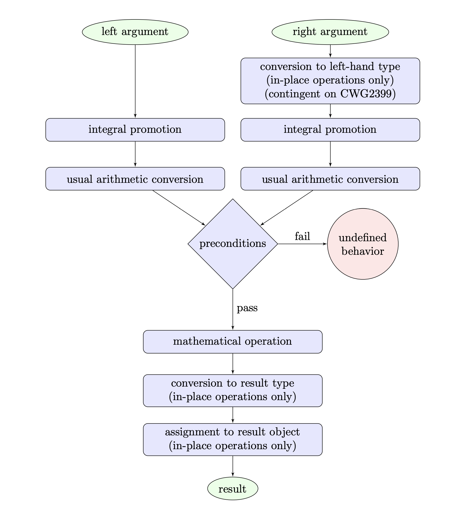

# ［C++］WG21月次提案文書を眺める（2022年11月）

文書の一覧

- [JTC1/SC22/WG21 - Papers 2022 mailing2022-11](http://www.open-std.org/jtc1/sc22/wg21/docs/papers/2022/#mailing2022-11)

全部で75本あります。（新規35本

### [N4924 WG21 2022-10 Admin telecon minutes](https://www.open-std.org/jtc1/sc22/wg21/docs/papers/2022/n4924.pdf)

WG21の各作業部会の管理者ミーティングの議事録。

前回から今回の会議の間のアクティビティの報告がされています。

### [N4925 2023-02 Issaquah meeting information](https://www.open-std.org/jtc1/sc22/wg21/docs/papers/2022/n4925.pdf)

2023年2月に行われる予定のWG21全体会議のインフォメーション。

次回は、アメリカのワシントン州イサクアで行われる予定で、内容は主に会場の案内についてです。

### [N4926 Working Draft, C++ Extensions for Library Fundamentals, Version 3](https://www.open-std.org/jtc1/sc22/wg21/docs/papers/2022/n4926.html)

Library Fundamental v3のワーキングドラフト。

### [N4927 Editor's Report: C++ Extensions for Library Fundamentals, Version 3](https://www.open-std.org/jtc1/sc22/wg21/docs/papers/2022/n4927.html)

↑の差分を記した文書。

変更点は

- P2705R0 : 報告されたIssueの解決
- P0987R2 : 型消去の代わりに`polymorphic_allocator<>`を使用するように変更
- P2708R1

の内容を適用したことなどです。

### [P0901R10 Size feedback in operator new](https://www.open-std.org/jtc1/sc22/wg21/docs/papers/2022/p0901r10.html)
### [P1018R18 C++ Language Evolution status 🦠 pandemic edition 🦠 2022/07–2022/11](https://www.open-std.org/jtc1/sc22/wg21/docs/papers/2022/p1018r18.html)

2022年7月から11月にかけてのEWG活動報告書。

主にコア言語のIssueのレビューが主だったようです。

なお、C++23についての作業は終了しているらしく、これ以降コア言語の提案をC++23に向けて作業することはないようです。

### [P1018R19 C++ Language Evolution status](https://www.open-std.org/jtc1/sc22/wg21/docs/papers/2022/p1018r19.html)

2022年11月のkona会議のEWG活動報告書。

コア言語のIssueやNBコメントのレビュー・投票が行われていたようです。

C++26に向けて、以下の提案がCWGに転送されました

- [P1061R0 Structured Bindings can introduce a Pack](https://wg21.link/P1061R0)
- [P2361R0 Unevaluated string literals](https://wg21.link/P2361R0)
- [P2014R0 aligned allocation of coroutine frames](https://wg21.link/P2014R0)
- [P0609R1 Attributes for Structured Bindings](https://wg21.link/P0609R1)
- [P2558R0 Add @, $, and ` to the basic character set](https://wg21.link/P2558R0)
- [P2621R0 UB? In my Lexer?](https://wg21.link/P2621R0)
- [P2686R0 Updated wording and implementation experience for P1481 (constexpr structured bindings)](https://wg21.link/P2686R0)
- [P1967R0 #embed - a simple, scannable preprocessor-based resource acquisition method](https://wg21.link/P1967R0)
- [P2593R0 Allowing static_assert(false)](https://wg21.link/P2593R0)

次の提案はLEWGに転送されました

- [P2641R0 Checking if a union alternative is active](https://wg21.link/P2641R0)
- [P2546R0 Debugging Support](https://wg21.link/P2546R0)
- [P0876R5 fiber_context - fibers without scheduler](https://wg21.link/P0876R5)
- [P2141R0 Aggregates are named tuples](https://wg21.link/P2141R0)

### [P1028R4 SG14 status_code and standard error object](https://www.open-std.org/jtc1/sc22/wg21/docs/papers/2022/p1028r4.pdf)

現在の`<sysytem_error>`にあるものを置き換える、エラーコード/ステータス伝搬のためのライブラリ機能の提案。

`<sysytem_error>`ヘッダは`std::error_code`関連のものを擁するヘッダで。C++11にて、当時のFilesystem TSから分離される形で先行導入されました。`<filesystem>`を使うとき以外はあまり使用されることはないようですが、これは標準の多くのヘッダファイルから参照されており、標準ヘッダの内部依存関係の一部を構成しています。

このエラーコードインターフェースの設計上の問題は近年2018年）明らかになり、正しく使うことが難しく、エラー報告のためのインターフェースなのにエラーを起こしやすいなどの問題がありました。それは[P0824R1](https://www.open-std.org/jtc1/sc22/wg21/docs/papers/2018/p0824r1.html)で纏められて報告され、現在の`std::error_code`周りの問題を改善した代替の機能が追求されました。

この提案は、そのようなライブラリ機能を実装するとともにBoost.Outcomeなどでの経験をベースとして、現在のエラーコードインターフェースの問題を解決し置き換えることを目指したライブラリ機能を提案するものです。

このライブラリの中核は、`std::error_code`を置き換える`std::system_code`というクラス型です。これはシステムの何かしらのコード（必ずしもエラーではない）を統一的に表現するためのクラスで、使用感はほぼ`std::error_code`と同様です。

```cpp
std::system_code sc;  // デフォルト構築は空（成功でもエラーでもない）
native_handle_type h = open_file(path, sc);

// Is the code a failure?
if(sc.failure()) {
  // Do semantic comparison to test if this was a file not found failure
  // This will match any system-specific error codes meaning a file not found
  if(sc != std::errc::no_such_file_or_directory) {
    std::cerr << "FATAL: " << sc.message().c_str() << std::endl;
    std::terminate();
  }
}
```

この`open_file()`はプラットフォームによって次のように実装できます。

```cpp
// POSIXシステムの場合
using native_handle_type = int;

native_handle_type open_file(const char *path, std::system_code &sc) noexcept {
  sc.clear();  // 非エラー状態にする
  
  // ファイルオープン
  native_handle_type h = ::open(path, O_RDONLY);

  // エラーチェック
  if (h == -1) {
    // errnoはsystem_codeに型消去される
    sc = std::posix_code(errno);
  }

  return h;
}
```

```cpp
// Windowsの場合
using native_handle_type = HANDLE;

native_handle_type open_file(const wchar_t *path, std::system_code &sc) noexcept {
  sc.clear();  // 非エラー状態にする

  // ファイルオープン
  native_handle_type h = CreateFile(path, GENERIC_READ,
    FILE_SHARE_READ|FILE_SHARE_WRITE|FILE_SHARE_DELETE,
    nullptr,
    OPEN_EXISTING,
    FILE_ATTRIBUTE_NORMAL,
    nullptr
  );

  // エラーチェック
  if (h == INVALID_HANDLE_VALUE) {
    // GetLastError()の結果はsystem_codeに型消去される
    sc = std::win32_code(GetLastError());
  }

  return h;
}
```

この新しい`system_code`は、`std::error_code`の次のような点を改善しています

- `<string>`に依存しない
- `constexpr`対応
- `std::error_category`の、リンク時にランダムに比較が壊れる問題が起きない
- `bool`変換時の曖昧さがない
    - `std::error_code`の`bool`変換で`true`が帰るのはエラー状態の時とは限らない（値が非ゼロであることしか意味しない）
- 上記と関連して、`0`を特別扱いせず、成功と失敗を任意に表現できる
- 比較が意味ベース（エラーコードとの比較はその値の比較ではなく、意味するエラー状態の比較になる）
    - `std::error_code`のように値ベースではない
    - `std::error_condition`と`std::error_code`のように分かりづらい関係性のクラスを必要としない
- エラーコードの型が任意（`std::error_code`は`int`限定）
- 複数のシステムエラーコードを扱うことができる
- エラーカテゴリの厳密な区別

また、この提案には含まれていないように見えますが、P0709で提案されている静的例外クラス`std::error`を実装し、それをエラー状態とする戻り値型`result<T>`も提案しようとしているようです。これは、`std::expected<T, std::error>`と非常によく似ているクラスですが、エラー型がハードコーティングされていることによって若干異なるインターフェースを持っています。

- [P0824R1 Summary of SG14 discussion on <system_error>](https://www.open-std.org/jtc1/sc22/wg21/docs/papers/2018/p0824r1.html)
- [Reference implementation for proposed SG14 status_code (<system_error2>) in C++ 11 - Github](https://github.com/ned14/status-code)
- [P1028 進行状況](https://github.com/cplusplus/papers/issues/405)

### [P1202R5 Asymmetric Fences](https://www.open-std.org/jtc1/sc22/wg21/docs/papers/2022/p1202r5.pdf)
### [P1264R2 Revising the wording of stream input operations](https://www.open-std.org/jtc1/sc22/wg21/docs/papers/2022/p1264r2.pdf)

`<istream>`の例外に関する規定を改善する提案。

現在の`<istream>`の規定は非常に複雑になっており、特にいつ例外を投げるのかが分かりづらく、それによって実装間で振る舞いに差異が生じています。

空でないストリームからの抽出に失敗する入力操作の例

```cpp
#include <iostream>
#include <sstream>

int main () {
  std::stringbuf buf("not empty");
  std::istream is(&buf);

  // failbitがセットされたら例外を送出する
  is.exceptions(std::ios::failbit);

  bool threw = false;
  
  try {
    unsigned int tmp{};
    // 数値を読み取れないので失敗する
    is >> tmp;
  } catch (std::ios::failure const&) {
    threw = true;
  }

  std::cout << "bad = " << is.bad() << std::endl;
  std::cout << "fail = " << is.fail() << std::endl;
  std::cout << "eof = " << is.eof() << std::endl;
  std::cout << "threw = " << threw << std::endl;
}
```

この結果は、実装によって次のようになります

||libstdc++|MSVC STL|libc++|
|---|---|---|---|
|bad|0|0|1|
|fail|1|1|1|
|eof|0|0|0|
|threw|1|1|0|

正しいのはlibstdc++/MSVC STLの振る舞いに思えますが、現在の複雑な規定によればlibc++の振る舞いも合法のようです。ただ、この振る舞いは有用ではなく、ほぼ無意味です。

空のストリームからの抽出に失敗する入力操作の例

```cpp
#include <iostream>
#include <sstream>

int main () {
  std::stringbuf buf; // empty
  std::istream is(&buf);

  // failbitがセットされたら例外を送出する
  is.exceptions(std::ios::failbit);

  bool threw = false;
  
  try {
    unsigned int tmp{};
    // 数値を読み取れないので失敗する
    is >> tmp;
  } catch (std::ios::failure const&) {
    threw = true;
  }

  std::cout << "bad = " << is.bad() << std::endl;
  std::cout << "fail = " << is.fail() << std::endl;
  std::cout << "eof = " << is.eof() << std::endl;
  std::cout << "threw = " << threw << std::endl;
}
```

この結果は、実装によって次のようになります

||libstdc++|MSVC STL|libc++|
|---|---|---|---|
|bad|0|0|1|
|fail|1|1|1|
|eof|1|1|1|
|threw|1|1|0|

正しいのはlibstdc++/MSVC STLの振る舞いに思えますが、やはりこれもlibc++の振る舞いが間違っているわけではないようです。

この提案は、このような状況を招いている複雑な規定を明確になるように修正し、libstdc++/MSVC STLの振る舞いを維持したままlibc++の振る舞いを修正しようとするものです。

- [LWG Issue 2349. Clarify input/output function rethrow behavior](https://cplusplus.github.io/LWG/issue2349)
- [P1264 進行状況](https://github.com/cplusplus/papers/issues/342)

### [P1478R8 Byte-wise atomic memcpy](https://www.open-std.org/jtc1/sc22/wg21/docs/papers/2022/p1478r8.html)
### [P1619R2 Functions for Testing Boundary Conditions on Integer Operations](https://www.open-std.org/jtc1/sc22/wg21/docs/papers/2022/p1619r2.pdf)

整数演算の境界条件をチェックするためのライブラリ関数の提案。

C++の整数演算には誰もが遭遇する境界条件（最大値・最小値を跨ぐような演算）についての罠があります。これは初心者でも簡単に遭遇しうる一方で、その理解にはC++言語の知識や整数のハード上表現の知識、数学的な知識などを必要とし、アサーションのためにその判定を書くことはかなりの注意を必要とします。

提案より、整数の二項演算で行われることの流れ図



（提案によれば、この図は修正が必要な箇所があり、他の部分についても修正の必要がある可能性があり、それこそが整数演算の複雑さを現している、とのことです・・・）

この提案は、そのような境界条件に関するアサーションに使用するための、条件を簡単かつ直接的に命名及び表現したライブラリ関数を追加しようとするものです。

この提案による関数群は多岐に渡りますが、いずれもプリフィックス`can_~`で始まり、`bool`値を返す`constexpr`関数です。

```cpp
#include <limits>

int add(std::integral auto lhs, std::integral auto rhs) {
  // 2つの整数値の足し算が問題なく行えるか
  assert(std::can_add(lhs, rhs));
  // 足し算の結果をintに正しく変換できるか
  assert(std::can_convert<int>(lhs + rhs));

  return lhs + rhs;
}
```

他にも、インクリメント等の単項演算子、四則演算と`%`などの2項演算子、`+= *=`などの複合代入演算子（`_in_place`が後ろにつく）にそれぞれ対応した関数が用意され、全ての関数に`_modular`が後ろにつくバージョン（`2^N`を法とするモジュロ演算によるもの）が用意されています。

この関数群は次の条件を全てパスする場合に`true`を返し、そうでなければ`false`を返します。

1. 各関数に指定された式が評価されると、その実行はwell-formed
2. 各オペランドについて、整数昇格と変換が適用される前後の値は`2^N`を法として合同。また、比較演算と`/ /= % %= >> >>=`の両オペランド、`<< <<=`の右オペランドについて、整数昇格と変換の適用前後の値は等しくなる。
3. 式の結果と数学演算の結果は`2^N`を法として合同。また、ポストフィックスに`_modular`が付かない関数では、式の結果と数学演算の結果は等しくなる。

この提案による関数群は、C++26以降で導入されるContractにおいても有用であると思われます。

- [P1619 進行状況](https://github.com/cplusplus/papers/issues/393)

### [P2164R8 views::enumerate](https://www.open-std.org/jtc1/sc22/wg21/docs/papers/2022/p2164r8.pdf)
### [P2167R3 Improved Proposed Wording for LWG 2114 (contextually convertible to bool)](https://www.open-std.org/jtc1/sc22/wg21/docs/papers/2022/p2167r3.html)
### [P2248R7 Enabling list-initialization for algorithms](https://www.open-std.org/jtc1/sc22/wg21/docs/papers/2022/p2248r7.html)
### [P2396R1 Concurrency TS 2 fixes](https://www.open-std.org/jtc1/sc22/wg21/docs/papers/2022/p2396r1.pdf)
### [P2434R0 Nondeterministic pointer provenance](https://www.open-std.org/jtc1/sc22/wg21/docs/papers/2022/p2434r0.html)

現在のC++のポインタ意味論をポインタの*provenance*モデルに対して整合させるための提案。

ポインタにおける*provenance*という概念は、ポインタの*provenance*（出自・由来・出所）を重視したポインタの意味論のことで、現在の整数アドレス的なポインタ意味論で行えてしまっていることを制限しようとするものです。これによって、コンパイラのエイリアス解析においてより多くの仮定を行えるようになり、最適化が促進されます。そこでは特に、ポインタ値を整数にキャストした後で戻すという操作によって*provenance*がどこまで伝播するのかが問題となっています。

C/C++の規格にはこの概念はまだ導入されておらず、[P2381R1](https://www.open-std.org/jtc1/sc22/wg21/docs/papers/2021/p2318r1.pdf)にて提案段階にあります。そこでは、いくつかの*provenance*モデルが挙げられています

- PNVI (provenance-not-via-integer)
    - （ポインタをキャストした）整数値を介してポインタの*provenance*の追跡をする代わりに、整数->ポインタのキャスト地点で指定されたアドレスが生存期間内にあるオブジェクトを指しているかをチェックし、問題がなければそこで*provenance*を再作成する
- PNVI-ae (PNVI exposed-address)
    - PNVIを発展させたもので、以前に露出した（*exposed*）ストレージインスタンス（オブジェクトの配置されているストレージの実体、オブジェクトの配置されている場所のような概念、ほぼポインタのことと思って差し支えない）に対してのみ、整数->ポインタのキャストにおいて*provenance*の再作成を許可する
    - ストレージインスタンスは次のいずれかの場合に露出したことになります
      - （ストレージインスタンスの）ポインタ値の整数型へのキャスト
      - ポインタの表現の（非ポインタ型での）読み出し
      - `%p`によるポインタ値の出力
- PNVI-ae-udi (PNVI exposed-address user-disambiguation):
    - PNVI-aeをさらに発展させたもので、ストレージインスタンスの直後の場所のポインタの、ポインタと整数間の往復キャスト（ポインタ<->整数の間を行き来するキャスト）もサポートする。
    - ストレージインスタンスの直後の場所のポインタとは、いわゆる配列の末尾のポインタ（配列のendイテレータ）や、それを発展させて許可されている任意のオブジェクトの1つ後ろを指すポインタの存在、のこと
- PVI (provenance-via-integers)
    - 整数演算を介したときでも*provenance*を追跡するモデル。ポインタ値だけでなく全ての整数値に対して*provenance*を関連づけ、整数/ポインタのキャスト前後で*provenance*を保持し、整数とポインタの`+ -`整数演算の結果の*provenance*に関して特別な選択を行う。

Cの*provenance*導入議論においての最有力候補はPNVI-ae-udiモデルです。おそらくこれはC++においても同様となるでしょう。

規格には取り込まれていなくても、現在のC++（最新のC++23ドラフト N4917）が規定するポインタセマンティクスは既に整数アドレス的なものではなく、ポインタの*provenance*が禁止することを目的とする多くの状況は現在も未定義動作となります。

```cpp
int main() {
  int jenny=0;
  // std::cout << &jenny;
  *(int*)8675309=1;
  return jenny;
}
```

実装がこの整数値（`8675309`）に対するポインタを特別に定義していないとすると、このコードはPNVI-ae-udi及びPVIの両方で未定義動作となり（どちらも、整数値`8675309`に*provenance*を見出せない）、現在のC++においてもキャストが無効なポインタ値を生成する可能性があることから未定義動作になります。

```cpp
int main() {
  int x,y=0;
  uintptr_t p=(uintptr_t)&x,q=(uintptr_t)&y;
  p^=q;
  q^=p;
  p^=q;
  *(int*)q=*(int*)p;
  return x;
}
```

PVIでは、`p, q`の操作の結果得られる値はその*provenance*を継承しない（`^=`は特別扱い演算の対象外な）ためこれを許可しません。PNVI-ae-udiでは、`main()`内2行目でストレージインスタンスが露出しており、整数演算（xorによるswap）後の`p, q`が生存期間内にあるオブジェクトを指していることから許可されます。  
C++では、`x, y`のアドレスがどのように選択されたとしても`q(p)`は結局`x(y)`のアドレスになるため、ポインタへのキャストは交換されたポインタを生成し、これは許可されます。この解釈は任意の整数演算やI/O操作に及びます。

```cpp
int main() {
  int *p=new int;
  uintptr_t i=(uintptr_t)p;
  delete p;

  p=new int(1);
  if((uintptr_t)p==i) *(int*)i=0;
  return *p;
}
```

PVIでは、新しいポインタ`p`と以前の`p`由来の整数`i`を比較しただけでは`i`に`p`の*provenance*が継承されないため、これを許可しません。PNVI-ae-udiでは、新しいオブジェクトのアドレス（`p`のポインタ値）が比較（後段2行目`(uintptr_t)p==i`）時に露出するため、それと同じ値を持つ`i`のポインタへのキャストは新しい`p`と同じ値になるため、これは許可されます。  
C++では、`i`が新しい`p`と同じ値を持っていれば、キャストによって同じポインタに戻されるため、これは許可されます。

このように、現在のC++のポインタ意味論と規定はPNVI-ae-udiモデルによく整合しているように見えます。しかし、現在のC++のポインタ規定は*udi(user-disambiguation)*を実装していません。往復変換が許可されるポインタは元の値を持つと規定されている（[expr.reinterpret.cast]/5）ため、オブジェクトへのポインタとメモリ内でその直後の場所を指すポインタに対して同じ整数値を生成する実際の実装を（誤って？）禁止しています（つまり、1つの整数値に対するポインタ値が複数存在する可能性があり、実際にそのような実装があるようです）。

同様に、[[basic.types.general]/2–4](https://eel.is/c++draft/basic.types.general)は、バイト列から構成されたポインタかもしれないものについても同様に元の値を持つこと（値表現が一致すること）を要求しており、そのような状況を許可していません。

`std::bit_cast`は同じ値表現を持つ複数の値の可能性を認めるものの、結果の値は未規定としています。

この提案は、*udi(user-disambiguation)*を実装（該当する場合を未定義動作ではなく）するために、これらに関連する規定を修正しようとするものです。

変更は、ポインタの値表現（ビット列）については、同じビット列が複数のポインタ値に対応する可能性があり、（`memcpy`などによって）そのビット値が取得される（*acquires*）時は、その複数ある中からwell-definedとなる（未定義動作とならない）1つを選択する、のようにします。これによって、*udi(user-disambiguation)*が実装され、現在のC++のポインタ規定をPNVI-ae-udiモデルにより整合させることができます。

- [旧石器時代のポインタをご利用の皆様へ ～provenance入門～ - Qiita](https://qiita.com/__pandaman64__/items/1788a90ae5be79cc908b)
- [Provenance-aware Memory Object Model for C - zenn.dev](https://zenn.dev/yohhoy/scraps/8b22a217ec7515)
- [P2434 進行状況](https://github.com/cplusplus/papers/issues/1364)

### [P2539R4 Should the output of std::print to a terminal be synchronized with the underlying stream?](https://www.open-std.org/jtc1/sc22/wg21/docs/papers/2022/p2539r4.html)
### [P2546R3 Debugging Support](https://www.open-std.org/jtc1/sc22/wg21/docs/papers/2022/p2546r3.html)
### [P2548R2 copyable_function](https://www.open-std.org/jtc1/sc22/wg21/docs/papers/2022/p2548r2.pdf)
### [P2548R3 copyable_function](https://www.open-std.org/jtc1/sc22/wg21/docs/papers/2022/p2548r3.pdf)
### [P2548R4 copyable_function](https://www.open-std.org/jtc1/sc22/wg21/docs/papers/2022/p2548r4.pdf)
### [P2552R1 On the ignorability of standard attributes](https://www.open-std.org/jtc1/sc22/wg21/docs/papers/2022/p2552r1.pdf)
### [P2559R1 Plan for Concurrency Technical Specification Version 2](https://www.open-std.org/jtc1/sc22/wg21/docs/papers/2022/p2559r1.html)
### [P2564R1 consteval needs to propagate up](https://www.open-std.org/jtc1/sc22/wg21/docs/papers/2022/p2564r1.html)
### [P2564R2 consteval needs to propagate up](https://www.open-std.org/jtc1/sc22/wg21/docs/papers/2022/p2564r2.html)
### [P2564R3 consteval needs to propagate up](https://www.open-std.org/jtc1/sc22/wg21/docs/papers/2022/p2564r3.html)
### [P2570R1 Contract predicates that are not predicates](https://www.open-std.org/jtc1/sc22/wg21/docs/papers/2022/p2570r1.html)
### [P2588R2 Relax std::barrier phase completion step guarantees](https://www.open-std.org/jtc1/sc22/wg21/docs/papers/2022/p2588r2.html)
### [P2589R1 static operator[]](https://www.open-std.org/jtc1/sc22/wg21/docs/papers/2022/p2589r1.pdf)
### [P2602R2 Poison Pills are Too Toxic](https://www.open-std.org/jtc1/sc22/wg21/docs/papers/2022/p2602r2.html)
### [P2614R2 Deprecate numeric_limits::has_denorm](https://www.open-std.org/jtc1/sc22/wg21/docs/papers/2022/p2614r2.pdf)
### [P2615R1 Meaningful exports](https://www.open-std.org/jtc1/sc22/wg21/docs/papers/2022/p2615r1.html)
### [P2616R1 Making std::atomic notification/wait operations usable in more situations](https://www.open-std.org/jtc1/sc22/wg21/docs/papers/2022/p2616r1.html)
### [P2616R2 Making std::atomic notification/wait operations usable in more situations](https://www.open-std.org/jtc1/sc22/wg21/docs/papers/2022/p2616r2.html)
### [P2640R2 Modules: Inner-scope Namespace Entities: Exported or Not?](https://www.open-std.org/jtc1/sc22/wg21/docs/papers/2022/p2640r2.pdf)
### [P2644R1 Final Fix of Broken Range based for Loop Rev 1](https://www.open-std.org/jtc1/sc22/wg21/docs/papers/2022/p2644r1.pdf)
### [P2647R1 Permitting static constexpr variables in constexpr functions](https://www.open-std.org/jtc1/sc22/wg21/docs/papers/2022/p2647r1.html)
### [P2649R0 2022-10 Library Evolution Poll Outcomes](https://www.open-std.org/jtc1/sc22/wg21/docs/papers/2022/p2649r0.html)

2022年10月に行われたLEWGにおける全体投票の結果。

次の提案が投票にかけられ、一部の投票に当たって寄せられた賛否のコメントが記載されています。

- C++23
    - [P2539R3 print To Terminal Synchronization](https://wg21.link/P2539R3)
- C++26
    - [P2631R0 Publish The Library Fundamentals v3 Technical Specification Now](https://wg21.link/P2631R0)
    - [P1083R6 resource_adaptor](https://wg21.link/P1083R6)
    - [P2587R3 to_string Or Not to_string](https://wg21.link/P2587R3)
    - [P2495R1 Interfacing stringstreams With string_view](https://wg21.link/P2495R1)
    - [P2510R3 Formatting Pointers](https://wg21.link/P2510R3)
    - [P2572R0 std::format Fill Character Allowances](https://wg21.link/P2572R0)
    - [P2511R2 Beyond operator(): NTTP Callables In Type-Erased Call Wrappers](https://wg21.link/P2511R2)
    - [P2592R2 Hashing Support For chrono Value Classes](https://wg21.link/P2592R2)
    - [P0543R2 Saturation Arithmetic](https://wg21.link/P0543R2)
    - [P0870R4 is_convertible_without_narrowing](https://wg21.link/P0870R4)
    - [P2614R1 Deprecate numeric_limits::has_denorm](https://wg21.link/P2614R1)

このうち、P2511R2がコンセンサスを得られず、P2614R1はターゲットの設定を間違えていたためやり直しになったようです。

### [P2650R0 2022-11 Library Evolution Polls](https://www.open-std.org/jtc1/sc22/wg21/docs/papers/2022/p2650r0.html)

2022年11月に行われるLEWG全体投票の予定表。

次の提案（およびNBコメント）が投票にかけられます。

- C++23
    - [P2164R8 views::enumerate](https://wg21.link/P2164R8)
    - [P2711R1 Making Multi-Param Constructors Of Views Explicit](https://wg21.link/P2711R1)
    - [P2655R1 common_reference_t Of reference_wrapper Should Be A Reference Type](https://wg21.link/P2655R1)
    - [FR-015-026 Remove cbegin/cend From Spans And Views](https://github.com/cplusplus/nbballot/issues/417)
    - [FR-013-020 Replace repeat With cycle](https://github.com/cplusplus/nbballot/issues/415)
    - [P2693R0 Formatting thread::id And stacktrace](https://wg21.link/P2693R0)
    - [LWG3806 Should Concept formattable<T, charT> Default To char?](https://wg21.link/LWG3806)
    - [FR-003-010 Formatting Of Ranges Of tuple-like Objects](https://github.com/cplusplus/nbballot/issues/406)
    - [P2588R2 Relax barrier Phase Completion Step Guarantees](https://wg21.link/P2588R2)
    - [US-43-104 subspan Type Confusion](https://github.com/cplusplus/nbballot/issues/520)
    - [FR-002-015 Return A span From strides](https://github.com/cplusplus/nbballot/issues/405)
    - [GB-087 start_lifetime_as Is Broken And Inconsistent For Arrays](https://github.com/cplusplus/nbballot/issues/458)
    - [P2679R1 Fixing start_lifetime_as For Arrays](https://wg21.link/P2679R1)
    - [P2674R1 is_implicit_lifetime](https://wg21.link/P2674R1)
    - [US-30-072 Predefined Macros From The C Library](https://github.com/cplusplus/nbballot/issues/502)
    - [GB-080 Sync intmax_t And uintmax_t With C2x](https://github.com/cplusplus/nbballot/issues/447)
    - [P2652R0 Disallow User Specialization Of allocator_traits](https://wg21.link/P2652R0)
    - [P2614R1 Deprecate numeric_limits::has_denorm](https://wg21.link/P2614R1)
    - [GB-081 Deprecate Contents Of <stdalign.h>](https://github.com/cplusplus/nbballot/issues/453)
    - [GB-082 Deprecate Contents Of <stdbool.h>](https://github.com/cplusplus/nbballot/issues/453)
    - [GB-084 Deprecate errc Constants Related To UNIX STREAMS](https://github.com/cplusplus/nbballot/issues/444)
    - [GB-121 Remove voidify](https://github.com/cplusplus/nbballot/issues/452)
- C++26
    - [P2559R1 Plan For Concurrency Technical Specification Version 2](https://wg21.link/P2559R1)
    - [P2545R1 Why RCU Should Be In C++26](https://wg21.link/P2545R1)
    - [P2530R1 Why Hazard Pointers Should Be In C++26](https://wg21.link/P2530R1)
    - [P0493R3 Atomic Maximum/Minimum](https://wg21.link/P0493R3)
    - [P2527R1 variant_alternative_index And variant_alternative_index_v](https://wg21.link/P2527R1)
    - [P2264R4 Make assert Macro User Friendly For C And C++](https://wg21.link/P2264R4)

NBコメントの投票は否決するか？を問うようで、コンセンサスが得られた場合にそのNBコメントをリジェクトする（受け入れない）ことになるようです。

### [P2652R1 Disallow user specialization of allocator_traits](https://www.open-std.org/jtc1/sc22/wg21/docs/papers/2022/p2652r1.html)
### [P2653R1 Update Annex E based on Unicode 15.0 UAX 31 Steve Downey](https://www.open-std.org/jtc1/sc22/wg21/docs/papers/2022/p2653r1.pdf)
### [P2655R1 common_reference_t of reference_wrapper Should Be a Reference Type](https://www.open-std.org/jtc1/sc22/wg21/docs/papers/2022/p2655r1.html)
### [P2657R1 C++ is the next C++](https://www.open-std.org/jtc1/sc22/wg21/docs/papers/2022/p2657r1.html)
### [P2658R1 temporary storage class specifiers](https://www.open-std.org/jtc1/sc22/wg21/docs/papers/2022/p2658r1.html)
### [P2659R1 A Proposal to Publish a Technical Specification for Contracts](https://www.open-std.org/jtc1/sc22/wg21/docs/papers/2022/p2659r1.pdf)
### [P2664R0 Proposal to extend std::simd with permutation API](https://www.open-std.org/jtc1/sc22/wg21/docs/papers/2022/p2664r0.pdf)

Parallelism TS v2にある`std::simd`に、permute操作のサポートを追加する提案。

SIMDにおけるpermute命令とは、SIMDレジスタ内で要素を並び替える命令の1つです。ある計算の際に効率的なデータの並びとその後の別の計算の際に効率的なデータの並びが異なる場合など、SIMDレジスタ内にデータを載せたまま並べ替えが必要になることはよくあり、その際にpermute命令を使用できます。

現在の`std::simd`にはこのような操作を直接的に行うAPIがなく、要素の抽出（`extract()`）や`std::simd`値の分割（`split()`）と、連結（`concat()`）や挿入（`insert()`）を組み合わせて行うしかありません。これは複雑であるとともにコンパイル時の操作となってしまうため動的な並べ替えを行うことができません。また、直接的なAPIが提供されていないことによって、操作とSIMD命令を1対1でマッピングすることが難しくなります。

この提案は、ハードウェアのSIMD permute命令に対応する`std::simd`値の要素の並べ替えを行う関数を追加しようとするものです。

この提案ではpermut操作を行うための3種類のAPIを提案しています

1. コンパイル時にインデックス計算を行う
    - 並べ替えパターンを生成する関数を受け入れることで、インデックス計算をコンパイラに任せる
2. 別の`std::simd`値による実行時インデックス指定
3. SIMDマスクによって、入力の要素を出力に使用するかを決定する

```cpp

int main() {
  // 入力例（この提案のAPIは入力のstd::simd型に依存しない）
  std::fixed_size_simd<float, 10> values = ...;

  // 1. コンパイル時のインデックス計算
  {
    // 出力のインデックスは入力インデックス[0, 1, 2…)を用いて[0 0 2 2 4 4…)のようにマップされる
    const auto dupEvenIndex = [](size_t idx) -> size_t { return (idx / 2) * 2; };
    const auto de = std::permute(values, dupEvenIndex);
    // deは入力と同じ要素数で同じ要素型

    // 出力サイズの明示的な指定
    // stride3で4つの値を生成（つまり、出力配列は入力インデックスによって[0, 3, 6, 9]のようにマップされる）
    const auto stride3 = std::permute<4>(values, [](size_t idx) -> size_t { return idx * 3; });
    // stride3は4要素で同じ要素型
  }

  // 2. 実行時インデックス指定
  {
    // 実行時インデックス
    std::fixed_size_simd<unsigned, 8> indexes = ...;

    // indexesの先頭から、そのインデックスに対応する入力（values）要素を出力にマップする
    const auto result = std::permute(values, indexes);
    // resultは8要素（インデックス配列と同じ要素数）で入力と同じ要素型
  }

  {
    // SIMDマスク
    std::fixed_size_simd<unsigned, 10> mask = ...;

    // 要素を半分に圧縮する
    // maskによって入力から出力に使用する要素をフィルタする
    const auto result = std::compress(values, mask);
    // resultは入力の半分の要素数で入力と同じ要素型
  }
}
```

これらの関数は、実行環境（CPU）の直接的なSIMD命令によって効率的に処理されることが期待できます。

また、提案では、これらのAPIを拡張して一般のメモリに対するスキャッタ/ギャザー操作を行うAPIとすることもできるとしています。

- [AVXの倍精度実数シャッフル系命令チートシート - Qiita](https://qiita.com/kaityo256/items/ee8afca236e0af21ad96)
- [Day 7 : SIMD化 - 一週間でなれる！スパコンプログラマ](https://kaityo256.github.io/sevendayshpc/day7/index.html)
- [P2638R0 Intel's response to P1915R0 for std::simd parallelism in TS 2 - WG21月次提案文書を眺める（2022年09月）](https://onihusube.hatenablog.com/entry/2022/10/09/021557#P2638R0-Intels-response-to-P1915R0-for-stdsimd-parallelism-in-TS-2)
- [P2664 進行状況](https://github.com/cplusplus/papers/issues/1383)

### [P2674R1 A trait for implicit lifetime types](https://www.open-std.org/jtc1/sc22/wg21/docs/papers/2022/p2674r1.pdf)
### [P2679R1 Fixing std::start_lifetime_as and std::start_lifetime_as_array](https://www.open-std.org/jtc1/sc22/wg21/docs/papers/2022/p2679r1.pdf)
### [P2681R0 More Simple Statistics](https://www.open-std.org/jtc1/sc22/wg21/docs/papers/2022/p2681r0.pdf)

標準ライブラリにいくつかの統計関数を追加する提案。

この提案は、[P1708R6](https://wg21.link/p1708r6)をベースとして、同様の設計で次の5つの統計計算関数を追加しようとするものです

- 一変量統計
    - パーセンタイル
    - 最頻値
- 二変量統計
    - 共分散
    - 相関係数
    - 線形回帰

これらのものにはP1708と同様に`range`を入力としてその要素から統計量を計算する関数と、各値をオンラインで入力していき統計量を計算する`accumulator`オブジェクト（クラス）の2つのAPIが用意されています。

```cpp
#include <stats>
#include <vector>
#include <iostream>

int main() {
  std::vector vec = {1, 1, 2, 3, 4, 4, 4, 5};

  // 最頻値の計算（フリー関数）
  auto mode = std::mode_of_sorted(vec);
  // mode == 4


  // 相関係数の計算（accumulatorオブジェクト）
  std::correlation_accumulator acc{};

  // データ入力
  acc(50, 40);
  acc(60, 70);
  acc(70, 90);
  acc(80, 60);
  acc(90, 100);

  // 計算結果の取得
  auto corr = acc.value();
  // corr == 0.73
}
```

相関係数の計算は[こちら](https://sci-pursuit.com/math/statistics/correlation-coefficient.html)の例をお借りしました。

- [P1708R3 Simple Statistical Functions - ［C++］WG21月次提案文書を眺める（2021年01月）](https://onihusube.hatenablog.com/entry/2021/02/11/153333#P1708R3-Simple-Statistical-Functions)
- [P2664 進行状況](https://github.com/cplusplus/papers/issues/1384)

### [P2693R0 Formatting thread::id and stacktrace](https://www.open-std.org/jtc1/sc22/wg21/docs/papers/2022/p2693r0.pdf)

`std::thread::id`と`std::stacktrace`を`std::format()`及び`std::print()`で出力できるようにする提案。

標準ライブラリ型の`std::format`対応はP1636R2で提案され、LEWGのレビューを通過しLWGにおけるレビューで改訂が必要とされましたが、どうやら著者の方と連絡がつかなくなり進展が望めなくなっています（提出されたのは2019年でした）。

C++23 CDへのNBコメントにおいて、`std::thread::id`の`std::format`対応が推奨され、この提案はそれを受けてそのための文言を提供するものです。

NBコメントで`std::thread::id`だけが特別視されたのはデバッグ目的だったようで、同様にデバッグに有用な`std::basic_stacktrace`と`std::stacktrace_entry`も含めることになったようです。

一方で、P1636R2で提案されていた他の物（`std::bitset`や`std::unique_ptr`など）は含まれていません。

```cpp
// この提案が採択されたC++23以降の例
import std:

int main() {
  // スレッドIDの出力
  std::print("This thread id : {}", std::this_thread::get_id());


  auto st = std::stacktrace::current();

  // スタックトレース全体の出力
  std::print("Entire stack trace\n{}", st);
  // 1フレームだけ出力
  std::print("Top of stack trace\n{}", st[0]);
}
```

これはC++23に対するNBコメントを受けてのものなので、C++23をターゲットとして作業されています。

- [FR-008-011 22.14 [format] Support formatting of thread::id](https://github.com/cplusplus/nbballot/issues/410)
- [`std::thread::id` - cpprefjp](https://cpprefjp.github.io/reference/thread/thread/id.html)
- [P2664 進行状況](https://github.com/cplusplus/papers/issues/1384)

### [P2695R0 A proposed plan for contracts in C++](https://www.open-std.org/jtc1/sc22/wg21/docs/papers/2022/p2695r0.pdf)

C++ Contracts（契約プログラミング）のC++26導入へ向けた予定表。

計画によれば、2023年中に現在のMVPと呼ばれる機能セットの設計を完了し、2024年中でEWG/CWGによるレビューを行い、2025年初頭にC++26 WDへマージする、という予定です。ただし、必要に応じてロードマップは修正されるとしています。

この予定表はSG21で採用することに合意が取れており、EWG/CWGの合意が必要かもしれませんが、SG21としてはC++26に向けてContractを進めていくようです。

- [P2665 進行状況](https://github.com/cplusplus/papers/issues/1385)

### [P2696R0 Introduce Cpp17Swappable as additional convenience requirements](https://www.open-std.org/jtc1/sc22/wg21/docs/papers/2022/p2696r0.html)

*Cpp17Swappable*という要件を追加する提案。

現在規格書中で使用されている*swappable*要件は、型`T`の右辺値または左辺値が`T`の任意の右辺値または左辺値とそれぞれ`swap`可能であること、のように規定されており、`T`についての*swappable*要件は左辺値と右辺値の両方について値の交換可能性を要求しています。これによって、単に左辺値だけが`swap`可能であればよい場合に規定を追加で記述しなければならなくなっており、文章の肥大化を招くとともに分かりづらくなっています。

この提案のいう*Cpp17Swappable*要件とは、型`T`の左辺値が*swappable*であること、のような規定で、*swappable*要件のサブセットになっています。これを用いて、現在単に左辺値の*swappable*だけが必要なところの規定を書き換えるのがこの提案の目的です。

この提案は意味論の変更を意図するものではなく、規格書の記述の改善を目的としています。

- [P2696 進行状況](https://github.com/cplusplus/papers/issues/1386)

### [P2697R0 Interfacing bitset with string_view](https://www.open-std.org/jtc1/sc22/wg21/docs/papers/2022/p2697r0.pdf)
### [P2698R0 Unconditional termination is a serious problem](https://www.open-std.org/jtc1/sc22/wg21/docs/papers/2022/p2698r0.pdf)
### [P2700R0 Questions on P2680 “Contracts for C++: Prioritizing Safety”](https://www.open-std.org/jtc1/sc22/wg21/docs/papers/2022/p2700r0.pdf)
### [P2701R0 Translating Linker Input Files to Module Metadata Files](https://www.open-std.org/jtc1/sc22/wg21/docs/papers/2022/p2701r0.pdf)
### [P2702R0 Specifying Importable Headers](https://www.open-std.org/jtc1/sc22/wg21/docs/papers/2022/p2702r0.pdf)
### [P2703R0 C++ Standard Library Ready Issues to be moved in Kona, Nov. 2022](https://www.open-std.org/jtc1/sc22/wg21/docs/papers/2022/p2703r0.html)
### [P2704R0 C++ Standard Library Immediate Issues to be moved in Kona, Nov. 2022](https://www.open-std.org/jtc1/sc22/wg21/docs/papers/2022/p2704r0.html)
### [P2705R0 C++ Library Fundamentals TS Issues to be moved in Kona, Nov. 2022](https://www.open-std.org/jtc1/sc22/wg21/docs/papers/2022/p2705r0.html)
### [P2706R0 Drafting for US 26-061: Redundant specification for defaulted functions](https://www.open-std.org/jtc1/sc22/wg21/docs/papers/2022/p2706r0.html)
### [P2708R0 No Future Fundamentals TSes](https://www.open-std.org/jtc1/sc22/wg21/docs/papers/2022/p2708r0.html)
### [P2708R1 No Future Fundamentals TSes](https://www.open-std.org/jtc1/sc22/wg21/docs/papers/2022/p2708r1.html)
### [P2709R0 Core Language Working Group “ready” Issues for the November, 2022 meeting](https://www.open-std.org/jtc1/sc22/wg21/docs/papers/2022/p2709r0.html)
### [P2710R0 Core Language Working Group NB comment resolutions for the November, 2022 meeting](https://www.open-std.org/jtc1/sc22/wg21/docs/papers/2022/p2710r0.html)
### [P2711R0 Making multi-param (and other converting) constructors of views explicit](https://www.open-std.org/jtc1/sc22/wg21/docs/papers/2022/p2711r0.html)
### [P2711R1 Making multi-param constructors of views explicit](https://www.open-std.org/jtc1/sc22/wg21/docs/papers/2022/p2711r1.html)
### [P2712R0 Classification of Contract-Checking Predicates](https://www.open-std.org/jtc1/sc22/wg21/docs/papers/2022/p2712r0.pdf)
### [P2718R0 Wording for P2644R1 Fix for Range-based for Loop](https://www.open-std.org/jtc1/sc22/wg21/docs/papers/2022/p2718r0.html)
### [P2722R0 Slides: Beyond operator() (P2511R2 presentation)](https://www.open-std.org/jtc1/sc22/wg21/docs/papers/2022/p2722r0.pdf)
### [P2723R0 Zero-initialize objects of automatic storage duration](https://www.open-std.org/jtc1/sc22/wg21/docs/papers/2022/p2723r0.html)
### [P2725R0 std::integral_constant Literals](https://www.open-std.org/jtc1/sc22/wg21/docs/papers/2022/p2725r0.html)
### [P2726R0 Better std::tuple Indexing](https://www.open-std.org/jtc1/sc22/wg21/docs/papers/2022/p2726r0.html)
### [P2727R0 std::iterator_interface](https://www.open-std.org/jtc1/sc22/wg21/docs/papers/2022/p2727r0.html)