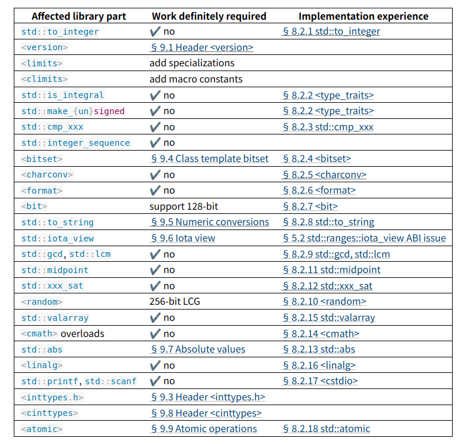

# ［C++］WG21月次提案文書を眺める（2024年01月）

文書の一覧

- [JTC1/SC22/WG21 - Papers 2024 mailing2024-02](https://www.open-std.org/jtc1/sc22/wg21/docs/papers/2024/#mailing2024-02)

全部で112本あります。

もくじ

[:contents]

### [P0493R5 Atomic maximum/minimum](https://www.open-std.org/jtc1/sc22/wg21/docs/papers/2024/p0493r5.pdf)
### [P0843R10 inplace_vector](https://www.open-std.org/jtc1/sc22/wg21/docs/papers/2024/p0843r10.html)
### [P0876R15 fiber_context - fibers without scheduler](https://www.open-std.org/jtc1/sc22/wg21/docs/papers/2024/p0876r15.pdf)
### [P1061R7 Structured Bindings can introduce a Pack](https://www.open-std.org/jtc1/sc22/wg21/docs/papers/2024/p1061r7.html)
### [P1144R10 std::is_trivially_relocatable](https://www.open-std.org/jtc1/sc22/wg21/docs/papers/2024/p1144r10.html)
### [P1729R4 Text Parsing](https://www.open-std.org/jtc1/sc22/wg21/docs/papers/2024/p1729r4.html)
### [P2047R7 An allocator-aware optional type](https://www.open-std.org/jtc1/sc22/wg21/docs/papers/2024/p2047r7.html)
### [P2075R4 Philox as an extension of the C++ RNG engines](https://www.open-std.org/jtc1/sc22/wg21/docs/papers/2024/p2075r4.pdf)
### [P2249R5 Mixed comparisons for smart pointers](https://www.open-std.org/jtc1/sc22/wg21/docs/papers/2024/p2249r5.html)
### [P2249R6 Mixed comparisons for smart pointers](https://www.open-std.org/jtc1/sc22/wg21/docs/papers/2024/p2249r6.html)
### [P2299R4 `mdspan`s of All Dynamic Extents](https://www.open-std.org/jtc1/sc22/wg21/docs/papers/2024/p2299r4.html)

これはどうやら間違って公開されたようで、内容はR3と同一です。

- [P2299R3 mdspans of All Dynamic Extents - WG21月次提案文書を眺める（2021年06月）](https://onihusube.hatenablog.com/entry/2021/07/12/182757#P2299R3-mdspans-of-All-Dynamic-Extents)

### [P2389R0 `dextents` Index Type Parameter](https://www.open-std.org/jtc1/sc22/wg21/docs/papers/2024/p2389r0.html)

`std::dextents`から、整数型の指定を省略する提案。

`std::dextents`は`std::mdspan`のインデックス指定のためのもので、次元数だけを静的に指定しておいて、次元ごとの要素数は動的に指定するものです。

```cpp
import std;

// int型2x2行列
using imat22 = std::mdspan<int, std::extents<std::size_t, 2, 2>>;

// int型4x3行列
using imat43 = std::mdspan<int, std::extents<std::size_t, 4, 3>>;

// int型2次元行列
using imatnn = std::mdspan<int, std::dextents<std::size_t, 2>>;

int main() {
  int data[] = { ... };

  // 2x2行列
  imatnn mat22{data, 2, 2};
  // 4x3行列
  imatnn mat43{data, 4, 3};
}
```

すなわち、`dextents<size_t, 2>`は`extents<size_t, dynamic_extent, dynamic_extent>`の略記です。

当初の`mdspan`では`extents/dextents`の使用する整数型（インデックス型）は`std::size_t`で固定でしたが、P2533によってそれが変更可能となり、それに伴って`extents/dextents`はテンプレートパラメータリストの最初で使用する整数型を受け取るようになりました。

特に`dextents`ではこれによって、本来できていた`dextents<2>`を`dextents<std::size_t, 2>`のように書かなければならなくなり、わずらわしさが増加しています。

インデックス型のカスタマイズは重要な機能ですが、多くのユーザーはその変更を考慮する必要が無いため、`dextents`はデフォルトで`std::size_t`を使用するようにしておこうとする提案です。

```cpp
// これを
using imatnn = std::mdspan<int, std::dextents<std::size_t, 2>>;

// こう書けるようにする
using imatnn = std::mdspan<int, std::dextents<2>>;
```

この実現方法としては、ソースの破壊的変更を受け入れて`std::dextents`のテンプレートパラメータを入れ替えることを提案しているようです。

```cpp
namespace std {
  // 現在の宣言
  template <typename IndexType, std::size_t Rank>
  using dextents = ...;
}
```

これは、現在`std::dextents<std::size_t, 2>`と書いているところを`std::dextents<2, std::size_t>`と書くようにしなければならなくなるので、破壊的変更となります。

LEWGのレビューでは、破壊的変更を回避して`std::dims`という新しいエイリアステンプレート？を追加してこの問題の解決とすることで合意が取れているようです。

```cpp
namespace std {

  template <typename IndexType, std::size_t Rank>
  using dextents = ...;

  // 追加
  template <std::size_t Rank, typename IndexType = std::size_t>
  using dims = dextents<IndexType, Rank>
}
```

- [`std::extents` - cpprefjp](https://cpprefjp.github.io/reference/mdspan/extents.html)
- [P3086 進行状況](https://github.com/cplusplus/papers/issues/1743)

### [P2422R0 Remove nodiscard annotations from the standard library specification](https://www.open-std.org/jtc1/sc22/wg21/docs/papers/2024/p2422r0.html)

規格署における標準ライブラリの関数から、`[[nodiscard]]`を取り除く提案。

`operator new`等をはじめとして、現在の標準ライブラリの一部の関数にはその戻り値を捨てることが望ましくないことから`[[nodiscard]]`が付加されています。この提案は、標準ライブラリの規定としてそれを取り除くとともに、今後も追加しないことを提案するものです。

その理由としては

- その注釈を行うかどうかは、実装品質の問題
- 何も指定しないため、規格書にあるべきかは疑問
- 委員会の時間を消費することなく、一律的に利用可能にすることができる
- 一律的に利用可能にするためには、実装の分析と経験が必要
- この注釈を付加することが適切であるかの判断は場合によって困難であり、実装後の経験によって変更される可能性がある

としています。

`[[nodiscard]]`の注釈を付加することを決定するためには想像よりも多くの作業と時間を必要とする一方で、それによるメリットはあまり大きくなく、規格書に対してではなく各実装に対してその検討を促してほしい、という事のようです。

この提案では現在標準ライブラリの関数に付加されている`[[nodiscard]]`をすべて取り除くとと主に今後も付加しないことを基本とし、代わりに別の文書で`[[nodiscard]]`を付加することを推奨する標準ライブラリ中の関数をまとめておくことを提案しています。

- [P2422 進行状況](https://github.com/cplusplus/papers/issues/1744)

### [P2643R2 Improving C++ concurrency features](https://www.open-std.org/jtc1/sc22/wg21/docs/papers/2024/p2643r2.html)
### [P2686R3 constexpr structured bindings and references to constexpr variables](https://www.open-std.org/jtc1/sc22/wg21/docs/papers/2024/p2686r3.pdf)
### [P2688R1 Pattern Matching: `match` Expression](https://www.open-std.org/jtc1/sc22/wg21/docs/papers/2024/p2688r1.pdf)
### [P2721R0 Deprecating function](https://www.open-std.org/jtc1/sc22/wg21/docs/papers/2024/p2721r0.pdf)
### [P2727R4 std::iterator_interface](https://www.open-std.org/jtc1/sc22/wg21/docs/papers/2024/p2727r4.html)
### [P2746R4 Deprecate and Replace Fenv Rounding Modes](https://www.open-std.org/jtc1/sc22/wg21/docs/papers/2024/p2746r4.pdf)
### [P2758R2 Emitting messages at compile time](https://www.open-std.org/jtc1/sc22/wg21/docs/papers/2024/p2758r2.html)
### [P2781R4 std::constexpr_wrapper](https://www.open-std.org/jtc1/sc22/wg21/docs/papers/2024/p2781r4.html)
### [P2786R4 Trivial Relocatability For C++26](https://www.open-std.org/jtc1/sc22/wg21/docs/papers/2024/p2786r4.pdf)
### [P2822R0 Providing user control of associated entities of class types](https://www.open-std.org/jtc1/sc22/wg21/docs/papers/2024/p2822r0.pdf)

ADLにおいて考慮される関連名前空間を制御する言語機能提案。

ADLでは、非修飾名（名前空間指定なし）の関数呼び出しに際して、関数に渡されている引数の型の情報を用いてその関数を見つけようとします。

```cpp
template<typename T>
void adl_example(T a) {
  NS::f(a); // 修飾名呼び出し、ADLは行われない
  f(a);     // 非修飾名呼び出し、ADLが行われる
}
```

この例では、`adl_example()`内部から`f`という名前を探索する必要があり、`f(a)`の呼び出しでは非修飾名探索が行われます。ここで何も見つからない場合、次にADLによって引数`a`の型`T`の関連情報から`f`という推定関数名を探索します。

ADLは関数オーバーロードの探索のために必須であり、同時に関数によるカスタマイゼーションポイントを提供する役目も担っています。

この時、ADLによって探索が行われる場所のことを関連エンティティ（*associated entities*）と呼びます。これは、ADLによって関数呼び出しに渡されている引数型（クラス型）`T`に対して、次のもので構成される集合です

- `T`自身
- `T`の直接/間接の基底クラス
    - それらの関連エンティティは含まれない
- `T`がネストしたクラス型ならば、`T`を直接囲んでいるクラス型
    - 直接のもののみで、その外側のクラス型は含まれない
    - 囲んでいるクラス型の関連エンティティは含まれない
- `T`がクラステンプレートの特殊化であれば
    - そのテンプレート引数を`A`とすると、`A`の関連エンティティ
    - そのテンプレートテンプレート引数として使用されているテンプレート

ここでのエンティティとはほぼクラス型のことです。

これらの関連エンティティのそれぞれごとに、そのエンティティのフレンドとして宣言されたADL対象の名前を持つ関数を探索し、さらにエンティティの関連名前空間（そのエンティティを囲う最も内側の非インライン名前空間とそのエンティティを囲う最も内側のインライン名前空間の集合）でもADL対象の名前を持つ関数を探索します。

この時、関連エンティティ及び関連名前空間の定義が複雑かつ予測しづらいことによって予期しない関数が呼び出される場合があり、長年問題になってきました（C++ ADLとかでググれば事例をいくつも見つけられるでしょう）。特に、クラステンプレートのテンプレート引数が関連エンティティに含まれてしまうというのが驚きの呼び出しに繋がります。そのほかにも

- 関連エンティティが増加することによるコンパイル時間増大
- 同名の候補がいくつも見つかる場合にエラーメッセージが膨大になる
- 予期しないテンプレートのインスタンス化が起こる
    - 関連エンティティとして`T`の基底クラスを見に行くため、`T`がインスタンス化される

などの問題があります。これらの解決のための提案もいくつか出されたものの、後方互換の問題や実装経験の乏しさなどもあり、解決策は確立されませんでした。

この提案ではADLによる問題の解決のために、クラス型の宣言ごとに関連名前空間を明示的に指定できるオプトイン構文を用いることによって、ADLの関連エンティティを制御することができるようにしようとするものです。

提案しているのは、`namespace(...)`というものをクラス型宣言内でクラス名の後においておくものです。`...`にはADLの関連エンティティもしくは関連名前空間として含めたいものを指定し、空にすることもできます。

```cpp
// 関連エンティティは自身のみ
template<typename T>
class example namespace()
{ /* ... */ };

// some_containerの関連エンティティとして、要素型Tを追加
template<typename T, typename Alloc>
class some_container namespace(T)
{ /* ... */ };

// 関連エンティティのルールは現在と同様
class normal_adl
{};
```

`namespace(...)`に指定することのできるエンティティは型名とクラステンプレート名、および名前空間名の3つのみです。

あるクラス型`C`に対して、`namespace(Ts...)`によって指定された型/テンプレート名`Ts...`は`C`の関連エンティティの設定を上書きし、`C`および`Ts...`のみが関連エンティティとして扱われるようにします。ただし、何かを追加した時でも`namespace()`のように空として指定した時でも、それが指定されているクラス型`C`自身は常に関連エンティティであり続けます。

`namespace(...)`に名前空間名が指定されている場合、ADL探索対象の関連名前空間に指定した名前空間が追加されます。こちらは関連名前空間を上書きせず、関連名前空間は指定したものに加えて、通常通りに関連エンティティの関連名前空間が含まれます。

クラス宣言時に`namespace(...)`を指定しなければ、関連エンティティの設定を現在と同じになります。すなわち、既存のコードの動作を変更しません。

このように、関連エンティティの決定を上書きしなおかつ限定することによって、ADL時の探索対象を限定するとともに、基底クラスやテンプレートパラメータなどの含まれてほしくないものが自動で含まれてしまうのを防ぐことができます。これにより、関連エンティティの検出の手間が減るとともに関連エンティティの削減によってコンパイル負荷を減らすことができ、いたずらに同名候補が増えないことでエラーメッセージを削減でき、意図しないインスタンス化も回避することができます。

`namespace(...)`には型名など指定可能なものをリストとして複数指定することができます。

```cpp
// 複数の型を関連エンティティに追加
template<typename First, typename Second>
struct pair namespace(First, Second)
{ /* ... */ };

// Ts...に含まれる型だけを関連エンティティに追加（基底クラスは含まれない）
template<typename... Ts>
struct tuple namespace(Ts...) : detail::tuple_base<Ts...>
{ /* ... */ };
```

また、本来は関連エンティティとして扱われないような型を関連エンティティに含まれるようにすることもできます。

```cpp
namespace std {
  // NTTP Xの型を関連名前空間に追加する
  template<auto X>
  struct constexpr_v namespace(decltype(X)) {
    ...

    constexpr operator decltype(X) const { return X; }

    ...
  }
}

template<typename T>
void f(T t) {
  std::cout << t << '\n'; // ok

  auto cv = std::c_<T{...}>;

  std::cout << cv << '\n';  // ok、Tを関連エンティティとするADLでTの関数を検出し
                            //     暗黙変換によってTの関数が使用できる
}
```

提案中の`std::constexpr_v`では、ラップしているコンパイル時定数の型が関連エンティティに含まれないことから、ラップしているNTTP値のインターフェースを使用できない問題が指摘されています。これを回避するために、テンプレートパラメータを増やしてNTTP値の型を関連名前空間に入れようとしていますが、この提案ならよりスマートにそれを解決できます。

- [P2781R2 `std::constexpr_v` - WG21月次提案文書を眺める（2023年05月）](https://onihusube.hatenablog.com/entry/2023/07/08/205803#P2781R2-stdconstexpr_v)

また、全く関係の無い型を指定することもできます。

```cpp
struct string_like namespace(std::string_view)
{
  
  ...

  operator std::string_view() const noexcept;
  
  ...
};

void f(string_like mystr, std::string_view strv) {
  std::cout << mystr; // ok、string_viewの<<がADLによって発見され暗黙変換によって使用される
  
  // mystrには比較演算子が定義されていないとしても
  bool b = strv == mystr; // ok、string_viewの==が使用される
}
```

この`string_like`は文字列を保持する簡単な型であるとして、現在は`string_like`の値に対するADLからでは`std::string_view`のために定義されている`std`の関数を発見することはできません。この提案の後、このように`std::string_view`を関連エンティティとして追加することで、ADLによってそれを発見し、暗黙変換によって利用することができます。

- [P2822 進行状況](https://github.com/cplusplus/papers/issues/1746)

### [P2835R3 Expose std::atomic_ref's object address](https://www.open-std.org/jtc1/sc22/wg21/docs/papers/2024/p2835r3.html)
### [P2845R6 Formatting of std::filesystem::path](https://www.open-std.org/jtc1/sc22/wg21/docs/papers/2024/p2845r6.html)
### [P2863R4 Review Annex D for C++26](https://www.open-std.org/jtc1/sc22/wg21/docs/papers/2024/p2863r4.html)
### [P2875R3 Undeprecate `polymorphic_allocator::destroy` For C++26](https://www.open-std.org/jtc1/sc22/wg21/docs/papers/2024/p2875r3.pdf)
### [P2893R2 Variadic Friends](https://www.open-std.org/jtc1/sc22/wg21/docs/papers/2024/p2893r2.html)
### [P2900R5 Contracts for C++](https://www.open-std.org/jtc1/sc22/wg21/docs/papers/2024/p2900r5.pdf)
### [P2927R1 Observing exceptions stored in exception_ptr](https://www.open-std.org/jtc1/sc22/wg21/docs/papers/2024/p2927r1.html)
### [P2964R0 Allowing user-defined types in `std::simd`](https://www.open-std.org/jtc1/sc22/wg21/docs/papers/2024/p2964r0.html)

現在の`std::simd<T>`の`T`は算術型や複素数型など標準にある数値型に限られています。この提案は、それを少し緩和してユーザー定義型（プログラム定義型）をSIMD要素として使用可能にする提案です。

用途としては、特定の型に保存された信号データや動画像データ、あるいは飽和整数型や固定小数点数型などの特殊な数値型を`std::simd`上で取り扱えるようにすることを目的としています。

この提案のアプローチは、カスタマイゼーションポイントを通して必要な場所に特別な動作を注入するものです。ただし、`std::simd`で使用可能な型としてはトリビアルコピー可能であることを要求しています。

この提案ではまず、`std::simd`のAPIのうち、ユーザー定義型で動作させるためにカスタムが必要なものとそうでないものなどを次の4つに分類します

1. Basic
    - 要素型を使用するために提供されなければならない関数
    - 四則演算など
2. Custom
    - 汎用的に実装できるが、より効率的な実装のためにカスタマイズを提供することもできる関数
    - 符号反転（0から引くというデフォルトを提供できるが、浮動小数点数型の符号ビット反転のように効率実装が可能）など
3. Copy
    - ビット列が何を表しているかを知らなくても、`std::simd`の値間で要素を移動することができる
    - トリビアルコピー可能を要求することで実現
4. Algorithm
    - 何らかの処理を実現するために他の関数（上記3つ）を利用するもの
    - 必要な関数をユーザー定義型が提供していない場合は使用できなくなる
    - アルゴリズムはカスタマイゼーションポイントを提供しない

この中で、カスタマイゼーションポイントの用意が必要なものは上2つのBasicとCustomに分類される関数です。`std::simd`については次の関数群が該当しています

1. Basic
    - 単項演算子
      - `operator~`
    - 二項演算子
      - `+,-,*,/,%,<<,>>,&,|,^`
    - 複合代入演算子
      - `+=,-=,*=,/=,%=&=,|=,^=,<<=, >>=`
    - 比較演算子
      - `operator==`
      - `<,<=,>, >=`
2. Custom
    - コンストラクタ
      - `basic_simd(basic_simd<U>)` : `T`と`U`が異なる場合変換のためのカスタマイゼーションポイントが必要
    - 単項演算子
      - `operator-`
      - `operator!`
    - 比較演算子
      - `operator!=`
    - フリー関数
      - `min`
      - `max`
      - `clamp`
      - 数学関数

この提案では、これらの関数に対してカスタマイゼーションポイントを用意しておくことでユーザー定義型でも`std::simd`が動作可能なようにしようとしています。カスタマイズが提供されていない場合、Basicな関数はコンパイルエラーとなり、Customな関数はデフォルトの実装が使用され実行されます。

上記関数群とは少し性質が異なりますが、そもそも`std::simd`でユーザー定義型を扱うためにはそのストレージをどう用意したらいいのかについての知識が必要となります。この提案では、`std::simd_custom_type_storage<T>`というクラステンプレートを用意して、これをユーザー定義型で特殊化したうえでその入れ子型でストレージ型を指定することを提案しています。

```cpp
namespace std {
  // stdで提供
  template<typename T>
  struct simd_custom_type_storage;
}

// ユーザー定義型に対しては特殊化して使用
template<>
struct std::simd_custom_type_storage<user-defined-type> {
  using value_type = /* some bit container */;
};
```

あるいは（もしくは追加で）、ユーザー定義型が直接これを提供するようにする方法も考えられます

```cpp
struct user-defined-type {
  using simd_storage_type = /* some container */;
};
```

この`simd_storage_type`はユーザー定義型（ここでの`user-defined-type`）と同じサイズであり、相互に`std::bit_cast`可能である必要があります。すなわち、`simd_storage_type`は`user-defined-type`の範囲となるものではなく、`user-defined-type`を表現できる何らかのストレージ型です（ユーザー定義型自身でもok）。例えば、8bit数値8個分のデータに対して64bit整数型を使用する、ようなことが可能です。

このストレージ型のカスタマイズは`std::simd`でユーザー定義型を利用可能にするための必須の操作です。

そのうえで、先程上げた各種単項/二項演算のカスタマイズは、演算子オーバーロードではなく特定の名前付き関数テンプレートのカスタマイズによって行われます。

```cpp
// std::simdに定義されている二項operator+オーバーロード
constexpr friend 
  basic_simd operator+(const basic_simd& lhs, const basic_simd& rhs)
    requires (details::simd_has_custom_binary_plus || details::element_has_plus)
{
    if constexpr (details::simd_has_custom_binary_plus)
      return simd_binary_op(lhs, rhs, std::plus<>{});    // ユーザー定義型を呼び出す
    else
        /* impl-defined */
}
```

`simd_binary_op()`は二項演算のカスタマイズを受ける統一的な名前の関数テンプレートです。このように二項演算でまとめてしまうことで、二項演算の種類ごとに別名のカスタマイゼーションポイントが生えてしまうことを抑止しています。二項演算の種類は第三引数に透過二項演算ファンクたオブジェクトを渡すことで識別します。

単項演算に対しても同様に、`simd_unary_op()`という名前のカスタマイゼーションポイントを提供できます（こちらはタグ型を用意する必要がありますが）。

シフト演算子に関しては対応する既存のファンクタ型が定義されておらず、何かしら対応が必要ですが、この提案（intel内部での実装）では専用のファンクタ型（`std::simd_shift_left<>`など）を追加することを採用しています。

残ったフリー関数については、ADLを利用した単純な関数オーバーロードによってカスタマイズすることを提案しています。

```cpp
template<typename Abi>
constexpr auto abs(const basic_simd<user-defined-type, Abi>& v) {
  return /* special-abs-impl */;
}
```

これは既存の`std::complex`等と共通することです。

この提案の内容はまだ、intelにおける社内実装における設計選択を説明する側面が強く、カスタマイゼーションポイントの提供方法あるいは提供する対象についてはは固まっていません。

- [P2422 進行状況](https://github.com/cplusplus/papers/issues/1748)

### [P2988R2 `std::optional<T&>`](https://www.open-std.org/jtc1/sc22/wg21/docs/papers/2024/p2988r2.pdf)
### [P2988R3 `std::optional<T&>`](https://www.open-std.org/jtc1/sc22/wg21/docs/papers/2024/p2988r3.pdf)
### [P2989R1 A Simple Approach to Universal Template Parameters](https://www.open-std.org/jtc1/sc22/wg21/docs/papers/2024/p2989r1.pdf)
### [P2992R1 Attribute [[discard("reason")]]](https://www.open-std.org/jtc1/sc22/wg21/docs/papers/2024/p2992r1.html)
### [P2994R1 On the Naming of Packs](https://www.open-std.org/jtc1/sc22/wg21/docs/papers/2024/p2994r1.html)
### [P2996R2 Reflection for C++26](https://www.open-std.org/jtc1/sc22/wg21/docs/papers/2024/p2996r2.html)
### [P3002R1 Policies for Using Allocators in New Library Classes](https://www.open-std.org/jtc1/sc22/wg21/docs/papers/2024/p3002r1.html)
### [P3004R0 Principled Design for WG21](https://www.open-std.org/jtc1/sc22/wg21/docs/papers/2024/p3004r0.pdf)

原則に基づいた設計のプロセスを紹介する文書。

標準化委員会での議論プロセスにおいて、事前に確認しておくべき設計原則の見落としや軽視による議論の手戻りなどの問題の発生を防止し、提案に関する作業のための時間を節約するために新しい提案が事前に確認しておくべきポリシーを文書としてまとめておこうとする活動が現在なされています。

この文書は、そのようなポリシーを含めて事前に定められた原則に従って提案の内容を評価し設計を進めていく作業プロセスを紹介するものです。

この提案は

- 4章 : 企業イベントにおける会場選択という作業を例にして、プロセスの使用方法を紹介する
- 5章 : 4で紹介したプロセスの詳細な手順の説明
- 6章 : 委員会においてそのプロセスを適用する例を紹介
- 7章 : プロセスに基づいて提案の作業を進めるために、WG21の標準化会議がどのように開催されるべきかについての説明
- 付録 : C++における実際の問題についてプロセスを適用する例をいくつか紹介

のような内容で構成されています。

- [P2267R0 Library Evolution Policies - WG21月次提案文書を眺める（2023年10月）](https://onihusube.hatenablog.com/entry/2024/01/08/203712#P2267R0-Library-Evolution-Policies)
- [P2979R0 The Need for Design Policies in WG21 - WG21月次提案文書を眺める（2023年10月）](https://onihusube.hatenablog.com/entry/2024/01/08/203712#P2979R0-The-Need-for-Design-Policies-in-WG21)

### [P3005R0 Memorializing Principled-Design Policies for WG21](https://www.open-std.org/jtc1/sc22/wg21/docs/papers/2024/p3005r0.pdf)

機能提案が満たすべきポリシーそのものについてのプロセスとフレームワークの提案。

P2979やP2267などによって、委員会での議論を効率化するためのポリシーを策定し文書化しておこうとする作業が行われています。この提案では、そうしたポリシーそのものの策定や修正、維持管理プロセスを提案するものです。

- [P2267R0 Library Evolution Policies - WG21月次提案文書を眺める（2023年10月）](https://onihusube.hatenablog.com/entry/2024/01/08/203712#P2267R0-Library-Evolution-Policies)
- [P2979R0 The Need for Design Policies in WG21 - WG21月次提案文書を眺める（2023年10月）](https://onihusube.hatenablog.com/entry/2024/01/08/203712#P2979R0-The-Need-for-Design-Policies-in-WG21)

### [P3008R1 Atomic floating-point min/max](https://www.open-std.org/jtc1/sc22/wg21/docs/papers/2024/p3008r1.html)
### [P3016R2 Resolve inconsistencies in begin/end for valarray and braced initializer lists](https://www.open-std.org/jtc1/sc22/wg21/docs/papers/2024/p3016r2.html)
### [P3019R4 Vocabulary Types for Composite Class Design](https://www.open-std.org/jtc1/sc22/wg21/docs/papers/2024/p3019r4.html)
### [P3019R5 Vocabulary Types for Composite Class Design](https://www.open-std.org/jtc1/sc22/wg21/docs/papers/2024/p3019r5.html)
### [P3019R6 Vocabulary Types for Composite Class Design](https://www.open-std.org/jtc1/sc22/wg21/docs/papers/2024/p3019r6.html)
### [P3032R0 Less transient constexpr allocation](https://www.open-std.org/jtc1/sc22/wg21/docs/papers/2024/p3032r0.html)

定数式における動的メモリ確保の制限を少しだけ緩和する提案。

C++20では定数式における動的メモリ確保が許可されましたが、定数式中で確保されたメモリはその定数評価の範囲内で解放される必要があり、実行時に持ち越すことはできません。

この制限はコンパイル時に確保したメモリを実行時から参照することを防止するためのものですが、実際には実行時から参照される可能性が無いにも関わらずコンパイル時のメモリ確保が禁止される場合があります。

以下例ではP2996R1で提案中の静的リフレクションを使用しますが、リフレクションを使用することはこの提案の本質の部分とはほぼ関係がありません。意思っておくべきことは、式`E`に対して`^E`は`std::meta::info`型のオブジェクトを返すことと、`enumerators_of()`という関数が`std::meta::info`の`std::vector`を返すことです。

```cpp
namespace std::meta {
  using info = /* ... */;

  consteval vector<info> enumerators_of(info);
}
```

以下、例

```cpp
int main() {
  constexpr int r1 = enumerators_of(^E).size(); // ✅

  return r1;
}
```

`constexpr`変数`r1`の初期化式は定数式であり、`enumerators_of()`から返される`std::vector`はその評価内で破棄されるため、問題ありません。

```cpp
constexpr int f2() {
  return enumerators_of(^E).size(); // ❌
}

int main() {
  constexpr int r2 = f2();

  return r2;
}
```

`r2`の初期化に関しては`r1`と同様ですが、`f2()`は`constexpr`関数であり実行時からも呼ばれる可能性があるため、`consteval`関数呼び出し`enumerators_of(^E)`は即時関数コンテキストに無く、その実行のために新しい定数評価コンテキストを導入します。ただし、そのコンテキスの範囲は`enumerators_of(^E)`のみであり、`enumerators_of(^E).size()`ではなく、`enumerators_of(^E)`の戻り値はその定数評価コンテキストの外側で参照されるために生存するため、定数式で許可されません。

```cpp
consteval int f3() {
  return enumerators_of(^E).size(); // ✅
}

int main() {
  constexpr int r3 = f();
  return r3;
}
```

`f2()`に対して`f3()`は`consteval`関数であり、その本体内のすべてが即時関数コンテキスト内にあります。これによって、`enumerators_of(^E).size()`全体が定数式になり、そこで生成される一時`std::vector<info>`オブジェクトはその評価の内側で破棄されるため、問題なくなります。

```cpp
template<class E>
constexpr int f4() {
  return enumerators_of(^E).size(); // ✅
}

int main() {
  constexpr int r4 = f4<E>();
  return r4;
}
```

`f4()`が`constexpr`関数テンプレートであり、含まれる式`enumerators_of(^E).size()`が`consteval`関数を呼び出しているのに定数式ではない（`f2()`の時と同様の理由によって）ため、関数テンプレート`f4()`は即時関数（`consteval`関数）として扱われ、結果として`f3()`と同じ状態になるため問題ありません。

これは、`constexpr`関数テンプレート内に即時関数呼び出しが含まれている場合に`consteval`関数に直さなくてもそれを呼び出せるようにするために（そのような関数呼び出しは、場合によっては単なる`constexpr`関数呼び出しである可能性もあるため）、関数テンプレートがそのインスタンス化に際して適応的に即時関数に昇格される仕組みによって、`f2()`と異なった結果となります。

```cpp
consteval int f5() {
  constexpr auto es = enumerators_of(^E); // ❌
  return es.size();
}

int main() {
  constexpr int r5 = f();
  return r5;
}
```

`consteval`関数の中で`constexpr`変数を初期化しているため、`es`の初期化式は別の定数評価コンテキストを導入しています。このため、`es`初期化式の評価内で`enumerators_of(^E)`戻り値の`vector`は破棄されなければならないが、されていないため拒否されます。ただしこの場合、`consteval`関数`f5()`の呼び出し内部でコンパイル時`vector`が破棄されることは確実です。

リフレクションを使用していることを除いて、これら5つの例のうち問題の内3つはC++23でも有効です。残りの2つは現時点でも拒否されるものの、実際に実行時までコンパイル時`std::vector`が持ち越されることは無いため、本来問題ないはずの例です。

2つ目の例

```cpp
constexpr int f2() {
  return enumerators_of(^E).size(); // ❌
}
```

`enumerators_of(^E)`は即時関数コンテキストの外側で呼び出される即時関数であり、定数式ではない即時関数呼び出しとなるため、その呼び出しは即時関数呼び出しとして扱われます、しかしその戻り値から呼ばれる`.size()`は単なる`constexpr`関数（定数式）であるため、その即時関数呼び出しの一部ではありません。これによって`enumerators_of(^E).size()`はその評価に異なる2つのコンテキストを含んでしまい、そのコンテキスト間で`std::vector`を移行できないためエラーになります。

これを許可するには、単に`enumerators_of(^E).size()`全体を定数式として扱ってやればよく、`enumerators_of(^E)`の呼び出しが定数式になりうる最も近い囲み式（それを含む式）を定数式として扱うようなことをする必要があります。

5つ目の例

```cpp
consteval int f5() {
  constexpr auto es = enumerators_of(^E); // ❌
  return es.size();
}
```

では`enumerators_of(^E)`の戻り値`std::vector`がその評価を超えて生存することでエラーとなっています。しかし、ここではそれを囲む関数が`consteval`関数であるため、`es`は実行時に参照されることはありません。

これを許可するためには、定数評価内の動的メモリ確保はその評価内で解放される、もしくはその割り当てが即時関数コンテキスト内にある場合はそのコンテキストの終わりで解放する必要がある、のようにすればよさそうです。

まとめると、最初の5つの例のうち拒否される2つの例を許可するようにするには、2つの異なる変更が必要となります

1. 定数式にならない即時関数呼び出しが定数式になるように、それを含むより大きな式を定数式として扱う
2. 定数式における動的メモリ確保に関して、開放のタイミングが同じ評価内にある場合に加えて、同じ直接のコンテキスト内にある場合も許可する

しかし、この2つ目の変更についてはすぐに標準文言の変更を考えることができてその利益も大きいですが、1つ目の変更は文言が複雑になるとともに利益があまり大きくありません（関数を`consteval`にするか、`constexpr`変数の初期化式にすれば回避できるため）。

従って、この提案ではこの2つ目の変更のみを提案しています。

ここまでの例で使用されているように、この変更は静的リフレクションを使用するにあたって遭遇することになるであろう問題を取り除くものでもあります。

- [constexpr関数内でconsteval関数を呼び出せない問題を軽減 - cpprefjp](https://cpprefjp.github.io/lang/cpp23/consteval_needs_to_propagate_up.html)
- [P2564R0 consteval needs to propagate up - WG21月次提案文書を眺める（2023年03月）](https://onihusube.hatenablog.com/entry/2022/04/02/175835#P2564R0-consteval-needs-to-propagate-up)
- [可変サイズをもつコンテナのconstexpr化 - cpprefjp](https://cpprefjp.github.io/lang/cpp20/more_constexpr_containers.html)
- [P3032 進行状況](https://github.com/cplusplus/papers/issues/1751)

### [P3045R0 Quantities and units library](https://www.open-std.org/jtc1/sc22/wg21/docs/papers/2024/p3045r0.html)

物理量と単位を扱うライブラリ機能の提案。

この提案は以前に個別に提出されていた関連提案を1つにまとめて、設計の詳細説明を追加したものです。

それぞれの提案については以前の記事を参照

- [P2980R0 A motivation, scope, and plan for a physical quantities and units library - WG21月次提案文書を眺める（2023年10月）](https://onihusube.hatenablog.com/entry/2024/01/08/203712#P2980R0-A-motivation-scope-and-plan-for-a-physical-quantities-and-units-library)
- [P2980R0 A motivation, scope, and plan for a physical quantities and units library - WG21月次提案文書を眺める（2023年10月）](https://onihusube.hatenablog.com/entry/2024/01/08/203712#P2980R0-A-motivation-scope-and-plan-for-a-physical-quantities-and-units-library)
- [P2982R0 `std::quantity` as a numeric type - WG21月次提案文書を眺める（2023年10月）](https://onihusube.hatenablog.com/entry/2024/01/08/203712#P2982R0-stdquantity-as-a-numeric-type)

以降、物理量と単位のライブラリの標準化作業はこの提案で行われます。

- [P3045 進行状況](https://github.com/cplusplus/papers/issues/1752)

### [P3047R0 Remove deprecated namespace `relops` from C++26](https://www.open-std.org/jtc1/sc22/wg21/docs/papers/2024/p3047r0.html)

`std::relops`を削除する提案。

`std::relops`はクラス型に`< ==`の演算子を定義しておけば残りの比較演算子を自動で実装するものです。しかし、これは同等以上のものがC++20で一貫比較として言語機能に組み込まれたことで非推奨とされていました。

この提案は、これはC++26に向けて削除しようとするものです。

```cpp
#include <cassert>
#include <utility>

struct Test {
  int data = 0;

  friend bool operator==(Test a, Test b){return a.data == b.data;}
  friend bool operator <(Test a, Test b){return a.data <  b.data;}
};

int main() {
  Test x{};
  Test y{2};

  assert(x == x);
  assert(x != y);

  // std::rel_opsをusingする
  using namespace std::rel_ops;

  // rel_opsによって利用可能になる
  assert(x <  y);
  assert(x <= y);
  assert(x >= y);
  assert(x >  y);
}
```

現在はMSVCのみ`rel_ops`の使用に対して非推奨である警告を発するようです。

現在のこのようなコードは

1. `<utility>`ではなく`<compare>`をインクルード
2. `<`の代わりに`<=>`を定義する
    - 典型的な実装であれば`default`指定で良い
3. 利用側で、`std::rel_ops`の`using`を削除する

の3ステップで移行できます。

- [`std::rel_ops` - cpprefjp](https://cpprefjp.github.io/reference/utility/rel_ops.html)
- [P3047 進行状況](https://github.com/cplusplus/papers/issues/1753)

### [P3052R1 view_interface::at()](https://www.open-std.org/jtc1/sc22/wg21/docs/papers/2024/p3052r1.html)
### [P3055R1 Relax wording to permit relocation optimizations in the STL](https://www.open-std.org/jtc1/sc22/wg21/docs/papers/2024/p3055r1.html)
### [P3060R1 Add std::views::upto(n)](https://www.open-std.org/jtc1/sc22/wg21/docs/papers/2024/p3060r1.html)
### [P3068R0 Allowing exception throwing in constant-evaluation.](https://www.open-std.org/jtc1/sc22/wg21/docs/papers/2024/p3068r0.pdf)

定数式において`throw`式による例外送出を許可する提案。

現在定数式においては例外送出が許可されていません。そのほかに定数式におけるエラー報告を行うメカニズムが用意されているわけでもないため、定数式におけるエラー処理は省略されるか、`optional`などを使用して侵入的にハンドリングされています。いずれにせよ、エラーを報告するメカニズムを欠いていることで、定数式におけるエラーメッセージ出力はコンパイラに頼るほかなく、ほとんどの場合わかりづらいメッセージが出力されます。

また、P2996で提案中の値ベース静的リフレクションにおいては、エンティティから反射して（`^`によって）取得した鏡像（`std::meta::info`値）に対して作用する`consteval`メタ関数が用意されており、入力が不正であることによってそれらの処理がエラーを返す場合のエラー報告メカニズムとして、例外が最もふさわしいものであることが示唆されています。

この提案は、これらの理由から定数式における例外の送出（`throw`式の評価）およびハンドリング（`try - catch`の実行）を許可するものです。

提案では、定数式における`throw`式の評価を許可し、1つの定数式の評価内において送出された例外がその評価内でキャッチされない場合にコンパイルエラーとするようにしています。

```cpp
constexpr auto just_error() {
  throw my_exception{"this is always an error"};
}

constexpr void foo() {
  try {
    auto v = just_error(); // ok、foo()が定数式で実行される場合、すぐにキャッチされるのでエラーにならない
  } catch (my_exception) { }

  try {
    constexpr auto v = just_error(); // ng、constexpr変数の初期化は別の定数評価コンテキストを構成するが、その評価内でキャッチされない
  } catch (my_exception) { }
}
```

また、この提案では例外を定数式で許可するような言語機能の変更のみを提案していて、`<stdexcept>`にあるような関連するライブラリ機能を定数式で使用可能にすることは提案していません。

- [P2996R1 Reflection for C++26 - WG21月次提案文書を眺める（2023年12月）](https://onihusube.hatenablog.com/entry/2024/02/29/191439#P2996R1-Reflection-for-C26)
- [P3068 進行状況](https://github.com/cplusplus/papers/issues/1754)

### [P3072R1 Hassle-free thread attributes](https://www.open-std.org/jtc1/sc22/wg21/docs/papers/2024/p3072r1.html)
### [P3073R0 Remove evaluation_undefined_behavior and will_continue from the Contracts MVP](https://www.open-std.org/jtc1/sc22/wg21/docs/papers/2024/p3073r0.pdf)

Contracts MVPのライブラリ仕様から、`evaluation_undefined_behavior`と`will_continue()`を削除する提案。

契約違反時に呼ばれる違反ハンドラの引数には`std::contracts::contract_violation`という型のオブジェクトへの参照が渡され、ここには契約違反時の関連情報が保持されており、メンバ関数を通して取得することができます。

そのうちの1つ、`detection_mode()`は契約違反がどのように起きたか（契約条件が`false`を返した、例外が投げられたなど）を`std::contracts::detection_mode`列挙値によって返します。`std::contracts::detection_mode`の列挙値には未定義動作によって契約違反が発生した場合を意味する`evaluation_undefined_behavior`という値が定義されています。

もう1つ、`will_continue()`は違反ハンドラが正常にリターンした後に違反地点の直後からプログラムが続行されることが期待されているか（違反ハンドラの終了がプログラム終了を意味するか）を`bool`値で取得することができます。

しかし、この2つのものについてはその導入後に、その意味や正しい仕様、動機付けとなる使用例等について未解決の問題が多く報告されたようです。これを受けてこの提案は、この2つのものはC++26で契約を使用できるようにするために必須のものではなく、それらの疑問の解決のための時間を確保するために、C++26に向けての仕様から削除して将来の拡張にすることを提案するものです。

#### `evaluation_undefined_behavior`

`.detection_mode()`が`evaluation_undefined_behavior`を返す場合、契約条件式の評価に伴ってプログラムが未定義動作に陥ることが検出されたことを意味します。この導入の後で、この値の使用方法に関して、UBサニタイザーのようなツールがプログラムの任意の場所で検出した未定義動作について報告するために違反ハンドラを使用するのに活用できることが提案されました。すなわち、違反ハンドラは契約機能を超えて、外部ツールが検出した事項について報告する標準APIとして機能しうるということです。

SG21においてこのアイデアを議論する過程で、`evaluation_undefined_behavior`の意味するところについて疑義が上がり、次のようなことを意味しているかどうかについてコンセンサスがないことが確認されました

- 契約述語の式自体、またはその直接部分式の1つを評価すると未定義動作が発生する可能性がある
- 契約述語の評価中に式を評価すると、その評価中に呼び出される関数の本体内（別の翻訳単位にあるかもしれない）等も含めて、未定義動作が発生する可能性がある
- プログラムの実行中に任意の式を評価すると、契約機能が使用されているかどうかに関係なく未定義動作が発生する可能性がある

外部ツールが実行時にUBを検出する場合にそれを報告するための標準APIを用意するというアイデアについてはSG21でも好意的に受け止められており、そのアプローチが実行されると違反ハンドラによる契約違反処理、サニタイザーによるUBの実行時検出、erroneous behaviourの概念についてを統合したC++における未定義動作を軽減するための包括的な機能を提供することができるようになるかもしれません。

そのような方向性の検討は内部的に行われているようですが、現在のところどのようにそれを実現するかについてはまだほぼ決まっていません。そのための議論もオープンに行われている段階ではなく、今の段階でそれに関する機能を追加してしまうことはそのような将来的な機能の設計自由度を制限することになり、時期尚早であると思われます。

そのために契約違反ハンドラを利用すべきかどうかについてのコンセンサスはなく、利用した場合でも`.detection_mode()`とその列挙値を使用することが適切な設計なのかも不明です。仮にその方向のために`evaluation_undefined_behavior`を利用したとして、`.detection_mode()`がそれを返す場合に`contract_violation`の他のメンバ関数がどう振舞うべきか（他のメンバ関数は当然契約で使用されることを前提としている）に関しても不透明です。

さらには、`evaluation_undefined_behavior`の意味を定義するためには未定義動作の検出についてを扱う必要がありますが、それによって実装可能性の問題にぶつかっており、その正しい規定については現在合意できていないようです。例えば、実装はUB検出能力を提供するべきなのか、翻訳単位を超えた場合にどうするのか、UB検出機能はQoIの推奨程度のものなのかなど、どれを選択するのかとそれをどのように標準文言に落とし込むかについてコンセンサスが得られていないようです。

また、`evaluation_undefined_behavior`を実装及びサニタイザーも含めて何かしらのUB検出の詳細な報告メカニズムとして使用することには使用経験がありません。特に、どこで何が起きたかについての詳細な報告方法、コールバックにどのような引数を提供すべきかについては、現在のサニタイザー実装においても決定的なコンセンサスは見られません。

これらの理由によって、この提案では`evaluation_undefined_behavior`列挙値を削除してC++26には含めないようにし、これらの問題点を解決するための議論や検討、実装の時間を取るようにすることを提案しています。

#### `will_continue()`

`will_continue()`は元々、契約のセマンティクスが*ignore*と*enforce*だけだった時代に追加されたもので、*enforce*セマンティクスとその時点で標準に無かった*observe*セマンティクスを区別することを目的としていました。その後*observe*セマンティクスが正式に標準に追加されたことで冗長になったかに見えましたがユースケースがあるとして残されました。

そのユースケースには次のようなものがあげられています

- 非標準のセマンティクスの検出
    - 契約条件をチェックする非標準のセマンティクスで違反後終了するものを検出して、終了のための対応を行う
    - 違反ハンドラの終了後にプログラムが続行または終了することが何を意味するのか、違反ハンドラが正常終了して元の実行に戻った後が何を意味するのかを規定しなければならない
    - その規定をどう行うかについてのコンセンサスがない
- 未定義動作の実行時検出
    - 戻り値は*enforce*の場合に`false`、*observe*の場合に`true`となると思われるが、規定では後者の場合も`false`になりうる場合がある
    - 提供されている唯一の例は、契約チェック後のパスに未定義動作が含まれている場合にそれを検出することを意図したもの
    - `evaluation_undefined_behavior`と同じ問題がある他、こちらはより目的外利用であると思われる
- セマンティクスのクエリの短縮形
    - 前の2つの用途のいずれにも使用されていない場合、この関数は`semantic() == std::contracts::contract_semantic::observe`の短縮形となる
    - コンテナの`.empty()`が`.size() == 0`の短縮形であるのと同様に、このような仕様は非常に明快であり、この提案で挙げている他の問題に悩まされない
    - ただし、前の2つのような混乱の可能性を標準に追加することを正当化するほど有用であるとは思えない

これらのユースケースにはいずれも問題があるため、`will_continue()`を削除してC++26には含めないようにし、これらの問題点を解決するための議論や検討、実装の時間を取るようにすることを提案しています。

- [P2811R4 Contract Violation Handlers - WG21月次提案文書を眺める（2023年05月）](https://onihusube.hatenablog.com/entry/2023/07/08/205803#P2811R4-Contract-Violation-Handlers)
- [P3073 進行状況](https://github.com/cplusplus/papers/issues/1755)

### [P3074R1 std::uninitialized<T>](https://www.open-std.org/jtc1/sc22/wg21/docs/papers/2024/p3074r1.html)
### [P3074R2 std::uninitialized<T>](https://www.open-std.org/jtc1/sc22/wg21/docs/papers/2024/p3074r2.html)
### [P3085R0 `noexcept` policy for SD-9 (throws nothing)](https://www.open-std.org/jtc1/sc22/wg21/docs/papers/2024/p3085r0.html)

ライブラリ関数に`noexcept`を付加する条件についてのポリシーの提案。

標準化作業のためにポリシーを策定する動きを受けて、LEWG/LWGにおいて無条件`noexcept`の付加基準に関するポリシーを検討する提案です。

この提案では、現在の運用に則った次の基準を推奨するポリシーとしています

- LWGとLEWG双方が例外を投げないとして合意された関数についてのみ、無条件`noexcept`を指定する

そのうえで、Lakos Ruleに基づいた次のポリシーについても検討しています

- 事前条件を持つ関数は無条件`noexcept`指定するべきではない

まだどちらがポリシーとして合意されたわけではなく、この提案はこのどちらかをポリシーとして採用することを推奨するものです。

提案では、これに関する過去の議論や実装の状況、様々な論点や意見などを詳細に記録しています。

- [P3085 進行状況](https://github.com/cplusplus/papers/issues/1756)

### [P3088R0 Attributes for contract assertions](https://www.open-std.org/jtc1/sc22/wg21/docs/papers/2024/p3088r0.pdf)

↓

### [P3088R1 Attributes for contract assertions](https://www.open-std.org/jtc1/sc22/wg21/docs/papers/2024/p3088r1.pdf)

契約注釈に対して属性を指定できるようにする提案。

C++26に向けて提案中の契約構文は、現在のところ3種類の契約注釈のいずれも属性指定を行うことができません。属性の主な役割は実装に対して独自のコードアノテーションを追加する場所と機能を提供することにあり、契約注釈に対する属性でも有用である可能性があります。

そのようなユースケースとして、契約注釈に対するラベル付があります。契約注釈に対するラベルはC++20の契約仕様には含まれていましたが現時点のMVPには含まれておらず、C++29以降の機能拡張として議論していくことがほぼ確定しています。C++20時点では`audit`というラベルがチェックされないコードの仮定を表現するために提供されていました。

他にも、現在の契約注釈のセマンティクスは実装定義とされますが、それをラベルによって明示的に指定するような用途など、さまざまなラベルを考えることができます。

`audit`など基本的なラベル付けはおそらく将来のC++で提供されますが、C++26の契約注釈に対しても属性構文を指定して実装がラベルを先行提供することで将来のラベルの実装実験を行うことができます。この余白が提供されない場合、実装毎に異なるキーワードや独自の構文などによってそれが行われる可能性があり、移植性や将来の互換性を損ねる可能性があります。

この提案は、そのようなラベル属性を提案するものではなく、3種類の契約注釈に一貫した方法で属性を指定できるようにしておくことを提案するものです。

提案では、契約注釈構文内のキーワードとそれに続く開きかっこの間に属性指定を入れ込む構文を提案しています。

```cpp
bool binary_search(Range r, const T& value)
  pre [[vendor::audit]] (is_sorted(r));

void f() {
  int i = get_i();
  contract_assert [[vendor::assume]] (i > 0); // ...
}
```

属性がどの注釈に適用されているかが明白であり、他の場所（前、後、かっこの中）だと発生する問題が発生しないことからこの場所を選択しています。

また、`noexcept(contract_assert(false))`がどう振る舞うかについての議論を回避するために、現在のMVP仕様では`contract_assert()`は文(*statement*)とされています。これによって、他の文との属性指定方法が一貫しなくなるため、`contract_assert()`の場合にのみその先頭に対しても属性指定を許可することも提案しています。

ただし、文の先頭に対する属性指定はそのアサーション文（*assertion-statement*）に対する属性指定とされ、`contract_assert`の後に中置する属性指定は契約注釈に対する属性指定として区別されます。

```cpp
void f() {
  int i = get_i();

  // 契約注釈に対する属性指定
  contract_assert [[vendor::assume]] (i > 0);

  // アサーション文に対する属性指定
  [[likely]] contract_assert(i > 0);
}
```

この違いは、契約注釈に対する属性指定（中置）なのか、文に対する属性指定（先頭）なのかの違いです。

- [P3088 進行状況](https://github.com/cplusplus/papers/issues/1757)

### [P3090R0 `std::execution` Introduction](https://www.open-std.org/jtc1/sc22/wg21/docs/papers/2024/p3090r0.pdf)

P2300のsender/receiverベース非同期処理ライブラリの紹介をする文書。

P2300のライブラリ機能がどういうもので何を目的としているかやその設計についてが簡単に紹介され、サンプルコードとともにその機能の解説が行われています。

### [P3091R0 Better lookups for `map` and `unordered_map`](https://www.open-std.org/jtc1/sc22/wg21/docs/papers/2024/p3091r0.html)

連想コンテナからキーによって要素を検索するより便利な関数の提案。

連想コンテナの要素を引き当てる最も簡易な方法は添え字演算子`[]`を使用することですが、これにはいくつか問題点があります

- `const`コンテナに対して使用できない
- 要素型がデフォルト構築可能ではない場合は使用できない
- キーに対応する要素が見つからない場合は要素をデフォルト構築して挿入する
- キーに対応する要素が見つからない場合に挿入される値として、デフォルト構築された値が望ましいものではない場合がある

例えば、整数をキーとして浮動小数点数（`double`）を要素とする`map`を`thaMap`として、1~100の範囲の整数値にマップされた最大の`double`値を取得する単純なループを考えてみます

```cpp
double largest = -std::numeric_limits<double>::infinity();
for (int i = 1; i <= 100; ++i) {
  largest = std::max(largest, theMap[i]);
}
```

まず、これは`thaMap`が`const`である場合に機能しません。`[1, 100]`の範囲のキーに対応する要素が存在しない場合`largest`には`0.0`が得られますが、この値がデフォルトとして望ましくない場合があります。そして、ループ開始前に`thaMap`の要素が僅かしか含まれていない場合でも、ループ終了後には`thaMap`の要素数は100になり増えた分の要素は全て`0.0`で初期化されています。

この問題を回避する手段はいくつか考えられます。例えば`.at()`を使用すると次のようになります

```cpp
double largest = -std::numeric_limits<double>::infinity();
for (int i = 1; i <= 100; ++i) {
  try {
    largest = std::max(largest, theMap.at(i));
  } catch (const std::out_of_range&) { }
}
```

このコードは`thaMap`が`const`でも動作し、要素が見つからないキーは無視し、`thaMap`に無駄な要素を挿入しません。しかし、このコードを好ましいと感じる人はほとんど居ないでしょう。このようなループ中の例外処理は、要素が見つからないキーが稀でない限りかなり非効率になります。

そのほかには、`.find()`を使用する方法も考えられます

```cpp
double largest = -std::numeric_limits<double>::infinity();
for (int i = 1; i <= 100; ++i) {
  auto iter = theMap.find(i);
  if (iter != theMap.end()) {
    largest = std::max(largest, iter->second);
  }
}
```

これは僅かに冗長なコードと引き換えに`[]`や`.at()`にあった問題をすべて回避しており、現在可能な最も望ましいコードです。しかし、その冗長性（イテレータの使用、2つのメンバ関数を呼び出さなければならない、イテレータの要素のさらに`second`要素を使用しなければならない）が認知的負荷を増大させています。さらに、この処理を一般化すると微妙なバグに遭遇する可能性があります

```cpp
template <class Key, class Value>
void f(const Key& k, const std::map<Key, Value>& aMap) {
  Value obj = some-default-obj-value-expression;
  auto iter = aMap.find(k);
  if (iter != aMap.end()) {
    obj = iter->second;
  }
  // code that uses `obj` ...
}
```

このコードは、`Value`がコピー代入可能でない場合にコンパイルエラーとなります。しかし、そのような型の仕様が稀である場合、そのエラーに遭遇するのも稀になるでしょう。このようなエラーを回避するためには、`obj`の初期化を1行で書く必要があります

```cpp
auto iter = aMap.find(k);
Value obj = iter != aMap.end() ? iter->second : some-default-obj-value-expression;
```

ただ、これは冗長さを残したままコードが複雑化しており、理想的な場合の`[]`の使用感とは程遠いコードになっています。

結局現在のところ、連想コンテナからの要素を引き当てという操作のために使いやすくて最適な方法が提供されていません。この提案は新しい3つのメンバ関数（`get, get_ref, get_as`）を追加することによって上記のような問題のない連想コンテナからの要素引き当てインターフェースを提供しようとするものです。

提案されているメンバ関数の概要は次のようになっています

```cpp
// Return by value
template <class... Args>
  mapped_type get(const key_type& key, Args&&... args) const;

// Return by reference
template <class Arg>
  common_reference_t<mapped_type&,       Arg&> get_ref(const key_type& key, Arg& ref);

template <class Arg>
  common_reference_t<const mapped_type&, Arg&> get_ref(const key_type& key, Arg& ref) const;

// Return as a specific type
template <class R, class... Args>
  R get_as(const key_type& key, Args&&... args);

template <class R, class... Args>
  R get_as(const key_type& key, Args&&... args) const;
```

`.get()`は`key`に対応する要素が存在する場合にそれをコピーして取得し、存在しない場合は`args...`から`mapped_type`を構築して返し、要素が存在せず`args`が空のパックの場合はデフォルト構築結果を返します。これは組み込み数値型をはじめとするコピーコストが小さい型の場合に適する関数です。

`.get_ref()`は`key`に対応する要素の参照を取得し、要素が存在しない場合は`ref`をそのまま返します。これは要素型のコピーコストが重い場合や要素を変更したい場合などに適する関数です。

```cpp
std::map<std::string, int> theMap;

...

// 文字列範囲namesに含まれている名前と同じ名前の要素をインクリメントする
for (const auto& name : names) {
  int temp = 0;  // Value is irrelevant
  ++theMap.get_ref(name, temp);  // 参照を通じてインクリメント
  // Possibly-modified value of `temp` is discarded here.
}
```

第二引数の`ref`は非`const`左辺値参照を取ります。これは、対象の連想コンテナが`const`の場合に右辺値を束縛するのを防止するためです。

```cpp
void f(const std::map<int, std::string>& theMap) {
  const std::string& ref = theMap.get_ref(0, "zero");  // ERROR: temporary `std::string("zero")`
  
  ...
}
```

仮に`ref`引数が`Arg&&`だった場合、この例では`.get_ref()`内部で文字列リテラルから`std::string`の一時オブジェクトが作成されてその参照が返されます。`return`文で一時オブジェクトが作成されていたとしても戻り値型が参照型のためそのような参照はダングリング参照となり、`ref`の使用は未定義動作となります。このようなバグを回避するために、`ref`引数は単なるサン辺地参照を取るようになっており、少なくとも`.get_ref()`から返される参照よりも長い生存期間を持つオブジェクトヘの参照を渡すことを意図しています。

また、この関数の戻り値型は要素型の参照型と`ref`の参照型との間の`common_reference`になっており、両者のCV修飾が一貫しない場合や基底クラスと派生クラスが混じる場合などに望ましい結果を生成します

```cpp
void g(const std::map<int, int>& theMap) {
  ...
  
  int alt = 0;
  auto& ref = theMap.get_ref(key, alt);  // `ref` has type `const int&`
  
  ...
}
```

最後の`.get_as<R>()`は、`key`に対応する要素を`R`型に変換して返し、要素が存在しない場合は`args...`から`R`を構築して返します。これは、要素型が`R`に変換出来る場合に`R`で代替値を返した方が効率的となる場合に適する関数です。そのもっとも普遍的な例は`std::string_view`でしょう

```cpp
std::map<int, std::string> theMap;

...

std::string_view sv = theMap.get_as<std::string_view>(key, "none");
```

この例では、要素の`std::string`あるいは第二引数の`char[]`から、一時的な`std::string`への変換を介在させずに直接戻り値の`std::string_view`を取得しています。返された`sv`は安全に使用できます。

これと同じことを前の`.get(), .get_ref()`でやろうとすると、バグを導入するかコンパイルエラーとなります。

```cpp
// BUG: 戻り値の一時stringから変換されたダングリングstring_view
std::string_view sv = theMap.get(key, "none");

// ERROR: ダングリング参照を生成するため拒否される
std::string_view sv = theMap.get_ref(key, "none");
```

提案より、その他の例

<table>
<tr>
<th>現在</th>
<th>この提案</th>
</tr>
<tr>
<td valign="top">

```cpp
auto iter = m.find(k);
T x = iter == m.end() ? T{} : iter->second;
```

</td>
<td valign="top">

```cpp
T x = m.get(k);
```

</td>
</tr>
</table>

<table>
<tr>
<th>現在</th>
<th>この提案</th>
</tr>
<tr>
<td valign="top">

```cpp
auto iter = m.find(k);
T x = iter == m.end() ? T{a1...aN} : iter->second;
```

</td>
<td valign="top">

```cpp
T x = m.get(k, a1...aN);
```

</td>
</tr>
</table>

<table>
<tr>
<th>現在</th>
<th>この提案</th>
</tr>
<tr>
<td valign="top">

```cpp
T v;
auto iter = m.find(k);
T& x = iter == m.end() ? v : iter->second;
```

</td>
<td valign="top">

```cpp
T v;
T& x = m.get_ref(k, v);
```

</td>
</tr>
</table>

<table>
<tr>
<th>現在</th>
<th>この提案</th>
</tr>
<tr>
<td valign="top">

```cpp
std::map<K, std::vector<U>> m{ ... };
auto iter = m.find(k);
std::span<U> x = iter == m.end() ? std::span<U>{} : iter->second;
```

</td>
<td valign="top">

```cpp
std::map<K, std::vector<U>> m{ ... };
std::span<U> x = m.get_as<std::span<U>>(k);
```

</td>
</tr>
</table>

<table>
<tr>
<th>現在</th>
<th>この提案</th>
</tr>
<tr>
<td valign="top">

```cpp
std::map<K, std::vector<U>> m{ ... };
const std::array<U, N> preset{ ... };
auto iter = m.find(k);
std::span<const U> x = iter == m.end() ? std::span<const U>{preset} : iter->second;
```

</td>
<td valign="top">

```cpp
std::map<K, std::vector<U>> m{ ... };
const std::array<U, N> preset{ ... };
std::span<const U> x = m.get_as<std::span<const U>>(k, preset);
```

</td>
</tr>
</table>

<table>
<tr>
<th>現在</th>
<th>この提案</th>
</tr>
<tr>
<td valign="top">

```cpp
std::unordered_map<K, U*> m{ ... };
auto iter = m.find(k);
if (iter != m.end()) {
  U* p = iter->second;
  // ...
}
```

</td>
<td valign="top">

```cpp
std::unordered_map<K, U*> m{ ... };
U* p = m.get(k, nullptr);
if (p) {
  // ...
}
```

</td>
</tr>
</table>

<table>
<tr>
<th>現在</th>
<th>この提案</th>
</tr>
<tr>
<td valign="top">

```cpp
auto iter = m.find(k);
if (iter != m.end()) {
  T& r = iter->second;
  // ...
}
```

</td>
<td valign="top">

```cpp
T not_found;
T& r = m.get_ref(k, not_found);
if (&r != &not_found) {
  // ...
}
```

</td>
</tr>
</table>

このような関数を考えるとき、真っ先に思いつくのは`std::optional`や`std::expected`の利用でしょう。提案ではそれも検討していますが、`.get()`に関しては同等の事をやろうとすると2回のコピーが発生するため`optional<T&>`が無い場合は利点が無く、`optional<T&>`があったとしても`.get_ref()`や`.get_as()`に相当するものがない、としています。

- [P3091 進行状況](https://github.com/cplusplus/papers/issues/1759)

### [P3092R0 Modules ABI requirement](https://www.open-std.org/jtc1/sc22/wg21/docs/papers/2024/p3092r0.html)

モジュールがABIに課す要件についてまとめる提案。

モジュールはその仕様策定にあたってABIを壊さないように配慮して導入されています。とはいえその仕様は複雑で、ABIから見た時にモジュールの仕様において何が許可されていて何が許可されていないかは自明ではありません。

この提案の目的はモジュールを実装するにあたってABIの後方互換性を確保するために、ABIの仕様の何を変更する必要があり何を変更しなくてもいいか、あるいはABIの仕様をモジュールに合わせてどう変更することができるかについての見通しを良くするために、モジュール仕様とABI仕様の両面からその間にある要件についてを文書化しようとするものです。

次のようなことがリストアップされています

- ABIからの要請による言語側の変更
    - TU-Localなエンティティ
    - クラス内で定義されたメンバ関数は暗黙的に`inline`にならない
- `std`モジュール
    - `#include`と`import`を混ぜたとしても定義が競合しないことが規定されている
    - これは、`std`及び`std.compat`で宣言されたエンティティがヘッダで宣言されているものと同じリンケージかつ同じマングル名を持つことを意味している
- 反映されていないABIからの要請
    - ABI境界
      - モジュール内の非`inline`関数/変数の定義がABI境界に影響しないことが望ましい
        - これによって、その定義の変更がインポートしている翻訳単位の再コンパイルをトリガーしなくても良くなる

この提案は初期のものであり、リストは完全ではない可能性があります。

- [［C++］TU-local Entityをexposureするのこと（禁止） - 地面を見下ろす少年の足蹴にされる私](https://onihusube.hatenablog.com/entry/2021/04/30/230638)
- [P3092 進行状況](https://github.com/cplusplus/papers/issues/1760)

### [P3093R0 Attributes on expressions](https://www.open-std.org/jtc1/sc22/wg21/docs/papers/2024/p3093r0.html)

式に対して属性を指定できるようにする提案。

現在のC++において、属性の指定は実際には文に対して行われており、式に対して属性を指定することができません

```cpp
// 全てNGな例

// 関数呼び出し式に対する属性指定
([[attr]] f(1, 2, 3));

// 関数引数の式に対する属性指定
process(([[lock]] g()), 42);

// カンマ式中の部分式に対する属性指定
for (int i = 0; i < N; ++i, ([[discard]] f()))
  doSomething(i);

// メンバ初期化子リスト内の初期化式に対する属性指定
struct S {
  S(int i)
      : m_i(([[debug_only(check(i))]] i)) {}

  int m_i;
};
```

この提案は、これらのような式に対する属性指定を許可しようとするものです。

この提案は`[[discard]]`属性を提案するP2922から分離されたもので、モチベーションはこの属性を関数呼び出しが可能な任意の場所に書けるようにすることにあります。

```cpp
// 戻り値を無視してほしくない関数
[[nodiscard]]
int f(int i);

// 文に対する属性指定、現在も可能
[[discard("f always succeeds for 42")]] f(42);

// 式に対する属性指定、この提案
for (int i = 0; i < N; ++i, ([[discard("f succeeds for inputs >= 0")]] f(i)))
  doSomething(i);
```

他にも、P2946の`[[throws_nothing]]`属性を同様に関数呼び出しに対して指定可能にすることにも使用可能です

```cpp
// 文に対する属性指定
[[throws_nothing]] f(42);

// 式に対する属性指定
struct S {
  S(int i)
    : m_i(([[throws_nothing]] f(i))) {}

  int m_i;
};
```

この場合、`f()`は狭い契約を持つ（何らかの事前条件を持つ）関数であり、通常無条件`noexcept`ではありません。しかし、呼び出し側でその事前条件を満たしていることを確認していることをこの属性の付加によってコンパイラに伝達することで、例外処理周りのコード生成をスキップすることができ、`noexcept`が指定されている場合の恩恵をアドホックに適用することができます。

属性が文にしか指定できないのは意図的なもののようで、属性を導入した提案（N2761）によれば式に対する何らかの属性指定にはキーワードを導入すべき、としています。しかし、キーワードの追加はとてもハードルが高く、属性のように無視できるという性質がありません。

提案では、C++の現行文法における式の最上位である*assignment-expression*に対して*attribute-specifier-seq*（属性文法）を適用可能にすると現在可能な文に対する属性指定と衝突するためそれは提案せず、代わりに*parenthesized expressions*（`()`に囲まれた式）の内側の*expression*に対して*attribute-specifier-seq*を指定可能にすることを提案しています。

```cpp
primary-expression:
    literal
    this
    ( attribute-specifier-seq(opt) expression )
      ^^^^^^^^^^^^^^^^^^^^^^^^^^^^
    id-expression
    lambda-expression
    fold-expression
    requires-expression
```

この上で、セマンティクスの指定を追加して、この属性指定がその隣にある括弧の中の*expression*に対して適用されるようにします。

```cpp
int a[10];

[[attr]] a[0] = x + y;      // 文に対する属性指定
([[attr]] a[1]) = x + y;    // 式`a[1]`に対する属性指定
a[2] = [[attr]] x + y;      // ill-formed
a[3] = ([[attr]] x) + y;    // 式`x`に対する属性指定
a[4] = ([[attr]] x + y);    // 式`x + y`に対する属性指定
a[4] = ([[attr]] (x + y));  // 同上
([[attr]] a[6] = x + y);    // 式`a[6] = x + y`に対する属性指定


// attr1はrequires式全体に適用される
// attr2は式`c.foo()`に適用される
// attr3は式`*c`に適用される
template <typename T>
concept C =
  ([[attr1]] requires (C c)
    {
        ([[attr2]] c.foo());
        { ([[attr3]] *c) } -> convertible_to<bool>;
    });


// attr1は文に対する属性指定
// attr2は式全体に適用される
// attr3はラムダ式の関数呼び出し演算子に適用される
// attr4はラムダ式の関数型に適用される
[[attr1]] ( [[attr2]] [] [[attr3]] () [[attr4]] {} () );
```

`()`が冗長に見えますが、`()`が必要である事によって属性がどの式に対して適用されているかが明確になるメリットもあります。

この新しい文法は、最初に示した例をすべて許可します

```cpp
// この提案後OKになる

// 関数呼び出し式に対する属性指定
([[attr]] f(1, 2, 3));

// 関数引数の式に対する属性指定
process(([[lock]] g()), 42);

// カンマ式中の部分式に対する属性指定
for (int i = 0; i < N; ++i, ([[discard]] f()))
  doSomething(i);

// メンバ初期化子リスト内の初期化式に対する属性指定
struct S {
  S(int i)
      : m_i(([[debug_only(check(i))]] i)) {}

  int m_i;
};
```

- [P2992R0 Attribute `[[discard]]` and attributes on expressions - WG21月次提案文書を眺める（2023年10月）](https://onihusube.hatenablog.com/entry/2024/01/08/203712#P2992R0-Attribute-discard-and-attributes-on-expressions)
- [P3093 進行状況](https://github.com/cplusplus/papers/issues/1761)

### [P3094R0 `std::basic_fixed_string`](https://www.open-std.org/jtc1/sc22/wg21/docs/papers/2024/p3094r0.html)

NTTPとして使用可能なコンパイル時文字列型である`std::basic_fixed_string`の提案。

C++20では、クラス型のオブジェクトをNTTP（非型テンプレートパラメータ）に取ることができるようになりました。そうすると文字列をNTTPとして扱いたくなるのですが、標準ライブラリにある文字列型はいずれもNTTPに使用できるクラス型の分類である構造的型（*structural type*）の要件を満たしていないため、使用可能ではありませんでした。

このような文字列型は込み入ったテンプレートを扱うライブラリの作成時に便利な場合があります。この提案は、提案中の単位ライブラリ（P3045R0）においてこのような文字列型が必要となったため、その準備として`std::basic_fixed_string`を標準ライブラリに導入することを目指すものです。

また、このような文字列型はGithubで探すといくつも見つかり、様々な人が個別に最発明していることが分かります。そのような型が標準ライブラリにあれば、そのような最発明を回避することができます。

提案する`std::basic_fixed_string`の要件として次のことがあげられています

- 構造的型（*structural type*）の要件を満たす
- 等価比較可能かつ全順序による順序付け比較が可能
- null終端された文字列の保持と連結をサポート
- コンパイル時に初期化された場合でも、実行時からも読み取り可能
- 保持する文字列ストレージへの少なくとも読み取りアクセスを提供する
- `std::string`準拠のインターフェースは提供しない
    - `std::string_view`でラップすることでそのようなインターフェースを提供できる

提案より、実装全景

```cpp
template<typename CharT, std::size_t N>
struct basic_fixed_string {
  // ストレージ
  CharT data_[N + 1] = {};  // exposition only

  // メンバ型
  using value_type = CharT;
  using pointer = CharT*;
  using const_pointer = const CharT*;
  using reference = CharT&;
  using const_reference = const CharT&;
  using const_iterator = const CharT*;
  using iterator = const_iterator;
  using size_type = std::size_t;
  using difference_type = std::ptrdiff_t;

  // コンストラクタ
  constexpr explicit(false) basic_fixed_string(const CharT (&txt)[N + 1]) noexcept;
  constexpr basic_fixed_string(const CharT* ptr, std::integral_constant<std::size_t, N>) noexcept;

  template<std::convertible_to<CharT>... Rest>
    requires(1 + sizeof...(Rest) == N)
  constexpr explicit basic_fixed_string(CharT first, Rest... rest) noexcept;

  // Rangeアクセスインターフェース
  [[nodiscard]] constexpr bool empty() const noexcept;
  [[nodiscard]] constexpr size_type size() const noexcept;
  [[nodiscard]] constexpr const_pointer data() const noexcept;
  [[nodiscard]] constexpr const CharT* c_str() const noexcept;
  [[nodiscard]] constexpr value_type operator[](size_type index) const noexcept;

  [[nodiscard]] constexpr const_iterator begin() const noexcept;
  [[nodiscard]] constexpr const_iterator cbegin() const noexcept;
  [[nodiscard]] constexpr const_iterator end() const noexcept;
  [[nodiscard]] constexpr const_iterator cend() const noexcept;

  // string_viewへの変換
  [[nodiscard]] constexpr std::basic_string_view<CharT> view() const noexcept;

  // 連結
  template<std::size_t N2>
  [[nodiscard]] constexpr friend basic_fixed_string<CharT, N + N2> operator+(const basic_fixed_string& lhs,
                                                                             const basic_fixed_string<CharT, N2>& rhs) noexcept;

  // 比較
  [[nodiscard]] constexpr bool operator==(const basic_fixed_string& other) const;
  template<std::size_t N2>
  [[nodiscard]] friend constexpr bool operator==(const basic_fixed_string&, const basic_fixed_string<CharT, N2>&);

  template<std::size_t N2>
  [[nodiscard]] friend constexpr auto operator<=>(const basic_fixed_string& lhs,
                                                  const basic_fixed_string<CharT, N2>& rhs);
  
  // ストリーム出力
  template<typename Traits>
  friend std::basic_ostream<CharT, Traits>& operator<<(std::basic_ostream<CharT, Traits>& os,
                                                       const basic_fixed_string<CharT, N>& str);
};

// 推論補助
template<typename CharT, std::size_t N>
basic_fixed_string(const CharT (&str)[N]) -> basic_fixed_string<CharT, N - 1>;

template<typename CharT, std::size_t N>
basic_fixed_string(const CharT* ptr, std::integral_constant<std::size_t, N>) -> basic_fixed_string<CharT, N>;

template<typename CharT, std::convertible_to<CharT>... Rest>
basic_fixed_string(CharT, Rest...) -> basic_fixed_string<CharT, 1 + sizeof...(Rest)>;

// エイリアス
template<std::size_t N>
using fixed_string = basic_fixed_string<char, N>;

// std::format()サポート
template<typename CharT, std::size_t N>
struct std::formatter<basic_fixed_string<CharT, N>> : formatter<std::basic_string_view<CharT>> {
  template<typename FormatContext>
  auto format(const basic_fixed_string<CharT, N>& str, FormatContext& ctx)
  {
    return formatter<std::basic_string_view<CharT>>::format(str.view(), ctx);
  }
};
```

- [C++20 非型テンプレートパラメータとしてクラス型を許可する - cpprefjp](https://cpprefjp.github.io/lang/cpp20/class_types_in_non-type_template_parameters.html)
- [P3094 進行状況](https://github.com/cplusplus/papers/issues/1762)

### [P3095R0 ABI comparison with reflection](https://www.open-std.org/jtc1/sc22/wg21/docs/papers/2024/p3095r0.pdf)

静的リフレクションを用いてABI互換性チェックを可能にする提案。

この提案の言うABIの比較とは、ある構造体のレイアウトが2つのプログラム間で互換性があるかどうかをチェックできることを言います。そのような現実のユースケースは例えば

- ネットワーク/共有メモリを介したプロセス間通信
    - データの受信側はそのデータをマーシャリングする際にそれが安全かどうか（必要なフィールドが存在し想定する型であること）を確認したい
    - また、送受信されるメッセージサイズが気にされる（確認のためのオーバヘッドが小さいことが要求される）場合もある
- C++で記述された1つのpython拡張モジュールが別のpython拡張モジュールに渡される構造体を作成できるpythonバインディング
    - 例えばnumpyライブラリでは、ユーザーは全く別のシステムで作成されたnumpy配列を扱う独自のpython拡張ライブラリを作成可能
      - この場合、それらのC++モジュールはpythonプロセスを介してやり取りすることになる
    - 2つのC++モジュールが同じプロセスで実行されている場合、片方のモジュールの関数ポインタを他方のモジュールから呼び出すことができる
      - この時、モジュールを跨いで仮想関数を呼び出せる？また、それは安全？

などがあります。

この提案ではそのための簡易な方法として、P2996で提案中の静的リフレクションを用いてクラスレイアウトに関する情報をコンパイル時にハッシュ化しておき、それをプログラム間で比較することで構造体レイアウトの互換性を判定する方法を紹介し、そのためのユーティリティを標準ライブラリに導入することを提案しています。

提案する機能の使用感は次のようなものになります

```cpp
constexpr auto HashConfig = std::meta::abi::ABIHashingConfig{.include_indirections = true};
size_t hash = std::meta::abi::get_abi_hash<MyStruct, HashConfig>();
```

ABIハッシュは他の方法（手動バージョニングやprotobuf等ライブラリ、JSONシリアライズ）と比べると、コンパイル時に自動化可能であり比較のためのデータ（ハッシュ値）は非常に小さく済むため通信やパフォーマンスのオーバーヘッドが最小で、なおかつその利用が簡単である点が優れています。

まず2つのコンフィグ構造体と関連する列挙型を追加します

```cpp
// Common usecase optimized with future extensibility
struct ABIHashingConfig {
  static constexpr int MINIMUM_SUPPORTED_VERSION = 0; // To allow future rollover
  static constexpr int MAXIMUM_SUPPORTED_VERSION = 0; // To gracefully error out

  uint8_t version : 4 = 0;
  bool include_nsdm_names : 1 = true;     // 非静的メンバ名をハッシュに含めるか否か
  bool include_indirections : 1 = false;  // 同じプロセス内での比較時にのみ意味がある
} __attribute__((packed));

// Virtual ABI hashing use-case kept as an optional extension
enum class VTableHashingMode : uint8_t {
  NONE, SIGNATURE, SIGNATURE_AND_NAMES, NUM_VTABLE_HASHING_MODES
};

enum class VirtualABI : uint8_t {
  ITANIUM, MSVC
};

struct IndirectionABIHashingConfig {
  uint8_t version : 4 = 0;
  VTableHashingMode virtual_hashing_mode : 4 = VTableHashingMode::NONE;
  VirtualABI abi_mode : 2 = VirtualABI::ITANIUM; // Architecture dependent default
} __attribute__((packed));
```

`ABIHashingConfig`の`include_indirections`メンバは仮想テーブルについてのハッシングを行うかどうかの指定のようで、次のような意味を持ちます

- `include_indirections`が`false`で
  - `version`が特定のバージョンに一致する場合
    - `ABIHashingConfig`構造体のシリアライズ後のサイズは1バイト
  - そうではない場合（将来の拡張）
    - `version`が特定の数値より大きい場合に、拡張構造体を導入できる
- `include_indirections`が`true`の場合
  - ABIハッシュの最後には、`IndirectionABIHashingConfig`構造体のシリアライズが付加される
    - `version`フィールドの役割は`ABIHashingConfig`とほぼ同様
  - この構造体はプロセス境界を越えてシリアライズされることはなく、サイズが最適化されていない

これらの設定を用いてABIハッシュを計算する`get_abi_hash()`は次のようなシグネチャになっています

```cpp
template <typename T, ABIHashingConfig config = ABIHashingConfig{},
          IndirectionABIHashingConfig indirection_cfg = IndirectionABIHashingConfig{}>
consteval size_t get_abi_hash();
```

この関数はP2996の値ベース静的リフレクションをベースとして、完全にライブラリ機能として実装することができます。提案にはその実装例と、[godboltへのリンク](https://godbolt.org/z/sndxcK5qj)があります。

- [P3095 進行状況](https://github.com/cplusplus/papers/issues/1763)

### [P3096R0 Function Parameter Reflection in Reflection for C++26](https://www.open-std.org/jtc1/sc22/wg21/docs/papers/2024/p3096r0.pdf)

C++26に向けた静的リフレクションに対して、関数仮引数に対するリフレクションを追加する提案。

P2996R1の現在の値ベース静的リフレクション仕様には、関数`func()`に対して`^func`で取り出した`meta::info`オブジェクトからその関数の仮引数に関する情報を取得する手段が提供されていません。この提案は、いくつかの重要なユースケースでそれが必要であるとして、それを含めておくようにP2996に対して提案するものです。

ユースケースとしてはDependency Injectionや多言語バインディング、デバッグやロギングを挙げています。

この提案では特に、仮引数の型を取得する機能と仮引数名を取得する機能を分けて論じており、前者に関しては有用であり導入に当たって問題ないとしていますが、後者を可能にすると問題が起こるとして詳細に検討しています。

リフレクションによって仮引数名を取得可能にする場合の問題とは、宣言と定義で仮引数名を変更可能なためどの時点の仮引数名を取得すべきがが不透明であることです。

```cpp
#include <experimental/meta>
#include <iostream>

using namespace std::experimental::meta;

// function declaration 1
void func(int a, int b);

void print_after_fn_declaration1() {
  std::cout << "func param names are: ";
  template for (constexpr auto e : param_range(^func)) {
      std::cout << name_of(e) << ", ";
  }
  std::cout << "\n";
}

// function declaration 2
void func(int c, int d);

void print_after_fn_declaration2() {
  std::cout << "func param names are: ";
  template for (constexpr auto e : param_range(^func)) {
      std::cout << name_of(e) << ", ";
  }
  std::cout << "\n";
}

// function definition
void func(int e, int f) {
  return;
}

void print_after_fn_definition() {
  std::cout << "func param names are: ";
  template for (constexpr auto e : param_range(^func)) {
      std::cout << name_of(e) << ", ";
  }
  std::cout << "\n";
}

int main() {
  print_after_fn_declaration1();  // 出力: func param names are: a, b,
  print_after_fn_declaration2();  // 出力: func param names are: c, d,
  print_after_fn_definition();    // 出力: func param names are: e, f,
}
```

関数は何度でも再宣言することができ、その都度仮引数名を変えることができます。そのため、どの宣言の仮引数名を取得すべきかが不透明であり、何らかの保証が無い場合にコンパイル時の仮引数名の取得の使用は危険なものになりかねません。これはメンバ関数でも同様です。

特に、次のような性質が仮引数名リフレクションの安全な利用を困難にしています

- 結果が宣言順に依存する
- 結果の一貫性をチェックできない
- リフレクションが行われる方法にも依存する
    - メンバ関数の場合

この提案ではこの解決策として、次の5つを検討しています

- 保証なし : 対策をしない。結果は実装依存
- 一貫性向上 : 直接・間接のリフレクション両者の一貫性を保証
    - `has_consistent_paramater_names()`によってそれをチェックできる
- 一貫性した命名の強制 : 到達可能な複数の宣言・定義において、仮引数名が異なっている場合はその取得をコンパイルエラーにする
    - ただし、仮引数名が省略されている場合は異なっていてもよい
- 言語属性 : `[[canonical]]`のような属性を導入し、この属性が指定された宣言の仮引数名を取得する
    - そのような関数宣言が存在しない場合はその取得をコンパイルエラーにする
- ユーザー定義属性 : `[[canonical]]`のような属性をユーザー定義できるようにする

これらの選択肢の比較は次のようになります

||一貫性|順序非依存|すぐに適用可能|自己完結型|堅牢|
|---|---|---|---|---|---|
|保証なし|no|no|yes|yes|no|
|一貫性向上|yes|no|yes|yes|yes|
|一貫した命名の強制|yes|yes|partially|yes|yes|
|言語属性|yes|yes|no|no|yes|
|ユーザー定義属性|yes|yes|no|no|yes|

表の列の意味はそれぞれ

- 一貫性 : 全てのコンテキストで一貫して動作する
- 順序非依存 : 到達可能な宣言の順序変更の影響を受けない
- すぐに適用可能 : 既存のコードベースに対してほぼ変更を加えずに使用できる
- 自己完結型 : リフレクション以外の言語の変更がほぼ必要ない
- 堅牢 : 名前の不一致を検出する手段を提供する

となっています。この表からは、「一貫した命名の強制」のソリューションが最適であることが伺えます。

これらの検討から、P2996R1に対して次のことを提案しています

- 関数仮引数の型のリフレクション
- 「一貫した命名の強制」ソリューションに基づく関数仮引数名のリフレクション
- `has_default_argument`メタ関数を復元
- `is_function_parameter`メタ関数を復元

　

- [P2911R0 Python Bindings with Value-Based Reflection - WG21月次提案文書を眺める（2023年07月）](https://onihusube.hatenablog.com/entry/2023/09/23/203644#P2911R0-Python-Bindings-with-Value-Based-Reflection)
- [P3096 進行状況](https://github.com/cplusplus/papers/issues/1764)

### [P3101R0 Differentiating potentially throwing and nonthrowing violation handlers](https://www.open-std.org/jtc1/sc22/wg21/docs/papers/2024/p3101r0.pdf)

Contractsの違反ハンドラが例外を投げるかどうかをコンパイル時に検出可能にする提案。

現在の契約仕様の違反ハンドラは、`::handle_contract_violation(const std::contracts::contract_violation&)`というシグネチャで、ユーザーはこれを置き換えたうえでユーザー定義の違反ハンドラ内部から例外を送出することが許可されています。その際、置換する違反ハンドラには`noexcept`を付けてもつけなくても良いとされています。

違反ハンドラからの例外送出に関してはそのユースケースがあるため意図的に許可されているものですが、逆に、コードによっては違反ハンドラが例外を投げうることが望ましくない場合もあります。そのようなコードでは、違反ハンドラが例外を投げないことを`static_assert`でコンパイル時に検証しておきたいかもしれません。またあるいは、違反ハンドラが例外を投げないことを仮定した最適化が可能になることも考えられます。

例えば現在書かれている次のようなコードがあった時

```cpp
auto resource = acquire_resource(); // 非RAIIなリソース取得
f(resource); // 例外を投げないことが知られている
release(resource);
```

`f()`に後から事前条件を追加した場合、違反ハンドラが例外を投げる可能性があるため、このコードはリソースリークを起こすものになります。このような場合に、違反ハンドラが例外を投げるかどうかをコンパイル時に検出できるとそのような危険を回避することができます。

この提案は、次の式をそのような判定に使用できるようにしようとしています

```cpp
noexcept(
  ::handle_contract_violation(
    std::declval<const std::contracts::contract_violation&>()
  )
)
```

この式が`true`を返す場合、例外を投げうる違反ハンドラのインストールはill-formedであるため、この式を使用して違反ハンドラが例外を投げるかどうかを検出することができます。また、コンパイラフラグによって違反ハンドラの`noexcept`性を制御できるようにすることもできるようにしようとしています。

これを実現するためにこの提案では、現在の仕様で「違反ハンドラは`noexcept`である場合もそうでない場合もある」のようにされているところを「違反ハンドラが`noexcept`指定されるかどうかは実装定義」のように修正することを提案しています。また、`noexcept`指定ありをデフォルトとしておくことを推奨しています。

- [P3101 進行状況](https://github.com/cplusplus/papers/issues/1765)

### [P3102R0 Refining Contract Violation Detection Modes](https://www.open-std.org/jtc1/sc22/wg21/docs/papers/2024/p3102r0.pdf)

契約違反ハンドラに渡される違反時の状況についてを伝達する2つの列挙型がどのような意味をもち、どのような列挙子を持つべきかを検討する提案。 

現在のContracts MVP仕様には契約違反時の動作をカスタマイズすることのできる置換可能な契約違反ハンドラが組み込まれています。違反ハンドラはその唯一の引数として`contract_violation`という型のオブジェクトを受け取り、ここには契約違反を起こした原因についての情報が含まれています。その目的は主に次に2点にあります

- 違反ハンドラ呼び出しを引き起こしたソフトウェア欠陥の迅速な診断と修正に役立てる
- 違反ハンドラの動作を決定するための情報を提供する
    - 違反ハンドラでは、終了する、継続する、例外を投げる、イベントループに移行し中断する、などの契約違反時の対応を行うが、違反に至った経緯の情報がこの決定に影響を与える場合がある

これらの情報はまた、その詳細を取得し提供するのにかかるコストとのバランスがとれている必要があります。そのうえで、違反ハンドラが呼び出された際にその内部で何が起きたのかを推察することができるように、`contract_violation`オブジェクトのプロパティはきちんと指定されていなければなりません。

`contract_violation`オブジェクトに現在あるプロパティのうちの2つ、`.kind()`と`.detection_mode()`はそれぞれ違反ハンドラが次の2つの事を認識するのに十分であるようにすることを目的としています

1. `kind` : 検出された契約違反の原因となった言語構成要素の種類を表す
2. `detection_mode` : その言語構成要素（`kind`の1つ）を通過する可能性のあるルートのうち、どれが違反につながったのかを表す

この提案は、この2つのプロパティがそれぞれどのようなときにどのような値を取るべきなのかを考察し、これらの関数が返す列挙型の値として何が必要なのかを提案するものです。ただし、その目的は現在の仕様を明確化することにあり、現在の仕様とは異なる代替案を提案するものではありません。

現在の契約仕様には、事前条件・事後条件・アサーションという3つの形式の契約アサーションが存在します。`kind`の返す列挙値はこれら3つを区別することを目的としています。従って、`kind()`の返す列挙型の値は最低次の3つを備えている必要があります

1. `pre` : 事前条件アサーションの評価に伴って違反が検出されたことを示す
2. `post` : 事前条件アサーションの評価に伴って違反が検出されたことを示す
3. `assert` : アサーション式の評価に伴って違反が検出されたことを示す

3つの契約述語はその評価のタイミングが異なるだけで、評価されて以降はほぼ同じように機能します。従って、契約違反が検出される可能性のあるルートも共通しており、現在のMVP仕様ではそのルートとして次の3つがあげられています

1. 契約述語が評価され結果が`false`になる
2. 契約述語の評価に伴って例外が送出される
3. 述語が常に`false`になることをコンパイラが証明できる状況では、その評価を省略できる

従って、 `detection_mode()`の返す列挙値はこれらの3つのルートを表す必要があります

1. `predicate_false` : 上記ルートの1に対応
2. `predicate_would_be_false` : 上記ルートの3に対応
3. `evaluation_exception` : 上記ルートの2に対応

また、契約違反ハンドラは、プログラム中のUBをwell-definedな方法で処理するための汎用機構の中核となることをその目的としてもいます。契約機能はその一部として、ライブラリのUBに繋がる事前条件違反を、well-definedな違反ハンドラの呼び出しに変換するメカニズムを提供するものであるともいえます。ただし、そのような機能をC++に導入するためには、そのほかの方法も考えられます

- *procedural function interfaces*
    - 関数契約を表現する各種アサーションを纏めたコードブロックによって関数呼び出しをラップする手続き型インターフェース
    - 契約機能はこの特殊な場合と見ることができる
- 既存の`assert()`マクロ
    - `assert()`は明らかに契約アサーションの一種であり、その違反の検出時に契約違反ハンドラを呼び出すようにする拡張が考えられる
- サニタイザ
    - 現在の実装は検出時にカスタム可能なハンドラを備えていない
    - サニタイザのコールバックとして契約違反ハンドラを呼び出せるようにする拡張が考えられる
- C標準のAnnex Kにある、ライブラリAPIに対して様々な事前条件チェックを行うハンドラを設定するメカニズム
    - この違反時のコールバックハンドラに契約違反ハンドラを使用できる
- サニタイザのような高級なものではなく、簡単なチェックでUBを検出できる
    - その場合のコールバックとして契約違反ハンドラを使用できる

これらの方向性は何か固まったものがあるわけではありませんが、いずれも契約違反ハンドラを有効活用できる可能性があります。そのため、この将来の拡張あるいはベンダ拡張を考慮に入れると、`kind`の値は拡張可能である必要がありそうです。また、`kind`の値がなんであっても、違反が起きているものの契約述語を評価したり例外が送出されていたりするわけではなく、未定義動作が起こる可能性があったことを確認するための`detection_mode()`の列挙子が必要です。

- `evaluation_undefined_behavior` : 評価が継続された場合、UBが発生したであろうことを表す

この提案による2つの列挙型の内容は次のようになります

```cpp
namespace std::contracts {

  // 契約注釈の種類
  enum class contract_kind : int {
    pre,    // 事前条件アサーションの評価に伴って違反が検出されたことを示す
    post,   // 事前条件アサーションの評価に伴って違反が検出されたことを示す
    assert  // アサーション式の評価に伴って違反が検出されたことを示す
  };

  // 契約違反の起こり方
  enum class detection_mode : int {
    predicate_false,              // 契約述語が評価され結果が`false`になった
    predicate_would_be_false,     // 契約述語を評価すると`false`になる（評価は省略されている）
    evaluation_exception,         // 契約述語の評価に伴って例外が送出された
    evaluation_undefined_behavior // 評価が継続された場合、UBが発生していた
  };


  class contract_violation {
  public:

    ...
  
    // 契約違反の起こり方
    detection_mode detection_mode() const noexcept;

    // 破られた契約の種別
    contract_kind kind() const noexcept;

    ...

  };
}
```

- [P3102 進行状況](https://github.com/cplusplus/papers/issues/1766)

### [P3103R0 More bitset operations](https://www.open-std.org/jtc1/sc22/wg21/docs/papers/2024/p3103r0.html)

`<bit>`にあるビット操作関数に対応するメンバ関数を`std::bitset`にも追加する提案。

C++20で`<bit>`に追加されたビット操作関数群のうち、一部のもの（`popcount()`など）は`std::bitset`にも別名ではあるものの存在しますが、対応する操作が存在していないものもあります。

`std::bitset`は内部の整数値を外部に公開しないため`<bit>`の関数を利用したり、ユーザーが効率的な実装を提供することはできません。これによって、`std::bitset`の機能性が相対的に悪くなっています。そのため、`std::bitset`にも対応する操作をメンバ関数として提供しようとする提案です。

追加する関数の対応関係は次のようになります

|`<bit>`の関数|提案する関数|
|---|---|
|`std::has_single_bit(T)`|`one()`|
|`std::countl_zero(T)`|`countl_zero()`</br>`countl_zero(size_t)`|
|`std::countl_one(T)`|`countl_one()`</br>`countl_one(size_t)`|
|`std::countr_zero(T)`|`countr_zero()`</br>`countr_zero(size_t)`|
|`std::countr_one(T)`|`countr_one()`</br>`countr_one(size_t)`|
|`std::rotl(T, int)`|`rotl(size_t)`|
|`std::rotr(T, int)`|`rotr(size_t)`|
||`reverse()`|

カウントを行う系統の関数の追加のオーバーロード（`size_t`を取るもの）は、指定された位置からのカウントを行うものです。

また、`reverse()`はビット順を逆にする関数であり、`<bit>`には対応するものがありません。この関数はこの操作をビット操作でやるよりも整数値としての逆転を行った方が高速になるとして追加されています。例えば、ARMv8には`RBIT`という命令が用意されています。

- [P3103 進行状況](https://github.com/cplusplus/papers/issues/1767)

### [P3104R0 Bit permutations](https://www.open-std.org/jtc1/sc22/wg21/docs/papers/2024/p3104r0.html)

`<bit>`にビット置換系操作を追加する提案

追加することを提案しているのは次のものです

- `std::bit_reverse`
- `std::bit_repeat`
- `std::next_bit_permutation`/`std::prev_bit_permutation`
- `std::bit_compress`
    - `std::bit_compressl`
- `std::bit_expand`
    - `std::bit_expandl`

これらの操作は、ソフトウェア実装するのが少し難しく、直接あるいは間接のハードウェアサポートが受けられるものがほとんどです。また、`*_bit_permutation`を除いて広範なユースケースがあり、多くのアルゴリズム等の実装に必要な基礎的な操作として必要とされています。そのため、この提案ではこれらのものを標準ライブラリ関数として追加することを提案しています。

**bit_reverse**

```cpp
template<unsigned_integral T>
constexpr T bit_reverse(T x) noexcept {
  T result = 0;
  
  for (int i = 0; i < numeric_limits<T>::digits; ++i) {
    result <<= 1;
    result |= x & 1;
    x >>= 1;
  }

  return result;
}
```

`bit_reverse()`は、入力`x`をビット単位で逆順に並べ替えた値を返します。

```cpp
auto r = bit_reverse(uint32_t{0x00001234});
// r == 0x24c80000u
```

**bit_repeat**

```cpp
template<unsigned_integral T>
constexpr T bit_repeat(T x, int length) noexcept(false) {
  T result = 0;
  
  for (int i = 0; i < numeric_limits<T>::digits; ++i) {
    result |= ((x >> (i % length)) & 1) << i;
  }

  return result;
}
```

`bit_repeat()`は入力`x`の下位`length`ビットに含まれているビット列を`T`の幅に収まる回数だけ繰り返した値を返します。

```cpp
auto r = bit_repeat(uint32_t{0xc}, 4);
// r == 0xccccccccu
```

**next_bit_permutation/prev_bit_permutation**

```cpp
template<unsigned_integral T>
constexpr T next_bit_permutation(T x) noexcept {
  const int count = popcount(x);
  
  while (x != 0 && popcount(++x) != count) {}

  return x;
}

template<unsigned_integral T>
constexpr T prev_bit_permutation(T x) noexcept {
  const int count = popcount(x);

  while (x != 0 && popcount(--x) != count) {}
  
  return x;
}
```

`next_bit_permutation()`は`(x, numeric_limits<T>::max()]`の区間の中で、`popcount(y) == popcount(x)`となる値を返します。そのような値が存在しない場合は0を返します。

`prev_bit_permutation()`は`[0, x)`の区間の中で、`popcount(y) == popcount(x)`となる値を返します。そのような値が存在しない場合は0を返します。

```cpp
int main() {
  for (uint8_t x = 0b111; x != 0; x = next_bit_permutation(x)) {
    std::println("{0:b} : {0}", x);
  }
}
```
```
111 : 7
1011 : 11
1101 : 13
1110 : 14
10011 : 19
...
```

`prev_bit_permutation()`は`next_bit_permutation()`対して、出発点から逆向きにたどる値を返します。

**bit_compress**

```cpp
template<unsigned_integral T>
constexpr T bit_compressr(T x, T m) noexcept {
  T result = 0;
  
  for (int i = 0, j = 0; i < numeric_limits<T>::digits; ++i) {
    bool mask_bit = (m >> i) & 1;
    result |= (mask_bit & (x >> i)) << j;
    j += mask_bit;
  }

  return result;
}

template<unsigned_integral T>
constexpr T bit_compressl(T x, T m) noexcept {
  return bit_reverse(bit_compressr(bit_reverse(x), bit_reverse(m)));
}
```

`bit_compressr()`は`m`をマスクビットとして、`m`のうち1が立っている場所に対応する`x`のビットだけを取り出して、それを下位桁で連続するように詰めた`T`の値を返します。`bit_compressl()`は取り出したビット列を最上位桁で連続するように詰めた`T`の値を返します。

```cpp
int main() {
  uint8_t x = 0b11001011u;
  uint8_t m = 0b10101010u;

  auto r1 = bit_compressr(x, m);
  std::println("{0:08b} : {0}", r1);

  
  auto r2 = bit_compressl(x, m);
  std::println("{0:b} : {0}", r2);
}
```
```
00001011 : 11
10110000 : 176
```

**bit_expand**

```cpp
template<unsigned_integral T>
constexpr T bit_expandr(T x, T m) noexcept {
  T result = 0;

  for (int i = 0, j = 0; i < std::numeric_limits<T>::digits; ++i) {
    bool mask_bit = (m >> i) & 1;
    result |= (mask_bit & (x >> j)) << i;
    j += mask_bit;
  }

  return result;
}

template<unsigned_integral T>
constexpr T bit_expandl(T x, T m) noexcept {
  return bit_reverse(bit_expandr(bit_reverse(x), bit_reverse(m)));
}
```

`bit_expandr()`は`m`の最下位ビットから立っているビットが見つかるごとに、`x`の最下位から1ビットづつ`m`の立っているビットの位置にコピーします。

`bit_expandl()`は`m`の最上位ビットから立っているビットが見つかるごとに、`x`の最上位から1ビットづつ`m`の立っているビットの位置にコピーします。

ただしどちらも、`m`を直接変更するわけではなく、そのコピーに対してそのような置換操作を行います。

```cpp
int main() {
  uint8_t x = 0b11001011u;
  uint8_t m = 0b10101010u;

  auto r1 = bit_expandr(x, m);
  std::println("{0:08b} : {0}", r1);

  
  auto r2 = bit_expandl(x, m);
  std::println("{0:b} : {0}", r2);
}
```
```
10001010 : 138
10100000 : 160
```

どちらの関数も、マスク`m`の`0`の場所は変更されず、`1`の場所だけがその表れる位置（最下位or最上位から`k`番目）に応じて、`x`の`k`番目のビットで置換されます。

これらの関数は直接的もしくは間接的に、現行CPUが備える命令を用いて実装することができます。

|関数|x86_64|ARM|RISC-V|
|---|---|---|---|
|`bit_reverse`|(BSWAP)|RBIT(SVE2)|(vrgather(V))|
|`bit_repeat`||||
|`next_bit_permutation`|(TZCNT(BMI)/BSF)|(CTZ)|(ctzB)|
|`prev_bit_permutation`|(TZCNT(BMI)/BSF)|(CTZ)|(ctzB)|
|`bit_compressr`|PEXT(BMI2)|BEXT(SVE2)|(vcompress(V))|
|`bit_expandr`|PDEP(BMI2)|BDEP(SVE2)|(viota+vrgather(V))|
|`bit_compressl`|(PEXT(BMI2)+POPCNT(ABM))|BGRP(SVE2), (BEXT(SVE2)+CNT(SVE))|(vcompress(V))|
|`bit_expandl`|(PDEP(BMI2)+POPCNT(ABM))|(BDEP(SVE2)+CNT(SVE))|(viota+vrgather(V))|

表中で()に囲まれている所は、その命令を用いて実装できることを表しています。(BMI)とか(SVE2)などは対応している命令セットの略称です。

LEWGIによる最初のレビューにおいては`*_bit_permutation`以外のものは好意的に受け止められたようで、`*_bit_permutation`を削除することで次のステップに進めることができると推奨されています。

- [pdep、pdep抜きで - ubiquitinブログ](https://eukaryote.hateblo.jp/entry/2020/03/30/162323)
- [rank/selectのselect1でpdepを使う - ubiquitinブログ](https://eukaryote.hateblo.jp/entry/2020/09/18/044337)
- [P3104 進行状況](https://github.com/cplusplus/papers/issues/1768)

### [P3105R0 constexpr `std::uncaught_exceptions()`](https://www.open-std.org/jtc1/sc22/wg21/docs/papers/2024/p3105r0.html)

`std::uncaught_exceptions`と`std::current_exception`を定数式でも使用可能にする提案。

`std::uncaught_exceptions()`は現在キャッチされていない例外の数を返す関数であり、`std::current_exception()`は現在の例外オブジェクトを指す`std::exception_ptr`を返すもので、定数式において例外送出が許可されていないためこれらの関数も`constexpr`ではありません。

とはいえ、現在定数式で例外送出は許可されていないため、前者は常に`0`を返し、後者は常に`nullptr`を返すことで`constexpr`な実装が可能です。

`std::uncaught_exceptions()`のユースケースの1つは、RAIIオブジェクトのデストラクタにおいて例外送出中であるかどうかを検出する、というものがあります。例えば、LFTSv3に存在している`std::scope_success`（スコープ終端で例外が投げられていない場合に実行）と`std::scope_failure`（スコープ終端で例外が投げられている場合に実行）において使用されています。

これらのクラスを`constexpr`対応させることは妥当な改善だと思われますが、`std::uncaught_exceptions()`が`constexpr`ではないため`if consteval`で分岐するなどの特殊対応が必要になります。

前述のように、定数式における例外送出が許可されない現状であれば`constexpr`指定するだけならば簡単に行えるため、同様の場合に余計な`if consteval`を書かなくても良くするために、`std::uncaught_exceptions()`を`constexpr`対応させようとする提案です。

`std::current_exception()`は一貫性のために同時に`constexpr`対応することを提案しているものの、ユースケースは不明としています。

提案より、実装例

```cpp
namespace std {
  constexpr int uncaught_exceptions() noexcept {
    if consteval {
      return 0;
    } else {
      return __uncaught_exceptions_impl();  // 現在の実行時実装を実行
    }
  }

  constexpr exception_ptr current_exception() noexcept {
    if consteval {
      return exception_ptr(nullptr);
    } else {
      return __current_exception_impl();  // 現在の実行時実装を実行
    }
  }
}
```

この実装の場合、`std::exception_ptr`もリテラル型にしなければなりませんが、現在の主要な実装は全て単なる`void*`のラッパとしてそれを実装しているため、これは簡単に対応可能だとしています。

この提案の動機自体は静的リフレクションとは無関係ですが、静的リフレクションの提案（P2996R1）においてはそのエラー報告メカニズムとして定数式における例外の利用を検討しており、その場合には上記のような単純な実装では済まなくなります。提案ではその場合の実装として

- コンパイラは`std::active_exceptions()`および`std::current_exception() `が正しく動作するように定数式において全てのアクティブな例外オブジェクトを追跡しなければならない
    - このようなグローバル状態は現在定数式には存在しないため、コンパイラ側での実装が必要
- `std::exception_ptr`は型消去され、参照カウンタによるスマートポインタのように動作する必要がある
    - P2738R1によって`void*`からのキャストが定数式で許可されているため、実装は可能になっている

の2点について、少なくともコンパイラによるサポートが必要としています。

- [`std::experimental::scope_fail` - cppreference.com](https://en.cppreference.com/w/cpp/experimental/scope_fail)
- [`std::experimental::scope_success` - cppreference.com](https://en.cppreference.com/w/cpp/experimental/scope_success)
- [P3105 進行状況](https://github.com/cplusplus/papers/issues/1769)

### [P3106R0 Clarifying rules for brace elision in aggregate initialization](https://www.open-std.org/jtc1/sc22/wg21/docs/papers/2024/p3106r0.html)

要素数不明の配列の`{}`省略を伴う初期化時の規定の矛盾を修正する提案。

要素数不明の配列を初期化する場合、その要素数は初期化子リスト内の初期化子の数で決まる、とされています。一方で、規格書にある次のような例はそれと矛盾した結果を規定しています

```cpp
struct X { int i, j, k = 42; };

// どちらも同じ要素数の配列となる
X a[] = { 1, 2, 3, 4, 5, 6 };
X b[2] = { { 1, 2, 3 }, { 4, 5, 6 } };
```

`a`の初期化子リストには6つの初期化子があり、`b`は2つです。しかし、この2つの配列は同じ要素数（2）かつ同じ値になるとされています。

これと同様の問題はNTTPの推論においても存在しています

```cpp
template<int N>
void f1(const X(&)[N]);

f1({ 1, 2, 3, 4, 5, 6 }); // Nは2か6のどちら？

template<int N>
void f2(const X(&)[N][2]);

f2({ 1, 2, 3, 4, 5, 6 }); // Nは1か6のどちら？
```

この場合のような`N`は要素数不明の配列初期化時と同様に初期化子リスト内の初期化子の数で決まりますが、`{}`初期化可能な要素型を考慮するとその要素数がいくつになるのか不明です。

これはCWG Issue 2149で報告されており、この提案はその修正のための文言を提供するものです。

修正に当たっては、初期化子リスト内の各初期化子は初期化先の集成体型の各メンバにマッチするように割り当てられ、そのうえで初期化子リスト内の`{}`省略境界を判定して要素数を推論します。

先程の例の場合

```cpp
struct X { int i, j, k = 42; };

X a[] = { 1, 2, 3, 4, 5, 6 };
X b[2] = { { 1, 2, 3 }, { 4, 5, 6 } };
```

この動作は変わらず、どちらも要素数2の配列であり同じ値を持ちます。

```cpp
template<int N>
void f1(const X(&)[N]);

f1({ 1, 2, 3, 4, 5, 6 }); // Nは2

template<int N>
void f2(const X(&)[N][2]);

f2({ 1, 2, 3, 4, 5, 6 }); // Nは1
```

この場合はそれぞれ`N = 1, N = 2`に推論されます。

提案よりその他の例

```cpp
struct S1 { int a, b; };
struct S2 { S1 s, t; };

// xとyは同じ値を持つ
S2 x[2] = { 1, 2, 3, 4, 5, 6, 7, 8 };
S2 y[2] = {
  {
    { 1, 2 },
    { 3, 4 }
  },
  {
    { 5, 6 },
    { 7, 8 }
  }
};
```

```cpp
// y[3]要素の初期化子は省略されている
float y[4][3] = {
  { 1, 3, 5 },
  { 2, 4, 6 },
  { 3, 5, 7 },
};

// この初期化子は上記と同じ効果を持つ
float y[4][3] = {
  1, 3, 5, 2, 4, 6, 3, 5, 7
};
```

```cpp
struct S { } s;
struct A {
  S s1;
  int i1;
  S s2;
  int i2;
  S s3;
  int i3;
} a = {
  { },  // s1の初期化子
  0,
  s,    // s2の初期化子
  0
};      // s3とi3は未初期化
```

```cpp
struct A {
  int i;
  operator int();
};
struct B {
  A a1, a2;
  int z;
};

A a;
B b = { 4, a, a };
// b.a1.iは4で初期化
// b.a2はaで初期化
// b.zはaのint変換演算子の結果で初期化
```

この提案による修正は、既存コンパイラの動作やユーザの期待するところをベースとしているため、おそらく既存のコードの振る舞いが変わることはないはずです。

この提案は2024年3月に行われた東京会議で承認され、C++26ドラフトに取り込まれています。

- [2149. Brace elision and array length deduction](https://cplusplus.github.io/CWG/issues/2149)
- [P3106 進行状況](https://github.com/cplusplus/papers/issues/1770)

### [P3107R0 Permit an efficient implementation of `std::print`](https://www.open-std.org/jtc1/sc22/wg21/docs/papers/2024/p3107r0.html)

`std::print`のより効率的な実装を許可する提案。

C++20で追加された`std::print`の現在の規定（正確には、内部で使用される`vprint_unicode/vprint_nonunicode`）では、出力文字列を一旦一時`std::string`オブジェクトに出力してから、その文字列をストリームへ出力するように規定されています。これは仕様の簡素化とインターリーブ出力しないことを明確にすることを目的としていました。

例えば、`vprint_nonunicode()`の効果は次のように指定されています

> `vformat(fmt, args)`の結果を`stream`へ書き込む

`vformat(fmt, args)`の結果は`fmt`に従って`args`をフォーマットした結果文字列を表す`std::string`オブジェクトであり、この呼び出しで`std::string`の一時オブジェクトが生成されています。`vprint_unicode()`の規定はもう少し複雑ですが、同様に`vformat(fmt, args)`の結果の文字列をストリームに出力するようになっています。

しかし、これに基づく実装ではロックしたストリームバッファに直接書き込むような効率的な実装を取ることが出来ないことが分かりました。Cの`printf`はCのストリームバッファをロックしながらインターリーブせずに出力する効率的な実装（POSIXの`flockfile/funlockfile`）を行っており、Rustやjavaの出力関数も同様の実装を行っているようです。

現在の規定に沿った実装でそれを採用できないのは、ユーザー定義のフォーマッターに対して観測可能な影響があるためです。ユーザー定義のフォーマッターから例外が送出される場合、現在の規定のように出力文字列を一時文字列に出力してからストリーム出力する実装だと例外が送出された場合は文字は一切出力されませんが、直接ストリームバッファに書き込む効率実装では例外が送出される前にストリームに書き込まれた文字列は出力されてしまいます。

ただし、フォーマット文字列のエラーはほとんどの場合にコンパイル時に検証されるためそれが問題となるケースはまれであり、対策としてはユーザー側で中間文字列やバッファに`std::format`出力してから`std::print`出力するという方法を取ることができます。

また、現在の規定に沿った実装では`std::print`の出力時に無制限な動的メモリ確保を行う可能性があり、リソースに制約がある環境における`std::print`の利用を適さないものにして、Cの関数を直接使用するような相対的に危険な方法を採用し続ける誘因を発生させる可能性があります。

この提案は、規定を修正して`std::print`でもCの`printf`同様の効率実装を許可しようとするものです。それによって、出力時の余分なメモリ確保が不用になり、提案のパフォーマンス比較の報告によれば20%程高速化可能とのことです。

この提案は2024年3月に行われた東京会議で承認され、C++26ドラフトに取り込まれています。

- [4042. `std::print` should permit an efficient implementation](https://cplusplus.github.io/LWG/issue4042)
- [P3107 進行状況](https://github.com/cplusplus/papers/issues/1771)

### [P3109R0 A plan for `std::execution` for C++26](https://www.open-std.org/jtc1/sc22/wg21/docs/papers/2024/p3109r0.html)

P2300で提案中のExceutorライブラリについて、C++26サイクル中に取り組むべき作業項目リスト。

P2300で提案中のExceutorライブラリ（`sender/receiver`ライブラリ）は、C++26の導入を目指して作業されておりLWGにおける初期レビューを終了いているため、おそらくC++26には入ると思われます。

この提案は、現在報告されている設計上の問題点とその解決や役立つ追加のユーティリティなど、C++26サイクル中にP2300に対して必要な追加の作業についてリストアップし、その優先度などを検討するものです。

提案で挙げられている破壊的変更を伴う設計変更は次のようなものです

- `ensure_started()`アルゴリズムの削除
    - 非同期スコープへの置換
- `tag_invoke`への依存の削除
- `queryable`コンセプトの調整
- `stop_callback`の同期オーバーヘッドを削減できるように、`get_stop_token()`の要件を修正
- `execution::run_loop`クラスの設計改善
- ヒープ割り当てを伴う`sender`におけるカスタムアロケータの許可

Exceutorライブラリの初期出荷に含めるべきユーティリティは次のようなものです

- 非同期スコープ
- コルーチンタスク型
- システム*Execution Context*

これらの項目の変更は纏めると次のように類別されます

|提案|項目|変更種別|
|---|---|---|
|P2519|非同期スコープ+`ensure_started()`アルゴリズムの削除|設計の追加|
|P2855|`tag_invoke`への依存の削除|設計変更|
|P3121|`queryable`コンセプトの調整|設計変更（一般化）|
||`get_stop_token()`の要件修正|最適化|
||`run_loop`クラスの設計改善|設計変更|
||`sender`におけるカスタムアロケータ|設計追加|
||コルーチンタスク型|設計追加|
|P2079|システム*Execution Context*|設計追加|
||アルゴリズム破棄順序の明確化|設計変更|

この表は提案からのもので、おそらく上に行くほど優先度が高いものです。ただし、この提案ではまだ優先度を明確に決定していません。

提案には各問題について個別の説明がありますが、個別の提案でより詳細に検討されると思われるのでここでは省略します。

- [P2855R0 Member customization points for Senders and Receivers - WG21月次提案文書を眺める（2023年5月）](https://onihusube.hatenablog.com/entry/2023/07/08/205803#P2855R0-Member-customization-points-for-Senders-and-Receivers)
- [P3107 進行状況](https://github.com/cplusplus/papers/issues/1772)

### [P3110R0 Array element initialization via pattern expansion](https://www.open-std.org/jtc1/sc22/wg21/docs/papers/2024/p3110r0.html)

パターンの展開による配列初期化の提案。

配列の要素を宣言時に初期化する場合、デフォルト初期化以外の初期化が必要になると各要素に対して明示的に初期化子を指定する必要があります。要素数が大きい場合これはかなり面倒なことになり、また、要素数がテンプレートパラメータなどで指定される場合は直接初期化子を書くことができません。このため、配列と配列要素の初期化は分けて書かれることになりますが、その場合要素型がデフォルト構築可能でないとそれすらもエラーになります。

```cpp
class E {
public:
  E(int);
};

E a[100];       // error: Eはデフォルト構築可能ではない
E b[100] = { }; // error: Eはデフォルト構築可能ではない
E c[100] = { 0, 0, 0, /* 97 more zeros... */ }; // OK、しかし煩雑

template <size_t N>
void f() {
  // Nが初期化子の数と合わないとエラー
  E x[N] = { 0, 0, 0, /* how many zeros here? */ };
}
```

この提案は、この問題の解決のためにパラメータパック展開の構文をベースにした新しい配列初期化構文を提案するものです。

提案する構文は次のように、配列初期化時に数値リテラルに対して`...`を使用するものです

```cpp
int a[57] = { 5 ... }; // 配列aのすべての要素を5で初期化
```

この`...`による数値リテラルの展開は、ちょうど初期化対象の配列の要素数分だけ初期化子をコピペします。

注意点として、`5...`のように`...`を数値にくっつけてしまうと浮動小数点数リテラル（`5.0`は`5.`と略記できる）として認識されてしまうため、数値と`...`の間にはスペースが必要です

```cpp
int a[27] = { 5... };   // error, 5... は不正な数値リテラルとして解釈される
int b[27] = { 5 ... };  // OK
int c[27] = { (5)... }; // OK, pattern does not end with a numeric literal
```

この初期化構文は既存の各要素に対する初期化と組み合わせて使用することができます。その場合は初期化子リストの最後の初期化子として現れます

```cpp
// 最初の4要素を1, 2, 3, 4で初期化し、残りの96要素は5で初期化
int a[100] = { 1, 2, 3, 4, 5 ... };
```

この初期化パターンの展開後の各初期化子は手書きされたときと同様に個別に評価されます。関数呼び出しが含まれている場合、各関数呼び出しは初期化ごとに呼び出されます。

```cpp
#include <cassert>
#include <cstddef>

int array_elem(std::size_t index);

void f() {
  std::size_t n = 0;
  int a[32] = { array_elem(n++)... };

  assert(n == 32);
}
```

`{}`でも`()`でも、この場合の初期化子の評価順序は右から左とすることを提案しています。

集成体初期化における`{}`省略では、1つの初期化子リスト内のすべての初期化子が同じ配列の初期化に関与している場合にのみこの構文を使用できます。

```cpp
struct A {
  int a, b, c[20];
};

A a1 = { 1, 2, { 3, 4, 5 ... } };   // OK
A a2 = { 1, 2, 3, 4, 5 ... };       // error: `1, 2`の初期化子は非配列の初期化に使用される

struct B {
  int x[20];
};

B b1 = { { 1, 2, 3, 4, 5 ... } };   // OK
B b2 = { 1, 2, 3, 4, 5 ... };       // OK, すべての初期化子は同じ配列の初期化に使用される

struct C {
  int a[20], b, c;
};

C c1 = { { 1, 2, 3 ... }, 4, 5 };   // OK
C c2 = { 1, 2, 3 ..., 4, 5 };       // error: この構文は初期化子リストの最後に現れなければならない
C c3 = { 1, 2, 3 ... };             // OK, bとcは0で初期化される

struct D {
  int a, b;
};

D d1[5] = { { 1, 2 }, { 3, 4 }... };    // OK
D d2[5] = { 1, 2, 3, 4 ... };       // error: `4 ...`の初期化子は配列の初期化に使用されない
D d3[5] = { 1, 2, { 3, 4 }... };    // error: 一部の初期化子は配列の初期化に使用されない
```

この提案による初期化構文は、同じ値（初期化子）を繰り返す形の初期化のみを行い、`1 ... 5`のような変化する値による初期化はサポートしていません。

EWGIにおける初期のレビューではこの提案のさらなる追求に合意が得られなかったものの、代わりにこのアプローチをより一般化した初期化方法に興味を持っているようです。

- [P3110 進行状況](https://github.com/cplusplus/papers/issues/1773)

### [P3112R0 Specify Constructor of `std::nullopt_t`](https://www.open-std.org/jtc1/sc22/wg21/docs/papers/2024/p3112r0.html)

初期化子リストから`std::nullopt_t`への変換が考慮されるのを防止するために、`std::nullopt_t`のコンストラクタを明示的に定義しておく提案。

この問題は、次のようなコードがGCCでコンパイルエラーを起こすことに起因しています

```cpp
#include <optional>

struct Widget {
  class PassKey {
    PassKey() = default;
    friend class Widget;
  };
  Widget(PassKey) {}

  static std::optional<Widget> make() {
    std::optional<Widget> result{{{}}}; // ng、GCCのみ
    return result;
  }
};
```

`result{{{}}}`の意図するところは、`Widget::Passkey`をデフォルト構築したうえで`Widget`を構築しようとしています。しかしこのコードは、GCC(13.2)では拒否され、エラーメッセージによると初期化子リストから`std::nullopt_t`変換できないためエラーとなっているようです。

GCC(libstdc++)の`nullopt_t`のコンストラクタは、単一のタグ型を取る`explicit`コンストラクタとして定義されています。これによって、`nullopt_t`のコンストラクタは`{}`からの暗黙変換シーケンスが存在しますが、そのコンストラクタが`explicit`であることによってその経路は常に拒否されます。

ただ経路が存在することによって`optional`の構築時にその経路が考慮されてしまい、しかも`nullopt`を取るコンストラクタがテンプレートではないことからオーバーロード解決で優先的に選択され、結果コンパイルエラーとなります。すなわち、``result{{{}}}``は一番内側の`{}`は`nullopt_t`コンストラクタのタグ型の構築、その内側（中間）の`{}`は`nullopt_t`の構築、一番外側の`{}`は`optional<Widget>`の構築、として認識されてしまっています。

一方で、この問題はClang(libc++)やMSVC(MSVC STL)では起こりません。なぜなら、これらの実装では`nullopt_t`のコンストラクタは2つのタグ型を取るようにされており、`{{}}`が`nullopt`の構築として認識されないためです。

このような実装揺れが発生しているのは、`nullopt`の構築に関する規定が明瞭ではないためです。規定では、「`nullopt_t`型は、デフォルトコンストラクターも初期化子リストコンストラクターも持たず、集成体ではない」としか規定されておらず、これをどのように実装すべきかを指定していません。この制限は`nullopt_t`の実体を`std::nullopt`1つに留めて不用意に構築されないようにするためのものですが、この制限だけでは上記の問題における暗黙変換シーケンスを防止するほど協力ではありません。例えば、次のような実装も許可されます

```cpp
namespace std {
  struct nullopt_t {
    nullopt_t(int) {}  // not explicit
  };
}
```

類似の問題はCWG Issue 2525で報告されており、こちらはコア言語におけるオーバーロード解決時の暗黙変換シーケンスの考慮を変更し、上記のGCCのような暗黙変換の考慮が正当となるようにしようとするものです。こちらはより一般的な問題の解決（この提案の意図と反するものではあるものの）ではありますが、上記の問題の解決のためにはより限定的な方法をとることもできます。

この提案ではCWG2525とは無関係に、上記のような初期化子リストからの`optional`構築時に`nullopt_t`のコンストラクタが`optional`の構築に影響を及ぼすことを防止するために、`nullopt_t`に特殊なコンストラクタを明示的に追加することを提案しています。

```cpp
struct nullopt_t {
  struct nullopt-construct-tag {};  // exposition only

  constexpr explicit nullopt_t(same_as<nullopt-construct-tag> auto) {}
};

inline constexpr nullopt_t nullopt(nullopt_t::nullopt-construct-tag());
```

`nullopt_t`コンストラクタのタグ型を明示的にし、`nullopt_t`の唯一のコンストラクタテンプレートとしてそのタグ型のみを受け入れるものを追加します。`{}`からの推論でこのコンストラクタが考慮されることは決してないため、上記の問題をコア言語の解決によらずに解消することができます。

- [2525. Incorrect definition of implicit conversion sequence](https://cplusplus.github.io/CWG/issues/2525)
- [P3112 進行状況](https://github.com/cplusplus/papers/issues/1774)

### [P3113R0 Slides: Contract assertions, the noexcept operator, and deduced exception specifications](https://www.open-std.org/jtc1/sc22/wg21/docs/papers/2024/p3113r0.pdf)
### [P3114R0 noexcept(contract_assert(_)) -- slides](https://www.open-std.org/jtc1/sc22/wg21/docs/papers/2024/p3114r0.pdf)
### [P3115R0 Data Member, Variable and Alias Declarations Can Introduce A Pack](https://www.open-std.org/jtc1/sc22/wg21/docs/papers/2024/p3115r0.pdf)

パラメータパックを導入できる場所を増やす提案。

現在パラメータパックを導入することができるのは

- テンプレートパラメータ
- 関数引数
- 初期化キャプチャ
- 構造化束縛（C++26予定）

の4箇所のみです。この提案はこれに加えて

- エイリアス宣言
- メンバ変数宣言
- 変数宣言

でもパックを導入できるようにしようとするものです。

この提案の内容はP1858で以前に提案されていたもので、この提案はそれをベースに改善を加えてC++26に導入することを目指すとともに、Circleやclangにおける実装経験や静的リフレクションとの関連について説明するものです。

まず、エイリアスによるパック導入は型エイリアス名の代わりに型パックを宣言するものです。

```cpp
template <typename ...Ts>
struct S{
  using ...value_types = std::remove_cvref_t<Ts>;
};
```

これによる最大の問題点は、パラメータパックが非テンプレートの文脈で任意に現れるようになってしまう点です。現在パラメータパックが出現しうるのは、可変長テンプレートのクラス/関数定義内だけですが、パックエイリアスは任意の場所で展開されて使用される可能性があります。

```cpp
template <typename ...Ts>
void g();

void f() {
  g<S<int, int>::value_types...>();
}
```

この影響は主に実装に関してのもので、パック処理の実装によっては任意の場所でパック展開が起こることを想定していないものがあるかもしれず、実装した場合のコンパイル時間への影響は避けられません。

この問題も長く議論されてきましたが、C++26を予定している構造化束縛によるパック導入の機能の一部としてもそれが必要とされる部分があり、最終的には実装負荷を受け入れるべき、としています。

変数宣言によるパック導入は主に他の機能との一貫性向上のために提案されています。これによって例えば、`std::integer_sequence`の使用感を改善することができます

```cpp
template <typename T, T... V>
struct __ints {
  static constexpr decltype(V) ...values = V;
};

template <auto N>
constexpr auto ...ints = __make_integer_seq<__ints, decltype(N), N>::...values;

template<typename... Ts>
void print_tuple(const std::tuple<Ts...>& t) {

constexpr std::size_t size = sizeof...(Ts);
  (print(std::get<...ints<size>>(t)), ...);
}
```

メンバ変数宣言によるパック導入はこの提案の最も強力な部分です。その使用は単純に、メンバ変数をパックとして宣言することができるものです。その後は、パックであることは除いて通常のメンバ変数のように使用できます。

```cpp
template <typename ...Ts>
struct tuple {
  [[no_unique_address]] Ts ...elems;

  tuple(Ts... ts) : elems(ts)... {};
};

template <typename ...Ts>
tuple(Ts...) -> tuple<Ts...>;
```

例えばこのように、`tuple`の実装をかなり改善することができます。

提案より、その他の例。

`std::bind`likeなユーティリティの実装

```cpp
template <typename Functor, typename... Args>
struct bind {
  [[no_unique_address]] Functor f;
  [[no_unique_address]] Args... args;

  template <typename Self, typename... Xs>
  auto operator()(this Self&& self, Xs&&... xs) -> decltype(auto) {
    return std::invoke(
      std::forward<Self>(self).f,
      (std::forward<Self>(self)....args)...,
      std::forward<Xs>(xs)...);
  }
};

template <typename Functor, typename... Args>
bind(Functor&& f, Args&&... args) -> bind<Functor, Args...>;

template <typename = void>
auto test() {
  return bind{[](int a, int b, int c) {
                return a + b + c;
              }, 1, 2}(3);
}
```

`variant`の実装

```cpp
template <typename ...Ts>
struct variant {
  union {
    Ts ...data;
  };
};
```

リフレクションとの関連に関しては、これらパックの活用はリフレクションと相互に補完し合うもので、特に型のリストに関する処理を効率的に書けるようになる、としています。また、リフレクションは`meta::info`の`range`のスプライシング（`[: rng :]...`で`rng`の各要素の`meta::info`に対して文法要素を生成する）をサポートすべきとということも提言しています。

- [P1858R2 Generalized pack declaration and usage](https://www.open-std.org/jtc1/sc22/wg21/docs/papers/2020/p1858r2.html)
- [P2277R0 Packs outside of Templates - WG21月次提案文書を眺める（2021年01月）](https://onihusube.hatenablog.com/entry/2021/02/11/153333#P2277R0-Packs-outside-of-Templates)
- [P3115 進行状況](https://github.com/cplusplus/papers/issues/1777)

### [P3116R0 Policy for explicit](https://www.open-std.org/jtc1/sc22/wg21/docs/papers/2024/p3116r0.html)

標準ライブラリ関数に`explicit`を付加するポリシーについての提案。

標準ライブラリ中で`explicit`を使用するパターンは主に次の3つに類別されます

1. `explicit operator bool()`
    - 限定的な状況でのみ`bool`への暗黙変換を許可する
    - 例えば、`std::optional`は`if`の条件分の中などでは`bool`として使用できるが、`bool`変数の初期化にはそのまま使用できない
2. 単一引数コンストラクタにおける暗黙変換防止のための`explicit`
    - 単一引数コンストラクタは変換コンストラクタとして暗黙変換によって意図しない型からの構築を引き起こすことがある
    - 単一引数コンストラクタを`explicit`にすると暗黙変換が防止され、コンストラクタ引数型に一致する型のみを引数として取るようになる
3. みだりな構築を回避するための、タグ型における引数無しコンストラクタの`explicit`
    - タグ型を`{}`から構築させないようにし、構築の際はその型名を明示的に書かせる
    - 例えば`std::unexpect_t`はそれを受け取る場所（`std::expected`コンストラクタ）で`{}`を使用できず、`std::unexpect_t{}`もしくは`unexpect`の使用を強制する

`<ranges>`の一部を除いてこの3つのパターンに反する`explicit`の使用は見つからず、これは現在の標準ライブラリが暗黙の一貫性に従って`explicit`を使用していることを示しており、この一貫性を言語化することで1つのポリシーとなり得ます。

この提案は、上記3つの基準をそのままポリシーとして提案するものです。

なお、`<ranges>`における例外とはP2711R1で提案されていた、`view`型の複数引数コンストラクタの挙動を単一引数のものと一貫させることを意図したもの（`foo_view x = {arg};`と`foo_view x = {arg1, arg2};`を共に禁止するもの）で、`view`型の使用が稀であることも相まって例外的なものなのでこれをポリシー化することは提案していません。

- [P2711R1 Making multi-param constructors of views explicit - WG21月次提案文書を眺める（2022年11月）](https://onihusube.hatenablog.com/entry/2022/12/25/175304#P2711R1-Making-multi-param-constructors-of-views-explicit)
- [P3112 進行状況](https://github.com/cplusplus/papers/issues/1778)

### [P3117R0 Extending Conditionally Borrowed](https://www.open-std.org/jtc1/sc22/wg21/docs/papers/2024/p3117r0.html)

呼び出し可能なものを受け取るタイプの`view`型を条件付きで`borrowed_range`になる用ようにする提案。

C++20の`<ranges>`では[P2017R1](https://www.open-std.org/jtc1/sc22/wg21/docs/papers/2020/p2017r1.html)の採択によって多くのRangeアダプタの`view`型は入力範囲が`borrowed_range`であるかによって自身も`borrowed_range`となるようになっています。しかし、入力の範囲以外に追加の引数を受け取るようなタイプの`view`型では考慮されていない場合があります。

ある範囲が`borrowed_range`であるということは、その範囲は要素列を保有しておらず実質的に参照型のように扱うことができることを意味します。これはまた、その範囲オブジェクトを破棄したとしてももとの要素列が維持されているということで、`ranges::subrange`の取得などの操作を安全に行えます。また、この性質は`view`が状態を持たないか、持ったとしてもイテレーションにあたってそれを変更せず、イテレータ側にコピーされていることを意味しています。

`view`型が`borrowed_range`であることはRangeアダプタをパイプでチェーンした場合に重要となり、入力範囲が`borrowed`である場合に最終的な`view`型も`borrowed`となるかどうかに影響します。なるべく多くのRangeアダプタの`view`型が`borrowed_range`を継承できるようにしておくと、それを妨げるケースを減らすことができます。

現在どうしても`borrowed_range`にならない`view`には例えば`views::transform`があります。`views::transform`の場合、入力範囲が`borrowed_range`であり受け取る変換関数がサイズ0（すなわち状態を持たない）の場合に`transform_view`を`borrowed_range`にすることができます。通常の`transform_view`と比較すると変換関数を保存している領域の分サイズを小さくすることができ、これによって関数呼び出しパフォーマンスを向上させることが期待できます。

このような`borrowed_range`となれる`views::transform`は既にP2728R6（ユニコード変換機能提案）にて`views::project`として提案されています。そこでは、ユニコード文字列の各文字に対して別のユニコード形式へ変換する`view`の実装に使用されており、変換パフォーマンスが重要になるためにサイズオーバーヘッドを回避することを目的として使用されています。

とはいえ、ほとんど同じことを行うRangeアダプタを別名で追加することなく、現在の`views::transform`を調整することでこれは達成できるはずです。また、より一般化して、呼び出し可能なものを受け取るRangeアダプタ全体に対してそのような最適化を導入することができるでしょう。これは変更が必要なそれぞれに対して別のアダプタを追加するよりも有用なアプローチです。

この提案はこれらの理由から、呼び出し可能なものを受け取るタイプのRangeアダプタの`view`型が、入力範囲が`borrowed_range`であり受け取る呼び出し可能なものが空（ステートレス）である場合に自身も`borrowed_range`となるように修正しようとするものです。

この提案では、次のRangeアダプタの`view`型について変更を提案しています

- `join_view`
    - 入力範囲が`borrowed`であり`join_view`が`forward`であれば、`join_view`は`borrowed_range`になる
- `transform_view, zip_transform_view, adjacent_transform_view, take_while_view, filter_view, chunk_by_view`
    - 入力範囲が`borrowed`であり受け取るcallableが空なら、それぞれの`view`は`borrowed_range`になる
- `lazy_split_view, split_view, join_with_view`
    - 使用するパターン範囲が小さい場合にそれをイテレータにコピーすることで、`borrowed_range`になようにする

呼び出し可能なものを受け取る`view`型以外に対しても、特定条件下で`borrowed_range`となれるようにすることを提案しています。

提案には`libstdc++`の実装に対して変更を適用した上でのパフォーマンス測定結果が付加されており、`transform_view`の場合のみ提案する変更によって呼び出しパフォーマンスの向上が確認できたと言うことです。他のものはほぼ変化がなかったものの、悪くなることはないようです。

- [P3117 進行状況](https://github.com/cplusplus/papers/issues/1779)

### [P3122R0 [[nodiscard]] should be Recommended Practice](https://www.open-std.org/jtc1/sc22/wg21/docs/papers/2024/p3122r0.html)

標準ライブラリ関数に対する`[[nodiscard]]`指定を個別関数に行うのではなく、推奨事項として単一の文章で指定するようにする提案。

個別の関数に`[[nodiscard]]`を付加しようとするときでもWG21の正規の議論手順（LEWG -> LWG -> WG21）を踏まなければなりませんが、これはただでさえ限られている委員会のリソースを浪費してしまい、時間の使い方として適切であるとは言えない側面があります。

例えば、[P2377R0](https://www.open-std.org/jtc1/sc22/wg21/docs/papers/2021/p2377r0.html)では`<iterator>`の関数に対して`[[nodiscard]]`を付加しようとしていますが、文言だけで10P近くもあり、しかもR0には問題があったため改訂を必要としています。

重要なのは、現実の標準ライブラリの実装で、実際に使用しているユーザーに対して、実際の警告を表示することであって、標準のPDFの個々の宣言に`[[nodiscard]]`が存在するかどうかは重要ではありません。

個別の関数に1つ1つ`[[nodiscard]]`を付加していって実装を制御しようとするよりも、単一の規範的な推奨事項によってそれを行う方が時間の使い方としてはるかに有効です。

また、標準ライブラリ実装者はその実装にあたってどの関数に属性を追加するべきかを決定する最も適切な立場にいます。例えば、`x == end;`が引数を変化しないことをコンパイラが認識して警告を表示することができるのであれば、その実装では`operator==`に対して`[[nodiscard]]`を指定する必要はありません。標準ライブラリ実装者はこれを適切に判断することができます。

この提案は、このような理由から、標準ライブラリの規定で個別の関数に`[[nodiscard]]`を付加するのはやめて、どのような関数にそれを付加すべきかを推奨する文言によってそれを統一的に指定しようとするものです。

提案されている文言では、次のリストに該当する関数の呼び出しにおいて、評価されうる文脈でその値が破棄されている場合に警告を発すべき（=`[[nodiscard]]`を付加すべき）としています

- `operator==, operator<=>`
- 引数を介してアクセス可能なオブジェクトの状態を変更しない、`explicit`メンバ関数と`const`メンバ関数
    - `vector::empty() const`や`unordered_map::bucket_size(size_type) const`など
- ポインタ/参照/イテレータを返す非`const`メンバ関数で、オブジェクトパラメータ（`this`）や戻り値が参照するオブジェクトを変更しないもの
    - `vector::begin()`や`set::find(const key_type&)`、`basic_string::operator[](size_type)`など
- 非参照引数を変更することを除いて、引数からアクセスできるオブジェクトを直接的にも間接的にも変更しない非メンバ関数
    - `as_const(T&)`や`back_inserter(Container&)`、`ranges::next(I)`など
- 戻り値型が`void`ではない、CPOの関数呼び出し演算子

このわずかな文章で、標準ライブラリ内の関数に対する`[[nodiscard]]`の指定を将来にわたっても制御することができるようになり、標準の文章量を削減するとともに委員会のリソースを効率的に使用できるようになります。

- [P3122 進行状況](https://github.com/cplusplus/papers/issues/1780)

### [P3123R0 2024-02 Library Evolution Polls](https://www.open-std.org/jtc1/sc22/wg21/docs/papers/2024/p3123r0.html)
### [P3126R0 Graph Library: Overview](https://www.open-std.org/jtc1/sc22/wg21/docs/papers/2024/p3126r0.pdf)

グラフアルゴリズムとデータ構造のためのライブラリ機能の提案の概要をまとめた文書。

この提案は、以前にP1709R5で提案されていたグラフライブラリの提案をいくつかの提案に分割したもののうちの1つで、提案する機能の大まかな概要を説明するものです。

以前の提案についてはそちらの記事を参照

- [P1709R3 Graph Library - ［C++］WG21月次提案文書を眺める（2022年10月）](https://onihusube.hatenablog.com/entry/2022/11/13/233529#P1709R3-Graph-Library)
- [P1709R4 Graph Library - ［C++］WG21月次提案文書を眺める（2023年12月）](https://onihusube.hatenablog.com/entry/2024/02/29/191439#P1709R4-Graph-Library)

グラフとそのアルゴリズムという分野はとても広いため、この提案ではそのうちで将来の基盤となる必須なものと有用でよく使用されるものに焦点を絞って提案しています。

記述されているゴールや優先度は次のようなものです

- ライブラリにしっかりとした理論的基盤を提供する
- 標準ライブラリによって確立された、範囲・アルゴリズム・コンテナ・ビューの分離に従った設計
- ライブラリを有用ものにするために十分なアルゴリズムセットを含める
    - アルゴリズムの構文は、シンプルかつ表現力豊かで理解しやすいものである必要がある
    - 高性能なアルゴリズムを実装する能力を犠牲にしてはならない
    - アルゴリズムは、入力の頂点集合が`random_access_range`であり頂点IDが最初に整数であることを期待できる
- 低レベルなインターフェースを使用することなく、グラフの頂点とエッジを走査することのできる一般的なビューを含む
    - 頂点リスト、頂点の入射エッジ、頂点の近傍、グラフの辺などを走査するためのシンプルなビュー
    - 深さ優先探索、幅優先探索、トポロジカルソートのための複雑なビュー
- ビューとアルゴリズムによって使用されるグラフコンテナインターフェース。様々なグラフデータ構造に対して一貫したインターフェースを提供する
    - このインターフェースには、コンセプト、型、型特性、関数が含まれており、`<ranges>`と同様の役割を提供する
    - ビューとエッジリストによる、頂点、エッジ、近傍の一貫したデータモデルの記述子
    - カスタマイズポイントによって、既存のグラフとデータ構図の両方に使用できる
    - 隣接リスト、頂点の外側の範囲と各頂点の発信エッジの内側の範囲
      - カスタマイゼーションポイントを通して、既存のグラフデータ構造でアルゴリズムとビューを使用できるようにする
      - エッジ・頂点・グラフ自体でのユーザー定義型のオプショナルなサポート
      - 二部グラフと多部グラフをサポート
    - エッジリスト、エッジリストはエッジディスクリプタの範囲
      - `edgelist_view`から`ranges::transform_view` を使用するユーザー定義範囲から
      - 圧縮された疎行列に基づく、高性能な`compessed_granh`コンテナ

この初期の設計は、将来的なグラフライブラリの改善・拡張を妨げないようにする必要があります。現時点でのよていは

- 並列アルゴリズムを含む、さらなるグラフアルゴリズム
- スパースなグラフや`bidirectional`なコンテナのサポート
- 双方向グラフのサポート
- 非整数な頂点のサポート
- `constexpr`化

などがあります。

このグラフライブラリは次の例のように、標準のコンテナを使用した範囲の範囲としてグラフを定義し使用します

```cpp
// グラフコンテナ（頂点の範囲、頂点は接続されている辺の範囲）
using G = std::vector<std::vector<int>>;

// 13個の頂点を持つグラフ
G costar_adjacency_list = {
  {1, 5, 6}, {7, 10, 0, 5, 12}, {4, 3, 11}, {2, 11}, {8, 9, 2, 12}, {0, 1}, {7, 0},
  {6, 1, 10}, {4, 9}, {4, 8}, {7, 1}, {2, 3}, {1, 4} };

// ↑のグラフの各ID（頂点）に対応する非整数要素
std::vector<std::string> actors = { "Tom Cruise", "Kevin Bacon", "Hugo Weaving",
                                    "Carrie-Anne Moss", "Natalie Portman", "Jack Nicholson",
                                    "Kelly McGillis", "Harrison Ford", "Sebastian Stan",
                                    "Mila Kunis", "Michelle Pfeiffer", "Keanu Reeves",
                                    "Julia Roberts" };

int main() {
  std::vector<int> bacon_number(size(actors));

  // ID 1の頂点から、接続されている辺に沿って幅優先探索でイテレートする
  // 頂点ID 1はKevin Bacon
  for (auto&& [uid,vid] : basic_sourced_edges_bfs(costar_adjacency_list, 1)) {
    bacon_number[vid] = bacon_number[uid] + 1;
  }

  // 計算結果をID順で出力する
  for (int i = 0; i < size(actors); ++i) {
    std::cout << actors[i] << " has Bacon number " << bacon_number[i] << std::endl;
  }
}
```

このサンプルコードは、`actors`配列に格納された人物のベーコン数を計算しています。出力は次のようになるようです

```
Tom Cruise has Bacon number 1
Kevin Bacon has Bacon number 0
Hugo Weaving has Bacon number 3
Carrie-Anne Moss has Bacon number 4
Natalie Portman has Bacon number 2
Jack Nicholson has Bacon number 1
Kelly McGillis has Bacon number 2
Harrison Ford has Bacon number 1
Sebastian Stan has Bacon number 3
Mila Kunis has Bacon number 3
Michelle Pfeiffer has Bacon number 1
Keanu Reeves has Bacon number 4
Julia Roberts has Bacon number 1
```

提案するライブラリ機能は、[stdgraph](https://github.com/stdgraph)で実装が進められています。

- [P3126 進行状況](https://github.com/cplusplus/papers/issues/1782)

### [P3127R0 Graph Library: Background and Terminology](https://www.open-std.org/jtc1/sc22/wg21/docs/papers/2024/p3127r0.pdf)

グラフアルゴリズムとデータ構造のためのライブラリ機能の提案の概要をまとめた文書。

この提案は、以前にP1709R5で提案されていたグラフライブラリの提案をいくつかの提案に分割したもののうちの1つで、提案の理論的背景やモチベーション等を説明するものです。

標準ライブラリのイテレータ抽象によるコンテナとアルゴリズムの分離はC++コーディングにとって革命的であり、標準で用意されるアルゴリズム関数群は十分に強力なものですが、本質的には1次元の範囲に対してしか適用できません。そのため、問題が1次元範囲で表現できないような場合には、標準ライブラリのアルゴリズムを活かすことができません。

多次元配列がそのよい例であり、別の重要な概念にグラフとそのアルゴリズムがあります。グラフはその対象の実体に関係なく、エンティティ間の関係をモデル化するための強力な抽象化であり、グラフは本質的に汎用的な概念です。グラフはコンピューターサイエンスの問題領域の至る所で現れ、現実世界のアプリケーションでも広く使用されています。例えば、インターネットのルーティング、地図上での最適経路探索、消費者の消費行動の分析、など様々な関係性を扱うのに使用され、もちろん機械学習の分野でも重要な役割を果たしています。

そのようなグラフ構造が使用されているところでは、グラフアルゴリズムもまた同時に使用されています。よく知られているものとしては、幅優先探索やダイクストラ法、連結成分などがあります。また、グラフは非常に多くの問題領域で使用されているため、それを表現するデータ構造も様々なものが使用されています。

グラフアルゴリズムを任意のグラフに適用するためには、原初のSTLと同様にアルゴリズムをその適用対象であるグラフの表現（データ構造）から適切に分離する必要があります。そのためには、グラフアルゴリズムを調査して各アルゴリズムがその入力に課す要件を最小化し、また体系的に整理して、これをコンセプトによって定式化する必要があります。

そのようにして確立されたグラフの標準インターフェースは、標準で定義されたグラフアルゴリズム以外のものを実装する場合にも有用となります。ユーザーは標準インターフェースに従ってグラフアルゴリズムを実装することで自然に再利用可能（特定のコンテナに縛られない）に定義することができ、それがオープンに公開されればC++コミュニティ全体にとって有益になります。

グラフは様々な場所で使用されており、現代のソフトウェアシステムにとって無くてはならないものであり、グラフアルゴリズムとデータ構造の標準化されたライブラリ機能はC++コミュニティに莫大な利益をもたらすことは間違いありません。この提案は、このような考え方に基づいて設計されたグラフライブラリを提案するものです。

提案ではグラフの初歩的な説明から、その表現とデータ構造などについての解説を行っています。

- [P3127 進行状況](https://github.com/cplusplus/papers/issues/1783)

### [P3128R0 Graph Library: Algorithms](https://www.open-std.org/jtc1/sc22/wg21/docs/papers/2024/p3128r0.pdf)

グラフアルゴリズムとデータ構造のためのライブラリ機能の提案のうち、提案するグラフアルゴリズムについてまとめた文書。

ここで提案している、初期ライブラリに含めるべき優先度1のグラフアルゴリズムは次のものがあげられています

- 最短パス
    - 幅優先探索
    - ダイクストラ法
    - ベルマン=フォード法
- クラスタリング
    - Triangle counting
- Communities
    - ラベル伝播法
- 成分
    - 間接点
    - 連結成分
    - 二重辺連結成分
    - 強連結成分
      - Kosarajuアルゴリズム
      - Tarjanアルゴリズム 
- 有向非巡回グラフ
    - トポロジカルソート
- 最大独立集合
- リンク分析
    - Jaccard係数
- 最小全域木
    - クラスカル法
    - Prim法

この提案ではこの優先度1のアルゴリズム群についての文言を提案しています。標準Rangeアルゴリズムのようにコンセプトによって制約された関数テンプレートであり、グラフに特有の次のような基本特性を指定しています

- 複雑性（*Complexity*） : `O(|E| + |V|)`など
    - 辺の数（`|E|`）と頂点の数（`|V|`）によって指定されるアルゴリズムの計算量
- 有向（*Directed*）？ : yes/no
    - アルゴリズムは有向グラフにのみ使用できる（yes）か、無効グラフにも使用できる（no）か
- 多重辺（*Multi-edge*）？ : yes/no
    - ある2つの頂点間に同じ方向の辺が複数存在する場合にも、アルゴリズムは正しく動作する（yes）か否か（no）
- 閉路（*Cycles*）？ : yes/no
    - グラフに閉路が含まれている場合にも、アルゴリズムは正しく動作する（yes）か否か（no）
- 自己ループ（*Self-loops*）？ : yes/no
    - グラフに自己ループ（同じ1つの頂点をソースかつターゲットとする辺）が含まれている場合、アルゴリズムは正しく動作する（yes）か否か（no）
- 例外？ : yes/no
    - 関数が例外を投げるか（yes）否か（no）

提案には、優先度2以下のアルゴリズムの優先度案についても記載があります。優先度の低いアルゴリズムはこのライブラリ提案が最初に導入された後に追加していく予定です。

- [P3127 進行状況](https://github.com/cplusplus/papers/issues/1783)

### [P3129R0 Graph Library: Views](https://www.open-std.org/jtc1/sc22/wg21/docs/papers/2024/p3129r0.pdf)

グラフアルゴリズムとデータ構造のためのライブラリ機能の提案のうち、提案するビューについてまとめた文書。

グラフに対してのビューは、`<ranges>`のビューがその要素をイテレーションするのと同様に、グラフの頂点を1次元の範囲としてイテレーションするためのものです。その際、ただイテレーションするだけではなく、幅優先や深さ優先などイテレーションをカスタマイズすることができるようになっています。そして、ビューであるので、それにあたって元のグラフをコピーせずにそれを行います。

このビューは、ユーザーが使用するものというよりは上記のアルゴリズム実装で使用されることを意図しています。

```cpp
// uuの型は、vertex_descriptor<vertex_id_t<G>, vertex_reference_t<G>, void>
// gは何らかのグラフ、Gはその型
for(auto&& uu : vertexlist(g)) {
  vertex_id<G> id = uu.id;
  vertex_reference_t<G> u = uu.vertex;

  // ... do something interesting
}
```

`vertexlist()`はグラフの頂点をそのままイテレートするビューを返すものです。

グラフに対するビューの要素型はDescriptorと呼ばれるシンプルな構造体で、ビューの返す値を用途に合わせてカスタマイズできるようにするための中間表現です。これは構造化束縛によって分解することができます

```cpp
for(auto&& [id, u] : vertexlist(g)) {
  // ... do something interesting
}
```

ビューの生成関数にはグラフの頂点を何かしらの値に変換するための関数オブジェクトを渡すことができます。


```cpp
// グラフgの頂点をなにかの値に変換する
auto vvf = [&g](vertex_reference_t<G> u) { return vertex_value(g, u); };

// Descriptorの3つ目の値として変換結果を受け取る
for(auto&& [id, u, value] : vertexlist(g, vvf)) {
  // ... do something interesting
}
```

Descriptorは次の3つのいずれかの構造体となります

- `vertex_descriptor<ID_type, VertexType, VertexValueType>`
  - 1つの頂点の情報を保持する型
- `edge_descriptor<IDType, Sourced, EdgeType, EdgeValueType>`
  - 1つの辺の情報を保持する型
- `neighbor_descriptor<IDType, Sourced, VertexType, ValueType>`
  - 1つの辺に接続されている頂点の情報を保持する型

Descriptorは3~4つのテンプレートパラメータの指定によってそのメンバ（保持する情報）を細かく調整します。

グラフに対するビューとしては次の4つが提案されています

1. vertexlist Views
    - 頂点の範囲をイテレートし、各要素は`vertex_descriptor`の値
    - `vertexlist(g)`
2. incidence Views
    - ある頂点に隣接する辺の範囲をイテレートし、各要素は`edge_descriptor`の値
    - `incidence(g, vertex_id)`
3. neighbors Views
    - ある頂点に接続されている辺の範囲をイテレートし、各要素は`neighbor_descriptor`の値（イテレーション対象は辺に接続されている頂点）
    - `neighbors(g, vertex_id)`
4. edgelist Views
    - グラフのすべての頂点の辺の範囲をイテレートし、各要素は`edge_descriptor`の値
    - `edgelist()`

どのビューにも、頂点/辺を値へ変換する関数を受け取るオーバーロードが1つ対応し、その2種についてIDにのみ注目するバージョンが用意されています（全部で、2*2種類*4ビュータイプあります）。vertexlist Viewsだけは、それらバリエーションに対してさらにイテレート範囲を制限する範囲orイテレータペアを受け取るオーバーロードが用意されます（つまり、3オーバーロードタイプ*2種類*2IDタイプあります）。


さらに、探索を行うビューも3種類用意されています

1. Depth First Search Views
    - `*_dfs()`
2. Breadth First Search Views
    - `*_bfs()`
3. Topological Sort Views
    - `*_topological_sort()`

この3つの探索ビューはそれぞれ、頂点・エッジ・有向エッジについて探索を行う関数（`vertices`,`edges`,`sourced_edges`）とそれのIDにのみ注目するバージョン（`basic_*_(dfs|bfs|topological_sort)()`）の合計6種類が用意されており、それぞれには頂点/辺を値へ変換する関数を受け取るオーバーロードが1つ対応しています（つまり、全部で12種類*3探索タイプあります）。

- [P3129 進行状況](https://github.com/cplusplus/papers/issues/1785)

### [P3130R0 Graph Library: Graph Container Interface](https://www.open-std.org/jtc1/sc22/wg21/docs/papers/2024/p3130r0.pdf)

グラフアルゴリズムとデータ構造のためのライブラリ機能の提案のうち、グラフの実体となるコンテナのインターフェースについてまとめた文書。

上で提案されている標準グラフアルゴリズムにおいては、頂点は`random_access_range`なコンテナかつその頂点ID（`vertex_id_t<G>`）は整数型であることを仮定しており、将来的に追加していくアルゴリズムにおいてもこれを前提としていく予定です。

しかし、グラフ構造の表現には定まったデファクト的なものはなく、在野のグラフ処理においては様々なデータ構造によってグラフが表現されています。ここで提案されているグラフコンテナインターフェースは、別に提案しているアルゴリズムの仮定するものよりも広い範囲のグラフ表現をカバーするものであり、標準ライブラリ内にあるかどうかに関わらず、`std::list`の`std::vector`やCSRベースのグラフ、隣接行列など、あらゆる形式の隣接グラフをカバーできるように設計されています。

これは、将来のグラフデータモデルの拡張の下地となることや、非標準グラフ実装のフレームワークとなることを意図しています。たとえば、スパースあるいは非整数な頂点ID、`bidirectional`な連想コンテナに格納するなど、標準アルゴリズムの要件よりも緩い制約の下でグラフデータ構造が定義されるかもしれません。そのような実装においては、ビューやアルゴリズムも特化した実装を必要とします。その性能は標準グラフアルゴリズムの仮定によるものよりも性能は劣りますが、高性能なグラフコンテナにデータを移してから実行するより直接実行したほうが効率的な場合があり、グラフコンテナインターフェースはそのような場合をサポートするようになっています。

ここで提案されているグラフコンテナインターフェースはコンセプトを中心として設計されており、グラフコンテナのプロパティを取得する型特性やグラフコンテナ型から各種関連型を取り出すエイリアステンプレートと関数、エラーを表現するクラスやグラフを読み込む関数などが提案されています。この設計は、C++20の`<ranges>, <iterator>`のそれとよく似ています。

- [P3130 進行状況](https://github.com/cplusplus/papers/issues/1786)

### [P3131R0 Graph Library: Graph Containers](https://www.open-std.org/jtc1/sc22/wg21/docs/papers/2024/p3131r0.pdf)

グラフアルゴリズムとデータ構造のためのライブラリ機能の提案のうち、グラフの実体となるコンテナ実体についてまとめた文章。

1つ上のP3130R0では、グラフを保持するコンテナのインターフェースについてコンセプトを中心として指定していました。この文書では、このライブラリが主に扱う具体的なコンテナについて説明しています。

基本的には、標準ライブラリのコンテナを用いた`random_access_range<forward_range<integral>>`や`random_access_range<forward_range<tuple<integral,...>>>`のようなものを隣接リストとして認識し、グラフとして扱うことができます。

次の例は、グラフを`forward_list`の`vector`として定義し、エッジの値はターゲット（行先頂点）のIDとそのエッジの重み値の組とするものです。そして、そのグラフの全ての頂点をイテレートし、さらに頂点ごとにその頂点から出発する全てのエッジをイテレートしています。

```cpp
// 標準コンテナによるグラフ型
using G = vector<forward_list<tuple<int,double>>>;

// エッジから重みを取得する関数
auto weight = [&g](edge_t& uv) { return get<1>(uv); }

G g;
load_graph(g, ...); // グラフデータの読み込み

// グラフコンテナインターフェースの関数を使用する
for(auto&& [uid, u] : vertices(g)) {
  for(auto&& [vid, uv]: edges(g,u)) {
    auto w = weight(uv);
    // do something...
  }
}
```

外側の範囲が`random_access_range`で内側の範囲が`forward_range`になっていて、内側の範囲の要素型が単なる整数値か整数値の`tuple`であるような型は、グラフコンテナインターフェース（P3130R0で提案されているもの）でそのまま使用することができます。これは標準以外のコンテナでも同様で、例えば`boost::containers`の各種コンテナを簡単に使用できます。

この提案ではこれに加えて、スパース行列によるグラフを表現するための特殊なコンテナ型である`compressed_graph`を提案しています。このグラフコンテナはCompressed Sparse Row形式で頂点とエッジ、および関連する値を格納するものです。1度構築した後は頂点とエッジを変更できませんが、その値（IDなど）は変更することができます。

```cpp
template <class EV = void, // Edge Value type
          class VV = void, // Vertex Value type
          class GV = void, // Graph Value type
          integral VId = uint32_t, // vertex id type
          integral EIndex = uint32_t, // edge index type
          class Alloc = allocator<VId>> // for internal containers
class compressed_graph {
public:
  compressed_graph();
  explicit compressed_graph(size_t num_partitions); // multi-partite
  compressed_graph(const compressed_graph&);
  compressed_graph(compressed_graph&&);

  {tilde}compressed_graph();

  compressed_graph& operator=(const compressed_graph&);
  compressed_graph& operator=(compressed_graph&&);
}
```

提案する公開インターフェースはこれだけで、このグラフ構造へのアクセスは標準のグラフコンテナインターフェースを通してのみアクセスするようにすることを提案しています。

この2種類のどちらでもないその他のグラフコンテナの場合は、グラフコンテナインターフェースの各種関数（CPO）を利用するために、それらに対するアダプトが必要となります。ほとんどの場合は、次のCPO群を使用可能にすれば十分とされており、アダプトのためにはそのグラフ型の名前空間と同じところに対応する名前のフリー関数を用意しておきます。

- `vertices(g)`
- `edges(g,u)`
- `target_id(g,uv)`
- `edge_value(g,uv)` : エッジが`value(s)`を持つ（エッジに値がある）グラフの場合
- `vertex_value(g,u)` : 頂点が`value(s)`を持つ（頂点に値がある）グラフの場合
- `graph_value(g)` : グラフが`value(s)`を持つ場合
- `source_id(g,uv)` : エッジがソースIDを持つ場合
- グラフが複数のパーティションをサポートしている場合
    - `partition_count(g)`
    - `partition_id(g,u)`
    - `vertices(g,u,pid)`

これらのことは、P3130Rでコンセプト等によって指定されるグラフコンテナインターフェースの具体例でもあります。

- [P3131 進行状況](https://github.com/cplusplus/papers/issues/1787)

### [P3133R0 Fast first-factor finding function](https://www.open-std.org/jtc1/sc22/wg21/docs/papers/2024/p3133r0.html)

整数値の最小の素因数を返す`std::first_factor()`の提案。

整数の素因数分解という問題はかなり活発的に研究されている問題の1つであり、Wikipediaにも12個のアルゴリズムが掲載されています。理想的なアルゴリズムには「効率性（時間と空間計算量の両方で）」「堅牢性（任意の入力に対して正しい答えを返す）」「実装の簡単さ」の3つの特性があります。

しかし、一般に整数の素因数分解のアルゴリズムはこれら3つの特性のうち2つしか満たすことができません。例えば、trial divisionアルゴリズムは堅牢かつ実装が容易ですが効率的ではなく、Pollard’s rhoアルゴリズムは効率的で実装が簡単ですが堅牢ではありません。

そこで、標準ライブラリで実装を提供することで実装についての要件を要求から外すことができます。ユーザーから見れば、提供されるアルゴリズムは3つの特性を満たすアルゴリズムを使用している場合とほぼ同等になります。そのような実際の例としてUnixの`factor()`があり、この関数は1秒以内にあらゆる64ビット整数値を素因数分解することができます。

これらの理由と、別に提案中の物理量と単位のライブラリ機能の実装において素因数分解を行う関数が必要になったことから、この提案はそれを標準ライブラリ機能として備えておくことを提案するものです。

また、アルゴリズムは`constexpr`として実装できるため、標準ライブラリ機能として備えておくことで定数式においても整数値の素因数分解機能を提供することができるようになります。

物理量と単位ライブラリにおいては、基本単位に対して整数倍のファクター（大きさ）を持つような単位を扱う際にその表現のために使用されます。例えば、kmは基本単位であるmに対して10^3倍大きい単位となります。このような大きさをもつ単位の表現においても、元の基本単位で行える操作をすべてサポートしなければなりません（そうしないと複雑な単位を扱えなくなる）。物理単位においては和と差は意味がない操作であるためサポートする必要が無く、その他の操作は結局積と有理数乗の2つの操作に帰結されます。

例えば、力Fは組立単位ではm⋅kg⋅s^-2ですがその次元（基本単位の組み合わせ）はLMT^-2となります。この力に対してさらに距離をかけたのがエネルギーJで、組み立て単位ではm^2⋅kg⋅s^-2となり次元はL^2MT^-2となります。ここでは大きさは入っていませんが、大きさが入っている時でもこのような単位の組み立て（すなわち単位の積と有理数乗）を基本単位の上で成立させる必要があるわけです。

大きさを持つ単位におけるこのような操作をサポートするための効率的な表現方法として、大きさを素因数分解してその素因数の指数を利用する方法が知られています。例えば基本単位に対して一定のファクターを持つ2つの単位（同じでも、異なっていてもよい）同士の操作においては

- 籍の場合、各素因数の指数を足す
- 有理数乗の場合、各素因数の指数をかける

となります。これは、それぞれの単位の大きさを覚えておいてそれを揃えて・・・のようなことをするよりも簡潔かつ効率的に基本単位に対する大きさを異なる単位同士の操作においても扱うことができます。

例えば、cmとmsの割り算（これは次元としては速度L/T）を考えると、距離Lの係数は10^-2=2^-2*5^-2、時間Tの係数は10^-3=2^-3*5^-3で、割り算cm/msの後での係数は、時間の係数の逆数の積となるのでそれぞれの素因数の指数によって、2^(-2+3)*5^(-2+3)=2^1*5^1=10となります。

このように、この素因数による表現では単位の大きさの換算をコンピューターにとって計算しやすい形で取り扱うことができます。この方法は提案の元になったmp-unitsライブラリをはじめとする在野の単位ライブラリでもうまく機能しているようです。

その際問題となるのは、非常に大きな素因数を含む数値を素因数分解する場合がある事です。堅牢であるが効率的でないアルゴリズムの場合、その計算に時間がかかるだけでなく定数式においての計算で`constexpr`ループの制限に引っかかる場合があります。これは実際に、mp-unitsライブラリで陽子の質量を1単位とする単位を定義しようとしてできなかったという経験に基づいています。

実装は複雑だが効率的で正しいアルゴリズムを実装し、精密にテストして、このライブラリ機能のためだけに使用することもできます。その場合、同じ素因数分解を扱う処理やライブラリではそれぞれ個別に同様の再発明が必要となります。さらに言えば、そのようなアルゴリズムでも定数式におけるループの制限をすべての場合に回避できるわけではありません。

この提案では、そのような実装を標準ライブラリに追加してシンプルで使いやすいインターフェースによって提供することで、素因数分解という問題の解決策を広く提供するようにすることを提案しています。そして、そのような実装はコンパイラマジックによって定数式においても完全に使用可能なようにすることを意図しています。

提案する`std::first_factor()`は次のようなものです

```cpp
namespace std {
  constexpr std::uint64_t first_factor(std::uint64_t n);
}
```

これは入力`n`の最小の素因数を（1つ）返すものです。すべての素因数を取得するにはこの関数を用いて

```cpp
std::vector<std::uint64_t> factorize(std::uint64_t n) {
  std::vector<std::uint64_t> factors;

  while (n > 1) {
    factors.push_back(std::first_factor(n));
    n /= factors.back();
  }
  
  return factors;
}
```

のようなコードを書くことで行えます。

- [単位と次元 | 高校物理の備忘録](https://physnotes.jp/foundations/dimensions/)
- [P3133 進行状況](https://github.com/cplusplus/papers/issues/1788)

### [P3135R0 Hazard Pointer Extensions](https://www.open-std.org/jtc1/sc22/wg21/docs/papers/2024/p3135r0.pdf)

ハザードポインタの拡張機能の提案。

C++26で追加されたハザードポインタ機能の全景はこちらです

```cpp
template <class T, class D = default_delete<T>>
class hazard_pointer_obj_base {
public:
  void retire(D d = D()) noexcept;
protected:
  hazard_pointer_obj_base() = default;
  hazard_pointer_obj_base(const hazard_pointer_obj_base&) = default;
  hazard_pointer_obj_base(hazard_pointer_obj_base&&) = default;
  hazard_pointer_obj_base& operator=(const hazard_pointer_obj_base&) = default;
  hazard_pointer_obj_base& operator=(hazard_pointer_obj_base&&) = default;
  ~hazard_pointer_obj_base() = default;
private:
  D deleter ; // exposition only
};

class hazard_pointer {
public:
  hazard_pointer() noexcept;
  hazard_pointer(hazard_pointer&&) noexcept;
  hazard_pointer& operator=(hazard_pointer&&) noexcept;
  ~hazard_pointer();
  [[nodiscard]] bool empty() const noexcept;
  template <class T> T* protect(const atomic<T*>& src) noexcept;
  template <class T> bool try_protect(T*& ptr, const atomic<T*>& src) noexcept;
  template <class T> void reset_protection(const T* ptr) noexcept;
  void reset_protection(nullptr_t = nullptr) noexcept;
  void swap(hazard_pointer&) noexcept;
};

hazard_pointer make_hazard_pointer();
void swap(hazard_pointer&, hazard_pointer&) noexcept;
```

これは例えば、次のように使用します

```cpp
// 管理対象のリソース表現型は、hazard_pointer_obj_baseをCRTPする
struct Name : public hazard_pointer_obj_base<Name> {
  /* details */
};

// 共有ポインタ
std::atomic<Name*> name;

// 頻繁に複数スレッドから呼ばれる
void print_name() {
  // ハザードポインタを取得する
  hazard_pointer h = make_hazard_pointer();
  // nameをハザードポインタへ登録
  Name* ptr = h.protect(name);
  // 以降、*ptrには安全にアクセスできる（勝手に消えたり変更されたりしない）
}

// あんまり呼ばれない
void update_name(Name* new_name) {
  // nameを更新する
  Name* ptr = name.exchange(new_name);
  // 削除待ち登録、全てのスレッドが必要としなくなった時に削除される
  ptr->retire();
}
```

複数スレッドから頻繁に呼ばれる`print_name()`は共有リソースである`name`の読み込みのを行います（`name`ポインタそのものは変更しない）。一方で、`update_name()`はたまに呼ばれて共有リソースを更新し`name`ポインタを変更します。`update_name()`と`print_name()`が呼ばれるタイミングは不定であり、仮に同時に呼ばれた時でも共有リソース（`name`）の使用が安全（読み取っている最中に消さない、消したリソースを読み取らない）になるような管理をロックフリーで行うのがハザードポインタという仕組みです。

この例のようなコードはC++26で書けるようになる予定ですが、全景をここにコピペできる程度にはかなり最低限の物しか入っていません。これは、初期の機能セットを大きくし過ぎて議論が長引いてしまうのを回避して、最低限の機能から始めて徐々に拡張していくことを意図したものです。

この提案は、その予定に沿ってハザードポインタの第一弾の拡張を提案するものです。

この提案では、次の機能が拡張候補として挙げられています

1. Batches of Hazard pointers
  - 目的 : 複数のハザードポインタをまとめて構築・破棄する
  - 根拠 : 複数のハザードポインタを個別に構築・破棄する際のレイテンシは、一括して構築・破棄することで償却できる
  - 利点 : レイテンシの改善
2. Synchronous reclamation
  - 目的 : 開放しようとするリソースに依存するようなデリータをもつオブジェクトの保護をサポートする
  - 根拠 : オブジェクトのデリータが使用できなくなる外部リソース（ファイルやネットワーク接続など）に依存する場合がある
  - 利点 : そのような場合でもハザードポインタによって安全なreclamationを実現できる
3. Integrated protection counting
  - 目的 : 可換/非可換カウンタによる保護とハザードポインタを組み合わせる
  - 根拠 : ハザードポインタによる保護とカウンタベースの保護を組み合わせたい場合がある
  - 利点 : そのような統合処理をユーザーが書く必要が無くなる
4. Dedicated reclamation execution
  - 目的 : reclamation処理の実行ポリシーを指定して、実行される場所のカスタマイズを可能とする
  - 根拠 : 適切なreclamation実行ポリシーは、ハザードポインタを利用するアプリケーションによって異なる
  - 利点 : ユーザーがreclamation実行ポリシーを指定可能になる
5. Custom domains
  - 目的 : ハザードポインタのドメインの構造やポリシーをカスタマイズし、デフォルトドメインやカスタムドメインと分離する
  - 根拠 : 特定のアプリケーションや使用シナリオに合わせてカスタマイズされたハザードポインタの構成を容易にする
  - 利点 : 特定のユースケースに合わせてハザードポインタの動作を微調整できるようになる

ここではこのすべてを1度に導入することを提案しておらず、このうちから1の"Batches of Hazard pointers"と2の"Synchronous reclamation"の2つだけをC++29に向けて導入することを提案しています。

facebookのfollyというライブラリにおいてこれらの機能は実装されており、それぞれ2017年と2018年ごろから実運用環境で活発に活用されているとのことです。

- [P1121R2 Hazard Pointers: Proposed Interface and Wording for Concurrency TS 2](https://onihusube.hatenablog.com/entry/2021/02/11/153333#P1121R2-Hazard-Pointers-Proposed-Interface-and-Wording-for-Concurrency-TS-2)
- [P3135 進行状況](https://github.com/cplusplus/papers/issues/1789)

### [P3136R0 Retiring niebloids](https://www.open-std.org/jtc1/sc22/wg21/docs/papers/2024/p3136r0.html)

Rangeアルゴリズム群を単なる関数オブジェクトとなるように規定しなおす提案。

C++20で`<range>`と共に導入されたRangeアルゴリズムおよび`std::ranges`以下の関数は、追加の規定によって単なる関数としては実装できないようになっています。この主な目的はADLを無効化して同名の古い関数が呼ばれないようにすることにあります

```cpp
void foo() {
  // std::ranges名前空間を取り込む
  using namespace std::ranges;

  std::vector<int> vec{1,2,3};
  distance(begin(vec), end(vec)); // #1 std::range::distanceが呼ばれる
}
```

`std::ranges`以下の新しい関数は、イテレータペアを受け取るものについてはイテレータと番兵の型が異なっており、その点について古い関数（イテレータと番兵は同じ型）よりも特殊化されておらず、オーバーロード解決において古いものが優先されてしまいます。そのため、このような追加の規定によってそれが起こらないようにしています。

このような振る舞いを持つ関数の事は、この事の発明者の名前を取ってniebloidsと呼ばれています。

また追加で、`std::ranges`以下の関数テンプレート（として宣言されているもの）はテンプレート引数リストを明示的に指定して呼び出せる必要は無いという規定があり、これらのことから標準ライブラリ実装はniebloidsを関数テンプレートとして実装しています。ただし規定としては関数テンプレートを指定しているため、そのような実装は規格的には厳密にいえば正しくないことになります。

このような規定を行っている背景には、通常の関数テンプレートにこのような特性を埋め込むことのできる新しいコア言語機能が追加されることを意図してのものだったようです。

しかし、そのような機能はC++23にはなく、C++26でも現れる気配はありません。

その間現実の実装は、niebloidsを[`semirgular`](https://cpprefjp.github.io/reference/concepts/semiregular.html)な関数オブジェクト（CPOのような）として実装するか関数テンプレートをより厳密にエミュレートしてコピー不可なものとして実装するかの相違がありましたが、結局現在（2024年）は全ての実装がniebloidsを`semirgular`な関数オブジェクトとして実装しています。

また、関数オブジェクトであるかが曖昧なため、関数を転送するようなコードが妨げられる場合があります

```cpp
auto x = std::views::transform(std::ranges::size);
auto y = std::views::transform(std::ranges::distance);
auto z = std::views::transform(std::ref(std::ranges::distance));
auto w = std::views::transform([](auto&& r) { return std::ranges::distance(r); });
```

`x`は有効ですが、`y`はそうではない時期がありました。`z`は事実上有効（少し経路が複雑ですが）で、`w`は有効なもののかなり冗長です。

また、関数オブジェクトはオーバーロードできませんが、規格では関数テンプレートのオーバーロードとして`range`を受け取るものとイテレータペアを受け取るものの少なくとも2つを定義しています。これは実際には関数オブジェクトでは実現できません（関数呼び出し演算子のオーバーロードにならざるをえない）。

この提案はこれらの問題から、niebloidsの実装を明確に関数テンプレートとして指定しなおすことを提案するものです。

この提案の後でも、`std::ranges`以下の関数に指定されたADLを無効化する性質が失われるわけではなく、niebloidsの実装が関数オブジェクトとして明確に指定されるようになるだけです。それによって上記の問題が解消され、関数名で転送するような操作も合法的に行えるようになります。

- [ADLを無効にする関数定義 - cpprefjp](https://cpprefjp.github.io/article/lib/disable_adl_function.html)
- [P3136 進行状況](https://github.com/cplusplus/papers/issues/1789)

### [P3137R0 `views::to_input`](https://www.open-std.org/jtc1/sc22/wg21/docs/papers/2024/p3137r0.html)

入力の範囲を`input_range`に弱めるRangeアダプタ、`views::input`の提案。

`rng | views::input`は入力範囲`rng`のRangeカテゴリを`input_range`かつ非`common_range`に弱めるもので、それ以外の性質は`rng`のものを保持します。

これは一見すると無意味にしか思えませんが、別のRangeアダプタが入力の性質をなるべく継承しようとして無茶をすることでRangeアダプタのイテレーションパフォーマンスが損なわれる場合に、あえて性質を弱めた範囲を渡すことでそれを回避するために使用するものです。

例えば`views::join`の場合、`views::join(rng)`は`rng`が`common_range`の場合、そのイテレータの比較において内部に保持する2つのイテレータ（外側/内側rangeのイテレータ）を順番に比較します。一方、`rng`が`common_range`でなければそのイテレータと番兵の比較においては外側イテレータの比較だけが行われます。これによって、`common_range`な`join_view`はそうでないものよりもイテレーションコストが重くなります。

あるいは`views::chunk`の場合、`rng | views::chunk(n)`では`rng`が`forward_range`であるかによって処理方法が大きく変化します。`rng`が`forward_range`（以上）である場合、各要素は`views::take(n)`となり、すべての要素をイテレーションする場合は各要素の部分を2回イテレートすることになります。一方、`input_range`である場合は内外イテレータの進行時にのみ1つづつ元の範囲上でイテレータが進行し、入力範囲は1度だけイテレートされます。

このように、Rangeアダプタの実装によっては`input`あるいは非`common`な入力に対してより効率的なイテレーションを行える場合があります。それを明示的に活用するために入力範囲の性質をあえて弱めるのが`views::input`です。

```cpp
namespace std::ranges {

  // views::inputの実装ビュー型
  template<input_range V>
    requires view<V>
  class to_input_view;

  // borrowed_rangeを受け継ぐ
  template<class V>
  inline constexpr bool enable_borrowed_range<to_input_view<V>> =
      enable_borrowed_range<V>;

  namespace views {
    // std::views::input実体
    inline constexpr unspecified to_input = unspecified;
  }

}
```

`to_input_view`は次のようなごく薄いラッパ型です

```cpp
template<input_range V>
  requires view<V>
class to_input_view : public view_interface<to_input_view<V>>{
  V base_ = V();                          // exposition only

  template<bool Const>
  class iterator;                         // exposition only

public:
  to_input_view() requires default_initializable<V> = default;
  constexpr explicit to_input_view(V base);

  constexpr V base() const & requires copy_constructible<V> { return base_; }
  constexpr V base() && { return std::move(base_); }

  constexpr auto begin() requires (!simple-view<V>);
  constexpr auto begin() const requires range<const V>;

  constexpr auto end() requires (!simple-view<V>);
  constexpr auto end() const requires range<const V>;

  constexpr auto size() requires sized_range<V>;
  constexpr auto size() const requires sized_range<const V>;
};
```

`.begin()`の呼び出しでは独自のイテレータを返し、`.end()`の呼び出しでは入力範囲の番兵をそのまま返すことで非`common_range`になります。また、返すイテレータは`input_iterator`相当のインターフェースしか用意しておらず、これらによって`rng | views::input`は入力範囲を`input_range`かつ非`common_range`に弱めています。

SG9の初期レビューでは、`input`に弱めることと非`common`にすることを分離する方向性で変更することに合意されているようです。

- [P2760R1 A Plan for C++26 Ranges](https://www.open-std.org/jtc1/sc22/wg21/docs/papers/2023/p2760r1.html#as_input)
- [P3137 進行状況](https://github.com/cplusplus/papers/issues/1791)

### [P3138R0 `views::cache_last`](https://www.open-std.org/jtc1/sc22/wg21/docs/papers/2024/p3138r0.html)

入力範囲の現在の要素をキャッシュするRangeアダプタ、`views::cache_last`の提案。

これはRange-v3では`cahce1`と呼ばれていたもので、入力範囲の最後の関節参照結果をそのイテレータ内部にキャッシュしておくものです。この用途は、同じ要素に対して関節参照が2回以上行われると効率的ではないような範囲に接続して、関節参照結果をキャッシュすることで効率的ではない関節参照が複数回行われないようにするものです。

そのような場合とは典型的には`views::transform`による要素の変換が挟まっているような場合であり、それに対して`views::filter`を接続すると問題を確認することができます。

```cpp
int main() {
  std::vector<int> v = {1, 2, 3, 4, 5};

  auto even_squares = v
      | std::views::transform([](int i){
              std::print("transform: {}\n", i);
              return i * i;
          })
      | std::views::filter([](int i){
              std::print("filter: {}\n", i);
              return i % 2 == 0;
          });

  for (int i : even_squares) {
      std::print("Got: {}\n", i);
  }
}
```

この実行結果は次のようになります

```
transform: 1
filter: 1
transform: 2
filter: 4
transform: 2
Got: 4
transform: 3
filter: 9
transform: 4
filter: 16
transform: 4
Got: 16
transform: 5
filter: 25
```

理想的あるいは直感的には、`views::transform`の変換関数の呼び出しは入力範囲の各要素に対して一回だけ行われるように思えます。しかし、`views::filter`がフィルタリングを行うのはそのイテレータが進行した時であり、関節参照した時とは別に元の範囲の要素を参照します。そのため、この例では`views::filter`の条件を満たす入力要素に対して（入力範囲の要素を二乗した数が偶数となる場合に）のみ、`views::filter`の前段の範囲の要素は2回参照され、このため`views::transform`の変換関数は2回呼ばれます。

この例の処理はさほどコストのかかるものではありませんが、`views::transform`の変換処理が重い場合などはこの挙動は直接観測できないこともあって問題となります。この場合に、`views::cache_last`をそのような変換を適用した後に挟むことで前段の関節参照結果を保存して、変換が1度だけ行われるようにすることができます。

```cpp
int main() {
  std::vector<int> v = {1, 2, 3, 4, 5};

  auto even_squares = v
    | views::transform(square)
    | views::cache_last         // 前段transform適用要素をキャッシュし、変換が1度だけ行われるようにする
    | views::filter(is_even);
  
  ...
}
```

この実行結果は次のようになります

```
transform: 1
filter: 1
transform: 2
filter: 4
Got: 4
transform: 3
filter: 9
transform: 4
filter: 16
Got: 16
transform: 5
filter: 25
```

あるいは、`views::transform`の入力範囲が`input_range`でその要素も右辺値の場合など、複数回の関節参照が単に非効率なだけではなく危険になるような範囲を安全に取り扱うためにも使用できます。

`views::cache_last`実装の上で問題となるのは、イテレータの`operator*`が`const`メンバ関数でなければならないことです。`views::cache_last`のイテレータはその初回の`operator*`呼び出しで前段のイテレータの関節参照結果をキャッシュするため、`const`メンバ関数として実装するためには`mutable`を用いたりポインタを経由するなどして`const`性の伝播を断ち切る必要があります。しかしこれをすると、標準ライブラリ関数に対して要求されている（[[res.on.data.races]/3](https://timsong-cpp.github.io/cppwp/n4861/res.on.data.races#3)）`const`メンバ関数のスレッドセーフ性を達成することができなくなります。

この提案ではこれを回避するために、標準ライブラリの`const`メンバ関数のスレッドセーフ性要求を、非`forward`な`input_iterator`に対して要求しないようにすることを提案しています。`input_iterator`イテレータにはマルチパス保証が無いため、仮にコピーして複数スレッドで使用したとしてもあるスレッドが所持するイテレータのインクリメントは他のコピーイテレータを無効化します。そのため、並行的に使用するイテレータは少なくとも`forward_iterator`でなくてはならず、`input_iterator`が並行処理に使用されることは無いはずで、それを例外に追加しても問題ないとしています。

なお、`views::cache_last`は`borrowed_range`にはならず常に`input_range`で、`common_range`にもならず`const`-iterableでもない範囲となります。

SG9の最初のレビューでは、このアダプタの名前として`cache<1>`が最多で`cache_latest`が次点という投票結果が得られたようです。しかし、`cache_last`から名前を変えるかどうかはLEWGに委ねています。

- [P3138 進行状況](https://github.com/cplusplus/papers/issues/1792)

### [P3140R0 `std::int_least128_t`](https://www.open-std.org/jtc1/sc22/wg21/docs/papers/2024/p3140r0.html)

128ビット幅の整数型とそのライブラリサポートを追加する提案。

現在のC++において、ビット幅が保証されている整数型の最大は64bitまでで、それを超える幅の整数型はオプションとされています。正確には64bit幅の整数型`std::int64_t/std::uint64_t`でさえ厳密にいえば存在は保証されていませんが、主要な実装では64bit幅の整数型までは使用するのに不自由することはありません。しかし、それを超えるビット幅、例えば128bitなどの整数型の存在はそれらよりも更に弱い立場にあり、あまり積極的に使用できるものではありません。

しかし、主要な3実装は現在すでに何かしらの形で128bit整数型を提供しています。ただ、そのライブラリのサポートはあまり充実していません。また、多くのC++ユーザーは64bitを超える幅の整数型の標準化に大きな関心を寄せてきました。

この提案は、標準ライブラリによって良くサポートされた128bit以上の整数型を手に入れるために、標準ライブラリに`std::int128_t/std::uint128_t`のようなエイリアスを追加し、その他の標準ライブラリ機能でもこれをサポートするように提案するものです。この提案による変更はライブラリの変更のみであり、コア言語の変更はありません。

この提案では、既存の`std::int64_t`などと同じく、`std::int128_t/std::uint128_t`が提供されるかどうかはオプションとしています。ただし、`std::int_least128_t/std::uint_least128_t`が必須とされることでそれらのエイリアスも定義可能であるため、この提案は実質的に128bit整数型を使用可能にします。

```cpp
// 追加するエイリアスの一覧
namespace std {
  using int_least128_t  = /* signed integer type */;
  using uint_least128_t = /* unsigned integer type */;

  using int_fast128_t   = /* signed integer type */;
  using uint_fast128_t  = /* unsigned integer type */;

  using int128_t  = /* signed integer type */;    // optional
  using uint128_t = /* unsigned integer type */;  // optional
}
```

この提案では、128bit整数型の多数のユースケースを紹介するとともに、既存の実装やライブラリの実装を調べることでこの変更の影響を詳細に見積もっており、それらの分析から次のような動機をあげています

1. ユーティリティ : 128bit整数は様々な領域で非常に役に立つ
2. 均一性 : 標準化することで多くのシーンで同じ名前が使用されるようになり、理想的には同じABIになる
3. 既存の慣行 : 128bit整数はすでに複数のコンパイラで実装されている
4. パフォーマンス : ソフトウェアエミュレーションされた128bit整数を組み込み型と同等に最適化することは不可能ではないにしても困難
5. 影響が小さい : 実装と標準に対する影響は大きくなく、メリットに照らせば妥当なもの

標準ライブラリの変更の必要性は次のようにまとめられています



noとなっているところは変更が必要ないことを意味しており、それ以外のところは何かしらの実装が必要となります。

この提案はコア言語の変更を伴っていませんが、既存のコードに対してわずかに影響があります。

1つは次のようなコードの型が変更される可能性があることです

```cpp
auto x = 18446744073709551615; // 2^64-1
```

最も幅の広い符号付き整数型が64bitである場合このコードはill-formed(UB)であり、コンパイラごとに異なる方法でこれを処理します

- clang : `decltype(x)`は`unsigned long long`となり、警告が発せられる
- gcc : `decltype(x)`は`__int128`となり、警告が発せられる
- clang : `decltype(x)`は`unsigned long long`となり、警告なし

この提案の後では、この型は`std::int_least128_t`となるのが正しい振る舞いとなります。

2つめの問題は、オーバーロード解決に影響を与える場合があることです。

テンプレートを使用せずにすべての整数型に対応するために、それら型ごとにオーバーロードを定義する方法があります

```cpp
void foo(int);
void foo(long);
void foo(long long);
```

この手法では拡張整数型に対応できていないため、この提案の後では`std::int128_t`のためのオーバーロードを追加する必要があります。

```cpp
void foo(int);
void foo(long);
void foo(long long);
void foo(std::int128_t);
```

このとき、`std::int128_t`が`long long`でだったとすると、この追加したオーバーロードは多重定義となりエラーになります。そのような実装は実際に存在しないのでこのコードが問題になることはありませんが、同様に追加した`std::int128_t`のオーバーロードが現在のオーバロード解決結果に影響を与える例をいくつか考えることができます。

3つ目の問題は、整数の幅が128bit以下であることを仮定しているコードが多数存在しており、128bit整数型の追加によってそれらが壊れてしまうことです。とはいえこれは言語の発展を妨げる理由にならず、ユーザーがその使用を選択しなければ実際には壊れないとしています。

最後の問題はライブラリのもので、`std::bitset`のコンストラクタの引数型を`std::int_least128_t`にしたときに起こるものです

1. `std::bitset<N>(0)`が曖昧な呼び出しになる
2. 負の数を指定した場合、符号拡張は`unsgined long lon`の幅までしか行われず、それを超えた部分は0で初期化されてしまう

この提案では1に対しては変換ランクが`int`以上のすべての整数型に対するオーバーロードを追加することで対処し（`int`が含まれていることで`0`は`int`が選択され、`int`で表現できない値で同様の問題が起きないように、`int`より大きい幅の整数型のすべてについてオーバーロードを用意する）、2の問題に対しては負の値が指定された場合の動作を全ビットセット（1にする）とみなすことで対処しています。

- [P3140 進行状況](https://github.com/cplusplus/papers/issues/1793)

### [P3142R0 Printing Blank Lines with println](https://www.open-std.org/jtc1/sc22/wg21/docs/papers/2024/p3142r0.pdf)

`std::println`を引数無しで呼んで空行を出力できるようにする提案。

C++23で導入された`std::println`はC++における文字列出力を決定的に改善しました。しかし、単に空行を出力したいだけの場合、`std::println("")`と書かねばならず2文字とはいえ冗長です。

この提案は、`std::println()`のように引数無しで呼び出したときに空行を出力するようにしようとするものです。

とはいえ差はたった2文字であり、機能の重要性はかなり低いためそれくらいは許容すべきという反対意見が予想されます。提案では、反対に対していくつかの理由を添えています

- 関数のデフォルトの動作を引き出すのに意味のない文字列リテラルを渡す必要があるのは直感に反する
- よく使用される文字列を識別子（変数あるいはマクロ）によって表現することは非常に望ましいコーディング手法の一つであり、特に頻繁に使用される空行に対して標準的なスペルを提供する必要がある
- コードの出力とソースコードの構造を一致させる目的で空行出力は使用される

この提案は2024年3月に行われた東京会議で全体投票をパスして、C++26に導入されています。

- [`std::println` - cpprefjp](https://cpprefjp.github.io/reference/print/println.html)
- [P3142 進行状況](https://github.com/cplusplus/papers/issues/1790)

### [P3143R0 An in-depth walk through of the example in P3090R0](https://www.open-std.org/jtc1/sc22/wg21/docs/papers/2024/p3143r0.pdf)

P2300のsender/receiverベース非同期処理ライブラリのサンプルコードを詳細に解説する文書。

この文書では、P3090R0で簡単に紹介されているP2300のサンプルコードを深堀して、より詳細に何が起きているかをステップバイステップかつ図を交えながら詳しく解説しています。

特に、`sender`アルゴリズムの接続やスケジューラの取得、処理の実行などに際して、内部的にどのような構造になっていて何が起こっているかを図によってわかりやすく説明しています。

### [P3144R0 Deprecate Delete of Incomplete Class Type](https://www.open-std.org/jtc1/sc22/wg21/docs/papers/2024/p3144r0.pdf)
### [P3146R0 Clarifying `std::variant` converting construction](https://www.open-std.org/jtc1/sc22/wg21/docs/papers/2024/p3146r0.html)

`std::variant`の変換コンストラクタ/代入演算子において、コンパイル時定数からの縮小変換を許可する提案。

この提案の目的は次のようなコードがコンパイルエラーにならないようにすることです

```cpp
using IC = std::integral_constant<int, 42>;

IC ic;
std::variant<float> v = ic; // 現在全ての実装でエラー
```

これは`std::variant`の変換コンストラクタ/代入演算子が縮小変換（この場合は`int -> float`）を拒否するようになっていることからエラーになっています。そこではおおよそ次のような制約によってそれを検出し、禁止しています

```cpp
template <typename Ti, typename From>
concept FUN_constraint = requires(From &&from) {
  { std::type_identity_t<Ti[]>{ std::forward<From>(from) } };
};
```

変換先の型`Ti`を配列化して、その配列型に対して`{}`初期化を試みることによって変換元の型（`From`）の値（`from`）が`Ti`の配列要素を初期化できるかをチェックしています。`{}`初期化では縮小変換が拒否されるため、`From -> Ti`の変換が縮小変換となる場合はこの制約を満たすことができません。

これを`float`に特化させて最初の例のコードを再現すると次のように

```cpp
template <typename T>
  requires FUN_constraint<float, T>
void FUN(float);

// variant::variant(T &&t)コンストラクタのチェックは次のようなTとtを用意して
//   T = IC &
//   t はICの左辺値参照
// 次のように書いたのと同等
FUN<T>(std::forward<T>(t)); // well-formed?

// もしくは次と同等
FUN<IC &>(ic);              // well-formed?
```

最初の`variant`構築の例がwell-definedであるかどうかは、これらの式がwell-definedであるかどうかによって決まります。そして、P2280R4採択前はこのコードはill-formedとなります。それは、`FUN_constraint<float, T>`が満たされないためです。

その検出は突き詰めると次のようなコードによって行われています

```cpp
using IC = std::integral_constant<int, 42>;

IC ic{};

float x[1]{ic}; // 縮小変換が起こる
```

`x`の初期化においては、まず`ic`（`integral_constant`）の変換コンストラクタによって`ic`は`int`に変換され、その`int`値が`float`型に変換されています。この2つ目の`int -> float`の変換仮定が縮小変換となりエラーが起きています。

ただし、このコードを直接実行するとエラーになりません。なぜなら、数値型同士の縮小変換の場合、定数式で変換が実行されて変換に当たって情報の欠落がないことが確認できれば、縮小変換はリスト初期化においても例外的に許可されるためです。`integral_constant`の変換コンストラクタは`constexpr`であり1段目の`int`値への変換は定数式によって行われ、返還後の値（`42`）はコンパイル時に取得されます。

ではなぜこれを`FUN_constraint`の制約にまとめた時にこの変換を弾く様になってしまうのかというと、`FUN_constraint`の`requires`式の引数`from`（の使用、id式）が定数式ではないためです。

```cpp
template <typename Ti, typename From>
concept FUN_constraint = requires(From &&from) {
                                         ^^^^
  { std::type_identity_t<Ti[]>{ std::forward<From>(from) } };
                                                   ^^^^
};
```

`requires`式の引数は実体がなくその値を定数式で使用してしまうと未定義動作が発生し、それは参照でも同様です。そのため、ここでの`from`の変換に際しては実際の変換は起こらずその変換結果の型のみがチェックされます。実際の変換が起こらないため縮小変換そのものも定数式で実行されず、そのため定数式における縮小変換の例外が適用されず、`integral_constant<int, N>`の`N`が何であったとしても縮小変換として扱われてしまいエラーになります。

ところで、ここでの参照`from`の使用は、その参照そのものあるいはその先の値に全く関心がありません。`integral_constant`の変換コンストラクタも`this`を使用せず、型に埋め込まれたNTTP値にのみアクセスします。この問題は`requires`式の引数だけでなく広く通常の関数においても起こることであり、P2280R4の採択によってC++23で解決されました。P2280R4では、`this`ポインタおよび参照の読み取り（参照そのもののコピー）を定数式で許可するものです。

P2280R4の採択によって`requires`式の引数の参照もその読み取りのみなら定数式となり、上記`FUN_constraint<float, IC&>`においても`from`は定数式として扱われることで`integral_constant -> int -> float`の変換が定数式で確認され、値が失われない場合にエラーにならなくなります（[P2280R4を実装したGCCで確認できます](https://gcc.godbolt.org/z/6Txqdoxhq)）。

このような背景を適用して、`std::variant`の変換コンストラクタ/代入演算子において最初のようなコードが合法であることを明確にしようとするのがこの提案です。

ただし、GCC14においても実は冒頭のコードは依然としてエラーになります。それは、`std::variant`の制約がコンセプトによって行われておらず`std::declval`を使用したSFINAEによって行われているためです。要点だけを抽出すると、SFINAEでは次のような変換をチェックすることで先ほど見たような縮小変換の検出を行っています

```cpp
template <typename To>
struct NarrowingDetector { To x[1]; };

NarrowingDetector<To>{ { std::declval<From>() } }
```

実際には`void_t`のイディオムと共に使用されていますが、問題は`std::declval`は`constexpr`関数ではなく（定義がないので当然ですが）P2280R4の恩恵に預かることができないという点にあります。

この提案では、実質的にコンセプトによってこの制約を書き直すことを要求しています。C++17以前にも適用するにはコンパイラの特別扱いが必要ではあるものの可能としていますが、提案をC++17以前に適用するかどうかは明確にしていません。

この提案の懸念はこれによって破壊的な動作変更（以前well-formedだったコードがエラーになる or 危険な変換が許可されてしまう）です。提案ではその分析も行っており、まず提案の主目的である`integral_constant`のような型からの変換を除いて、現在ill-formedなコードはill-formedのまま（縮小変換が許可されるものの変換先が曖昧になるため）になるとしています。

```cpp
using IC = std::integral_constant<int, 42>;

IC ic;

std::variant<float, double> v = ic;  // now     : ill-formed (縮小変換による拒否)
                                     // proposed: ill-formed (変換先が曖昧)
```

現在well-formedなコードがエラーになる場合も報告されています

```cpp
IC ic;
std::variant<long, float> v = ic;  // now     : selects long
                                   // proposed: ill-formed (変換先が曖昧)
```

が、この場合はユーザーコードのバグが浮き彫りになるため歓迎すべきとしています。このような変換は関数呼び出しで直接書いた場合でも曖昧になる（縮小変換ではない場合の`int`から`float/long`への変換順位は同等な）ためです。

```cpp
void f(long);
void f(float);

f(ic); // ERROR, ambiguous
```

最も危険なケースは、コンパイルは通り続けるものの提案の変更によって`variant`が構築する型が変わってしまう場合です。

```cpp
From f;
std::variant<A, B> v = f;  // now  : selects A
                           // after: selects B. Is this possible?
```

問題はこのようなケースが存在するかどうかですが、提案では重厚な推論の末このような`From, A, B`の組は存在しないとしています（証明っぽい詳細な推論が提案にはあります）。

また、このケースが存在しないといえる根拠にも関連するのですが、この提案によって許可される変換の型`From`はクラス型でなければならず、組み込みの数値型の場合は決してこの影響を受けません。

```cpp
constexpr int i = 42;

float f{i};                // OK, no narrowing
std::variant<float> v{i};  // この提案の後でもill-formed
```

なぜなら、数値型の縮小変換を定数式でチェックするためには、問題の中心にある`requires`式の引数の参照`from`（`From&&`、この場合は`int&&`）の指す値を読み取らなければならないためです。P2280はあくまで参照そのものの読み取り（参照先ではない）のみを許可しており、参照先を読み取ろうとするのは依然として許可されていません。このようなことを実現するためには`constexpr`引数が必要となり、それはまた、この提案のユースケースの対象でもあります（`integral_constant`を一般化した`constexper_t`が提案中）。

- [P0870R1 A proposal for a type trait to detect narrowing conversions - ［C++］WG21月次提案文書を眺める（2020年04月）](https://onihusube.hatenablog.com/entry/2020/05/01/194425#P0870R2--A-proposal-for-a-type-trait-to-detect-narrowing-conversions)
- [P2280R0 Using unknown references in constant expressions - ［C++］WG21月次提案文書を眺める（2021年01月）](https://onihusube.hatenablog.com/entry/2021/02/11/153333#P2280R0-Using-unknown-references-in-constant-expressions)
- [P3146 進行状況](https://github.com/cplusplus/papers/issues/1790)

### [P3147R0 A Direction for Vector](https://www.open-std.org/jtc1/sc22/wg21/docs/papers/2024/p3147r0.pdf)
### [P3148R0 Formatting of chrono Time Values](https://www.open-std.org/jtc1/sc22/wg21/docs/papers/2024/p3148r0.pdf)

`chrono`の値のフォーマットに関する問題を解決する提案。

P2945によって`chrono`の値のフォーマットに関するいくつかの問題が提起され、そこでは破壊的変更も含む形での修正が提案されました。破壊的変更そのものは受け入れられなかったものの、報告された問題と追加のいくつかの問題について解決の必要性が強く支持されました。

この提案は、それを受けてそれらの問題と追加の関連する問題の解消を図る提案です。

この提案で挙げられている問題は次の4つです

1. `time_point`値の小数点以下の制御
2. 12時間表示の細部
3. 時分秒の端数
4. エポックからの経過秒数

このうち、1と4はP2945で詳しく説明されていたのでそちらを参照

- [P2945R0 Additional format specifiers for time_point - WG21月次提案文書を眺める（2023年07月）](https://onihusube.hatenablog.com/entry/2023/09/23/203644#P2945R0-Additional-format-specifiers-for-time_point)

残った2と3はこの提案で追加された問題です。

**12時間表示の細部**

`%I %r`はどちらも、時間の単位を12時間時計の値（12進法）で出力するもので、`%I`は時間のみを、`%r`は時分秒を出力し、どちらも2桁の数字として出力します。10未満の数字は左側が0で埋められますが、これを制御する方法がありません。

また、`%r`は時分秒の値の後でスペースで区切って`AM/PM`を出力します。これは西洋言語における慣習であり、午前午後の出力方法としてはほかにもいくつか選択肢があります

- スペースが入る場合と入らない場合がある
- AM/PMは単にA/Pとする場合がある
- 大文字ではなく小文字の場合もある
- AM/PMはフォントによって区別されるばあがある

これらすべてにフォーマット指定子だけで対応する必要はありませんが、ユーザーが追加の少しの作業によって他の形式を簡単に出力できるようにするために午前/午後の出力なしで12時間表示の時刻を出力できる方法が必要です。すなわち、24時間表示の`%T %R`（24時間表示の時分秒、時分の出力）に対応する12時間表示の物が求められています。

**時分秒の端数**

これは1の問題とも関連しますが、`%H %M`指定はそれぞれ時・分を2桁の整数値として出力するものですが、それぞれの単位で出力した時の端数を小数点以下の数字として出力することができません。`%S`はミリ秒以下を小数として出力できますが、その精度を制御できません。

また、これらの指定では数字が1桁となる場合に数字の左側を0で埋めて2桁にしますが、これは時刻表現以外では望ましい動作ではない場合があります。

さらに、`time_point`ではなく`duration`の値は継続時間を保持することができますが、それを出力する方法がサポートされていません。現在の`chrono`フォーマットは時分秒がそれぞれ24や60等の法を仮定しています。


この提案ではこれらの問題の解決のために、次のようなフォーマットオプションを新設します

- 継続時間の出力
    - `%i` : 24進法ではない、合計の時間を端数と共に出力
    - `%f` : 60進法ではない、合計の分数を端数と共に出力
    - `%s` : 60進法ではない、合計の秒数を端数と共に出力
        - `time_point`の場合、エポックからの経過秒数の出力
- 精度
    - `{:.n}`の形式の精度指定（浮動小数点数型のオプション）を`%f %H %i %M %s %S`でも有効化
    - 最下位の桁以下の数字は切り捨て
    - 精度を0（`.0`）にすると小数点以下は出力されない
- ゼロ埋め
    - `E`を先頭に追加した改良コマンドを`%H %I %M %r %R %S %T`に追加
    - `E`付きオプションは数値の左側を0で埋めない
- 12時間時計
    - `%T %R`に対応する12時間時計での出力として、`%J %K`を追加、時間の単位は0埋めされない
      - `%J`は`%EI:%M:%S`と同じ出力になる
      - `%K`は`%EI:%M`と同じ出力になる
    - これらのオプションでも精度指定を有効化
      - 例えば、`.0%J`は`.0%EI:%M:%S`と同じ出力になる

出力の例

ミリ秒単位で`13:23:45.678`を表現する`time_point`値を`tp`、エポックは今日の0時、`h = floor<hours>(tp - floor<days>(tp))`として

|フォーマット文字列|出力|引数|バージョン|
|---|---|---|---|
|`{:%T}`|13:23:45.678|`tp`|C++20|
|`{:.0%T}`|13:23:45|`tp`|この提案|
|`{:%H:%M:%S}`|13:23:45.678|`tp`|この提案|
|`{:.0%H:%M:%S}`|13:23:45|`tp`|C++20|
|`{:.1%H:%M:%S}`|13:23:45.6|`tp`|この提案|
|`{:.2%H:%M}`|13:23.76|`tp`|この提案|
|`{:%I:%M:%S}`|01:23:45.678|`tp`|C++20|
|`{:.0%EI:%M:%S}`|1:23:45|`tp`|この提案|
|`{:%r}`|01:23:45 PM|`tp`|C++20|
|`{:%J}`|1:23:45|`tp`|この提案|
|`{:%R}`|13:23|`tp`|C++20|
|`{:%K}`|1:23|`tp`|この提案|
|`{:%K}{}`|1:23p|`tp, is_am(h) ? 'a' : 'p'`|この提案|
|`{:%s}`|48225.678|`tp`|この提案|

ミリ秒単位で`9245678`を表現する`duration`値を`d`として

|フォーマット文字列|出力|引数|バージョン|
|---|---|---|---|
|`{:%H}`|02|`d`|C++20|
|`{:.2%EH}`|2.56|`d`|この提案|
|`{:.5%i}`|2.56824|`d`|この提案|
|`{:%M}`|34|`d`|C++20|
|`{:.2%M}`|34.09|`d`|この提案|
|`{:.0%f}`|154|`d`|この提案|
|`{:%S}`|05.678|`d`|C++20|
|`{:.1%S}`|05.6|`d`|この提案|
|`{:.1%ES}`|5.6|`d`|この提案|
|`{:%s}`|9245.678|`d`|この提案|
|`{:.0%s}`|9245|`d`|この提案|
|`{}`|9245678ms|`d`|C++20|
|`{}`|9245678|`d.count()`|C++20|

P2945では精度の指定をフォーマットオプション全体ではなく、個別のオプションに対して追加することを提案していました。例えば、`.0%H:%M:%S`（この提案）ではなく`%H:%M:%.0S`。この提案では、既存の浮動小数点数に対するオプションと一貫していない、最下位の単位以外で端数を出力するユースケースが想像できない（`%.3H:%.2M:%.1S`はどのような出力になるのか？）などの理由からデメリットの方がメリットを上回るとしています。

- [P3015R0 Rebuttal to Additional format specifiers for `time_point`](https://onihusube.hatenablog.com/entry/2024/01/08/203712#P3015R0-Rebuttal-to-Additional-format-specifiers-for-time_point)
- [P3148 進行状況](https://github.com/cplusplus/papers/issues/1799)

### [P3149R0 async_scope -- Creating scopes for non-sequential concurrency](https://www.open-std.org/jtc1/sc22/wg21/docs/papers/2024/p3149r0.pdf)
### [P3150R0 SG14: Low Latency/Games/Embedded/Financial Trading virtual Meeting Minutes 2023/12/13-2024/2/14](https://www.open-std.org/jtc1/sc22/wg21/docs/papers/2024/p3150r0.pdf)
### [P3151R0 SG19: Machine Learning virtual Meeting Minutes to 2023/12/14-2024/02/8](https://www.open-std.org/jtc1/sc22/wg21/docs/papers/2024/p3151r0.pdf)
### [P3153R0 An allocator-aware variant type](httpsDescriptor://www.open-std.org/jtc1/sc22/wg21/docs/papers/2024/p3153r0.html)
### [P3154R0 Deprecating signed character types in iostreams](https://www.open-std.org/jtc1/sc22/wg21/docs/papers/2024/p3154r0.html)
### [P3155R0 noexcept policy for SD-9 (The Lakos Rule)](https://www.open-std.org/jtc1/sc22/wg21/docs/papers/2024/p3155r0.pdf)
### [P3156R0 empty_checkable_range](https://www.open-std.org/jtc1/sc22/wg21/docs/papers/2024/p3156r0.html)
### [P3157R0 Generative Extensions for Reflection](https://www.open-std.org/jtc1/sc22/wg21/docs/papers/2024/p3157r0.pdf)
### [P3158R0 Headless Template Template Parameters](https://www.open-std.org/jtc1/sc22/wg21/docs/papers/2024/p3158r0.html)
### [P3160R0 An allocator-aware `inplace_vector`](https://www.open-std.org/jtc1/sc22/wg21/docs/papers/2024/p3160r0.html)
### [P3300R0 C++ Asynchronous Parallel Algorithms](https://www.open-std.org/jtc1/sc22/wg21/docs/papers/2024/p3300r0.html)
