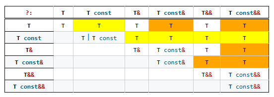
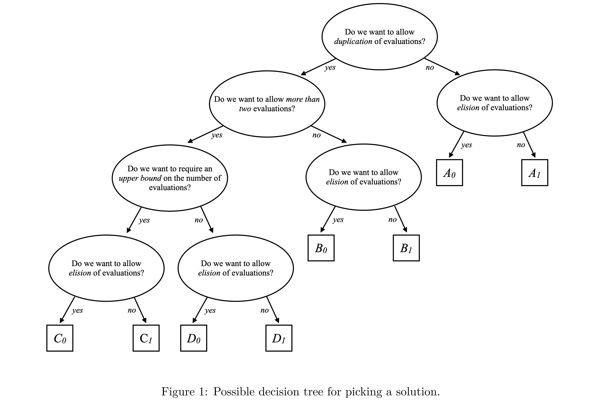

# ［C++］WG21月次提案文書を眺める（2024年04月）

文書の一覧

- [JTC1/SC22/WG21 - Papers 2024 mailing2024-04](https://www.open-std.org/jtc1/sc22/wg21/docs/papers/2024/#mailing2024-04)

全部で173本あります。

もくじ

[:contents]

### [N4974 Wroclaw meeting information](https://www.open-std.org/jtc1/sc22/wg21/docs/papers/2024/n4974.pdf)

2024年11月にポーランドのWroclaw（ブロツワウ）で行われる全体会議のインフォメーション。

予定（2024年11月18日～23日）と場所、ホテルの案内などが記載されています。

### [N4975 2024 WG21 admin telecon meetings](https://www.open-std.org/jtc1/sc22/wg21/docs/papers/2024/n4975.pdf)

2024年に行われる、WG21管理者ミーティングの予定表。

今年の残りは6/10と11/04に予定されています。

### [N4976 WG21 agenda: 18-23 March 2024, Tokyo, Japan](https://www.open-std.org/jtc1/sc22/wg21/docs/papers/2024/n4976.html)

2024年3月に東京で行われた会議のアジェンダ。

### [N4978 WG21 2024-03 Admin telecon minutes](https://www.open-std.org/jtc1/sc22/wg21/docs/papers/2024/n4978.pdf)

2024年3月4日に行われた、WG21管理者ミーティングの議事録。

前回（kona会議の前）からどのような活動があったかや、東京会議で何をするかなどの報告がなされています。

### [N4979 Hagenberg Meeting Invitation and Information](https://www.open-std.org/jtc1/sc22/wg21/docs/papers/2024/n4979.pdf)

2025年1月にオーストリアのHagenberg（ハーゲンベルグ）で行われる全体会議のインフォメーション。

予定（2025年1月10日～15日）と場所、生き方や現地の観光案内などが記載されています。

### [N4980 WG21 2024-03 Tokyo Minutes of Meeting](https://www.open-std.org/jtc1/sc22/wg21/docs/papers/2024/n4980.pdf)

2024年3月に東京で行われた全体会議の議事録。

最終日に行われた全体会議での各グループの作業報告と、全体投票の様子が記録されています。

### [N4981 Working Draft, Programming Languages -- C++](https://www.open-std.org/jtc1/sc22/wg21/docs/papers/2024/n4981.pdf)

C++26のワーキングドラフト第4弾

### [N4982 Editors' Report, Programming Languages -- C++](https://www.open-std.org/jtc1/sc22/wg21/docs/papers/2024/n4982.html)

↑の変更点をまとめた文書。

### [P0260R8 C+ Concurrent Queues](https://www.open-std.org/jtc1/sc22/wg21/docs/papers/2024/p0260r8.html)
### [P0562R1 Initialization List Symmetry](https://www.open-std.org/jtc1/sc22/wg21/docs/papers/2024/p0562r1.pdf)

↓

### [P0562R2 Trailing Commas in Base-clauses and Ctor-initializers](https://www.open-std.org/jtc1/sc22/wg21/docs/papers/2024/p0562r2.pdf)

コンストラクタ初期化子リストと基底クラスリストにおいて、末尾カンマを許容する提案。

カンマはC++の様々なところでエンティティの区切り文字として使用され、一部のコンテキストでは冗長な末尾のカンマが許容されます。

```cpp
enum class E {
  a,
  b,
  c,  // ok
};

int array[2] = { 
  0,
  1, // ok
};

std::vector<int> vec = {
  0,
  1, // ok
};

struct S {
  int a;
  int b;
};

S s = { 
  .a = 0,
  .b = 1,  // ok
};
```

このことは、単純なマクロの展開によってカンマ区切りリストを生成する際に便利であったり、単純なコード整形などによって見やすさや保守性の向上等のための助けとなります。

ただし、コンストラクタ初期化子リストでは末尾のカンマは許容されていません。

```cpp
class C {
  int a, b;
public:

  C(int n1, int n2)
    : a{n1},
      b{n2},  // ng
  {}
};
```

コンストラクタ初期化子リストの順番はクラスのメンバの宣言順と一致している必要があり、一致しない場合に時に微妙なバグを静かに埋め込むことになります。宣言順に一致させるために行の入れ替えをした後でカンマを消すというのはとても簡単な作業ではありますが、時に忘れがちで、コンパイルエラーを起こしてはじめて気づくこともあります。コンパイル時間が長い場合はその損失は大きなものになります。

また、そもそもその些細な作業の地味な面倒さから、並べ替えの必要性に気づいた人が作業をやらない誘因を与えています。

そのため、この提案ではコンストラクタ初期化子リストにおける末尾の不要なカンマを許容することを提案しています。

また、同様のメンテナンス性の問題と一貫性の向上のために、基底クラスリストにおいて同様に末尾カンマを許容するようにすることも提案しています。


<table>
<tr>
<th>現在</th>
<th>この提案</th>
</tr>
<tr>
<td valign="top">

```cpp
foo::foo(int x, int y, int z) :
  a(x),
  b(y),
  c(z)
{...}

class bar :
  public base,
  public mixin
{};
```

</td>
<td valign="top">

```cpp
foo::foo(int x, int y, int z) :
  a(x),
  b(y),
  c(z),
{...}

class bar :
  public base,
  public mixin,
{};
```

</td>
</tr>
</table>

この提案は内容が小さいこともありEWGのレビューをすでに終えてCWGでレビューされています。

- [P0562 進行状況](https://github.com/cplusplus/papers/issues/1818)

### [P0609R3 Attributes for Structured Bindings](https://www.open-std.org/jtc1/sc22/wg21/docs/papers/2024/p0609r3.pdf)
### [P0843R11 inplace_vector](https://www.open-std.org/jtc1/sc22/wg21/docs/papers/2024/p0843r11.html)
### [P0876R16 fiber_context - fibers without scheduler](https://www.open-std.org/jtc1/sc22/wg21/docs/papers/2024/p0876r16.pdf)
### [P1061R8 Structured Bindings can introduce a Pack](https://www.open-std.org/jtc1/sc22/wg21/docs/papers/2024/p1061r8.html)
### [P1068R11 Vector API for random number generation](https://www.open-std.org/jtc1/sc22/wg21/docs/papers/2024/p1068r11.pdf)
### [P1317R1 Remove return type deduction in `std::apply`](https://www.open-std.org/jtc1/sc22/wg21/docs/papers/2024/p1317r1.pdf)

`std::apply`の戻り値型推論をやめる提案。

`std::apply`の宣言は次のようになっており、戻り値型は`decltype(auto)`によって推論されています。

```cpp
namespace std {
  template<class F, tuple-like Tuple>
  constexpr decltype(auto)
    apply(F&& f, Tuple&& t) noexcept(...);
}
```

これによって、`apply`の引数に呼び出し不可能なペアを渡すと`apply`内部においてエラーが起こることによって、SFINAEのような動作をしないという問題があります。

例えば次のようなコンセプトとその使用例において

```cpp
#include <tuple>

template<class Func, class Tuple>
concept applicable =
  requires(Func&& func, Tuple&& args) {
    std::apply(std::forward<Func>(func), std::forward<Tuple>(args));
  };

int main () {
  auto func = [](){};
  auto args = std::make_tuple(1);

  static_assert(!applicable<decltype(func), decltype(args)>); // static_assert()によらずにエラーが起こる
}
```

この`func`は引数無しのラムダ式なので`std::tuple<int>`では呼び出しできません。`applicable`コンセプトの意図としては制約を満たさずに`false`となることが期待されますが、実際には`apply`本体内でのハードエラーとなることによってコンセプトの定義内でのエラーとなってしまいます。

これは、`decltype(auto)`によって戻り型が推論されているためで、これによって関数のシグネチャの決定のために本体のインスタンス化が必要となり、呼び出しできない引数が渡っている場合にそのインスタンス化の途中でハードエラーを起こしています。

この問題を回避するため、この提案は`std::apply`の戻り値型を求めるために`decltype(auto)`ではなく別の型特性を使用することを提案しています。

この提案では、`std::apply`の戻り値型導出のために`std::apply_result_t`という型特性を使用することを提案しています。

```cpp
namespace std {
  template<class Fn, class Tuple>
  struct apply_result;

  template<class F, class Tuple>
  using apply_result_t = apply_result<F, Tuple>::type;

  // 新しいapplyの宣言
  template<class F, class Tuple>
  constexpr std::apply_result_t<F, Tuple> apply(F&& f, Tuple&& t);
}
```

この`std::apply_result_t`は呼び出し不可能な型のペアを受け取ると、巧妙な実装によってそれをハードエラーではなくSFINAE-friendlyなエラーとして報告するように実装されます（提案中に実装例があります）。

また特に触れられてはいないのですが、上記の`applicable`のようなコンセプトを同時に追加しようともしています。

- [c+ - decltype(auto) works with SFINAE in some cases? - Stack Overflow](https://stackoverflow.com/questions/51119523/decltypeauto-works-with-sfinae-in-some-cases)
- [P1317 進行状況](https://github.com/cplusplus/papers/issues/326)

### [P2034R3 Partially Mutable Lambda Captures](https://www.open-std.org/jtc1/sc22/wg21/docs/papers/2024/p2034r3.pdf)
### [P2075R5 Philox as an extension of the C+ RNG engines](https://www.open-std.org/jtc1/sc22/wg21/docs/papers/2024/p2075r5.pdf)
### [P2127R0 Making C+  Software Allocator Aware](https://www.open-std.org/jtc1/sc22/wg21/docs/papers/2024/p2127r0.pdf)

Allocator AwareなC++コードのための解説書。

この文書は、Bloomberg社内の教育のために書かれた、C++コードでアロケータを受け取るクラスを記述するための知っておくべきことをまとめたものです。

LEWGにおけるポリシーの策定に当たってアロケータ関連のポリシーが提案されており、LEWGのメンバにとっても有用である可能性があるとして公開されたものです。

### [P2135R1 P2055R1: A Relaxed Guide to memory_order_relaxed](https://www.open-std.org/jtc1/sc22/wg21/docs/papers/2024/p2135r1.pdf)
### [P2141R2 Aggregates are named tuples](https://www.open-std.org/jtc1/sc22/wg21/docs/papers/2024/p2141r2.html)
### [P2248R8 Enabling list-initialization for algorithms](https://www.open-std.org/jtc1/sc22/wg21/docs/papers/2024/p2248r8.html)
### [P2300R8 `std::execution`](https://www.open-std.org/jtc1/sc22/wg21/docs/papers/2024/p2300r8.html)
### [P2300R9 `std::execution`](https://www.open-std.org/jtc1/sc22/wg21/docs/papers/2024/p2300r9.html)
### [P2355R2 Postfix fold expressions](https://www.open-std.org/jtc1/sc22/wg21/docs/papers/2024/p2355r2.html)
### [P2389R1 `dextents` Index Type Parameter](https://www.open-std.org/jtc1/sc22/wg21/docs/papers/2024/p2389r1.html)
### [P2414R3 Pointer lifetime-end zap proposed solutions](https://www.open-std.org/jtc1/sc22/wg21/docs/papers/2024/p2414r3.pdf)
### [P2542R8 views::concat](https://www.open-std.org/jtc1/sc22/wg21/docs/papers/2024/p2542r8.html)
### [P2573R2 = delete("should have a reason");](https://www.open-std.org/jtc1/sc22/wg21/docs/papers/2024/p2573r2.html)
### [P2591R5 Concatenation of strings and string views](https://www.open-std.org/jtc1/sc22/wg21/docs/papers/2024/p2591r5.html)
### [P2746R5 Deprecate and Replace Fenv Rounding Modes](https://www.open-std.org/jtc1/sc22/wg21/docs/papers/2024/p2746r5.pdf)
### [P2747R2 constexpr placement new](https://www.open-std.org/jtc1/sc22/wg21/docs/papers/2024/p2747r2.html)
### [P2748R5 Disallow Binding a Returned Glvalue to a Temporary](https://www.open-std.org/jtc1/sc22/wg21/docs/papers/2024/p2748r5.html)
### [P2755R1 A Bold Plan for a Complete Contracts Facility](https://www.open-std.org/jtc1/sc22/wg21/docs/papers/2024/p2755r1.pdf)
### [P2786R5 Trivial Relocatability For C++26](https://www.open-std.org/jtc1/sc22/wg21/docs/papers/2024/p2786r5.pdf)
### [P2795R5 Erroneous behaviour for uninitialized reads](https://www.open-std.org/jtc1/sc22/wg21/docs/papers/2024/p2795r5.html)
### [P2809R3 Trivial infinite loops are not Undefined Behavior](https://www.open-std.org/jtc1/sc22/wg21/docs/papers/2024/p2809r3.html)
### [P2810R4 is_debugger_present is_replaceable](https://www.open-std.org/jtc1/sc22/wg21/docs/papers/2024/p2810r4.html)
### [P2825R1 Overload Resolution hook: declcall(unevaluated-postfix-expression)](https://www.open-std.org/jtc1/sc22/wg21/docs/papers/2024/p2825r1.html)
### [P2825R2 Overload Resolution hook: declcall(unevaluated-postfix-expression)](https://www.open-std.org/jtc1/sc22/wg21/docs/papers/2024/p2825r2.html)
### [P2826R2 Replacement functions](https://www.open-std.org/jtc1/sc22/wg21/docs/papers/2024/p2826r2.html)
### [P2830R2 Standardized Constexpr Type Ordering](https://www.open-std.org/jtc1/sc22/wg21/docs/papers/2024/p2830r2.html)
### [P2830R3 Standardized Constexpr Type Ordering](https://www.open-std.org/jtc1/sc22/wg21/docs/papers/2024/p2830r3.html)
### [P2841R2 Concept and variable-template template-parameters](https://www.open-std.org/jtc1/sc22/wg21/docs/papers/2024/p2841r2.pdf)
### [P2845R7 Formatting of std::filesystem::path](https://www.open-std.org/jtc1/sc22/wg21/docs/papers/2024/p2845r7.html)
### [P2845R8 Formatting of std::filesystem::path](https://www.open-std.org/jtc1/sc22/wg21/docs/papers/2024/p2845r8.html)
### [P2855R1 Member customization points for Senders and Receivers](https://www.open-std.org/jtc1/sc22/wg21/docs/papers/2024/p2855r1.html)
### [P2863R5 Review Annex D for C++26](https://www.open-std.org/jtc1/sc22/wg21/docs/papers/2024/p2863r5.html)
### [P2866R2 Remove Deprecated Volatile Features From C++26](https://www.open-std.org/jtc1/sc22/wg21/docs/papers/2024/p2866r2.pdf)
### [P2867R2 Remove Deprecated strstreams From C++26](https://www.open-std.org/jtc1/sc22/wg21/docs/papers/2024/p2867r2.html)
### [P2869R4 Remove Deprecated `shared_ptr` Atomic Access APIs From C++26](https://www.open-std.org/jtc1/sc22/wg21/docs/papers/2024/p2869r4.pdf)
### [P2872R3 Remove `wstring_convert` From C++26](https://www.open-std.org/jtc1/sc22/wg21/docs/papers/2024/p2872r3.pdf)
### [P2873R1 Remove Deprecated locale category facets for Unicode from C++26](https://www.open-std.org/jtc1/sc22/wg21/docs/papers/2024/p2873r1.pdf)
### [P2875R4 Undeprecate `polymorphic_allocator::destroy` For C++26](https://www.open-std.org/jtc1/sc22/wg21/docs/papers/2024/p2875r4.pdf)
### [P2893R3 Variadic Friends](https://www.open-std.org/jtc1/sc22/wg21/docs/papers/2024/p2893r3.html)
### [P2900R6 Contracts for C++](https://www.open-std.org/jtc1/sc22/wg21/docs/papers/2024/p2900r6.pdf)
### [P2927R2 Observing exceptions stored in exception_ptr](https://www.open-std.org/jtc1/sc22/wg21/docs/papers/2024/p2927r2.html)
### [P2944R3 Comparisons for reference_wrapper](https://www.open-std.org/jtc1/sc22/wg21/docs/papers/2024/p2944r3.html)
### [P2977R1 Build database files](https://www.open-std.org/jtc1/sc22/wg21/docs/papers/2024/p2977r1.html)
### [P2988R4 std::optional<T&>](https://www.open-std.org/jtc1/sc22/wg21/docs/papers/2024/p2988r4.pdf)

`std::optional`が参照を保持することができるようにする提案。

以前の記事を参照

- [P2988R0 `std::optional<T&>` - WG21月次提案文書を眺める（2023年10月）](https://onihusube.hatenablog.com/entry/2024/01/08/203712#P2988R0-stdoptionalT)
- [P2988R1 `std::optional<T&>` - WG21月次提案文書を眺める（2024年01月）](https://onihusube.hatenablog.com/entry/2024/03/10/170322#P2988R1-stdoptionalT)
- [P2988R3 `std::optional<T&>` - WG21月次提案文書を眺める（2024年02月）](https://onihusube.hatenablog.com/entry/2024/05/18/235613#P2988R3-stdoptionalT)

このリビジョンでの変更は、問題となっていた`make_optional()`と`value_or()`のそれぞれについて、常に値（`std::optional<T>`/`T`）で返すようにしたことです。

どちらも後方互換性が問題であり、議論の結果良い解決策はないとして現状の`std::optional<T>`の挙動に合わせることになったようです。

- [P2988 進行状況](https://github.com/cplusplus/papers/issues/1661)

### [P2993R0 Constrained Numbers](https://www.open-std.org/jtc1/sc22/wg21/docs/papers/2024/p2993r0.pdf)

制約付きの整数型を生成するライブラリ機能の提案。

2018年から2022年の5年間で整数オーバーフローに関連するCVEレコードが1515件あります。1996年6月4日のアリアン5G V88/501ロケットの打ち上げ失敗は整数オーバーフローのエラー処理のバグが原因となり、3億7000万ドルの以上の損害を出しました。2015年と2020年には、ボーイング787のシステム内の時間値の整数オーバフローに関連する2つの別々のバグにより、飛行システムがクラッシュしたり計器に誤った情報が表示されたりするインシデントがありました。

これらのような整数型のオーバフローとそれに伴う結果は、プログラムの機能やセキュリティ、安全性を損なう重大なバグの原因となります。実行時に整数オーバーフローを検出できた場合でも、エラー処理を正しく行わなければそれもバグの元となります。

整数型の実行時の演算に伴う問題としてはそのほかにも、アンダーフロー、ゼロ除算、少し毛色は異なりますが配列の範囲外アクセスなどがあります。

C++コアガイドラインをはじめとする、安全なC/C++プログラムのためのコーディングルールにおいても必ず整数型のオーバーフローに関する注意やルールが存在しています。しかし、そのようなルールが取り入れられている現場においても、整数型のオーバーフローをはじめとする数値演算におけるバグは依然として危険性の高い問題であり続けています。

数値を正しく扱うために、既存のC++言語標準及びライブラリ、ガイドライン、コーディングルールなどは十分ではありません。

この提案では、標準ライブラリに対して新しい制約付きの数値システムを提案するものです。このシステムは、基本的に制約をコンパイル時にチェックし、必要な場合にのみ実行時チェックを行うことで、実行時への影響を最小限に抑えつつ安全で使いやすい数値型を提供するものです。

この提案による機能は`constrained_number<C, T>`という型を中心にしています。テンプレートパラメータの`C`には制約を指定し、`T`には内部表現のための整数型を指定して使用します。

```cpp
// 64bit符号付整数型としての制約を満たす値でのみ初期化可能
constrained_integral<int64_t> foo = 42; // ok

// [0, 10]の区間の整数値のみ表現可能な整数型
// この場合、符号付き整数型の値で初期化できない
constrained_number<constrain_interval<0, 10>> bar = 4;  // ng
```

ここでの制約とはコンセプトとは関係ありません。詳細は後述しますが、これは構文的な制約だけではなく意味論的な制約も表現可能なDSLになっています。

整数定数によって`constrained_number`を初期化するには、`_cn`リテラルを使用します。

```cpp
// 定数値'4'は指定されている制約を満たす
constrained_number<constrain_interval<0, 10>> bar = 4_cn;   // ok

// 定数値'42'は制約を満たさない
bar = 42_cn;    // ng
```

このチェックはすべてコンパイル時に行われ、実行時のオーバーヘッドはありません。

異なる制約を持つ`constrained_number`値の間で代入や初期化は可能ですが、代入・初期化しようとしている値が制約を満たしているかどうかがコンパイル時にチェックされます

```cpp
// 制約を満たす値によって正しく初期化されているとして
constrained_number<constrain_interval<0, 100>> foo = ...;

// 'foo'には'bar'の制約を満たさない値が含まれうる
constrained_number<constrain_interval<0, 10>> bar = foo;    // ng

// 上記エラーが無く、制約を満たす値によって正しく初期化されているとして
bar = ...;

// `bar`の値は`foo`の制約を常に満たす
foo = bar;  // ok
```

とはいえ、実行時に決定される値によって初期化できなければ実用には耐えません。ただしその場合でも制約を満たすかどうかはチェックされなければなりません。`make_constrained()`を使用すると、実行時の値から実行時に制約を満たしているかをチェックして変換することができます。このとき、制約を満たさない場合は例外が送出されます。

```cpp
// 5の倍数であることを要求する制約
constexpr any_constraint auto multiple_of_five_c =
  constraint_of<int64_t> &&
  constrain_multiple<5>;

// 5の倍数値のみからなる整数型
using mult_of_five_t = constrained_number<multiple_of_five_c>;

// コンパイル時にチェックされ、実行時には何もしない
auto v1 = make_constrained<multiple_of_five_c>(1005_cn);    // ok

// 実行時にチェック、制約が満たされない場合は例外を投げる
mult_of_five_t v2 = make_constrained<multiple_of_five_c>(get_some_raw_int());   // ok

// コンパイルエラー
auto v3 = make_constrained<multiple_of_five_c>(12_cn);  // ng

// 実行時に例外が送出される
mult_of_five_t v4 = make_constrained<multiple_of_five_c>(12);   // ok
```

`make_constrained()`は引数値に対してコンパイル時の検証が行える場合（`_cn`リテラルの値など）はコンパイル時にチェックを完了しようとします。

`constrained_number`は他の整数型に暗黙変換されません。`constrained_number`の値から生の整数値を得るためには`static_cast`によって明示的にキャストします
```cpp
// 制約を満たす値によって正しく初期化されているとして
constrained_number<constrain_interval<0, 10>> foo = ...;

// 組み込み整数型に変換
auto raw_foo = static_cast<uint32_t>(foo);  // ok
```

`constrained_number<C, T>`に指定する制約`C`の指定は、簡易なDSLによって行います。ここまでに使用していますが、整数型のとり得る値を区間で制限するために`constrain_interval`が用意されています

```cpp
// [-100, 100]区間の値のみ保持可能
constrained_number<constrain_interval<-100, 100>> small_number{};

// ↑はこれと等価
constrained_number<constrain_interval<-100, 100>> small_number = 0_cn;

// 0を除きたい場合（[-100, 0) ∪ (0, 100]）
constrained_number<constrain_interval<-100, -1> || constrain_interval<1, 100>> small_nonzero_number = 1_cn;
```

これによって、このライブラリではゼロ除算をコンパイル時に防止することができます。

```cpp
// small_numberは0を保持しうる
auto result_1 = 10_cn / small_number;   // ng

// small_nonzero_numberは0を保持しない
auto result_2 = 10_cn / small_nonzero_number;   // ok
```

この制約の実体は変数テンプレートであり、`constrained_number`のテンプレートパラメータの外側で定義しておくこともできます。

```cpp
constexpr auto non_zero_req = constrain_interval<-100, -1> || constrain_interval<1, 100>;
constexpr auto small_num_req = constrain_interval<-100, 100>;

// <=演算子を⊆の意味で使用可能
static_assert(non_zero_req <= small_num_req);

constrained_number<non_zero_req> non_zero = 1_cn;

// この初期化が安全であることは、制約の<=によってコンパイル時にチェックされる
constrained_number<small_num_req> small_num = non_zero;
```

この制約は、演算によって更新されます。

```cpp
constexpr auto one_to_ten_req = constrain_interval<1, 10>;
constexpr auto non_zero_req = constrain_interval<-100, -1> || constrain_interval<1, 100>;

constrained_number<non_zero_req> a = 42_cn;
constrained_number<one_to_ten_req> b = 3_cn;

auto c = a * b; // ok

// 実行時の値は期待通りに更新される
assert(c == 126);

// 制約もまた、期待通りに更新される
static_assert(c.constraint == constrain_interval<-1000, -1> || constrain_interval<1, 1000>);
```

用意されている制約は次のものです

|名称|定義|API|備考|
|---|---|---|---|
|区間|`[a, b]`|`constrain_interval<a, b>`|閉区間|
|集合|`{a, b, ...}`|`constrain_set<a, b, ...>`|外延的な集合|
|マスク|`{x ∈ Z | 0 <= x <= 2^n && (x & ~V) == C}`|`constrain_mask<V, C>`|ビットマスクによる整数値の指定|
|剰余類|`{x ∈ Z | mod(x, a) == 0}`|`constrain_multiple<a>`|`a`の倍数からなる集合|
|Constraint of|`[min(T), max(T)]`|`constraint_of<T>`|整数表現の制約区間|
|空集合|∅|`constraint_empty `|表現可能な値なし|
|不正|⊥|`constraint_invalid`|他の方法では表現できない値が含まれていたであろう集合|

これらの制約は集合的に指定されており、集合の演算によって制約を合成したりすることができます。制約の定義のために使用可能な演算は、次のものです


`constrained_number`を使用して、`[]`の引数値を制限する例

```cpp
template<class T, size_t Extent = dynamic_extent>
class span {
  ...

  constexpr reference at(constrained_number<constrain_interval<0, Extent - 1>> pos) noexcept const
    requires (Extent != dynamic_extent);

  constexpr reference operator[](constrained_number<constrain_interval<0, Extent - 1>> pos) noexcept const
    requires (Extent != dynamic_extent);
  
  ...
};
```

- [C+ における整数型の怪と "移植性のある" オーバーフローチェッカー (第1回 : 整数型の怪と対策の不足) - Qiita](https://qiita.com/a4lg/items/541c9d9dd5d874eeef2f)
- [P2993 進行状況](https://github.com/cplusplus/papers/issues/1817)

### [P2997R1 Removing the common reference requirement from the indirectly invocable concepts](https://www.open-std.org/jtc1/sc22/wg21/docs/papers/2024/p2997r1.html)

イテレータを介した間接呼び出し系のコンセプトから、`common_reference`要件を取り除く提案。

以前の記事を参照

- [P2997R0 Removing the common reference requirement from the indirectly invocable concepts - WG21月次提案文書を眺める（2023年10月）](https://onihusube.hatenablog.com/entry/2024/01/08/203712#P2997R0-Removing-the-common-reference-requirement-from-the-indirectly-invocable-concepts)

このリビジョンでの変更は、機能テストマクロを追加したことです。

この提案は2024年6月の全体会議で承認され、C++26ドラフトに導入されています。

- [P2997 進行状況](https://github.com/cplusplus/papers/issues/1669)

### [P3008R2 Atomic floating-point min/max](https://www.open-std.org/jtc1/sc22/wg21/docs/papers/2024/p3008r2.html)

浮動小数点数型の`std::atomic`における`fetch_max()/fetch_min()`の問題を解消する提案。

以前の記事を参照

- [P3008R0 Atomic floating-point min/max - WG21月次提案文書を眺める（2023年10月）](https://onihusube.hatenablog.com/entry/2024/01/08/203712#P3008R0-Atomic-floating-point-minmax)
- [P3008R1 Atomic floating-point min/max - WG21月次提案文書を眺める（2024年02月）](https://onihusube.hatenablog.com/entry/2024/05/18/235613#P3008R1-Atomic-floating-point-minmax)

このリビジョンでの変更は

- 以前に未規定としていたところを実装定義に変更
- `fetch_min/max`のデフォルトは不要であり、明示的な`fetch_fminimum/minimum_num`へ変更
- 入力の値の一つがNanの場合、結果の値がNanか他の値かどうかは未規定
- `fetch_fminimum/fminimum_num/fmaximum/fmaximum_num`は対応するC23のAPiを用いて設計され、シグナリングNaNは無視する
- `fetch_min/max`ではシグナリングNaNの動作を明示的に指定しない

などです。

- [P3008 進行状況](https://github.com/cplusplus/papers/issues/1672)

### [P3016R3 Resolve inconsistencies in begin/end for valarray and braced initializer lists](https://www.open-std.org/jtc1/sc22/wg21/docs/papers/2024/p3016r3.html)

`std::valarray`と初期化子リストに対して`std::begin`と`std::cbegin`を呼んだ場合の他のコンテナ等との一貫しない振る舞いを修正する提案。

以前の記事を参照

- [P3016R0 Resolve inconsistencies in `begin/end` for `valarray` and braced initializer lists - WG21月次提案文書を眺める（2023年10月）](https://onihusube.hatenablog.com/entry/2024/01/08/203712#P3016R0-Resolve-inconsistencies-in-beginend-for-valarray-and-braced-initializer-lists)
- [P3016R1 Resolve inconsistencies in begin/end for valarray and braced initializer lists - WG21月次提案文書を眺める（2023年12月）](https://onihusube.hatenablog.com/entry/2024/02/29/191439#P3016R1-Resolve-inconsistencies-in-beginend-for-valarray-and-braced-initializer-lists)
- [P3016R2 Resolve inconsistencies in begin/end for valarray and braced initializer lists - WG21月次提案文書を眺める（2023年12月）](https://onihusube.hatenablog.com/entry/2024/05/18/235613#P3016R2-Resolve-inconsistencies-in-beginend-for-valarray-and-braced-initializer-lists)

このリビジョンでの変更は

- LWG Issue 3624とLWG Issue 3625の変更（Issue解決）を提案する文言から外した
    - これらの解決策を承認しているように見えることが望ましくなかったため

などです。

- [P3016 進行状況](https://github.com/cplusplus/papers/issues/1678)

### [P3019R7 Vocabulary Types for Composite Class Design](https://www.open-std.org/jtc1/sc22/wg21/docs/papers/2024/p3019r7.html)

↓

### [P3019R8 Vocabulary Types for Composite Class Design](https://www.open-std.org/jtc1/sc22/wg21/docs/papers/2024/p3019r8.html)


動的メモリ領域に構築されたオブジェクトを扱うためのクラス型の提案。

以前の記事を参照

- [P3019R0 Vocabulary Types for Composite Class Design - WG21月次提案文書を眺める（2023年10月）](https://onihusube.hatenablog.com/entry/2024/01/08/203712#P3019R0-Vocabulary-Types-for-Composite-Class-Design)
- [P3019R3 Vocabulary Types for Composite Class Design - WG21月次提案文書を眺める（2023年12月）](https://onihusube.hatenablog.com/entry/2024/02/29/191439#P3019R3-Vocabulary-Types-for-Composite-Class-Design)
- [P3019R6 Vocabulary Types for Composite Class Design - WG21月次提案文書を眺める（2024年02月）](https://onihusube.hatenablog.com/entry/2024/05/18/235613#P3019R6-Vocabulary-Types-for-Composite-Class-Design)

R7での変更は

- `indirect`の無条件コピーコンストラクタについて、それを可能にする実装について説明
- 曖昧さの解消のために代入演算子に関する文言を修正
- `valueless_after_move`メンバ関数の動機について説明

このリビジョンでの変更は

- `indirect`と`polymorphic`のコンストラクタで`allocator_traits::construct()`を使用するためのより明示的な文言を追加
- `indirect`と`polymorphic`が`in_place_t/in_place_type_t`の特殊化としてインスタンス化されるのを防止する
- `reference_wrapper`との一貫性を保つために、`T`が完全型であることを強制する

などです。

この提案は現在LWGのレビュー中です。

- [P3019 進行状況](https://github.com/cplusplus/papers/issues/1680)

### [P3029R1 Better `mdspan`'s CTAD](https://www.open-std.org/jtc1/sc22/wg21/docs/papers/2024/p3029r1.html)

`std::span`/`std::mdspan`がコンパイル時定数によってインデックス指定を受ける場合のCTADを改善する提案。

以前の記事を参照

- [P3029R0 Better mdspan's CTAD - WG21月次提案文書を眺める（2023年12月）](https://onihusube.hatenablog.com/entry/2024/02/29/191439#P3029R0-Better-mdspans-CTAD)

このリビジョンでの変更は

- `maybe-static-ext`の特殊化を`{T::value}`で初期化することで、負の値からの変換を防止
- 最新のWDへの追随

などです。

この提案は2024年6月に行われた全体会議で承認され、C++26WD入りしています。

- [P3029 進行状況](https://github.com/cplusplus/papers/issues/1710)

### [P3032R1 Less transient constexpr allocation](https://www.open-std.org/jtc1/sc22/wg21/docs/papers/2024/p3032r1.html)

↓

### [P3032R2 Less transient constexpr allocation](https://www.open-std.org/jtc1/sc22/wg21/docs/papers/2024/p3032r2.html)

定数式における動的メモリ確保の制限を少しだけ緩和する提案。

以前の記事を参照

- [P3032R0 Less transient constexpr allocation - WG21月次提案文書を眺める（2024年02月）](https://onihusube.hatenablog.com/entry/2024/05/18/235613#P3032R0-Less-transient-constexpr-allocation)

R1での変更は、提案する文言の修正と、機能テストマクロの追加などです。

このリビジョンでの変更は、提案する文言の問題点の指摘に対応したことと、問題の解決方法としてあがっていた2つの方法をどちらも採用し提案するようにしたことです。

この提案では、定数評価コンテキストの分断によってコンパイル時に動的に確保したメモリを開放すべきコンテキストの境界が、ユーザーの期待と一致しないことを解決しようとしており、そのための次の2つの変更が必要としていました

1. 定数式にならない即時関数呼び出しが定数式になるように、それを含むより大きな式を定数式として扱う
2. 定数式における動的メモリ確保に関して、開放のタイミングが同じ評価内にある場合に加えて、同じ直接のコンテキスト内にある場合も許可する

1つ目の変更は複雑になり利得が低いとして、R1までは2つ目の変更だけを提案していました。

このリビジョンではどちらの変更も提案するようになっています。ルールは複雑になるものの、それによって解消される問題についてユーザーが細かいルールを学ぶ必要が無くなる利点がある（この利点が当初の見積もりよりも大きい）としています。

- [P3029 進行状況](https://github.com/cplusplus/papers/issues/1751)

### [P3034R1 Module Declarations Shouldn't be Macros](https://www.open-std.org/jtc1/sc22/wg21/docs/papers/2024/p3034r1.html)

名前付きモジュールのモジュール宣言において、モジュール名のマクロ展開を禁止する提案。

以前の記事を参照

- [P3034R0 Module Declarations Shouldn't be Macros - WG21月次提案文書を眺める（2023年12月）](https://onihusube.hatenablog.com/entry/2024/02/29/191439#P3034R0-Module-Declarations-Shouldnt-be-Macros)

このリビジョンでの変更はDRであることを明記した事のようです。

この提案は2024年3月の全体会議によって採択されており、C++26に導入済みです。

- [P3034 進行状況](https://github.com/cplusplus/papers/issues/1696)

### [P3037R1 `constexpr std::shared_ptr`](https://www.open-std.org/jtc1/sc22/wg21/docs/papers/2024/p3037r1.pdf)

`std::shared_ptr`を定数式でも使える様にする提案。

以前の記事を参照

- [P3037R0 `constexpr std::shared_ptr` - WG21月次提案文書を眺める（2023年12月）](https://onihusube.hatenablog.com/entry/2024/02/29/191439#P3037R0-constexpr-stdshared_ptr)

このリビジョンでの変更は

- モチベーションとなる例を追加
- libc++とMSVC STLのアトミック操作について追記

などです。

アトミック操作については、`std::is_constant_evaluated()`を利用することでコンパイル時にはアトミック操作を使用しないように実装可能であり、既存の実装（libc++とMSVC STL）でもそれで実装可能と思われる、と報告しています。

- [P3037 進行状況](https://github.com/cplusplus/papers/issues/1713)

### [P3049R0 node-handles for lists](https://www.open-std.org/jtc1/sc22/wg21/docs/papers/2024/p3049r0.pdf)

リストに対してノードハンドルのサポートを追加する提案。

C++17では、連想コンテナに対してノードハンドルAPIが追加されました。ノードハンドルとはノードベースコンテナのある一要素の所有権を引き取るもので、ノードハンドルを介することで、互換性のあるコンテナ間でムーブすらすることなく要素を移動することができます。

```cpp
// cpprefjpのサンプルを微修正したもの

import std;

int main() {
  std::map<char, int> m1, m2;

  m1.insert(std::make_pair('a', 10));
  m1.insert(std::make_pair('b', 20));
  m1.insert(std::make_pair('c', 30));

  // m1の'c'をキーとするノードハンドルを取得
  std::map<char, int>::node_type node = m1.extract('c');

  // 取得したノードハンドルを別のmap'm2'へ挿入
  // この時、ノード（要素）はコピーもムーブもされていない
  m2.insert(std::move(node));

  std::println("{}\n{}", m1, m2);
}
```

出力例

```
{'a': 10, 'b': 20}
{'c': 30}
```

一方`std::list`及び`std::forward_list`もノードベースコンテナではありましたが、元々`splice`のAPIを備えていたこともあり、APIの一貫性以上の利点はないとしてリスト系コンテナに対してはノードハンドルAPIは追加されませんでした。

この提案は、APIの一貫性向上も含めてさらに追加の利点があるとして、`std::list`及び`std::forward_list`にノードハンドルAPIを追加することを提案するものです。

ここで提案されているAPIは、連想コンテナのAPI

```cpp
// ノードハンドルの型
using node_type = implementation defined specialization of node_handle;

// ノードハンドルの取り出しAPI
node_type extract(const_iterator pos);
node_type extract(const key_type& key);
template<typename Key> 
node_type extract(Key&& key);

// insert()の戻り値型
struct insert_return_type {
  iterator position; 
  bool inserted; 
  node_type node; 
};

// ノードハンドルの挿入API
insert_return_type insert(node_type && handle);
iterator insert(const_iterator pos, node_type && handle);
```

に対してこのサブセットとなるもので、次の2つの関数からなります

```cpp
// ノードハンドルの型
using node_type = implementation defined specialization of node_handle;

// ノードハンドルの取り出し
node_type extract(const_iterator pos);

// ノードハンドルの挿入
iterator insert(const_iterator pos, node_type && handle);

// forward_listのAPI
node_type extract_after(const_iterator pos); 
iterator insert_after(const_iterator pos, node_type && handle);
```

減った分のAPIは、連想コンテナに固有の事情に特化したものだけです。

リスト系コンテナへのノードハンドルAPI追加の利点として、この提案では`splice()`操作と比較してソースとターゲットをより適切に分離できる点を挙げています。

```cpp
// listでsplice()を使用する例

// valに指定した値に一致する値を持つリスト要素を移動する
template<typename T> 
void splice_if(list<T> & from, list<T> & to, T val) { 
  const auto it{ranges::find(from, val)};
 
  if (it != from.end()) {
    to.splice(to.begin(), from, it); 
  }
} 

// usage: 
list<int> l1 = …; // filled with random ints 

// splice()によって要素を移動させようとする場合
// 移動元と移動先コンテナがそろっている必要がある
list<int> l2 = …;

splice_if(l1, l2, 42);
```

```cpp
// この提案のノードハンドルAPIを使用する例

// valに指定した値に一致する値を持つリスト要素のノードハンドルを取得する
template<typename T> 
list<T>::node_type extract_if(list<T> & from, T val) { 
  const auto it{ranges::find(from, val)};

  if (it != from.end()) {
    return from.extract(it);
  }

  return {}; 
} 

//usage: 
list<int>& l1 = …; // filled with random ints 
auto nh{extract_if(l1, 42)};
// nh は転送先とは独立して取り廻すことができる

// これにより、要素取り出しと要素挿入が分離される
list<int>& l2 = …; 
if(nh) l2.insert(l2.end(), move(nh));
```

この提案の内容は既に、MSVC STLのフォークにて実装可能なことが確認されています。

- [`node_handle` - cpprefjp](https://cpprefjp.github.io/reference/node_handle/node_handle.html)
- [P3049 進行状況](https://github.com/cplusplus/papers/issues/1820)

### [P3050R1 Fix C++26 by optimizing `linalg::conjugated` for noncomplex value types](https://www.open-std.org/jtc1/sc22/wg21/docs/papers/2024/p3050r1.html)

`std::linalg::conjugated()`を非複素数型に対してアクセサの変更をしないようにする提案。

以前の記事を参照

- [P3050R0 Optimize linalg::conjugated for noncomplex value types - WG21月次提案文書を眺める（2023年12月）](https://onihusube.hatenablog.com/entry/2024/02/29/191439#P3050R0-Optimize-linalgconjugated-for-noncomplex-value-types)

このリビジョンでの変更は

- 提案する文言についての説明を追加
- 実装へのリンクを追加
- タイトルとAbstractを変更して、これをC++26に間に合わせないと破壊的変更になることを強調

などです。

- [`std::linalg::conjugated()` - cpprefjp](https://cpprefjp.github.io/reference/linalg/conjugated.html)
- [P3050 進行状況](https://github.com/cplusplus/papers/issues/1719)

### [P3064R0 How to Avoid OOTA Without Really Trying](https://www.open-std.org/jtc1/sc22/wg21/docs/papers/2024/p3064r0.pdf)
### [P3068R1 Allowing exception throwing in constant-evaluation](https://www.open-std.org/jtc1/sc22/wg21/docs/papers/2024/p3068r1.pdf)

定数式において`throw`式による例外送出を許可する提案。

以前の記事を参照

- [P3068R0 Allowing exception throwing in constant-evaluation. - WG21月次提案文書を眺める（2024年02月）](https://onihusube.hatenablog.com/entry/2024/05/18/235613#P3068R0-Allowing-exception-throwing-in-constant-evaluation)

このリビジョンでの変更は、定数式において生成された例外オブジェクトが`exception_ptr`を用いてその評価の外側にリークしないように文言を調整したことと、その例を追加したことです。

この提案の変更においては、ある定数式の評価中に`throw`式によって生成された例外オブジェクトは、生存期間がその定数式の評価を超えてはならない、としています。これはその暗黙のコピー、すなわち`std::exception_ptr`によって取り廻されるものについても同様で、例外オブジェクトはその投げられた定数式の評価の内側で処理されなければなりません（されない場合、コンパイルエラーとなります）。

提案より、例

```cpp
consteval auto fail() -> std::exception_ptr { 
  try { 
    throw failure{}; 
  } catch (...) { 
    return std::current_exception() 
  } 
}

constexpr auto stored_exception = fail(); // 許可されない、定数評価から例外オブジェクトはリークしてはならない
```

- [P3068 進行状況](https://github.com/cplusplus/papers/issues/1754)

### [P3072R2 Hassle-free thread attributes](https://www.open-std.org/jtc1/sc22/wg21/docs/papers/2024/p3072r2.html)

スレッドへの属性指定APIについて、集成体と指示付初期化によるAPIの提案。

以前の記事を参照

- [P3072R0 Hassle-free thread attributes - WG21月次提案文書を眺める（2023年12月）](https://onihusube.hatenablog.com/entry/2024/02/29/191439#P3072R0-Hassle-free-thread-attributes)
- [P3072R1 Hassle-free thread attributes - WG21月次提案文書を眺める（2024年02月）](https://onihusube.hatenablog.com/entry/2024/05/18/235613#P3072R1-Hassle-free-thread-attributes)

このリビジョンでの変更は、 initializer-clausesの例を追加したことです。

- [P3072 進行状況](https://github.com/cplusplus/papers/issues/1733)

### [P3074R3 trivial union (was std::uninitialized<T>)](https://www.open-std.org/jtc1/sc22/wg21/docs/papers/2024/p3074r3.html)

定数式において、要素の遅延初期化のために共用体を用いるコードを動作するようにする提案。

以前の記事を参照

- [P3074R0 constexpr union lifetime - WG21月次提案文書を眺める（2023年12月）](https://onihusube.hatenablog.com/entry/2024/02/29/191439#P3074R0-constexpr-union-lifetime)
- [P3074R2 `std::uninitialized<T>` - WG21月次提案文書を眺める（2024年02月）](https://onihusube.hatenablog.com/entry/2024/05/18/235613#P3074R2-stduninitializedT)

このリビジョンでの変更は、代わりのソリューションとして`union`の仕様を変更する提案を追記したことなどです。

ここで新しく提案している解決策は、次のように注釈付きの`union`を宣言することでこの目的に沿った新しい共用体を提供することです

```cpp
template <typename T, size_t N>
struct FixedVector {
  trivial union { T storage[N]; };
  size_t size = 0;
};
```

この`trivial union`は、要素型によらず常にトリビアルにデフォルト構築可能かつトリビアルに破棄可能であり、そのメンバは初期化されません。ただし、その最初のメンバが*implicit-lifetime type*ならば、そのメンバの生存期間を暗黙的に開始しそれをアクティブメンバとします（上記例の場合、`FixedVector`のオブジェクトの生存期間が開始された時、`storage`メンバの配列型オブジェクトとしての生存期間が開始されるものの、配列要素は初期化されない）。

これは未初期化領域を得るためのものであると同時に依然として共用体でもあり、扱いは共用体に準じるため、言語の既存の部分に変更の必要性がなく、未初期化領域を得る目的ですぐに使い始めることができます。

このトリビアル`union`のメンバにデフォルトメンバ初期化子がある場合の動作については検討が必要そうですが、ここでは未初期化領域を得るためのものである意図と矛盾しているため、トリビアル`union`ではデフォルトメンバ初期化子を禁止することを提案しています。

- [P3074 進行状況](https://github.com/cplusplus/papers/issues/1734)

### [P3085R1 `noexcept` policy for SD-9 (throws nothing)](https://www.open-std.org/jtc1/sc22/wg21/docs/papers/2024/p3085r1.html)

ライブラリ関数に`noexcept`を付加する条件についてのポリシーの提案。

以前の記事を参照

- [P3085R0 noexcept policy for SD-9 (throws nothing) - WG21月次提案文書を眺める（2024年02月）](https://onihusube.hatenablog.com/entry/2024/05/18/235613#P3085R0-noexcept-policy-for-SD-9-throws-nothing)

- principled designとnotable omissionsセクションを追加
- パススルー関数という定義されていない用語の使用を削除

などです。


- [P3085 進行状況](https://github.com/cplusplus/papers/issues/1756)

### [P3086R1 Proxy: A Pointer-Semantics-Based Polymorphism Library](https://www.open-std.org/jtc1/sc22/wg21/docs/papers/2024/p3086r1.pdf)

↓

### [P3086R2 Proxy: A Pointer-Semantics-Based Polymorphism Library](https://www.open-std.org/jtc1/sc22/wg21/docs/papers/2024/p3086r2.pdf)

静的な多態的プログラミングのためのユーティリティ、"Proxy"の提案。

以前の記事を参照

- [P3086R0 Proxy: A Pointer-Semantics-Based Polymorphism Library - WG21月次提案文書を眺める（2024年02月）](https://onihusube.hatenablog.com/entry/2024/03/10/170322#P3086R0-Proxy-A-Pointer-Semantics-Based-Polymorphism-Library)

R1での変更は

- 抽象化モデルの`noexcept`指定を追記し、`ytaproxy::invoke`と`proxy::operator()`の`noexcept`指定を更新
- コード生成でより最適化を促進するために、`basic_facade`コンセプトと`proxy`の制約を削除

このリビジョンでの変更は

- `make_proxy()`を文言から削除
- `facade`コンセプトの文言を更新し、`facade`またはディスパッチの実装で`tuple-like`な型を使用できるようにした
- `facade`コンセプトのセマンティクスを改訂し、ディスパッチの呼び出しでフォールバックを使用できるようにした
- 提案するライブラリ機能の場所を`<memory>に変更
- フリースタンディングについてのセクションを追加
- P31019R6との比較に関する説明を追加
- 順序付けとハッシュサポートに関する説明を追加
- 未解決の質問についてのセクションを追加
- 2つのヘルパマクロの説明セクションを追加`

などです。

- [P3086 進行状況](https://github.com/cplusplus/papers/issues/1741)

### [P3091R1 Better lookups for `map` and `unordered_map`](https://www.open-std.org/jtc1/sc22/wg21/docs/papers/2024/p3091r1.html)

連想コンテナからキーによって要素を検索するより便利な関数の提案。

以前の記事を参照

- [P3091R0 Better lookups for `map` and `unordered_map` - WG21月次提案文書を眺める（2024年02月）](https://onihusube.hatenablog.com/entry/2024/05/18/235613#P3091R0-Better-lookups-for-map-and-unordered_map)

このリビジョンでの変更は

- `.get()`の戻り値型を`optional<mapped_type&>`に変更
- `.get_ref()`と`.get_as()`の役割を`optional<T&>`に委譲する
- `optional`に`.or_construct()`を追加する提案を追記
    - `.get_as()`の代替
- `optional<T&>`の`.value_or()`の拡張を提案
- 機能テストマクロの追加

などです。

このリビジョンで提案されているのは次の2つのメンバ関数だけになりました

```cpp
optional<      mapped_type&> get(const key_type& k);
optional<const mapped_type&> get(const key_type& k) const;
```

以前の`.get_ref()`は`optional`の`calue_or`によって再現可能です

```cpp
std::map<std::string, int> theMap{ ... };

...

// 文字列範囲namesに含まれている名前と同じ名前の要素をインクリメントする
for (const std:string& name : names) {
  int temp = 0;
  ++theMap.get(name).value_or(temp);  // 参照を通じてインクリメント
  // Possibly-modified value of `temp` is discarded.
}
```

以前に`.get_as()`で行っていたことをは、`std::optional`に対して`.or_construct()`を追加することで対応しようとしています

```cpp
std::optional<std::string> theOpt;
std::string_view sv1 = theOpt.or_construct<std::string_view>("empty");

std::map<int, std::string> theMap{ ... };
std::string_view sv2 = theMap.get(key).or_construct<std::string_view>("none");
```

`.or_construct()`は`std::optional`に追加することを提案しています。

```cpp
namespace std {
  template<typename T>
  class optional {
    ...

    template <class U = remove_cvref_t<T>, class... Args>
    U constexpr or_construct(Args&&...);

  };
}
```

`opt.or_construct<U>(args...);`のように呼んで、`opt`が保持している値を`U`に変換し、`opt`が無効状態ならば`args...`から`U`を構築して返します。

そして、`std::optional<T&>`の`.value_or(U&&)`の戻り値型は以前に`get_ref()`がそうであったように`T&`と`U&&`の`common_reference`にすることを提案しています。

- [P2988R3 `std::optional<T&>` - WG21月次提案文書を眺める（2024年02月）](https://www.open-std.org/jtc1/sc22/wg21/docs/papers/2024/p3091r1.html)
- [P3091 進行状況](https://github.com/cplusplus/papers/issues/1759)

### [P3094R1 `std::basic_fixed_string`](https://www.open-std.org/jtc1/sc22/wg21/docs/papers/2024/p3094r1.html)

NTTPとして使用可能なコンパイル時文字列型である`std::basic_fixed_string`の提案。

以前の記事を参照

- [P3094R0 `std::basic_fixed_string` - WG21月次提案文書を眺める（2024年02月）](https://onihusube.hatenablog.com/entry/2024/05/18/235613#P3094R0-stdbasic_fixed_string)

このリビジョンでの変更は

- この用途に`std::array`を使用する場合の不便な点について追記
- Design rationaleとOpen questionsのチャプターを追加
- Synopsisセクションを更新
  - `.view()`を`std::string_view`への変換演算子に置換
  - `std:integral_constant`を取るコンストラクタをイテレータペアを取るコンストラクタへ置換
  - `operator==`の改善
  - `char`以外の文字型のエイリアスを追加

などです。

- [P3094 進行状況](https://github.com/cplusplus/papers/issues/1762)

### [P3097R0 Contracts for C++: Support for virtual functions](https://www.open-std.org/jtc1/sc22/wg21/docs/papers/2024/p3097r0.pdf)

契約プログラミング機能において、仮想関数に対する契約の指定をサポートする提案。

以前の契約プログラミング仕様においては仮想関数にも通常の関数と同様に契約注釈を行うことができました。ただし、派生先の契約注釈は派生元の契約を暗黙に継承し、明示的に指定する場合でも派生元の契約と同じにならなければならないとされていました。これは、Assertion Redeclaration ruleというルール（事前条件は同じかより弱いもの、事後条件は同じかより強いものでなければならない）に沿うものでしたが、派生先に明示的に指定された契約注釈が派生元と同じであることをどう表現するかや異なる場合にどうするかなどや、そのルールがC++の実際の仮想関数のユースケースを満たしていないということが問題となり、より議論を尽くすためにC++26に向けては仮想関数に対する契約注釈を目指さないことになりました。それを受けて、現在のContracts MVP仕様（P2900R5）では仮想関数に対する契約注釈の指定は禁止されています。

例えば、Assertion Redeclaration ruleに従わないような2つの呼び出し、事前条件をより強くする場合と事後条件をより弱くする場合の2つのケースにおいても、ユースケースが存在しています。

例えば次のような`Car`クラスを基底クラスとして

```cpp
struct Car {
  virtual void drive(float speedMph)
    pre (speedMph < 100) // don't go too fast!
};

void testCar(Car& car) {
  car.drive(90);  // OK
  car.drive(120); // bug: precondition violation
}
```

次のように`Car`クラスを派生させると、事前条件をより強くすることになります

```cpp
struct ElectricCar : Car {
  void drive(float speed_mph) override
    pre (is_charged);   // 事後条件が強くなっている

  void charge() { is_charged = true }

private:
  bool is_charged = false;
};


void testCar(Car& car);

int main() {
  ElectricCar myElectricCar;
  testCar(myElectricCar);
}

void testCar(Car& car) {
  car.drive(90); // 事前条件違反、charge()を呼んでいない
}
```

このように派生クラスで事前条件を強くしてしまうと、`ElectricCar`のインスタンスは一般的に`Car`のインスタンスとして使用することができなくなるため、正統的なオブジェクト指向設計に準拠していません。

それでもなあお、これが合理的である場合があります。使用準備が整った`ElectricCar`のインスタンスをより広いスコープで使用することで、より具体的な事前条件を非ローカルで保証することができます。

```cpp
int main() {
  ElectricCar myElectricCar;
  myElectricCar.charge();
  
  testCar(myElectricCar); // everything works now!
}
```

デフォルト構築された`ElectricCar`はそのまま`Car`の代わりに使用することはできませんが、`.charge()`を呼び出すことでその準備が整います。この場合、`ElectricCar::drive()`で強められている契約はこの追加のセットアップ手順を省略されないようにすることを表現するものとしてみることができます。このような設計は現実のC++アプリケーションで一般的です。

（提案には、他の3つの場合と多重継承の場合のユースケース例があります）

また、以前のMVP仕様（派生先に派生元と同じ契約を強制する）では、この例だけでなく、Assertion Redeclaration ruleに従うような継承を行っている場合を完全にサポートしきれてはいません。

この提案は、仮想関数に対する契約注釈は契約機能の普及のために必須であるとして、以前の問題を解決して仮想関数に対する契約注釈を個萎えるようにするための新しいソリューションを提案するものです。

この提案では仮想関数に対する契約注釈を許可しますが、派生先の関数は派生元の関数の契約を継承しません。派生元関数の契約は派生元の関数の契約から完全に独立しており、派生先の事前条件及び事後条件は拡大と縮小の両方が可能になります。

そして、仮想関数呼び出し時の契約チェックの評価は次のようになります

1. 派生元関数の事前条件が評価される
2. 派生先関数の事前条件が評価される
3. 派生先関数の本体が実行される
4. 派生先関数の事後条件が評価される
5. 派生元関数の事後条件が評価される

仮想関数が基底クラスのポインタ/参照を介して呼び出される場合、派生元の関数は静的に決定されておりその契約も呼び出す場所から見えています。一方、派生先の関数は動的に決定され動的にディスパッチされますが、ディスパッチされた先ではどの派生型の実装された関数が呼ばれているのか、およびその契約についてが分かっています。

そのため、仮想関数の呼び出しにおいては直接関与する2つの型（静的型と動的型）についての情報を利用することができ、それによって上記のような呼び出しシーケンスが可能になります。

例えば、静的型と動的型が一致する場合（派生クラスオブジェクトを派生クラスのポインタ/参照、あるいはオブジェクトから直接呼び出した場合）、その派生クラスにおいてなされている契約だけが評価されます。

提案より、深い継承の例

```cpp
struct X {
  virtual void f() pre(a) post(b);
};

struct Y : X {
  void f() override pre(c) post(d);
};

struct Z : Y {
  void f() override pre(e) post(f);
};

int main() {
  Z z;

  X& x = (X&)z;
  x.f(); // a -> eの順でチェックされ、z::f()が実行された後、f -> bの順でチェックされる
  
  Y& y = (Y&)z;
  y.f(); // c -> eの順でチェックされ、z::f()が実行された後、f -> dの順でチェックされる
}
```

多重継承の例

```cpp
struct X1 {
  virtual void f() pre(a1) post (b1);
};

struct X2 {
  virtual void f() pre(a2) post (b2);
};

struct Y : X1, X2 {
  void f() override pre(c) post (d);
};

int main() {
  Y y;

  X2& x2 = (X2&)y;
  x2.f(); // a2 -> cの順でチェックされ、Y::f()が実行された後、d -> b2の順でチェックされる
}
```

このように、仮想関数呼び出しにおいてはコード上から見えている直接の静的型における関数と実際に呼び出される動的型における関数だけが契約チェックに関与することになり、直感的になるとともに非常に教えやすくもなります。

この提案における仮想関数に対する契約注釈は、仮想関数が純粋であるかどうかによらず行うことができ、同じように動作します。

提案しているこの方法では、事前条件は派生先の物より強くすることができ、どちらの条件においても派生元の契約を無視するようにすることができます。そのため、Assertion Redeclaration ruleに従ったものではありません。これは、実際のC++における仮想関数の使用パターンとの互換性と一貫性を最大化しつつ、全体として最も幅広いユースケースを可能にしようとした結果です。この提案では、Assertion Redeclaration ruleに従わない契約と継承を許可する一方で、Assertion Redeclaration ruleに従った契約と継承も同時に許可しています。

この提案において重要なことは、呼び出し側（派生元）と呼び出し先（派生先）の関数の両方がその呼び出しに伴って契約をチェックする一方で、必要なところではその契約を変化させたり回避する柔軟性を提供している点です。

- [P3049 進行状況](https://github.com/cplusplus/papers/issues/1822)

### [P3103R1 More bitset operations](https://www.open-std.org/jtc1/sc22/wg21/docs/papers/2024/p3103r1.html)

`<bit>`にあるビット操作関数に対応するメンバ関数を`std::bitset`にも追加する提案。

以前の記事を参照

- [P3103R0 More bitset operations - WG21月次提案文書を眺める（2024年02月）](https://onihusube.hatenablog.com/entry/2024/05/18/235613#P3103R0-More-bitset-operations)

このリビジョンでの変更は、`rotl`を`rotr`の対になるものとして定義することで、文言の指定を簡素化したことなどです。

- [P3103 進行状況](https://github.com/cplusplus/papers/issues/1767)

### [P3104R1 Bit permutations](https://www.open-std.org/jtc1/sc22/wg21/docs/papers/2024/p3104r1.html)

↓

### [P3104R2 Bit permutations](https://www.open-std.org/jtc1/sc22/wg21/docs/papers/2024/p3104r2.html)

`<bit>`にビット置換系操作を追加する提案

以前の記事を参照

- [P3104R0 Bit permutations - WG21月次提案文書を眺める（2024年02月）](https://onihusube.hatenablog.com/entry/2024/05/18/235613#P3104R0-Bit-permutations)

R1での変更は、AVX512などを考慮するようにハードウェアサポートの項目を拡張したことなどです。

このリビジョンでの変更は、`*_bit_permutation()`関数を削除したこと（LEWGIにおいて好まれなかったため）です。

- [P3104 進行状況](https://github.com/cplusplus/papers/issues/1768)

### [P3105R1 constexpr `std::uncaught_exceptions()`](https://www.open-std.org/jtc1/sc22/wg21/docs/papers/2024/p3105r1.html)

↓

### [P3105R2 constexpr `std::uncaught_exceptions()`](https://www.open-std.org/jtc1/sc22/wg21/docs/papers/2024/p3105r2.html)

`std::uncaught_exceptions`と`std::current_exception`を定数式でも使用可能にする提案。

以前の記事を参照

- [P3105R1 constexpr `std::uncaught_exceptions()` - WG21月次提案文書を眺める（2024年02月）](https://onihusube.hatenablog.com/entry/2024/05/18/235613#P3105R0-constexpr-stduncaught_exceptions)

R1での変更は

- P3068R0に関して追記
- Motivationセクションにて、将来性について追記
- 提案する文言の調整

などです。このリビジョンでの変更は

- 東京会議でのP3068R0のフィードバックについてのメモを追記
- 2つの機能テストマクロを変更することについて説明を追加
- `std::rethrow_exception`が`constexpr`としてマークされていない理由について説明
- Overviewセクション名の変更

などです。

- [P3068R0 Allowing exception throwing in constant-evaluation. - WG21月次提案文書を眺める（2024年02月）](https://onihusube.hatenablog.com/entry/2024/05/18/235613#P3068R0-Allowing-exception-throwing-in-constant-evaluation)
- [P3105 進行状況](https://github.com/cplusplus/papers/issues/1769)

### [P3106R1 Clarifying rules for brace elision in aggregate initialization](https://www.open-std.org/jtc1/sc22/wg21/docs/papers/2024/p3106r1.html)

要素数不明の配列の`{}`省略を伴う初期化時の規定の矛盾を修正する提案。

以前の記事を参照

- [P3106R0 Clarifying rules for brace elision in aggregate initialization - WG21月次提案文書を眺める（2024年02月）](https://onihusube.hatenablog.com/entry/2024/05/18/235613#P3106R0-Clarifying-rules-for-brace-elision-in-aggregate-initialization)

このリビジョンでの変更は提案する文言の修正のようです。

この提案は2024年3月に行われた東京会議で承認され、C++26ドラフトに取り込まれています。

- [P3106 進行状況](https://github.com/cplusplus/papers/issues/1770)

### [P3107R1 Permit an efficient implementation of std::print](https://www.open-std.org/jtc1/sc22/wg21/docs/papers/2024/p3107r1.html)

↓

### [P3107R2 Permit an efficient implementation of std::print](https://www.open-std.org/jtc1/sc22/wg21/docs/papers/2024/p3107r2.html)

↓

### [P3107R3 Permit an efficient implementation of std::print](https://www.open-std.org/jtc1/sc22/wg21/docs/papers/2024/p3107r3.html)

↓

### [P3107R4 Permit an efficient implementation of std::print](https://www.open-std.org/jtc1/sc22/wg21/docs/papers/2024/p3107r4.html)

↓

### [P3107R5 Permit an efficient implementation of std::print](https://www.open-std.org/jtc1/sc22/wg21/docs/papers/2024/p3107r5.html)

`std::print`のより効率的な実装を許可する提案。

以前の記事を参照

- [P3106R0 Clarifying rules for brace elision in aggregate initialization - WG21月次提案文書を眺める（2024年02月）](https://onihusube.hatenablog.com/entry/2024/05/18/235613#P3106R0-Clarifying-rules-for-brace-elision-in-aggregate-initialization)

R1での変更は

- libstdc++での予備実験の結果について追記
    - 既存実装と比較して約25%の高速化
- `std::println()`の定義を`std::format()`を呼び出さないより効率的な形に置き換え

R2での変更は

- ユーザー定義フォーマッターの`format()`でロックをする際のデッドロックの可能性を防ぐため、新しい動作をオプトインにした
- `__cpp_lib_print`機能テストマクロを更新するための手順を追加
- インターリーブ出力の問題をについての例を追加
- C++及びJavaでのロックの問題を示す例を追加

R3での変更は

- 継承時の問題を解消するために、ネストされたメンバ名の代わりに名前空間スコープの変数テンプレートを使用するように変更

R4での変更は

- `has_locking_formatter`をLEWGのリクエストにより`enable_nonlocking_formatter_optimization`にリネーム

このリビジョンでの変更は、標準フォーマッターがこの提案の効率実装にオプトインするため別の方法について追記したことなどです。

この提案は2024年3月に行われた東京会議で承認され、C++26ドラフトに取り込まれており、C++23へのDRとなったようです。

- [P3107 進行状況](https://github.com/cplusplus/papers/issues/1771)

### [P3119R0 Tokyo Technical Fixes to Contracts](https://www.open-std.org/jtc1/sc22/wg21/docs/papers/2024/p3119r0.pdf)

現在のContarcts仕様の小さな問題を解決する提案。

2023年3月に東京で行われたWG21全体ミーティングの中で、Contracts MVP（P2900R6）がEWGに転送され、最初のレビューが行われました。この提案は、その際に寄せられたごく小さい問題について報告し、その解決策を提案するものです。

報告されているのは次の3つの問題です。

**配列引数と事後条件**

事後条件から関数引数を参照する場合、その引数は`const`指定されている必要があります。ところが、（参照ではない）配列引数の場合は`decay`されることによってポインタによって宣言した場合と同等になりますが、その際にそのポインタそのものに`const`を付加することができません。

例えば、次の2つの宣言は等価となります。

```cpp
void f(const int a[]);
void f(int * const a);
```

2つ目の宣言を見ればわかるように、これはポインタ自体が`const`なのではなく、ポインタの指す先が`const`となる宣言です。2つ目の宣言の場合は`const`を追加することは容易ですが、1つ目の配列引数に対してそのポインタに`const`を付加することはできません。

これによって、そもそも事後条件からの関数引数を参照することを禁止している理由が再燃します

```cpp
void f(const int a[]) post( a[0] == 5 ) {
  static int x[1];
  a = x;    // ローカル静的配列へのポインタを代入（ポインタそのものはローカル変数なので関数の外には漏れていない）
  a[0] = 5; // 関数本体では事後条件は満たされている
}

void g() {
  int b[5] = {0,1,2,3,4,5};
  f(b);
  contract_assert(b[0] == 5); // これは決して満たされない（常に失敗）
}
```

**Cの可変長関数引数と事前/事後条件**

現在のMVPの規定では、Cの可変長引数を持つ関数に対して事前条件及び事後条件を指定した場合、それらの中からその可変長引数をどのように使用可能なのかについての指定がありません。一般に、`va_start()`から`va_end()`までの一連の流れは1つの関数内で完結している必要があり、現在の契約においては次の2点が問題となります

1. `va_start()`から`va_end()`の使用はある1つの述語内で完結しなければならない
    - Cの可変長引数から見ると、異なる契約述語は異なる関数
2. Cの可変長引数を`const`にする方法が無いため、事後条件はそれを参照できない

少なくとも事前条件から可変長引数を参照するには1つ目の問題を解消しなければなりませんが、それは性的に検証できることではないので、破られた場合に未定義動作とするしかありません。

**契約条件の評価回数の制限**

現在のMVPの仕様では、ある契約述語は違反の検出のために0回以上、違反の処理のために1回以上評価されうるとしていますが、最大何回評価するかについては制限がありません。これについて2つの問題点が指摘されました

1. 契約述語の評価を何度も繰り返した末にUBになるとしたら、その契約は常にUBになるとみなせる。
2. 実行時の計算量について厳密な制限を必要とするリアルタイムシステムでは、標準で1回の述語評価から生じる評価回数が制限されていない場合、契約を使用できない
    - 実際に実装がこれについて制限を設けたとしても、使用が無制限を許可する以上契約を使用しないようにする人が居るかもしれない

一方で、無制限の評価を許可する合理的な理由もあります

1. 異なる翻訳単位で定義されている関数では、関数呼び出しの両側でチェックを行う必要がある場合があるかもしれない
    - これによって、契約のチェックが全く行われないことを回避できる
    - このことは、各契約述語は少なくとも2回評価されることを要求している
2. 何回評価されるかが不定であることは、副作用が発生する正確な回数への依存を困難にするため、契約述語に副作用があることが推奨されていないことを明確にする
3. 破壊的な契約述語をテストするための特に徹底的な方法は、テスト中に繰り返して契約述語を評価することで結果が変わるかを観察すること
    - 任意の繰り返し回数を要求する適合コンパイラオプションはこれを検証するための優れたメカニズム


これらの3つの問題について、この提案では次のような解決を提案しています

1. 配列引数と事後条件 : 事後条件からの配列引数の参照は禁止（コンパイルエラーとする）
    - それを行いたい場合、等価なポインタによる宣言に書き換える
2. Cの可変長関数引数と事前/事後条件 : 契約述語での`va_start`の使用は禁止（コンパイルエラーとする）
3. 契約条件の評価回数の制限 : 評価回数の上限は実装定義
    - 標準としては具体的な数の指定を避ける

とてもマイナーな問題ではありますが、この解決によってContracts仕様はよりロバストになるはずです。

- [P3119 進行状況](https://github.com/cplusplus/papers/issues/1823)

### [P3122R1 [[nodiscard]] should be Recommended Practice](https://www.open-std.org/jtc1/sc22/wg21/docs/papers/2024/p3122r1.html)

標準ライブラリ関数に対する`[[nodiscard]]`指定を個別関数に行うのではなく、推奨事項として単一の文章で指定するようにする提案。

以前の記事を参照

- [P3122R0 [[nodiscard]] should be Recommended Practice - WG21月次提案文書を眺める（2024年02月）](https://onihusube.hatenablog.com/entry/2024/05/18/235613#P3122R0-nodiscard-should-be-Recommended-Practice)

このリビジョンでの変更は

- `std::remove_if`等をカバーするためにより多くの根拠を追記
- 提案されたLEWGポリシーの文言と標準に対する文言に箇条書きを追加

などです。

この提案はP3201R1に取り込まれる形になったようです。

- [P3122 進行状況](https://github.com/cplusplus/papers/issues/1780)

### [P3135R1 Hazard Pointer Extensions](https://www.open-std.org/jtc1/sc22/wg21/docs/papers/2024/p3135r1.pdf)

ハザードポインタの拡張機能の提案。

以前の記事を参照

- [P3135R0 Hazard Pointer Extensions - WG21月次提案文書を眺める（2024年02月）](https://onihusube.hatenablog.com/entry/2024/05/18/235613#P3135R0-Hazard-Pointer-Extensions)

このリビジョンでの変更はtypoやスタイルの調整のみのようです。

- [P3135 進行状況](https://github.com/cplusplus/papers/issues/1789)

### [P3146R1 Clarifying `std::variant` converting construction](https://www.open-std.org/jtc1/sc22/wg21/docs/papers/2024/p3146r1.html)

`std::variant`の変換コンストラクタ/代入演算子において、コンパイル時定数からの縮小変換を許可する提案。

以前の記事を参照

- [P3146R0 Clarifying `std::variant` converting construction - WG21月次提案文書を眺める（2024年02月）](https://onihusube.hatenablog.com/entry/2024/05/18/235613#P3146R0-Clarifying-stdvariant-converting-construction)

このリビジョンでの変更はC++17での互換実装について追記した事です。

以前の提案ではC++17以前での実装可能性が不明でしたが、このリビジョンでは実装例が示されています

```cpp
// 縮小変換が起こるとエラーを起こす（ここは変化なし）
template <typename T>
struct NarrowingDetector { T x[1]; };

// std::declval()を定数式で呼ばないための間接層
// From&& fは評価されない文脈のdeclval()から受け取る
template <typename To, typename From>
auto is_convertible_without_narrowing_helper(From &&f) ->
    decltype(NarrowingDetector<To>{ {std::forward<From>(f)} });

// プライマリテンプレート
template <typename From, typename To, typename = void>
constexpr inline bool is_convertible_without_narrowing_v = false;

// 検出を行う方
template <typename From, typename To>
constexpr inline bool is_convertible_without_narrowing_v<
    From, To,
    std::void_t<decltype(is_convertible_without_narrowing_helper<To>(std::declval<From>()))>  // declval()を型の文脈で関数引数に渡す
  > = true;


// テスト用関数
template <typename From,
          std::enable_if_t<is_convertible_without_narrowing_v<From, float>, bool> = true>
    void FUN(float);

?

//テストケース
int main()　{
  using IC = std::integral_constant<int, 42>;

  FUN<IC>(IC{}); // OK after P2280R4(DR)

  IC ic;
  FUN<IC &>(ic); // OK after P2280R4(DR)
}
```

この実装では、`is_convertible_without_narrowing_helper`という関数テンプレートによる間接層を追加して、定数式において値を得るのに`std::declval()`の呼び出しが型の文脈（評価されない文脈）でしか現れないようにしています。

以前の実装では`decltype(NarrowingDetector<To>{ { std::declval<From>() } })`のようにしていたため、`NarrowingDetector`のメンバ配列を初期化する参照は存在しないものを読み取ることになり、エラーになっていました。

この実装では、`NarrowingDetector`による検知は`is_convertible_without_narrowing_helper()`の後置戻り値型内で行われており、これは`is_convertible_without_narrowing_v`の部分特殊化の`decltpye()`内で参照されています。これは評価されない文脈なので関数は評価されておらず、`is_convertible_without_narrowing_helper()`の戻り値型だけを取得しようとします。`is_convertible_without_narrowing_helper<To>(From&& f)`の戻り値型では、この引数の参照`f`のコピーが発生しており、ここではその先にアクセスしようとしていないため参照の有効性は問われず（P2280R4の効果が適用され）、`integral_constant<int, 42>`から`float`への変換を直接書いた時と同様に定数式における変換が考慮されることで、`int -> float`の縮小変換で値が失われないことが分かるので定数式で許可され、エラーにならなくなります。

- [P3135 進行状況](https://github.com/cplusplus/papers/issues/1789)

### [P3147R1 A Direction for Vector](https://www.open-std.org/jtc1/sc22/wg21/docs/papers/2024/p3147r1.pdf)

`std::vector`に代わる、隣接可変サイズシーケンスコンテナ開発の方向性を探る提案。

以前の記事を参照

- [P3147R0 A Direction for Vector - WG21月次提案文書を眺める（2024年02月）](https://onihusube.hatenablog.com/entry/2024/05/18/235613#P3147R0-A-Direction-for-Vector)

このリビジョンでの変更は、サイズを表す型を指定するメンバ型のカスタマイズ方法を追加したことと、P0274の推奨事項を変更したことなどです。

サイズ型のカスタマイズは、`sequence_traits_t`構造体のメンバ型`size_type`を、テンプレートパラメータ`SIZE`によって調整するようにしています

```cpp
template<std::unsigned_integral SIZE = size_t>
struct sequence_traits_t {
  using size_type = SIZE; // The type of the size field.

  ...
};
```

これによって、`vector`がそのサイズを保持する変数の長さを抑えてSBOの有効長を長くする効果が得られます。

- [P3147 進行状況](https://github.com/cplusplus/papers/issues/1798)

### [P3149R1 async_scope -- Creating scopes for non-sequential concurrency](https://www.open-std.org/jtc1/sc22/wg21/docs/papers/2024/p3149r1.pdf)

↓

### [P3149R2 async_scope -- Creating scopes for non-sequential concurrency](https://www.open-std.org/jtc1/sc22/wg21/docs/papers/2024/p3149r2.pdf)

P2300で提案中のExecutorライブラリについて、並列数が実行時に決まる場合の並行処理のハンドリングを安全に行うための機能を提供する提案。

[P3149R0 async_scope -- Creating scopes for non-sequential concurrency - WG21月次提案文書を眺める（2024年02月）](https://onihusube.hatenablog.com/entry/2024/05/18/235613#P3149R0-async_scope----Creating-scopes-for-non-sequential-concurrency)

R1での変更は、実装経験の追記と受け取ったフィードバックを適用したことです。

R2での変更は

- `counting_scope::nest()`を更新して、スコープの未処理の`sender`の数がいつ減少するかの説明を追加
- SG21の投票結果に従って、`counting_scope::joined(), counting_scope::join_started(), counting_scope::use_count()`を削除

などです。

- [P3149 進行状況](https://github.com/cplusplus/papers/issues/1800)

### [P3159R0 C+ Range Adaptors and Parallel Algorithms](https://www.open-std.org/jtc1/sc22/wg21/docs/papers/2024/p3159r0.html)

Rangeアダプタを並列実行する際に必要となる最適化とその方針についての提案。

この提案は、P3300で提案されている並列Rangeアルゴリズムの実装に伴って発生する設計の選択肢について説明し、その選択を提案するものです。以下、ほぼ提案の翻訳

Rangeアダプタ/ファクトリは範囲の各要素の変換をローカルに（グローバルメモリを更新することなく）行うことができ、またコード上でもその変換を分かりやすく表現することができます。

ただし、Rangeアダプタ/ファクトリが生成する`view`は遅延評価を行い、範囲の要素に対して1つづつその変換処理を適用していきますが、並列化のためにはその変換処理を抽出してベースとなる範囲に対して一括適用（複数の操作を順番にやるのではなく、1度にすべての操作を適用する）する必要があります。

範囲を消費する並列Rangeアルゴリズムを実装するには、入力の範囲を適用されているアダプタと一番基底にある元の範囲/Rangeファクトリに再帰的に分解する最適化カーネルビルダーを構築する必要があります。ただし、このカーネルビルダーはライブラリ内部に閉じているもので、公開されるAPIには含める必要はありません。

このカーネルビルダーは、必要に応じて各アダプタとファクトリを並列処理に適した代替実装に置き換えたり、前処理パスを挿入したりします。

```cpp
// 最適化カーネルビルダーの簡単な例
auto optimize_range(range auto&& rng) {
  if constexpr(has_base(rng)) {
    // このアダプタを最適化するロジックにディスパッチする
    return optimize_range(rng.base());
  } else {
    return rng;
  }
}
```

Rangeアダプタ/ファクトリを標準ライブラリ由来のものだけを考慮することにすると、この最適化カーネルビルダーは次の事を行います

- 入力の範囲がRangeアダプタなのか、Rangeファクトリなのかを判断する
- 入力の範囲がどのRangeアダプタ/ファクトリから来たのかを特定する
- 入力の範囲から、基底となる範囲を取得する
- 各アダプタを最適化するロジックにディスパッチする

Rangeアダプタの最適化が必要な場合として、例えば次の場合があります

1. 自明ではない要素の削除
2. 自明ではない要素のグループ化

**自明ではない要素の削除**

`filter`や`take_while`などのアダプタは、事前に自明に計算できない方法で範囲の要素を削除（フィルタ）します。

並列アルゴリズムの実装では、N個の実行エージェントがM個の要素を処理するように、入力をスレッド間で事前に分散することができます。この分散時に範囲内のどの要素が削除されるのかを計算することができないため、各実行エージェントはM個の初期要素を受け取ってから遅れて各自で条件を満たす要素を削除することになります。

これらの非自明な削除を行うアダプタを並行的に使用するためには、削除対象の要素をそれとマークされた特定の値（*tombstone* : 墓石）に置き換える必要があります。墓石要素は範囲から削除する必要がある事を示す`std::optional`とよく似た要素です。

並列アルゴリズムが範囲を消費する場合、この墓石を取り除く必要があります。このためのもっとも簡単な方法は`copy_if`前処理パスを挿入することです。ただしこの処理を適用した範囲がメモリ上で実体化するのを回避するために、インプレースで行う必要があります。このような処理パスはストリーム圧縮（*stream compaction*）と呼ばれます。

```cpp
// このような処理は
for_each(rng | filter(f), g);

// このように最適化する必要がある
void kernel(range auto&& rng0) {
  // フィルタ要素の墓石への置き換えと、ストリーム圧縮
  rng1 = compact(rng0 | filter_tombstone(f));
  for_each_collective(rng1);
}
```

ストリーム圧縮は多くの場合、`scan`によって実装されます

```cpp
auto copy_if(range auto&& in, output_iterator auto out, auto pred) {
  vector<uint8_t> flags(size(in));

  transform(par, in, begin(flags), pred);

  vector<size_t> indices(size(in));

  exclusive_scan(par, flags, begin(indices), 0);

  for_each(par, zip(in, flags, indices),
    apply([&in] (auto e, auto flag, auto index]) {
      if (flag) out[index] = e;
    }));

  return subrange(begin(out), next(out, indices.back()));
}
```

墓石要素を取り除く別の方法は、後続のアダプタ等をすべてラップして墓石要素を無視するようにすることです。全てを単純にラップできる場合、ストリーム圧縮パスを挿入する必要が無くなります。

```cpp
// このような処理は
for_each(rng | filter(f), g);

// このように最適化（ストリーム圧縮を使用しない）
for_each(rng | transform([f] (auto x) {
                  if (!f(x)) return tombstone(x); else return nullopt;
               }),
         [g] (auto x) { if (x) g(*x); });


// このような処理は
reduce(rng | filter(f), g);

// このように最適化（ストリーム圧縮を使用しない）
reduce(rng | transform([f] (auto x) {
               if (!f(x)) return tombstone(x); else return nullopt;
             }),
       [g] (auto l, auto r) {
         if (l && r) return g(l, r);
         else if (l) return l;
         else if (r) return r;
         else        return {};
       });
```

ただし、このようなラッピングを常に可能ではありません。`adjacent`や`enumrate`をはじめとする一部のアダプタは要素の位置を認識します。これは、隣接する要素のアクセスするなど範囲内の要素の位置を考慮することを意味しており、墓石要素の存在はその位置ロジックを混乱させます。これを回避するためには、そもそも回避しようとしている遅延フィルタリングが必要となってしまいます。

このようなラッピングによって遅延的に墓石要素を取り除こうとする場合、最適化カーネルビルダーが範囲を再構築する際に、墓石が必要な範囲を見つけたらそれとマークし、墓石要素を無視できない範囲を見つけたらストリーム圧縮パスを挿入し墓石スキップが不要であるとマークする必要があります。

```cpp
// 墓石要素の要必要が入り乱れる例
sort(rng | filter(f) | transform(g) | adjacent<2> | filter(h) | transform(i));
  // ^^^^^^^^^^^^^^^^^^^^^^^^^^^^^^   XXXXXXXXXXX   ^^^^^^^^^^^^^^^^^^^^^^^^
  //           Tombstoned             Untombstoned         Tombstoned

// ↑を正しく処理する例
void kernel(range auto&& rng0) {
  rng1 = compact(rng0 | filter_tombstone(f) | transform_tombstone(g));
  rng2 = compact(rng1 | adjacent<2> | filter_tombstone(h) | transform_tombstone(i));
  sort_collective(rng2);
}
```

ラッピングによる遅延的な墓石要素の除去は、最適化カーネルビルダーの複雑さを増大させる代わりに、処理コストの高いストリーム圧縮パスを回避できるためパフォーマンスで有利になります。

C++26（予定）の並列Rangeアルゴリズムに向けては、簡素化のために、現時点ではこのラッピングによる遅延的な墓石要素の除去を行わず、墓石要素が必要となる範囲を見つけた場合はストリーム圧縮パスを挿入するようにすることを提案しています。

**自明な要素のグループ化と削除**

`drop. stride`などのRangeアダプタは事前に自明に予測可能な方法で要素を削除し、`chunk, adjacent`等のアダプタは事前に自明に計算可能な方法で要素をグループ化もしくは結合します。そのため、これらのアダプタを並列実行する場合、エージェントに分割して作業の分配を行う際にそのグルーピングを考慮することができます。

```cpp
// この様な処理は
for_each(rng | drop(X), f);

// このように最適化
auto start = begin(rng)   X;
auto end = end(rng);
for_each(start, end, f);
```

しかしこれらの入力アダプタが非自明な要素の削除もしくは非自明な要素のグループ化（`chunk_by, split`）を行うアダプタの適用を含んでいる場合、そのアダプタも非自明な要素削除を伴うアダプタとなるため、ストリーム圧縮パスを挿入する必要があります。

これらの、自明な要素のグループ化と削除を行うアダプタを処理するには2つのアプローチがあります

1. 常にストリーム圧縮パスを挿入し、作業の分散中にそれらを処理しない
    - 実装が単純
2. 以前に非自明な要素削除/グループ化のパスを含んでいる場合にのみストリーム圧縮パスを挿入し、それ以外の場合は作業分散中に処理する
    - 実装が複雑化するが、より効率的

この提案では、1のアプローチを提案しています。

- [P3300R0 C+ Asynchronous Parallel Algorithms - WG21月次提案文書を眺める 2024年02月](https://onihusube.hatenablog.com/entry/2024/05/18/235613#P3300R0-C-Asynchronous-Parallel-Algorithms)
- [P3119 進行状況](https://github.com/cplusplus/papers/issues/1824)

### [P3160R1 An allocator-aware `inplace_vector`](https://www.open-std.org/jtc1/sc22/wg21/docs/papers/2024/p3160r1.html)

提案中の`inplace_vector`にアロケータサポートを追加する提案。

以前の記事を参照

- [P3160R0 An allocator-aware inplace_vector - WG21月次提案文書を眺める 2024年02月](https://onihusube.hatenablog.com/entry/2024/05/18/235613#P3160R0-An-allocator-aware-inplace_vector)

このリビジョンでの変更は

- 提案の要約セクションを追加
- 設計オプションセクションの名前をAlternatives Consideredに変更
- Compile-Time Dataセクションが拡張され、Performance and Compile-Time Costsに名前を変更

などです。

- [P3160 進行状況](https://github.com/cplusplus/papers/issues/1809)

### [P3161R0 Unified integer overflow arithmetic](https://www.open-std.org/jtc1/sc22/wg21/docs/papers/2024/p3161r0.html)

↓

### [P3161R1 Unified integer overflow arithmetic](https://www.open-std.org/jtc1/sc22/wg21/docs/papers/2024/p3161r1.html)

オーバーフローを処理可能な整数演算の提案。

一部のアプリケーションでは、標準でサポートされている（あるいは今後されるであろう）整数値の最大幅を大きく超える値を扱わなければならない場合があります。また、そのような拡張幅を必要としない場合でも、整数演算の結果が有効かどうか（オーバーフローしていないかどうか）を知ることが重要な場合があります。前者の場合は多倍長整数型を使用することになりますが、その実装においては同様に整数演算の桁上がりを検知する必要があります。

それに対処するアルゴリズムは非常に単純で、ほとんどのCPUはそれをハンドルする命令をサポートしているものの、標準C++の範囲内でそれらの機構を利用可能な抽象化は存在していません。C++だけで同等の機能を実装するのはかなり難しく、その結果非常に非効率なコードになってしまいます。

C++23では整数型の飽和演算ライブラリが追加されましたが、これらはオーバーフローに対処する別のアプローチであり、オーバーフローを検知したい場合には向きません。

また、オーバーフローを検知可能な操作を行う関数があり、それがCPU命令を用いて効率的に実装されているとします。CPUは命令の実行のためあるいは結果の退避やレジスタ値の復帰のために特定のレジスタにオペランドをmovのような命令によって読み込みますが、一部のCPU（x86-64）では入力と出力のレジスタが一致していることから連続して同じ命令を同じ結果に対して適用していくような場合（多倍長整数の実装でよく現れるパターン）にmov命令の数を削減することができます。独立した計算を並べ替えたり可換なオペランドを入れ替えたりするオプティマイザはさらにmov命令を抑制可能になります。

このような最適化は個別の関数を実装するだけのライブラリ側では不可能であり、よりコンパイラに近いところで作業した場合に可能となります。このことは、このような操作が標準化されていることが重要であることを示唆しています。

この提案は、オーバーフローを検知することのできる整数型に対する操作を行うライブラリ機能を提案するものです。

提案より、整数型の演算のグループの要約表

|操作|現在の標準|飽和演算|オーバーフロー安全|Wide arithmetic|
|---|:-:|:-:|:-:|:-:|
|足し算|`+`|`add_sat()`|N/A|`add_carry()`|
|引き算|`-`|`sub_sat()`|N/A|`sub_borrow()`|
|掛け算|`*`|`mul_sat()`|N/A|`mul_wide()`|
|割り算, 剰余|`/, %, div()`|`div_sat()`*|`is_div_defined`|`div_wide(), is_div_wide_defined`|
|キャスト|`static_cast`|`saturate_cast`|`would_cast_modify`|N/A|

ここで提案されているのは、Wide arithmeticの列の関数群および`would_cast_modify`です。

`add_carry()`はキャリーありの加算を行います。

```cpp
template<class T>
constexpr add_carry_result<T> add_carry(T v1, T v2, bool carry) noexcept;
```

`result = v1  v2   (carry ? 1 : 0);`のような計算を行い、`result`の`T`と同じ幅の部分のビットによる`T`の値とオーバーフローが起きたかどうかの`bool`値を返します。

`sub_borrow()`はキャリーあり減算を行います。

```cpp
template<class T>
constexpr sub_borrow_result<T> sub_borrow(T v1, T v2, bool borrow) noexcept;
```

`result = v1 - v2 - (borrow ? 1 : 0);`のような計算を行い、`result`の`T`と同じ幅の部分のビットによる`T`の値とオーバーフローが起きたかどうかの`bool`値を返します。

`mul_wide()`はオーバーフローなしの乗算を行います。

```cpp
template<class T>
constexpr mul_wide_result<T> mul_wide(T v1, T v2) noexcept;
```

`result = v1 * v2;`のような計算を精度の制限が無いかのように行い、`T`の幅を`N`として、`result`の下位`N`ビットと上位`N`ビットの値をまとめて返します。`N`ビットの値同士の乗算の結果は`2N`ビットを超えないので、オーバーフローすることなく乗算を行い結果を得ることができます。

`div_wide()`は商と剰余の計算を同時に行います。

```cpp
template<class T>
constexpr div_result<T> div_wide(T dividend_high, T dividend_low, T divisor) noexcept;
```

これは、次のような計算を精度の制限が無いかのように行います

```cpp
dividend = (dividend_high << sizeof(T)*8) | dividend_low;
result_quo = dividend / divisor;
result_rem = dividend % divisor;
```

結果として、`T`の幅に切り詰めた`result_quo`の値と`result_rem`の値を返します。

この関数では、`divisor == 0`もしくは商の値`result_quo`がオーバーフローしている場合は未定義動作となります。これは`is_div_wide_defined()`によって調べることができます。

```cpp
template<class T>
constexpr bool is_div_wide_defined(T dividend_high, T dividend_low, T divisor) noexcept;
```

引数は`div_wide()`と同じで、`div_wide()`の結果が未定義にならない場合に`true`を返します。

`would_cast_modify()`は、キャストによって値が変化するかを調べるものです。

```cpp
template<class T, class U>
constexpr bool would_cast_modify(U) noexcept;
```

型`U`の入力値が型`T`で表現可能かを調べ、できる場合に`true`を返します。

また提案にはしていないものの、`std::div_sat()`の削除と`std::div`のシグネチャ修正も解決すべき問題として挙げています。

- [P3161 進行状況](https://github.com/cplusplus/papers/issues/1825)

### [P3162R0 LEWG [[nodiscard]] policy](https://www.open-std.org/jtc1/sc22/wg21/docs/papers/2024/p3162r0.html)

標準ライブラリの関数に対する`[[nodiscard]]`の付加についてのポリシーの提案。

基本的なモチベーションは前回の`[[nodiscard]]`関連の提案と共通しています

- [P2422R0 Remove nodiscard annotations from the standard library specification - WG21月次提案文書を眺める（2024年02月）](https://onihusube.hatenablog.com/entry/2024/05/18/235613#P2422R0-Remove-nodiscard-annotations-from-the-standard-library-specification)
- [P3122R0 [[nodiscard]] should be Recommended Practice - WG21月次提案文書を眺める（2024年02月）](https://onihusube.hatenablog.com/entry/2024/05/18/235613#P2422R0-Remove-nodiscard-annotations-from-the-standard-library-specification)

ただし、この提案では標準ライブラリの規定で`[[nodiscard]]`を付加するのをやめようとするのではなく、ポリシーに従ってある程度機械的に判断できるようにすることを目指しています。

この提案では次のようなポリシーを提案しています

1. 戻り値を無視するとリソースリークなどの重大な欠陥が避けられない関数には`[[nodiscard]]`を付加する
2. 関数名が誤解されやすいなど、戻り値を見落とすことがよくある間違いである関数には`[[nodiscard]]`を付加する
3. 関数の戻り値としてエラーを伝えるように設計された型には`[[nodiscard]]`を付加する

加えて、このポリシーを補強する3つの原則を提案しています

1. 複雑さを最小化する
    - C++の複雑さを最小限に抑えると、新規ユーザーにとって使いやすくなり、メンテナンス負荷が減少し、コードの寿命が延びる
    - この原則によって、`void`以外の戻り値型を持つ関数すべてに`[[nodiscard]]`を付加するのが禁止される
2. 90%の使用例に焦点を当てる
    - 全ての人の問題ではなくほとんどの人の問題に集中することで、一般的により良い結果が得られる
    - 最も一般的なバグの警告を生成するには`[[nodiscard]]`を数回付加するだけで済む
3. 結果に焦点を当てる
    - （委員会の）決定の現実の影響を考慮する。`[[nodiscard]]`ポリシーは次の2つの影響が考えられる
        1. 標準ライブラリ実装
            - 実装者は標準ライブラリの`[[nodiscard]]`ガイダンスに従う必要は無いため、ここでの影響は最小
            - listdc++/MSVC STLは独自の決定を下し、libc++は標準の規定に倣っている
        2. トレーニングコンテンツ
            -　C++の新規学習コンテンツ、本やcppreferenceをはじめとするwebサイトなどでは、標準ライブラリの関数シグネチャが頻繁に再掲している
            - これらのシグネチャは結果としてコーディングスタイルに大きな影響を与えている

ここでのポリシーと原則に従った`[[nodiscard]]`の付加例

```cpp
// 'empty'はよく新規学習者に'clear'と間違われる
[[nodiscard]]
bool map<T>::empty() const noexcept;

// Discarding the return value of 'new' is always a memory leak.
[[nodiscard]]
void* operator new(size_t);

// ==の戻り値を捨てるのは頻繁に発生するバグではなく
// [[nodiscard]]を正当化するほど壊滅的でもない
template<class T, size_t N>
constexpr bool operator==(const array<T, N>& x, const array<T, N>& y);

// `expected`戻り値の破棄はエラーの隠蔽につながる
// クラスに対する[[nodiscard]]は少しの構文オーバーヘッドで済む
template<class T, class E>
class [[nodiscard]] expected { ... };
```

- [P3162 進行状況](https://github.com/cplusplus/papers/issues/1826)

### [P3164R0 Improving diagnostics for sender expressions](https://www.open-std.org/jtc1/sc22/wg21/docs/papers/2024/p3164r0.html)

提案中のExecutorライブラリにおいて、`sender`チェーンのエラーを早期に報告するようにする提案。

P2300にて`sender/receiver`ベースのExecutorライブラリの提案が進行中です。`sender`はなにかの処理を表現する型のことを指しており、`sender`同士は`|`でチェーンすることで非同期処理グラフを構成することことができ、その結果もまた何らかの`sender`型となります。

処理グラフを構成している`sender`の型チェックのためには通常、その完了シグネチャ（成功・失敗・完了の3つのチャネルが何を返すかなどの情報）を計算する必要があり、一般に完了シグネチャを計算するためには`receiver`のもつ実行環境（*execution environment*）の情報が必要であるため、`sender`が`receiver`に接続されるまでは`sender`の表現している処理グラフの型チェックを行うことができません。

例えば、`read(get_stop_token)`のような`sender`（`stop_token`を取得して次に渡す`sender`）は、`rcvr`というなにか`receiver`を接続し処理が開始されると、その内部で`rcvr`の環境から次のように`stop_token`を取得してそれを返そうとします

```cpp
auto st = get_stop_token(get_env(rcvr));  // stop_token取得
set_value(move(rcvr), move(st));          // このsenderの処理の結果としてそれを返す
```

`receiver`が与えられてその実行環境が存在している場合にのみ、この`sender`（`read(get_stop_token)`）はその完了方法を知ることができます。

`receiver`の実行環境の型は接続されて初めて分かり、これはその`sender`が構成された場所から遠く離れている場合があります。その`sender`がエラーとなりうる構成をされている場合、そのエラーはその`sender`が構成された場所から離れたところで起こることになります。

ところが、用意されている`sender`のほとんどは`receiver`の実行環境に依存せずにその処理を完了することができます。例えば次のような`sender`による処理があるとき

```cpp
just(42) | then([](int* p) { return *p; });
```

この`just(42)`は結果として`42`という整数値を生成しますが、その結果は他の何かに依存せずに決まります。そして、後続の`then`ではそこに指定されたラムダの引数型が前段の`just(42)`の結果を受けることができないことがすぐに（`receiver`の接続を待たずして）分かります。

このような依存なしの`sender`（non-dependent `sender`）の場合、その後続の`sender`においてはその結果と自身の入力の期待が一致するかをすぐにチェックすることができます。

P2300でもそのような依存なしの`sender`は区別されていますが、現在その特性を使用してはいません。

この提案は、依存なしの`sender`が接続された場合の型チェックを早期に（`receiver`接続前に）行うようにする提案です。ここで提案されているのは次のことです

- 依存なしの`sender`を実行環境無くても完了を知ることのできる`sender`として定義
- `awaitable`ヘルパコンセプトの定義を変更して、任意のコルーチンで（`promise`型を知らなくても）`awaitable`かどうかのを問い合わせられるようにする
    - 例えば、awaiterインターフェース(`await_ready`, `await_suspend`, `await_resume`)を定義していればどのコルーチンでも`awaitable`であり、依存なしの`sender`として機能するはず
- 環境引数なしで`get_completion_signatures()`を呼び出せるようにする
- `completion_signatures_of_t`エイリアステンプレートの定義を修正し、`sender`の非依存シグネチャを問い合わせられるようにする（存在する場合にのみ）
- `sender`アダプタアルゴリズムに対して、可能な限り依存なし`sender`の性質を維持するように要求する
- `sender`アダプタアルゴリズムの"Mandates"にて、依存なし`sender`が渡されて型チェックに失敗した場合にハードエラーを起こすように規定する

これによって、多くの`sender`に対して早期の型チェックが可能となり、P2300の提案するライブラリ機能のユーザーエクスペリエンスが向上します。

- [P3164 進行状況](https://github.com/cplusplus/papers/issues/1827)

### [P3165R0 Contracts on virtual functions for the Contracts MVP](https://www.open-std.org/jtc1/sc22/wg21/docs/papers/2024/p3165r0.html)

契約プログラミング機能において、仮想関数に対する契約の指定をサポートする提案。

背景などは少し上のP3097R0の項を参照。この提案では、仮想関数はC++の主要なテクニックかつスタイルであり、仮想関数に対する契約注釈という重要な機能を最初のMVPの後に延期すべきではなく、最初のMVPに対してそのサポートを有効化することを提案しています。

提案している仮想関数に対する契約注釈のセマンティクスはP3097R0と同じものです。すなわち、仮想関数のオーバーライドにおいてはオーバライドした関数は基底の関数の契約を継承せず、仮想関数がポインタや参照を通して呼び出された場合は呼び出している参照の型（静的型）と実際に呼び出される型（動的型）の2つの型におけるその関数の契約条件だけがチェックされます。その順番は次のようになります

1. 派生元関数の事前条件が評価される
2. 派生先関数の事前条件が評価される
3. 派生先関数の本体が実行される
4. 派生先関数の事後条件が評価される
5. 派生元関数の事後条件が評価される

静的型と動的型が一致している場合はその直接の型の関数の契約のみがチェックされ、その型が仮に派生型だったとしても基底クラスの関数になされた契約条件はチェックされません。

提案文書より、ネストしているサンプルコード

```cpp
struct Vehicle {
  void drive(int speed) pre(speed_within_limit(speed)); // #1
};

struct WheeledVehicle : Vehicle {
  bool tiresSufficientlyInflated = false;
  void drive(int speed) pre(tiresSufficientlyInflated) override; // #2
};

struct MotorVehicle : WheeledVehicle {
  bool engineRunning = false;
  void drive(int speed) pre(engineRunning) override; // #3
};

void use1(Vehicle* veh) {
  veh->drive(80); // #4
}

void use2(WheeledVehicle* veh) {
  veh->drive(80); // #5
}

void use3() {
  MotorVehicle mv;

  use1(&mv);
  
  mv.drive(400); // #6

  use2(&mv);
}
```

この`use3()`の呼び出しに際して、まず`use1()`の中の`#4`では`#1`と`#3`の契約がチェックされます。次に`#6`の地点ではその動的型の契約`#3`だけがチェックされます。そして、`use2()`の呼び出しに伴う`#5`では、`#2`と`#3`の契約がチェックされます。

派生関数は基底関数の契約を継承せず独自の契約を持つことができる、というセマンティクスの根拠として、この提案でもステートフルな派生クラスを挙げています。派生クラスが独自の状態を持つ場合、構築直後は基底クラスの代替として使用できる準備ができていないということはよくあることであり、派生クラスにおける契約はその準備が整ったことを確認する事の出来るポイントとなります。

この提案では次のような設計原則を掲げています

- このアプローチはABIを破損しない
- 標準的な代替可能設計は比較的簡単に表現可能である必要があるが、強制する理由はない
- オーバライドする関数が基底の関数よりも狭い契約を持つなど、標準的ではない設計を許容する必要がある
- このアプローチでは、契約階層内での契約の包含の証明を要求しない
- このアプローチでは、呼び出し側での契約チェックを行う実装を可能な限り許可するように努める必要があるが、それ以上ではない

ここで提案されているアプローチは、これらを満たしながらルールはかなりシンプルなものになっています。

- [P3165 進行状況](https://github.com/cplusplus/papers/issues/1828)

### [P3166R0 Static Exception Specifications](https://www.open-std.org/jtc1/sc22/wg21/docs/papers/2024/p3166r0.html)

例外機構の欠点を改善することで使いやすくしようとする提案。

C++の例外機構にはいくつかの問題があり、現在積極的に使用される状況ではなく、一部の分野においては例外機構をオフにすることが推奨されてさえいます。これは標準C++の言語方言を実質的に生み出しており、そのような領域では標準ライブラリも使用できないか、使用されていません。これは言語の深い断絶であり、この2種類の言語にわたって共通のコードを書くことはできず、それぞれのプログラムを相互にリンクすることもできません。

そのような分断を防ぐために必要なことはエラーハンドリングの方法色々とを発明しその中から勝者を1つ選び抜くことではなく、既に言語に深く根差したエラーハンドリング機構である例外機構の現在の問題点を改善し、現在例外をオフにしているプログラムにおいてオンにしても何も問題が無くなるほどに普遍的に使用可能に修正することです。

多くのプラットフォームでは、例外処理にはコストがかかることが知られています。例えば、例外を送出するパスを通過する場合、そうでないパスを通過する場合と比較して100~1000倍も遅くなる場合があります。この例外の実行時コストは、例外処理に伴う動的なメモリ確保、実行時型情報、および例外ハンドラの動的な型マッチング等の例外機構の動的な性質によってもたらされており、例外送出時のコストを見積もることを困難にしています。

このような例外処理のパフォーマンスの問題はかなりよく知られており、例外の使用を避けさせている主要な理由の1つになっています。

一方で、エラーハンドリングのモデルとしての例外機構には多くの利点があり、言語にうまく統合されています。もし通常の戻り値返しと同等かそれ以上に効率的に例外機構を再設計することができれば、様々な可能性が開けます。そうなれば、パフォーマンス上の理由で従来は例外を使用していなかった環境で使用できるようにもなります。

そのような領域には、例えばゲーム開発等のリアルタイム環境や組み込み等のフリースタンディング環境等があります。特に、フリースタンディング環境では通常例外が有効化されないため、そこで使用可能な標準ライブラリの機能は大幅に制限されています。フリースタンディング環境で例外を使用可能にするためには、実行時パフォーマンスだけでなく例外機構のためのコードサイズが小さくならなければなりません。この実行時パフォーマンスとバイナリサイズの要件はまた、ゲーム開発等のリアルタイム性が重要な環境においても当てはまります。

また、現在の例外機構は関数のインターフェースからは見えない制御パスが導入されることにより、関数で発生する全てのエラーパスに対処したかどうかが分かりづらいという問題も抱えています。例外機構を改善あるいは代替しようとするこれまでの提案では、プログラムが意図せず例外をハンドリングしないという問題に対処していません。もし、関数を作成する際にその関数の例外仕様をコンパイル時にチェックして、例外を透過することを意図的に選択できるようになれば、未処理の例外に関する2種類のバグを削減することができます。

そのうちの1つは、関数を最初に作成する際に処理すべき例外を見落としていた場合で、もう一つは関数が作成された後でその関数内で呼ばれている関数の例外仕様が変化して処理すべき例外が増えた場合です。現在、C++の例外機構はこのどちらに対しても有効な対策を提供できていません。

この提案は、ここで述べたものも含めてよく知られている例外機構の欠点を改善することで、現在例外が使用されていない（無効にされているか使用できなかった）環境においても例外機構を使用可能にしようとするとともに、コンパイル時に処理すべき例外型を宣言・取得できるようにすることで例外の処理漏れやエラーパスに関わるバグを排除できるようにしようとするものです。

この提案ではおおよそ次の事を提案しています

- 静的/動的な例外指定を持つ関数を宣言するための`throw()`指定子を追加する
    - `throw(T1, T2, ...)`、`thorw(...)`、または`throw(std::any_exception)`のいずれかの指定となる
- 関数の例外指定をその定義から推定するための`throw(auto)`構文を追加する
- `throw()`指定子を持つ関数の本体がその例外指定に違反していないことをコンパイル時に静的にチェックすることを強制する
    - 指定に無い例外をハンドルするか、処理されない例外を転送することを宣言しないと、コンパイルエラー
- 特定の式から送出される可能性のある例外型を照会するための`declthrow(expr)`構文を追加する
- 静的な例外指定を持つ関数から送出される例外をキャッチするための、テンプレート`catch`構文を追加する
    - これにより、例外の型消去を必要とせずに1つのハンドラで複数の型の例外を処理できる

提案文書より、例

まず、この提案ではC++17で削除された動的例外指定（`throw()`）の構文を再利用、また拡張して、静的及び動的な例外指定を次のように行います

```cpp
void throws_nothing() throw(); // 空の静的例外指定（noexcept(true)と等価）
void throws_a_b() throw(A, B); // 静的例外指定
void throws_any() throw(...);  // 動的例外指定（noexcept(false)と等価）
void throws_any2() throw(std::any_exception); // throw(...)と同じ意味
```

この例の2番目のような静的例外指定は、`throw(auto)`によってコンパイラに任せることができます

```cpp
template<std::ranges::range R, typename F>
  requires std::invocable<F&, std::ranges::range_reference_t<R>>
void for_each(R rng, F func) throw(auto) {
  for (auto&& x : rng) {
    func(static_cast<decltype(x)>(x));
  }
}
```

この関数の静的例外指定（その関数が送出しうる例外オブジェクト型）のリストは、`declthrow()`によって問い合わせることができます。そして、そのように静的に飛んでくる型が分かっている例外オブジェクトはテンプレートハンドラによってキャッチすることができ、これは静的にインスタンス化されたハンドラによってキャッチされます

```cpp
std::variant<std::monostate, declthrow(throws_a_b())...> err; // variant<monostate, A, B>

try {
  throws_a_b();
} template catch (auto& e) { // instantiated for each static exception type in set { A , B }
  err.template emplace<decltype(auto(e))>(std::move(e));
}
```

静的例外指定がなされた関数では、その内側から送出される例外の型がチェックされ、その関数の静的例外指定に無い型が送出されうる場合はコンパイルエラーになるようにします

```cpp
void nothrow_caller() throw() {
  throws_a_b(); // Ill-formed: 例外仕様に記述されないA, Bが送出されうる

  try {
    throws_a_b(); // Ill-formed: 例外仕様に記述されないAが送出されうる（Bしかハンドルされてない）
  }
  catch (B) {}

  try {
    throws_a_b(); // OK: 全ての創出される可能性のある例外型は関数ローカルでハンドルされている
  }
  catch (A) {}
  catch (B) {}
}
```

`throw()`な関数内で`throw(...)`な関数を呼び出すときも同様

```cpp
void nothrow_caller() throw() {
  throws_any(); // Ill-formed: 動的な例外が関数ローカルでハンドルされていない

  try {
    throws_any(); // OK
  }
  catch(...) {}
}
```

`throw(A)`な関数内で`throw(...)`な関数を呼び出すときも同様

```cpp
void caller() throw(A) {
  throws_a_b(); // Ill-formed: 例外仕様に記述されないBが送出されうる

  try { throws_a_b(); /* OK */ }
  catch (B) {}

  try { throws_a_b(); /* OK */ }
  catch (A a) {
    if (!can_handle(a)) throw; // OK: Aの再創出
  }
  catch (B) {}
}
```

また提案では、これらの静的な例外指定を利用した効率的な例外処理機構の実装戦略についても詳しく説明しています（ただし、実際の実装経験は無いため予測的なものです）。

- [P0709R4 Zero-overhead deterministic exceptions: Throwing values](https://www.open-std.org/jtc1/sc22/wg21/docs/papers/2019/p0709r4.pdf)
- [P3166 進行状況](https://github.com/cplusplus/papers/issues/1829)

### [P3167R0 Attributes for the result name in a postcondition assertion](https://www.open-std.org/jtc1/sc22/wg21/docs/papers/2024/p3167r0.html)

事後条件構文内の戻り値名に対して属性を指定できるようにする提案。

P3088R1がContaracts MVP仕様にマージされたことで、契約注釈そのものに対して属性指定を行うことができるようになりました。

```cpp
int f(int i, int j)
  pre [[foo]] (i > 0 && j > 0)
  post [[bar]] (r: r > 0)
{
  [[likely]] contract_assert [[baz]] (i   j < 10);
  return i  j;
}
```

ただし、そこでは事後条件の中の戻り値名（`post [[bar]] (r: r > 0)`の`r`）に対する属性指定は提案されておらず、これは可能になっていません。

既存のC++のエンティティ名に対しては、ごく一部の例外を除いて属性指定ができるようにされています（そのごく一部の例外も例外となっているのは意図的ではないようです）。そのため、この提案はその慣例通りに、事後条件における戻り値名に対しても属性指定を可能にする提案です。

この提案では次の2点の変更を提案しています

- 事後条件構文（`post(r : expr)`）の戻り値名`r`の後に*attribute-specifier-seq*を配置して、その属性はその直前にある戻り値名に作用することを規定
- `[[maybe_unused]]`属性が事後条件内の戻り値名に対しても作用するように規定

```cpp
int g()
  post (r [[maybe_unused]]: r > 0);
```

この提案はSG21にて採択され、すでにContracts MVP（P2900R6）に対してマージされています。

- [P3088R1 Attributes for contract assertions - WG21月次提案文書を眺める（2024年02月）](https://onihusube.hatenablog.com/entry/2024/05/18/235613#P3088R1-Attributes-for-contract-assertions)
- [P3167 進行状況](https://github.com/cplusplus/papers/issues/1830)

### [P3168R0 Give `std::optional` Range Support](https://www.open-std.org/jtc1/sc22/wg21/docs/papers/2024/p3168r0.html)

↓

### [P3168R1 Give `std::optional` Range Support](https://www.open-std.org/jtc1/sc22/wg21/docs/papers/2024/p3168r1.html)

`std::optional`を`range`にする提案。

この提案は、P1255で提案中の`views::maybe/views::nullable`の代替案として、そもそも`std::optional`を`range`として扱えるようにしてしまおうとする提案です。

P1255については以前の記事を参照

- [P1255R6 : A view of 0 or 1 elements: `views::maybe` - WG21月次提案文書を眺める（2024年01月）](https://onihusube.hatenablog.com/entry/2020/05/01/194425#P1255R6--A-view-of-0-or-1-elements-viewsmaybe)
- [P1255R9 A view of 0 or 1 elements: `views::maybe` - WG21月次提案文書を眺める（2022年08月）](https://onihusube.hatenablog.com/entry/2020/05/01/194425#P1255R6--A-view-of-0-or-1-elements-viewsmaybe)

`maube_view`と`std::optional`の本質的な違いは`range`であるかどうかの一点のみで、その他の点でほぼ同じセマンティクスを持ち、互換性のあるインターフェースを備えています。一方で、インターフェースには相違点がありものによっては意図的でなかったりどこまで`std::optional`に合わせるべきかが不明瞭なものもあります。

結局、この2つのよく似た型が標準に存在しているとC++標準ライブラリのシンプルさと一貫性を損ね、どちらを使用するべきかについてユーザーに混乱が生じ教育コストも上昇します。

そのため、この提案では`std::optional`を直接`range`にしてしまうことで、1つの型でP1255のモチベーションを満たそうとしています。

この提案では、`std::optional`を`range`かつ`view`であり、また`contiguous`かつ`sized`となる範囲とすることを提案しています。

```cpp
namespace std {
  // optional本体
  template<class T>
    class optional;
  
  // viewへの対応
  template<class T>
    constexpr bool ranges::enable_view<optional<T>> = true;   

  // rangeとしてのformatを無効化
  template<class T>
    constexpr auto format_kind<optional<T>> = range_format::disabled;
}
```

そして、`optional`に対してイテレータインターフェースを追加します

```cpp
template<class T>
class optional {
public:
  ...
  
  // イテレータ型は独自のもの（ポインタではない）
  using iterator       = implementation-defined; // see [optional.iterators]
  using const_iterator = implementation-defined;

  ...
    
  // [optional.iterators], iterator support
  constexpr iterator begin() noexcept;
  constexpr const_iterator begin() const noexcept;

  constexpr iterator end() noexcept;
  constexpr const_iterator end() const noexcept;   

  ...
};
```

`optional`のイテレータ型はポインタ型を使用しないことを提案しています。これは、`optional`からポインタを取得できる経路が存在してしまうことで、それが誤用されたりすることを防止するためです

```cpp
void takes_pointer(T const*);
    
void f(optional<T> const& o) {
  // これはどういう意味？
  T const* p = o.begin();  
  
  // これを動作させたい？
  takes_pointer(o.begin());
  
  // もしくはこれも？
  if (o.begin()) { /* ... */ }
}
```

提案文書より、サンプルコード

```cpp
// A person's attributes (e.g., eye color). All attributes are optional.
class Person {                        
    /* ... */                               
public:                               
    optional<string> eye_color() const;   
};                                    
    
vector<Person> people = ...;
```


<table>
<tr>
<th>P1255R12</th>
<th>この提案</th>
</tr>
<tr>
<td valign="top">

```cpp
// Compute eye colors of 'people'.
vector<string> eye_colors = people
  | views::transform(&Person::eye_color)
  | views::transform(views::nullable)
  | views::join
  | ranges::to<set>()
  | ranges::to<vector>();
```

</td>
<td valign="top">

```cpp
// Compute eye colors of 'people'.
vector<string> eye_colors = people
  | views::transform(&Person::eye_color)
  // ラップが必要ない
  | views::join
  | ranges::to<set>()
  | ranges::to<vector>();
```

</td>
</tr>

<tr>
<td valign="top">

```cpp
for (auto&& opt : views::nullable(get_optional())) {
  ...

  use(opt); // optの利用は安全
}
```

</td>
<td valign="top">

```cpp
for (auto&& opt : get_optional()) {
  ...

  use(opt); // optの利用は安全
}
```

</td>
</tr>

<tr>
<td valign="top">

```cpp
auto opt_int = get_optional();
for (auto&& i : views::nullable(std::ref(opt_int))) {
  ...

  i = 123;
}
```

</td>
<td valign="top">

```cpp
auto opt_int = get_optional();
for (auto&& i : opt_int) {
  ...

  i = 123;
}
```

</td>
</tr>

</table>

この提案の方向性はLEWGのレビューにおいて弱いながらもコンセンサスを得ています。ただし、よりコンセンサスを高めるために実装と開発の経験が必要とされています。

- [P3168 進行状況](https://github.com/cplusplus/papers/issues/1831)

### [P3169R0 Inherited contracts](https://www.open-std.org/jtc1/sc22/wg21/docs/papers/2024/p3169r0.pdf)

契約プログラミング機能において、仮想関数に対する契約の指定をサポートする提案。

この提案は、上の方のP3097R0やP3165R0と同様に、現在MVP仕様で無効化されている仮想関数に対する契約指定とチェックを有効化しようとするものです。動機については、下の方のP3173R0も参照されるといいかもしれません。

ここで提案している仮想関数の契約チェックの方法はP3097R0やP3165R0とは少し異なっています。この提案では仮想関数呼び出し時に次のような手順で契約をチェックします

1. 呼び出し側は、呼び出された関数の静的型についての事前条件をチェックする
2. 動的型の関数本体を実行する
3. 呼び出し先は、オーバーライドされたすべての関数の事後条件をチェックする

すなわちこの提案では、事前条件は基底クラスの関数及びそれをオーバーライドする全ての関数の事前条件の論理和となり、事後条件は呼び出されている全てのオーバーライド及び既定の関数の事後条件の論理積となります。これは、Assertion Redeclaration rule（事前条件は同じかより弱く、事後条件は同じかより強くなければならない）に沿うものです。

またこの提案では、オプティマイザが契約を見て、特に事後条件について同等かより狭くなっていることが分かる場合は1つの契約チェックのみを行い不要なチェックを省略できるようにすることも提案しています。

提案より、基底クラスの場合の例

```cpp
struct C1 {
  virtual R1 f1(A1)
    pre(c1())
    post(c2())
  {
    contract_assert(c1());  // 常に満たされる
    return ...;             // c2()が満たされていなければならない
    // 事後条件c2()のチェック
  }
};

auto g1(C1& c,A1& a) {
  // 事前条件c1()のチェック
  auto r = c.f1(a);
  contract_assert(c2); // 常に満たされる
}
```
単一継承の例

```cpp
struct C2 : C1 {
  R1 f1(A1) override
    pre (c3())
    post (c4())
  {
    contract_assert(c3() || c1);  // 常に満たされる
    return ...;                   // (c4() && c2())が満たされていなければならない
    // 事後条件(c4() && c2())のチェック
  }
};

auto g1(C2& c,A1& a) {
  // 事前条件c3()のチェック
  auto r = c.f1(a);
  contract_assert(c4()); // 常に満たされる
  return r;
}
```

多重継承の例

```cpp
struct C3 {
  virtual R1 f1(A1)
    pre (c5())
    post (c6());
};

struct C4 : C2, C3 {
  virtual R1 f1(A1)
    pre (c7())
    post (c8());
  {
    contract_assert(c7() || c3() || c1() || c5()); // 常に満たされる
    return ...; // (c8() && c4() && c2() && c6())が満たされていなければならない
    // 事後条件(c8() && c4() && c2() && c6())のチェック
  }
};

auto g1(C4& c,A1& a) {
  // 事前条件c7()のチェック
  auto r = c.f1(a);
  contract_assert(c8()); // 常に満たされる
  return r;
}
```

この提案では、より強い事前条件とより弱い事後条件を行いたい場合、`contract_assert()`によって関数内で記述すればよく、`pre()/post()`で行う必要は無いとしています。

提案によれば、この実装は難しくなくABIに影響を与えることもないとのことです。

- [P3169 進行状況](https://github.com/cplusplus/papers/issues/1832)

### [P3170R0 sinkable exception error message](https://www.open-std.org/jtc1/sc22/wg21/docs/papers/2024/p3170r0.html)

標準の例外クラスに対して、動的確保無しでエラーメッセージを設定可能にする提案。

`std::logic_error`と`std::runtime_error`をはじめとする標準の例外クラスは、構築時にエラーメッセージを指定することができます。しかし、このコンストラクタに`std::string`を渡す場合、それはコピーされて保持される可能性があります。

```cpp
std::string temp = to_string(pos, location);
// std::stringはコピーされる可能性がある
throw std::out_of_range(temp);
```

これは、これらの型のコンストラクタが`explicit T(const string& what_arg);`の様に宣言されているためです。

この提案は、右辺値の`std::string`を受け取るコンストラクタを追加することで、例外オブジェクト構築時の余計な`std::string`のコピー及び動的メモリ確保の発生を削減しようとするものです。

この提案では各例外クラスのコンストラクタに`T(string&& what_arg);`の様なコンストラクタを追加することで、エラーメッセージを指定する`std::string`をムーブできるようにするものです。

```cpp
std::string temp = to_string(pos, location);
throw std::out_of_range(std::move(temp));

// もしくは
throw std::out_of_range(to_string(pos, location));
```

これによって、例外を投げる処理がそれに伴って発生しうる動的メモリ確保をその制御下に置くことができるようになります。

この提案は、以前のP3056R0で提案されていたものの一部を分離したものです。

- [P3056R0 what ostream exception - WG21月次提案文書を眺める（2023年12月）](https://onihusube.hatenablog.com/entry/2024/02/29/191439#P3056R0-what-ostream-exception)
- [`<stdexcept>` - cpprefjp](https://cpprefjp.github.io/reference/stdexcept.html)
- [P3170 進行状況](https://github.com/cplusplus/papers/issues/1833)

### [P3171R0 Adding functionality to placeholder types](https://www.open-std.org/jtc1/sc22/wg21/docs/papers/2024/p3171r0.html)

`std::bind`用のプレースホルダを活用した短縮ラムダ機能の提案。

標準ライブラリにはいくつかの演算子をラップした関数オブジェクト（`std::plus<>`など）があり、これらの関数オブジェクトはアルゴリズムのようなライブラリ機能に対して渡してその動作をカスタマイズするのに便利です。

ただし、標準ライブラリにある組み込み演算子に対応する関数オブジェクトは四則演算と比較及び論理演算くらいしか用意されておらず、添字演算子やシフト演算子など欠けているものが多くあります。

また、それらの関数オブジェクトはラムダ式を手書きするのと比較すると記述量を削減できるメリットがありますが、反面行うことが関数オブジェクト内部に隠蔽され対応する名前に置き換えられてしまうため、必ずしも可読性向上に繋がらず、直感的なものでもありません。

Boost.Lambda2というライブラリは、`std::bind`で使用されているプレースホルダに対して各種演算子のオーバーロードを提供しそれによって即席の関数オブジェクトを作成することで、やりたいことを直感的に記述しながらも記述量を削減するということを達成しています。

`views::zip`のイテレータの`operator*`および`operator++`の実装における各記述方法の比較

```cpp
// 手書きのラムダ式
auto operator*() const {
  return tuple_transform(current_,
    [](auto& it) -> decltype(auto) {
      return *it;
    });
}

auto operator++() -> iterator& {
  tuple_for_each(current_,
    [](auto& it) { ++it; });
  return *this;
}
```
```cpp
// 名前付き関数オブジェクト
auto operator*() const {
  return tuple_transform(current_,
    dereference{});
}

auto operator++() -> iterator& {
  tuple_for_each(current_,
    prefix_increment{});
  return *this;
}
```
```cpp
// Boost.Lambda2
auto operator*() const {
  return tuple_transform(current_, *_1);
}

auto operator++() -> iterator& {
  tuple_for_each(current_, ++_1);
  return *this;
}
```

Boost.Lambda2による記述は圧倒的に簡潔であり、行う作業を直接的に表現することができています。

Boost.Lambda2による記法は、対応する演算子の関数オブジェクトが既に存在する場合でも、一般的な述語を記述するために威力を発揮します。例えば、負の数を判定する述語を記述してみると

```cpp
// 手書きラムダ式 (28文字)
[](auto e) { return e < 0; }

// std::lessの使用 (19文字)
bind(less{}, _1, 0)

// Boost.Lambda2 (6文字)
_1 < 0
```

この提案は、Boost.Lambda2の機能を標準化することと、欠けている関数オブジェクトを追加することの2つを提案するものです。

とはいえ、標準ライブラリにはすでにプレースホルダと`std::bind`が存在しているので、追加で必要なのはプレースホルダに対して作用する演算子オーバーロードのみです。

追加する関数オブジェクトは次のものです

```cpp
namespace std {
  ...

  // [additional.operations], additional transparent operations
  struct subscript;                                                                 // freestanding
  struct left_shift;                                                                // freestanding
  struct right_shift;                                                               // freestanding
  struct unary_plus;                                                                // freestanding
  struct dereference;                                                               // freestanding
  struct increment;                                                                 // freestanding
  struct decrement;                                                                 // freestanding
  struct postfix_increment;                                                         // freestanding
  struct postfix_decrement;                                                         // freestanding

  // [compound.operations], compound assignment operations
  struct plus_equal;                                                                // freestanding
  struct minus_equal;                                                               // freestanding
  struct multiplies_equal;                                                          // freestanding
  struct divides_equal;                                                             // freestanding
  struct modulus_equal;                                                             // freestanding
  struct bit_and_equal;                                                             // freestanding
  struct bit_or_equal;                                                              // freestanding
  struct bit_xor_equal;                                                             // freestanding
  struct left_shift_equal;                                                          // freestanding
  struct right_shift_equal;                                                         // freestanding

  ...
}
```

どちらも、アドレス取得演算子（`&`）に対応するものは見送られています。

- [`std::placeholders` - cpprefjp](https://cpprefjp.github.io/reference/functional/placeholders.html)
- [Lambda2: A C++14 Lambda Library - master](https://www.boost.org/doc/libs/master/libs/lambda2/doc/html/lambda2.html)
- [P3171 進行状況](https://github.com/cplusplus/papers/issues/1834)

### [P3172R0 Using `this` in constructor preconditions](https://www.open-std.org/jtc1/sc22/wg21/docs/papers/2024/p3172r0.html)

コンストラクタにおける事前条件にて、`this`を使用した場合の動作を規定する提案。

現在のContarcts MVP仕様ではコンストラクタに事前条件を指定することができ、これは主にコンストラクタ引数についての事前条件を指定するものです。

```cpp
class X {
  std::string name;

public:

  explicit X(const char * n)
    pre(name != nullptr)  // まずこっちが評価され
    : name{n}             // 次にこっちが評価される
    {}
};
```

また、メンバ関数における契約条件として同じクラスのメンバ関数を使用することができます。

```cpp
T& container<T>::front()
  pre(!empty());
```

ただし、この2つの事を組み合わせてコンストラクタの事前条件でメンバ関数を呼び出してもそれは機能しません。デストラクタの事後条件でメンバ関数を呼び出すことも同様です。なぜなら、コンストラクタの呼び出し前はまだそのクラスのオブジェクトは初期化されておらず、デストラクタの実行後にはそのクラスのオブジェクトは既に破棄されているからです。

現在のMVP仕様ではこれについての規定がなく、暗黙的に未定義動作となります。

この提案は、コンストラクタの事前条件での`this`の使用とデストラクタの事後条件での`this`の使用の2つの場合について、どのような動作となるかを明確にしようとするものです。

この提案では次の2つの選択肢を挙げています

1. 明示的に未定義動作とする
    - 現在のコンストラクタにおける純粋仮想関数呼び出しと、コンストラクタの関数`try`ブロックにおける`this`の使用時と同じ挙動とする
    - ユーザーはそのような危険なコードを書かないものとして信頼する
2. ill-formedとする 
    - コンストラクタの事前条件とデストラクタの事後条件で暗黙的にでも`this`を使用している場合にコンパイルエラーにする
    - 一部の有用なアサーションが禁止されるかもしれない
    - Contractsの設計の精神に則った選択であるように思われる 
    - GCC13のContracts実験実装では、この動作を取っている

この提案では、このどちらを選択するかはSG21に委ねています。

- [P3172 進行状況](https://github.com/cplusplus/papers/issues/1835)

### [P3173R0 P2900R6 may be minimimal, but it is not viable](https://www.open-std.org/jtc1/sc22/wg21/docs/papers/2024/p3173r0.pdf)

Microsoftによる、現在のContracts MVPのC++26への導入について反対する意見書。

次の3点について、懸念が解消されない限りP2900R6のContracts MVPをC++26に導入するのに反対する、としています

1. 契約条件で未定義動作が起こることを許容していること
    - P2680R1のような仕組みを導入し、ContractsをUBフリーにする
2. 仮想関数と関数ポインタ経由などの間接呼び出しにおける契約チェックが欠けている
    - 仮想関数呼び出しも関数ポインタなどを経由した間接呼び出しもC++における実装の定番であり、これをサポートしない機能はC++26に適しているとは言えない
3. C++26の段階で標準ライブラリに対して適用される予定が無い事
    - 標準ライブラリのような基本的なコンポーネントで使用しないことは機能が使用可能ではないことを示している
    - 標準ライブラリに対して適用することで、機能の実装・使用経験が得られる

P2900R6で確立されているContracts MVPの設計やその原則などに反対するものではありません（1を除いて）が、これらの懸念を解消しなければMicrosoftとしてはC++26への導入に反対する意向のようです。

この提案を受けて、P2680の方向性をSG23で再検討することにしたようです。

- [P2680R0 Contracts for C++: Prioritizing Safety - WG21月次提案文書を眺める（2022年10月）](https://onihusube.hatenablog.com/entry/2022/11/13/233529#P2680R0-Contracts-for-C-Prioritizing-Safety)
- [P3173 進行状況](https://github.com/cplusplus/papers/issues/1836)

### [P3174R0 SG16: Unicode meeting summaries 2023-10-11 through 2024-02-21](https://www.open-std.org/jtc1/sc22/wg21/docs/papers/2024/p3174r0.html)

2023年10月から2024年2月に行われたSG16のミーティングの議事録。

全部で7回のミーティングが開催されており、どの提案をレビューしてだれがどういう発言をしたのかが詳しく記されています。

### [P3175R0 Reconsidering the `std::execution::on` algorithm](https://www.open-std.org/jtc1/sc22/wg21/docs/papers/2024/p3175r0.html)

P2300の`std::execution::on`アルゴリズムの命名について再考する提案。

`sender`と`sender`アルゴリズムをあまり知らない人が次のコードを見て

```cpp
namespace ex = std::execution;

ex::sender auto work1 = ex::just()
                      | ex::transfer(scheduler_A);

ex::sender auto work2 = ex::on(scheduler_B, std::move(work1))
                      | ex::then([] { std::puts("hello world!"); });

ex::sender auto work3 = ex::on(scheduler_C, std::move(work2))

std::this_thread::sync_wait(std::move(work3));
```

最終的に`std::puts("hello world!")`はどこの`scheduler`で（`scheduler_A, scheduler_B, scheduler_C`のどれか）実行されるか？と問われたとします。次のような合理的な推論によって、`scheduler_C`だと答えるかもしれません

1. 明らかに最初に実行するのは`on(scheduler_C, work2)`
2. とすると、`work2`が`scheduler_C`で実行されるのは確実
3. `puts("hello world!")`は`work2`の一部なので、当然`scheduler_C`で実行される

しかし実際には、`scheduler_A`で`puts("hello world!")`が実行されます。

`work2`は`scheduler_B`で`work1`を実行し、`work1`はすぐに`ex::on()`によって`scheduler_A`に遷移して以降戻りません。そのため、`work1`の継続処理は`scheduler_A`で実行されることになり、`puts("hello world!")`も`scheduler_A`で実行されます。

`work3`に追加の作業が接続されている場合、それも`scheduler_A`で実行されます。

P2300の作者の1人は実際にこの混乱に遭遇し、何人かのプログラマの友人に聞いたところ全員が実際の動作とは異なる動作を期待することが分かりました。

この問題は一部のアルゴリズムの名前が悪さをしていると考えられるため、名前を変更すればその動作に誤った期待をしづらくなります

```cpp
namespace ex = std::execution;

ex::sender auto work1 = ex::just()
                      | ex::continue_on(scheduler_A);

ex::sender auto work2 = ex::start_on(scheduler_B, std::move(work1))
                      | ex::then([] { std::puts("hello world!"); });

ex::sender auto work3 = ex::start_on(scheduler_C, std::move(work2))

std::this_thread::sync_wait(std::move(work3));
```

`continue_on`と`start_on`という名前はどちらもその実際の動作と一致する一方向の実行コンテキスト遷移を表しています。

この提案はまず、これをメインに提案するものです。

元々の`std::execution::on`という名前は、人々に対してそこへ行ってからまた戻ってくるものだと思わせてしまい、それを修正するために`start_on`に変更しようとしていますが、一方でそこへ行ってから戻ってくるアルゴリズムの需要もありそうです。

非同期作業においては、開始時と同じ実行コンテキストで完了するとより適切にカプセル化されます。例えば、OSのスレッドプールからタスクを`co_await`して、作業完了後に再開したスレッドがOSのタイマースレッドだった場合、利用者はかなり驚くことになるでしょう。当然ながら暗黙的にそのようなことを行うのはひどい設計です。

`std::execution::on`という名前は行って戻るという処理の印象を抱かせるものでしたが実際にはそういう動作をしておらず、この提案でその名前が変更されたことによってそのための名前が解放されることになります。

そこでこの提案では、実行元のコンテキスト（`scheduler`）を記憶し指定された処理を指定されたコンテキストで実行した後で元のコンテキストに自動的に戻ってくる`std::execution::on`という新しいアルゴリズムを追加することを提案しています。

これは次のように既存の`sender`アルゴリズムによって構成できます

```cpp
template <ex::scheduler Sched, ex::sender Sndr>
sender auto on(Sched sched, Sndr sndr) {
  return ex::read(ex::get_scheduler)
       | ex::let_value([=](auto old_sched) {
           return ex::start_on(sched, sndr)
                | ex::continue_on(old_sched);
         });
}
```

`on`をそこへ行ってまた戻るアルゴリズムとして定義すると、別のタイプのそこへ行ってまた戻るアルゴリズムを考えることができます。例えば次のコードについて考えてみます

```cpp
ex::sender auto work = async_read_file()
                     | ex::on(cpu_pool, ex::then(crunch_numbers))
                     | ex::let_value([](auto numbers) {
                         return async_write_file(numbers);
                       });
```

`async_read_file()`と`async_write_file(numbers)`はともに`sender`を返す関数です。

このコードでは、まず非同期にファイルを読み込みそれを`on`-`sender`に転送します。ここ（2行目）の`on`は前の作業の`sender`と`scheduler`、そして継続を受け取る別の`on`オーバーロードです。

`sender`（`async_read_file()`）の結果を受け取って指定された`scheduler`（`cpu_pool`）に遷移し、受けた結果を継続に転送して`ex::then(crunch_numbers)`を実行します。その後元の実行コンテキストに戻り、`async_write_file(numbers)`-`sender`を実行します。

これを1つ前で提案した`on`で書くと次のようになります

```cpp
ex::sender auto work = async_read_file()
                     | ex::let_value([=](auto numbers) {
                         ex::sender auto work = ex::just(numbers)
                                              | ex::then(crunch_numbers);
                         return ex::on(cpu_pool, work)
                              | ex::let_value([=](auto numbers) {
                                  return async_write_file(numbers);
                                });
                       });
```

元の`on`は2引数であり、前の作業の`sender`を受け取ることができず、基本的に処理グラフ（パイプライン）の先頭で使用するものです。こちらのおーバロードの`on`は3引数で、1つ目の引数として前の作業の`sender`を受け取ることができ、それによってパイプラインの途中で別の実行コンテキストへ移って少し作業して、完了したら戻ってくるという処理を簡単に書けるようになります。

この提案ではこちらの形式の`on`を追加することも提案しています。

この提案では追加でいくつかの関連する変更も提案しています。ただし最初の2つ以外はオプショナルとしており、まとめると次の事を提案しています。

- 提案
  - `std::execution::on`を`std::execution::start_on`に変更
  - `std::execution::transfer`を`std::execution::continue_on`に変更
- オプションの提案
  - 指定された処理を指定されたコンテキストで実行した後で元のコンテキストに自動的に戻ってくる`std::execution::on`アルゴリズムを追加
  - `receiver`の実行環境に値を書き込むことのできる`write_env`を追加し、`read`を`read_env`に変更
    - 新しい`on`の実装に使用する
  - `write_env`の簡単な応用であるカスタマイズ不可な`unstoppable`アダプタを追加
    - 現在の`receiver`環境の`stop_token`を`never_stop_token`に変更するもの
    - これは`schedule_from`アルゴリズムの再指定（次の項目）に使用する
  - `schedule_from`を一般化して、`sender`と`scheduler`の代わりに2つの`sender`を受け取るようにして、`finally`という名前に変更し、カスタマイズ不可にする
    - `schedule_from(sch, snd)`のデフォルト実装を`finally(snd, unstoppable(schedule(sch)))`として指定
  - パイプラインの途中に挿入することのできる`on`オーバーロードを追加

これらのことは[`stdexec`](https://github.com/NVIDIA/stdexec)で1年前から実装されているようです（ただし、巧妙に名前空間が分けられているようです）。

- [P3175 進行状況](https://github.com/cplusplus/papers/issues/1838)

### [P3176R0 The Oxford variadic comma](https://www.open-std.org/jtc1/sc22/wg21/docs/papers/2024/p3176r0.html)

前にカンマが無い省略仮引数引数（`...`）の使用を非推奨にする提案。

この提案が対象にしているのは関数引数の宣言における`f(int...)`のような`...`の使用です。これは現在`f(int, ...)`と等価な宣言として扱われています。

```cpp
// OK, 関数テンプレートパラメータパック
template<class... Ts> void a(Ts...);

// OK, 略記関数テンプレートパラメータパック
void b(auto...);

// OK, 省略パラメータ, Cとの互換性あり
void c(int, ...); 
void d(...); 

// Deprecated, 省略パラメータ, Cではill-formed
void e(int...);   // 👈
void f(int x...); // 👈

// Ill-formed, but unambiguous
void g(int... args);
```

この`f(int...)`のような`...`の使用はCでは許可されておらずC++で導入されてしまったものです。そのため、これは可変長引数関数の宣言として解釈されるべきではなく、多くのユーザーもパラメータパックの一種だと認識するでしょう。

このような宣言（`(int...)`）が間違って使用されてしまっていることは将来の機能に対して悪影響を与えます。すでにP1219R2に影響を与えている他、将来的に出てくる提案にも影響を与えるでしょう。

また、可変長テンプレートに慣れていないユーザーは`class`の後に`...`を置くのを忘れがちです。さらに、`auto`による略記を行うとさらに間違いが分かりづらくなります

```cpp
// 略記可変長関数テンプレート
void g(auto ...args);

// 略記関数テンプレート（可変長ではない）
void g(auto args...); // おそらく書き間違い
```

可変長テンプレートのパラメータパックの宣言と展開の記述はややこしく、このような書き間違いはよく起こってしまうため、これが何かしら診断されることが望ましいです。

さらには、C++では`f(auto......)`や`f(T......)`のような宣言さえ許可されています（それぞれ、`f(auto ..., ...)`と`f(auto, ..., ...)`と同じ宣言となる）。

この提案は、これらの問題からこのようなタイプの宣言を非推奨とすることを提案するものです。

以前の提案ではこのような宣言を禁止しようとするものもありましたが、既存コードへの影響から頓挫しており、この提案では同じ轍を踏まないために単に非推奨にすることまでを提案しています。

提案より、その他の例

```cpp
void a(...);                // OK
void b(auto...);            // OK
void c(auto, ...);          // OK

void d_depr(auto......);    // deprecated
void d_okay(auto..., ...);  // OK

void e_depr(auto x...);     // deprecated
void d_okay(auto x, ...);   // OK

void f_depr(auto...x...);   // deprecated
void f_okay(auto...x, ...); // OK

void g_depr(int...);        // deprecated
void g_okay(int, ...);      // OK

void h_depr(int x...);      // deprecated
void h_okay(int x, ...);    // OK
```

- [P3176 進行状況](https://github.com/cplusplus/papers/issues/1839)

### [P3177R0 const prvalues in the conditional operator](https://www.open-std.org/jtc1/sc22/wg21/docs/papers/2024/p3177r0.html)

条件演算子の型の決定において、スカラ型とクラス型で異なる結果のなるのを修正する提案。

次のようなコードにおいて

```cpp
// add_rvalue_referenceしないdeclval<T>()
template <class T>
auto make() -> T;

template <class T, class U>
using cond = decltype(true ? make<T>() : make<U>());

template <class T>
using cref = cond<T, T const&>; // この型は何になる？
```

`cref`の型は何になるでしょうか？

`T`に修飾が着いた型になるだろうということがまずわかります。片方が`const T&`なので`T&`や`T&&`ではないことが分かります（両辺を受けられないので）。したがって、`T`か`const T&`のどちらかになるであろうと予想できます。このコンテキストでprvalueな`T`が左辺値に昇格されるのは変なので、`T`になると考えることができます。

実際の結果は、スカラ型の場合は`T`になり、クラス型の場合は`const T`になります。

```cpp
cref<int> // int
cref<std::vector<int>> // const std::vector<int>
```

これは驚きの挙動であるだけでなく、有害な場合があります。

```cpp
auto get() -> T;
auto lookup() -> T const&;

T obj;
obj = flag ? get() : lookup();  // ここ
```

このコードの最後の行において、`flag`が何であれ`T`がスカラ型の場合は結局コピーなので問題はありません。クラス型の場合`flag`によって起こることが変化します。そして、この右辺の条件演算子の結果は`const T`になるわけですが、これが仮に`T`になるとした場合と比較すると非効率なことになります。

|`flag`|`const T`|`T`|
|---|---|---|
|`true`|コピー代入|ムーブ代入|
|`false`|コピー構築後コピー代入|コピー構築後ムーブ代入|

`=`の右辺の型に`const`が付いてしまうことによってこの違いが発生しています。また、これは`if (flag) { obj = get(); } else { obj = lookup(); }`のようなコードよりも効率が悪くなっています。

また、より出会いやすい所では`<ranges>`の`const_iterator`で出会うかもしれません。例えば次のようなイテレータ型があるとき

```cpp
// プロクシイテレータ型とする
template <class T>
struct Priterator {
  using value_type = T:
  auto operator*() const -> T;

  // other stuff
};
```

これを`const_iterator`に通すことを考えます。

```cpp
template<indirectly_readable It>
  using iter_const_reference_t =
    common_reference_t<const iter_value_t<It>&&, iter_reference_t<It>>;

template<class It>
  concept constant-iterator =                                                   // exposition only
    input_iterator<It> && same_as<iter_const_reference_t<It>, iter_reference_t<It>>;

template<input_iterator I>
  using const_iterator = see below;
```

[`const_iterator<I>`](https://cpprefjp.github.io/reference/iterator/const_iterator.html)は`constant-iterator`コンセプトによって`I`が既に定数イテレータであるかどうかを調べて、`std::basic_const_iterator`でラップするかどうかを決定します。そして、その決定には`common_reference_t`が使用されます。これも非常に複雑ですが、今回の場合は次のようなコードと結果が等しくなります

```cpp
template <class T>
using iter_const_reference_t = cond<iter_value_t<T> const&&, iter_reference_t<T>>;
```

`cond`は冒頭で見たものです。今回は`Priterator<T>`に対して`const<const T&&, T&>`のようになります。この場合でも結果は同じで、`T`がクラス型の場合この型は`const T`になります。

すると、`constant-iterator<Priterator<T>>`は`T`がクラス型の場合`false`になり、`const_iterator<Priterator<T>>`は`std::basic_const_iterator`でラップされます。そして、その間接参照結果型は`const T`になります。

本来間接参照結果型がprvalueな`T`の場合、`iter_const_reference_t`は単に`T`になるのが正しいふるまいです。しかし、この場合そうならず、余計な`const`がついてしまっています。

これは特殊な場合ではなく、`value_type`も`reference_type`もprvalueな`T`の場合に同じことになります。この場合に不要なラッピングが発生することも問題ですが、何より問題なのは本来ムーブできたものが出来なくなっていることが問題です。

まとめると、条件演算子の結果は`:`の左右のオペランドの組み合わせによって次のようになります


`T | T const`となっているところは`T`がスカラ型（左）かクラス型（右）かによって結果が変わる事を表しています。これらのグループは`const T`が条件演算子の後ろ側のどちらかのオペランドにある場合（黄色）と無い場合（オレンジ）の2つのグループに分けることができます。

オレンジのグループはここで問題にしてきたもので、この場合に`const T`を生成するのは間違っています。

黄色のグループは少し質問が異なります。ここで`const T`を生成するのはユーザーの求めるものなのでしょうか？そうすることに全くメリットが無いわけではなく、ムーブセマンティクス以前は関数が`T`の代わりに`const T`を返すようにして`f() = x`のような代入を防止することが推奨されていた時代がありました。しかしこれは現在では推奨されず、代入演算子の左辺値修飾によって防止することができます。

とはいえ、`const T`という型が現れる場合が稀であるため、オレンジのグループの修正の重要度はあまり高くありません。オレンジのグループを修正することでさらに重要度が低下するでしょう。

この提案はこの問題を解決するためのものであり、そのために（主張の）弱い提案と強い提案の2つを挙げています。

弱い提案は、両方のオペランドに`const T`が現れていない場合にクラス型の`T`についての結果を`T`になるようにするものです。すなわち、先ほどのオレンジのグループだけを修正するものです。


強い提案は、クラス型とスカラ型で結果が異ならないようにするものです。すなわち、弱い提案に加えて黄色のグループも修正するものです。


ただし、この強い提案には一点だけ違和感があるかもしれない部分があり、`cond<const T, const T>`が`T`になる所です。スカラ型の場合は現在そうなっているのですが、これが`const T`になる方が自然な挙動かもしれません。その場合、この部分だけ現在の動作を維持するように強い提案を修正することもできます



この場合スカラ型とクラス型で異なる型を生成することになりますが、おそらく問題にはならないでしょう。

- [［C++］iter_iter_const_reference_tの型の決定について - 地面を見下ろす少年の足蹴にされる私](https://onihusube.hatenablog.com/entry/2023/04/30/181514)
- [P3177 進行状況](https://github.com/cplusplus/papers/issues/1840)

### [P3179R0 C+ parallel range algorithms](https://www.open-std.org/jtc1/sc22/wg21/docs/papers/2024/p3179r0.html)

Rangeアルゴリズムを`ExecutionPolicy`に対応させる提案。

別の言い方をすると、並列アルゴリズムをRange化する提案です。

P2500R2では、既存の並列アルゴリズムをRange対応したうえで、さらに`scheduler`を受け取れるようにしようとするものでした。その後SG9ではこの2つの事（並列アルゴリズムをRange対応と並列アルゴリズムの`scheduler`対応）を分割して処理することになったようです。この提案は、前者の並列アルゴリズムのRange対応を担うものです。後者を担うのはおそらくP3300です。

この提案では、既存のRangeアルゴリズムに対して[標準の実行ポリシー](https://cpprefjp.github.io/reference/execution/execution/execution_policy.html)を受け取ることのできるオーバーロードを追加しようとしています。それらのものの事を、並列Rangeアルゴリズム（*parallel range algorithms*）と呼称しています。

設計の概要は次のものです

- 並列Rangeアルゴリズムは、最小限のコードの変更で使用できるようにするために、C++17の並列アルゴリズムに近いものにする
- 並列Rangeアルゴリズムは、対応するシリアル（非並列の）Rangeアルゴリズムの戻り値型と同じ戻り値型となる
- 並列Rangeアルゴリズムは、シリアルRangeアルゴリズムと同様にADLで発見されない関数である
- 並列Rangeアルゴリズムが要求する範囲及びイテレータのカテゴリは、`std::execution::seq`ポリシーの場合を除いて少なくともランダムアクセス可能である必要がある
- 並列Rangeアルゴリズムに呼び出し可能オブジェクト（述語や`for_each`の処理など）を渡す場合、`const`修飾された`operator()`が必要
- 提案しているAPIはカスタマイゼーションポイントではない
- ここで提案している並列Rangeアルゴリズムは`constexpr`ではない

この提案では特に、既存の並列アルゴリズムのRange移行、あるいは既存のRangeアルゴリズムの並列アルゴリズム移行において、コードの変更が最小になるように注意を払っています

```cpp
// 既存の並列アルゴリズムの使用
std::for_each(        std::execution::par, v.begin(), v.end(), [](auto& x) { ++x; });

// イテレータペアを使用したまま並列Rangeアルゴリズムへ移行
std::ranges::for_each(std::execution::par, v.begin(), v.end(), [](auto& x) { ++x; });

// さらに、範囲を直接渡す形に移行
std::ranges::for_each(std::execution::par, v, [](auto& x) { ++x; });
```
```cpp
// 既存のRangeアルゴリズムの利用
std::ranges::for_each(                     v, [](auto& x) { ++x; });

// 実行ポリシーを指定して並列Rangeアルゴリズムへ移行
std::ranges::for_each(std::execution::par, v, [](auto& x) { ++x; });
```

このように、並列Rangeアルゴリズムへの移行作業は名前空間名を追加するか、実行ポリシーを追加するだけで行うことができます。Rangeアルゴリズムからの移行の場合は戻り値型も同じままなので結果を利用するコードにも変更が必要ありません。

`for_each`で示すと、提案するAPIは次のようになります

```cpp
namespace std::ranges {
  // Policy-based API
  template <class ExecutionPolicy, policy-dependent-iterator I, sentinel_for<I> S,
            class Proj = identity, indirectly_unary_invocable<projected<I, Proj>> Fun>
    ranges::for_each_result<I, Fun>
      ranges::for_each(ExecutionPolicy&& policy, I first, S last, Fun f, Proj proj = {});

  template <class ExecutionPolicy, policy-dependent-range R, class Proj = identity,
           indirectly_unary_invocable<projected<iterator_t<R>, Proj>> Fun>
    ranges::for_each_result<ranges::borrowed_iterator_t<R>, Fun>
      ranges::for_each(ExecutionPolicy&& policy, R&& r, Fun f, Proj proj = {});
}
```

- [P2500R1 C++ parallel algorithms and P2300 - ［C++］WG21月次提案文書を眺める（2023年05月）](https://onihusube.hatenablog.com/entry/2023/07/08/205803#P2500R1-C-parallel-algorithms-and-P2300)
- [P3300R0 C++ Asynchronous Parallel Algorithms - ［C++］WG21月次提案文書を眺める（2024年02月）](https://onihusube.hatenablog.com/entry/2024/05/18/235613#P3300R0-C-Asynchronous-Parallel-Algorithms)
- [P3179 進行状況](https://github.com/cplusplus/papers/issues/1815)

### [P3180R0 C+ Standard Library Ready Issues to be moved in Tokyo, Mar. 2024](https://www.open-std.org/jtc1/sc22/wg21/docs/papers/2024/p3180r0.html)

3月に行われたKona会議でWDに適用されたライブラリに対するIssue報告の一覧

- [3767. codecvt<charN_t, char8_t, mbstate_t> incorrectly added to locale](https://cplusplus.github.io/LWG/issue3767)
- [3919. enumerate_view may invoke UB for sized common non-forward underlying ranges](https://cplusplus.github.io/LWG/issue3919)
- [3950. std::basic_string_view comparison operators are overspecified](https://cplusplus.github.io/LWG/issue3950)
- [3975. Specializations of basic_format_context should not be permitted](https://cplusplus.github.io/LWG/issue3975)
- [3984. ranges::to's recursion branch may be ill-formed](https://cplusplus.github.io/LWG/issue3984)
- [4011. "Effects: Equivalent to return" in [span.elem]](https://cplusplus.github.io/LWG/issue4011)
- [4012. common_view::begin/end are missing the simple-view check](https://cplusplus.github.io/LWG/issue4012)
- [4013. lazy_split_view::outer-iterator::value_type should not provide default constructor](https://cplusplus.github.io/LWG/issue4013)
- [4016. container-insertable checks do not match what container-inserter does](https://cplusplus.github.io/LWG/issue4016)
- [4023. Preconditions of std::basic_streambuf::setg/setp](https://cplusplus.github.io/LWG/issue4023)
- [4025. Move assignment operator of std::expected<cv void, E> should not be conditionally deleted](https://cplusplus.github.io/LWG/issue4025)
- [4030. Clarify whether arithmetic expressions in [numeric.sat.func] are mathematical or C++](https://cplusplus.github.io/LWG/issue4030)
- [4031. bad_expected_access<void> member functions should be noexcept](https://cplusplus.github.io/LWG/issue4031)
- [4035. single_view should provide empty](https://cplusplus.github.io/LWG/issue4035)
- [4036. __alignof_is_defined is only implicitly specified in C++ and not yet deprecated](https://cplusplus.github.io/LWG/issue4036)
- [4037. Static data members of ctype_base are not yet required to be usable in constant expressions](https://cplusplus.github.io/LWG/issue4037)
- [4038. std::text_encoding::aliases_view should have constexpr iterators](https://cplusplus.github.io/LWG/issue4038)
- [4043. "ASCII" is not a registered character encoding](https://cplusplus.github.io/LWG/issue4043)
- [4045. tuple can create dangling references from tuple-like](https://cplusplus.github.io/LWG/issue4045)
- [4053. Unary call to std::views::repeat does not decay the argument](https://cplusplus.github.io/LWG/issue4053)
- [4054. Repeating a repeat_view should repeat the view](https://cplusplus.github.io/LWG/issue4054)

### [P3181R0 Atomic stores and object lifetimes](https://www.open-std.org/jtc1/sc22/wg21/docs/papers/2024/p3181r0.pdf)

オブジェクトへの最後の書き込みがその破棄の前に行われなければならない、というルールを緩和する提案。

これは、マルチスレッドにおける共有変数のアトミックアクセスにおける一部の挙動の実装可能性の問題から提起されているようです。

オブジェクトへの最後のアクセスがスレッドAで行われ、それが`std::atomic<bool>`へのストアである場合を考えます。スレッドBはそのアトミック変数に対して`acquire`ロードを実行し、その後そのアトミックオブジェクトを破棄します。

```cpp
/// Thread A:
a->store(1, release); // a1: 1をストア

/// Thread B:
r1 = a->load(acquire);  // b1: 1を観測
delete a;               // b2: aを破棄
```

この場合、a1のストアが`release`ストアであればa1はb2よりも前に発生（*happens-before*）します。しかし、これが`release`フェンスと`relaxed`ストアだと問題があります。

```cpp
/// Thread A:
fence(release);       // releaseフェンス
a->store(1, relaxed); // a1: 1をストア

/// Thread B:
r1 = a->load(acquire);  // b1: 1を観測
delete a;               // b2: aを破棄
```

ここでのスレッドAにおける`release`フェンスと`relaxed`ストアは基本的に最初の例の`release`ストアとほぼ等価でありその差は通常問題になりませんが、ここでは問題になります。

この場合、b1の`acquire`ロードと同期するのはストアそのものではなく`release`フェンスであるためで、a1のストアはb2よりも後に実行される可能性があります。

問題を顕在化させるために、スレッドCを追加してそこでAとBで使用されたのと同じメモリを再利用する事にします。

```cpp
/// Thread A:
fence(release);
a->store(1, relaxed); // a1: 1をストア

/// Thread B:
r1 = a->load(acquire);  // b1: 1を観測
delete a;               // b2: aを破棄

/// Thread C: aの再配置を行う
b = new atomic<int>(0); // c1: aと同じストレージを取得するとする
r2 = b->load(relaxed);  // c2: スレッドAからの1は観測されないはず
```

この例において`r2`で1が観測されないためにはまず、アロケータ（`new`の実装）はb2がc1の前に起こる（*happens-before*）ことを保証する必要があります。そのうえで、a1がc2よりも前に発生する（*happens-before*）ことを保証する必要がありますが、そのためにはa1がb1よりも前に起こる（*happens-before*）ことを保証する必要があります。すると、a1のストア（`memory_order::relaxed`）が実質的に`memory_order::release`に変更されてしまうことになり、これは受け入れられません。

すなわちこの場合に`r2`で1が観測されないという保証は実装不可能となります。

一般的に、同期プリミティブの重要な性質は、自身の破棄を同期させることができる、ことにあります。例えば、オブジェクトにそれを保護するミューテックスと参照カウントが埋め込まれている場合、スレッドがミューテックスを獲得し、参照カウントをデクリメントし、参照カウントが0になったことを確認し、ミューテックスを開放し、オブジェクトを破棄する、ということは有効でなければなりません。

フェンスがこの保証を機能させるのに十分強力でない場合、`relaxed`アトミックアクセス+フェンスは突然この保証を失うことになります。これは一般に、メモリモデルの健全性を損ないます。

`seq_cst`フェンスを`relaxed`アクセスの前後に挿入することで`seq_cst`セマンティクスを実現するということは非常に直感的であり、エッジケースを除けばほぼ正しいはずです。同様に、`release`ストアを`release`フェンス+`relaxed`ストアに置換することは正しい、という明らかに正しいはずの主張も破綻します。結局、フェンスは基礎となるハードウェアの制限とは無関係な、奇妙な安全上の制限を持つことになってしまいます。

```cpp
// 次のような参照カウントのデクリメントの例を
int count = x->refcount.fetch_sub(1, acq_rel);
if (count == 1) delete x;

// このように書き直すと微妙に正しくないことになる
atomic_thread_fence(release);
int count = x->refcount.fetch_sub(1, relaxed);
atomic_thread_fence(acquire);
if (count == 1) delete x;
```

ちょっとした同期処理を書くとき、その処理を呼び出した側がその同期をどのように使うかはわかりません。他人の用意した同期プリミティブを使用する場合、同期の保証がどのように実装されているかはわからず、安全に破棄するためにそれを知る必要は本来ありません。

この提案は、オブジェクト生存期間とアクセスタイミングに関する標準の制限を緩和して、これらの問題を解決しようとするものです。

ここではまだ文言まで定まっていませんが、広く一般的に制限を緩和するのではなく、アトミックアクセスのより限定的な状況（上記例のような）にのみ制限を緩和するようにしようとしているようです。

- [`std::atomic_thread_fence` - cpprefjp](https://cpprefjp.github.io/reference/atomic/atomic_thread_fence.html)
- [C++11のmemory_orderの使い分け (3) - しらいとブログ](https://silight.hatenablog.jp/entry/2014/10/23/120618)
- [P3181 進行状況](https://github.com/cplusplus/papers/issues/1842)

### [P3182R0 Add `pop_value` methods to container adaptors](https://www.open-std.org/jtc1/sc22/wg21/docs/papers/2024/p3182r0.html)

標準ライブラリのコンテナアダプタに、値を取り出して返す`.pop_value()`を追加する提案。

標準ライブラリに用意されている3つのコンテナアダプタ`std::stack, std::queue, std::priority_queue`には、`.pop()`メンバ関数があります。その名前とは裏腹に、これらの関数はそれぞれのコンテナの先頭要素を削除しますがその値を返しません。

先頭の値は`.top()`もしくは`.front()`によって参照を取得し、必要ならコピー/ムーブによって他の場所へ退避させてから、`.pop()`を呼んで先頭要素を削除します。

そのため、C++においてこれらのコンテナアダプタを使用する際は、`.pop()`が取り除く値を返す場合に1行で済む処理を行うのに最低3行かかります。

```cpp
class Widget {
  std::stack<int>      d_stack;
  std::array<int, 100> d_array;

  ...

  int foo() {
    // これは間違い
    return d_array[d_stack.pop()];

    // これが正解
    const auto top = d_stack.top();
    d_stack.pop();
    return d_array[top];
  }
}
```

この提案は、この3行を1行で行う`.pop_value()`メンバ関数を3つのコンテナアダプタに追加しようとするものです。

現在の`.pop()`がこうなっているのは主に2つの理由によります

1. 効率性
    - `.pop()`は参照を返すことができず（呼び出し側では常にダングリング参照となるため）、値を返すとコピーコストが避けられない
2. 例外安全性
    - ムーブが例外を投げる場合に例外安全を提供しきれない

1の効率性に関してはこの制約はC++03とかの時代のものであり、現在のC++ならば暗黙ムーブによってコピーコストは最小にできます。

```cpp
// std::stackのpop_value()の実装例
value_type pop_value() {
  value_type x = std::move(c.back());
  c.pop();
  return x; // 暗黙ムーブ
}
```

このような実装ではさらに、NRVOによって`return`文における戻り値構築の際のムーブコンストラクタ呼び出しが省略され、その場合は`value_type`のムーブコンストラクタは1回だけ呼ばれます（NRVOが行われない場合は2回）。

例外安全性の問題は現在でも厄介です。上記のような実装において`return`文においてNRVOが実行されない場合に、戻り値構築のためのムーブコンストラクタが例外を投げると、強い例外安全保証を提供できなくなります。強い例外安全保証を提供する場合、コンテナの操作が例外を投げる場合その操作の呼び出し前まで状態が戻ることを保証しなければなりませんが、スタックまたはキューの状態を`.pop_value()`の呼び出し前に復元するには取り出したオブジェクトをコンテナの先頭に戻さなければなりませんが、そのためには直前で失敗したばかりのムーブ操作を再度実行する必要があります。

そのため、`.pop_value()`においては強い例外安全を保証できないため、値が失われることを受け入れなければなりません。

`std::stack`における実装の例。`std::queue`もほぼ同様になるとのことです。

```cpp
value_type pop_value() {
  struct Guard {
    stack* __this;
    bool failure = false;
    ~Guard() noexcept(false) {
      if (!failure) {
        __this->c.pop_back(); // 先頭要素の削除
      }
    }
  } guard{this};
  
  try {
    return move(c.back());  // 先頭要素の取り出し
  } catch (...) {
    guard.failure = true;
    throw;
  }
}
```

この実装例では、要素取り出しと`return`を同時に行うことでムーブコンストラクタが呼び出される回数を最大1回まで削減しています。これによって、値が消失する可能性のあるポイントが一箇所だけになっています。

`std::priority_queue`の場合は他2つと大きく異なります。`std::priority_queue`の場合はその不変条件を損なうことなく先頭の要素をムーブすることができないため、まず基底のコンテナ上で`std::pop_heap`を実行する必要があります（これは`pop()`の動作とほぼ同じ）。

この場合、現在の要素数に対してその対数を取ったものに近い回数の要素のムーブが起こり、2回目以降のムーブコンストラクタで例外が送出されると`std::priority_queue`の状態が壊れます。このリスクは現在でも`pop()`が同様の動作をするために存在しています。そのため、`std::priority_queue`ではムーブコンストラクタが例外を投げうる場合に本質的に安全ではありません。

現在でも`top() + pop()`操作が強い例外安全を提供できていない以上、`std::priority_queue`に対して`pop_value()`の追加を行わない根拠はほぼありません。

`std::priority_queue`における実装例

```cpp
value_type pop_value() {
    pop_heap(c.begin(), c.end(), comp); // 現在の先頭要素が末尾に来るようにヒープを再構成

    struct Guard {
        priority_queue* __this;
        ~Guard() noexcept(false) {
            __this->c.pop_back(); // 末尾要素（元先頭要素）を削除
        }
    } guard{this};
    
    return move(c.back());  // 末尾要素（元先頭要素）の取り出し
}
```

要素型のムーブコンストラクタが例外を投げうる場合、`std::priority_queue`では`pop_heap`ステップで例外が発生する可能性の方が高くなり、呼び出し側はどこで例外が発生したのかを知ることはできないため、仮に`return`で例外が発生したとしても状態に関する保証を提供する必要はありません。

なおこれらの例は概念実証であり、ムーブコンストラクタが例外を投げない場合の最適化などを妨げる意図があるわけではありません。それはおそくら文言によって許可するように示されます。

- [P3182 進行状況](https://github.com/cplusplus/papers/issues/1843)

### [P3183R0 Contract testing support](https://www.open-std.org/jtc1/sc22/wg21/docs/papers/2024/p3183r0.pdf)

関数の契約注釈だけを実行してテストを行う特別な関数の提案。

契約注釈を行った関数に対してその契約条件のテストを行うことに需要があり、SG21でもそれについて議論されてきました。現在のContracts MVP仕様ではその方法として、違反ハンドラをカスタマイズしてそこから例外や`longjmp`等によって契約違反をハンドラするという方法が提供されています。ただし、例外は`noexcept`指定された関数をテストすることができず、`longjmp`は引数を正しく破棄できないためこちらも問題があります。

この提案では、そのための専用の関数を追加することで、関数本体を実行することなくその契約条件だけを事前事後条件を分離してテストできるようにすることを提案しています。

提案しているのは次の2つの関数です

```cpp
// 事前条件のテスト
template<auto F, typename... Args>
bool check_preconditions(Args&&... args);

// 事後条件のテスト
template<auto F, typename R, typename... Args>
bool check_postconditions(const R& r, Args&&... args);
```

どちらの関数も対象の関数はNTTPで渡し、関数引数ではその引数や戻り値を渡します。そして、それぞれ指定された関数の事前条件（`pre()`）か事後条件（`post()`）だけを実行してその結果を`bool`値で返します。

このような関数は普通に実装できないため、コンパイラマジックによって実装することを意図しています。

提案より、使用例

```cpp
void f(int x) pre(x > 0) post(r: r >= 0) {
  return sqrt(x);
}

// Check that the pre condition is correct.
CHECK(check_preconditions<f>(1));
CHECK(!check_preconditions<f>(0));
CHECK(!check_preconditions<f>(-1));

// Check post condition
CHECK(check_postconditions<f>(1, 0));
CHECK(check_postconditions<f>(0, 0));
CHECK(!check_postconditions<f>(-1, 0));
```

この`CHECK`は、各種テストフレームワークが備えているテスト用マクロのようなものだとします。

この方法だとオーバーロードを処理できませんが、その場合は渡す関数名を`static_cast`することで特定のオーバーロードを指定することができます。提案している2つの関数内で、受け取っている関数引数から自動的にオーバーロード解決を行うようにすることは可能ですが、それはもはや関数テンプレートとは異なるものになるため、新キーワードによる言語機能にした方がいいとしています。この提案では相対的に作業が重くなるそちらのアプローチを避けています。

- [P3182 進行状況](https://github.com/cplusplus/papers/issues/1843)

### [P3187R1 remove `ensure_started` and `start_detached` from P2300](https://www.open-std.org/jtc1/sc22/wg21/docs/papers/2024/p3187r1.pdf)

P2300からいくつかの機能を削除する提案。

この提案では次の2つのことを提案しています

1. P2300から、`ensure_started`と`start_detached`を削除する
2. P2300から、`execute()`関連機能を削除する

#### `ensure_started`

`sender`は一般的に、どの時点でも安全に破棄可能であると仮定されています。`sender`を構成するアルゴリズムでは、例外やアルゴリズムの短絡動作のために子の（後続の）`sender`の接続/開始が保証されないことが一般的です。

ただし、`ensure_started`はバックグラウンドで非同期的に実行されている可能性のある作業を表す`sender`を返します。`ensure_started`が返した`sender`が接続/開始されずに破棄された場合にその`sender`が表す既に開始されている非同期作業に何が起こるのかを指定する必要があります。この場合の対処方法として次の4つの戦略が考えられます

1. 非同期作業が完了するまでそのデストラクタの実行をブロックする
    - 簡単にデッドロックを起こす可能性がある
2. 非同期作業から切り離し、バックグラウンドで完了するまで実行させる
    - 使用されているリソースを安全に開放できるタイミングが必ずしも分からなくなるので、クリーンなシャットダウンの実装が困難になる
3. UBにする
4. `std::thread`がしているように、プログラムを終了させる

現在の`ensure_started`はこのうち2の戦略を取っていますが。これは全て良くない戦略の中でも一番悪いものです。

返される`sender`は`sender`アダプタによって他の作業に合成されている可能性が高く、ほとんどの場合は機能するものの、失敗コードパスでのみ稀に明確ではないデータレースを引き起こすことがあるため、`ensure_started`の利用は危険となります。

#### `start_detached`

`start_detached`は`sender`を返さない`ensure_started`です。そのため、これにも`ensure_started`と同じ問題があります。ただし、誤解の元となるような戻り値を返さないためいくらか危険性は低くなります。

それでも、リソースを安全に破棄するためにはデタッチされた作業に参加するための他の帯域外メカニズムが必要になります

#### `execute()`

`execute()`は`schedule`を渡すことのできる`start_detached`です。そのため`start_detached`と同様の問題があります。


これらのリソース安全性に関わる問題に加えて、いずれの機能についてもP3149で提案されている`async_scope`を用いて書き直すことができます

```cpp
// これは
std::execution::ensure_started(sender);

// async_scopeによってこう書ける
std::execution::spawn_future(sender, scope);


// start_detached()の場合
std::execution::start_detached(s);

std::execution::spawn(s, scope);


// execute()の場合
std::execution::execute(sched, fn);

std::execution::spawn(std::execution::then(std::execution::schedule(sched), fn), scope);
```

`spawn_future()`の返す`sender`が接続/開始されることなく破棄された場合（上記の例のような場合）、停止要求を発行した後でその`sender`は非同期作業から切り離され、非同期作業はその後バックグラウンドで継続します。

`counting_scope`のオブジェクト（`scope`）の`scope.join()`を使用することで、切り離された作業の完了と後で結合することができ、これによって呼び出し元は開始された作業が停止してリソースが使用されなくなるまで待機することができるため、リソースの破棄を安全に作業の完了後に行うことができます。

回避しづらい危険性があり、回避策および代替機能も別に提案されているため、これら3つの機能を削除しようという提案です。

- [P3149R0 async_scope -- Creating scopes for non-sequential concurrency - WG21月次提案文書を眺める（2024年02月）](https://onihusube.hatenablog.com/entry/2024/05/18/235613#P3149R0-async_scope----Creating-scopes-for-non-sequential-concurrency)
- [P3187 進行状況](https://github.com/cplusplus/papers/issues/1853)

### [P3188R0 Proxy: A Pointer-Semantics-Based Polymorphism Library - Presentation slides for P3086R1](https://www.open-std.org/jtc1/sc22/wg21/docs/papers/2024/p3188r0.pdf)

P3086の解説スライド。

P3086で提案されている仮想関数によらない実行時ポリモルフィズムを実現するためのライブラリ機能について、その動機や機能性などについて詳しく述べられています。

- [P3086R0 Proxy: A Pointer-Semantics-Based Polymorphism Library - WG21月次提案文書を眺める（2024年01月）](https://onihusube.hatenablog.com/entry/2024/03/10/170322#P3086R0-Proxy-A-Pointer-Semantics-Based-Polymorphism-Library)

### [P3189R0 Slides for LEWG presentation of P2900R6: Contracts for C++](https://www.open-std.org/jtc1/sc22/wg21/docs/papers/2024/p3189r0.pdf)

LEWGのメンバーに向けて、P2900R6時点のContracts MVPの仕様について説明するスライド。

LEWGのメンバに向けてということで、言語機能の詳細には踏み込まずに主に標準ライブラリのAPIについての部分に詳しく触れています。

### [P3190R0 Slides for EWG presentation of D2900R7: Contracts for C++](https://www.open-std.org/jtc1/sc22/wg21/docs/papers/2024/p3190r0.pdf)

EWGのメンバーに向けて、P2900R6時点のContracts MVPの仕様について説明するスライド。

↑のスライド資料（P3189）の完全版です。読めば現時点でのC++ Contaractsを知ることができます。

### [P3191R0 Feedback on the scalability of contract violation handlers in P2900](https://www.open-std.org/jtc1/sc22/wg21/docs/papers/2024/p3191r0.pdf)

LLVM/libc++におけるC++コードのセキュリティ向上のための取り組みからの、Contracts MVP仕様へのフィードバック。

LLVMでは、最近までの数年間にわたって、C/C++コードベースのセキュリティ向上を図るための様々な取り組みを進めていました。例えば`-fbounds-safety`というポインタの実行時境界チェックを行うオプションや、libc++の堅牢化（*hardening*）フレームワークの開発などです。

これらの取り組みに共通することは、言語機能とライブラリ機能の両方において様々な事前条件を実行時に検査する方法を見つけて実装することであり、実装方法が異なっても（コンパイラによる任意箇所への挿入か、ライブラリマクロの手動挿入）、事前条件が満たされなかった場合にするべきことは同じです。

したがって、LLVMでは契約違反のハンドリングメカニズムを既存のコードベースに大規模に実装したうえでいくつもの実製品コードベースに展開した経験があります。その中には、コードサイズとパフォーマンスについて厳しい要件を持っているコードベースもあります。そのようなコードベースにおける要求こそが、大半のC++ユーザーが必要とする物の代表であると思われます。

この提案は、C++契約仕様がよりスケーラブルに設計されるために、LLVMにおけるこれらの取り組みで得られた経験をフィードバックとして提供するものです。

P2900のContracts MVP仕様は契約違反ハンドラのメカニズムを契約注釈のセマンティクスや違反ハンドラのカスタマイズによって柔軟に指定していることで多くの要件に応えている一方で、コードサイズやパフォーマンスへの影響を最小限に抑えて契約違反を取り扱う要求には対処できていません。そのためこの提案では、LLVMにおける取り組みの過程で得られた最も厳しいコードサイズ要件について紹介しています。

1. 契約違反ハンドラは分岐と`__builtin_trap()`に相当するもの以外のコードを生成指定はならない
    - 例えば、weakシンボルな違反ハンドラの呼び出しや`std::abort()`の呼び出し、述語の周囲の例外処理コード、などを生成してはならないことを意味します
2. 実行時に、`std::contract_violation`オブジェクトは都度生成する必要は無いはず（静的ストレージにあるかに関わらず）
    - これはコードの肥大化を回避するために重要
    - 静的ストレージにそのようなオブジェクトを置いておくことは、契約述語それぞれについてRTTIのような構造を生成することに似ており、スケールしない
3. 合理的なユーザーエクスペリエンスを提供するためには実装が契約違反に関する情報を保持できる仕組みが必要だが、その情報は実行ファイル中に保存されている必要は無い
    - LLVMにおける取組においては、デバッグ情報の中にそれを保存している

提案では、現在の契約違反時処理と違反ハンドラ実装がこれらの要件を満たしていないことを説明し、libc++の堅牢化フレームワークがどのようにこれを満たしているのかを比較しています（提案3～4章、ここでは省略）。

そのうえで、次の事を提案しています

#### 1. すぐに（ほぼ何も考えずに）使用可能なスケーラブルな契約セマンティクスのサポート

上記要件に沿うような契約違反の処理方法は最も基本的かつ重要なユースケースであり、実装定義のセマンティクスに委ねるのではなく標準で用意てしておくべきです。このために必要なことは新しい契約セマンティクスを追加する事だけです。

違反ハンドラが基本的に高度なロギング機能であると思うことにすると、P2900の3種類のセマンティクスは次のように分類されます

|セマンティクス|ロギングを行う|プログラムを終了する|P2900|
|---|---|---|---|
|*ignore*|no|no|ある|
|*observe*|yes|no|ある|
|????|no|yes|ない|
|*enforce*|yes|yes|ある|

この提案では、この表で不足している行に対応するセマンティクスを追加することを提案しています。

#### 2. 契約述語からの例外送出

これはスケーラビリティの要件から外れている側面です。実際には契約述語において例外が送出されることは非常に稀であると思われますが、P2900の現在の仕様ではコンパイラは契約述語の周囲に`try-catch`ブロックを生成する必要があり、これはコードの肥大化を招きます。

これについて取れる方法は

- 契約述語は`noexcept`関数のみを指定できる
- 契約述語を`noexcept`コンテキストで評価し、例外が送出されたらプログラムを終了する

#### 3. プログラムの終了のために`std::abort()`を使用しない

P2900の現在のバージョンでは、契約違反ハンドラ呼び出し後のプログラム終了のために`std::abort()`の使用を義務付けています。しかし、場合によっては`std::abort()`を使用せずにプログラムを終了したい場合があります。

例えば、プログラムの状態が悪意あるものによって侵害されている場合、簡単に上書き可能なメカニズムを使用することは望ましくありません。

また、`std::abort()`は標準ライブラリ関数であるため、言語機能からそれを呼び出すことは実際には困難です。実装では最終的に`__builtin_abort()`を使用することになりそうですが、これはCライブラリにリンクするときに`_abort`シンボルへの呼び出しを生成します。これは`abort()`などの関数をヘッダでインライン関数として定義する一部のフリースタンディング環境で役に立ってない。

この提案では、契約違反に関わるプログラムのの終了においては、実装定義の方法とすることを提案しています。

#### 4. 契約違反ハンドラの置換可能性

ユーザー提供の違反ハンドラはプログラムの全体で使用される必要があるため、リンク時に提供する必要があります。ただし、リンク時のカスタマイズは扱いがかなり難しく、共有ライブラリが自分のコード内でのみ`operator new`をオーバーロードしておこうとしてプログラム全体でオーバーロードしてしまうという事がよくあります。

この提案では、リンク時のカスタマイズは基本的に辞めることを推奨していますが、C++にはこの問題を解決するのに有用なツールが無いため、ここでは具体的な提案を挙げてはいません

- [P3191 進行状況](https://github.com/cplusplus/papers/issues/1848)

### [P3192R0 LEWGI/SG18 Presentation of P3104R1 Bit Permutations](https://www.open-std.org/jtc1/sc22/wg21/docs/papers/2024/p3192r0.pdf)

P3104R0で提案されている新しいビット操作ライブラリ機能の解説スライド。

おそらくLEWGのメンバに向けてプレゼンするためのものです。

- [P3104R0 Bit permutations - WG21月次提案文書を眺める（2024年02月）](https://onihusube.hatenablog.com/entry/2024/05/18/235613#P3104R0-Bit-permutations)

### [P3194R0 LEWGI/SG18 Presentation of P3105R1 constexpr std::uncaught_exceptions()](https://www.open-std.org/jtc1/sc22/wg21/docs/papers/2024/p3194r0.pdf)

P3105で提案されている`std::uncaught_exceptions()`の`constexpr`化について解説するスライド。

おそらくLEWGのメンバに向けてプレゼンするためのものです。

- [P3105R0 constexpr `std::uncaught_exceptions()` - WG21月次提案文書を眺める（2024年02月）](https://onihusube.hatenablog.com/entry/2024/05/18/235613#P3105R0-constexpr-stduncaught_exceptions)

### [P3196R0 Core Language Working Group "ready" Issues for the March, 2024 meeting](https://www.open-std.org/jtc1/sc22/wg21/docs/papers/2024/p3196r0.html)

3月に行われた東京会議でWDに適用されたコア言語に対するIssue報告の一覧。

- [453. References may only bind to “valid” objects](https://cplusplus.github.io/CWG/issues/453)
- [1954. typeid null dereference check in subexpressions](https://cplusplus.github.io/CWG/issues/1954)
- [2476. placeholder-type-specifiers and function declarators](https://cplusplus.github.io/CWG/issues/2476)
- [2533. Storage duration of implicitly created objects](https://cplusplus.github.io/CWG/issues/2533)
- [2546. Defaulted secondary comparison operators defined as deleted](https://cplusplus.github.io/CWG/issues/2546)
- [2547. Defaulted comparison operator function for non-classes](https://cplusplus.github.io/CWG/issues/2547)
- [2560. Parameter type determination in a requirement-parameter-list](https://cplusplus.github.io/CWG/issues/2560)
- [2568. Access checking during synthesis of defaulted comparison operator](https://cplusplus.github.io/CWG/issues/2568)
- [2634. Avoid circularity in specification of scope for friend class declarations](https://cplusplus.github.io/CWG/issues/2634)
- [2637. Injected-class-name as a simple-template-id](https://cplusplus.github.io/CWG/issues/2637)
- [2638. Improve the example for initializing by initializer list](https://cplusplus.github.io/CWG/issues/2638)
- [2657. Cv-qualification adjustment when binding reference to temporary](https://cplusplus.github.io/CWG/issues/2657)
- [2661. Missing disambiguation rule for pure-specifier vs. brace-or-equal-initializer](https://cplusplus.github.io/CWG/issues/2661)
- [2668. co_await in a lambda-expression](https://cplusplus.github.io/CWG/issues/2668)
- [2689. Are cv-qualified std::nullptr_t fundamental types?](https://cplusplus.github.io/CWG/issues/2689)
- [2700. #error disallows existing implementation practice](https://cplusplus.github.io/CWG/issues/2700)
- [2707. Deduction guides cannot have a trailing requires-clause](https://cplusplus.github.io/CWG/issues/2707)
- [2714. Implicit deduction guides omit properties from the parameter-declaration-clause of a constructor](https://cplusplus.github.io/CWG/issues/2714)
- [2745. Dependent odr-use in generic lambdas](https://cplusplus.github.io/CWG/issues/2745)
- [2746. Checking of default template arguments](https://cplusplus.github.io/CWG/issues/2746)
- [2748. Accessing static data members via null pointer](https://cplusplus.github.io/CWG/issues/2748)
- [2771. Transformation for unqualified-ids in address operator](https://cplusplus.github.io/CWG/issues/2771)
- [2775. Unclear argument type for copy of exception object](https://cplusplus.github.io/CWG/issues/2775)
- [2777. Type of id-expression denoting a template parameter object](https://cplusplus.github.io/CWG/issues/2777)
- [2803. Overload resolution for reference binding of similar types](https://cplusplus.github.io/CWG/issues/2803)
- [2809. An implicit definition does not redeclare a function](https://cplusplus.github.io/CWG/issues/2809)
- [2810. Requiring the absence of diagnostics for templates](https://cplusplus.github.io/CWG/issues/2810)
- [2811. Clarify "use" of main](https://cplusplus.github.io/CWG/issues/2811)
- [2813. Class member access with prvalues](https://cplusplus.github.io/CWG/issues/2813)
- [2820. Value-initialization and default constructors](https://cplusplus.github.io/CWG/issues/2820)
- [2822. Side-effect-free pointer zap](https://cplusplus.github.io/CWG/issues/2822)
- [2824. Copy-initialization of arrays](https://cplusplus.github.io/CWG/issues/2824)
- [2825. Range-based for statement using a braced-init-list](https://cplusplus.github.io/CWG/issues/2825)
- [2828. Ambiguous interpretation of C-style cast](https://cplusplus.github.io/CWG/issues/2828)
- [2830. Top-level cv-qualification should be ignored for list-initialization](https://cplusplus.github.io/CWG/issues/2830)
- [2831. Non-templated function definitions and requires-clauses](https://cplusplus.github.io/CWG/issues/2831)
- [2845. Make the closure type of a captureless lambda a structural type](https://cplusplus.github.io/CWG/issues/2845)
- [2846. Out-of-class definitions of explicit object member functions](https://cplusplus.github.io/CWG/issues/2846)
- [2848. Omitting an empty template argument list for explicit instantiation](https://cplusplus.github.io/CWG/issues/2848)
- [2849. Parameter objects are not temporary objects](https://cplusplus.github.io/CWG/issues/2849)
- [2850. Unclear storage duration for function parameter objects](https://cplusplus.github.io/CWG/issues/2850)
- [2851. Allow floating-point conversions in converted constant expressions](https://cplusplus.github.io/CWG/issues/2851)
- [2853. Pointer arithmetic with pointer to hypothetical element](https://cplusplus.github.io/CWG/issues/2853)
- [2854. Storage duration of exception objects](https://cplusplus.github.io/CWG/issues/2854)
- [2855. Undefined behavior in postfix increment](https://cplusplus.github.io/CWG/issues/2855)
- [2856. Copy-list-initialization with explicit default constructors](https://cplusplus.github.io/CWG/issues/2856)
- [2857. Argument-dependent lookup with incomplete class types](https://cplusplus.github.io/CWG/issues/2857)

### [P3197R0 A response to the Tokyo EWG polls on the Contracts MVP (P2900R6)](https://www.open-std.org/jtc1/sc22/wg21/docs/papers/2024/p3197r0.pdf)

Contracts MVPに対してEWGで行われた投票の結果を受けて、SG21の行動をまとめた文書。

2024年3月に東京で行われたWG21ミーティングにおいて、Contracts MVP提案がSG21からEWG/LEWGに転送され、そこでレビューが開始されました。初回の機能の説明の後でEWGにおいていくつかの投票が行われており、この文書はその結果を受けてSG21の次の行動を示すものです。

この提案では、次にとるべき行動を次の3つのバケットに分類しています

1. MVPが間違っている可能性があり、SG21で議論する必要がある
2. SG21はMVPが正しい解決策だと確信しているが、EWGで懸念を抱いている人々を説得するにはさらに作業を行う必要がある
3. 現時点ではSG21での作業は必要ない

EWGの投票とバケット分類

1. 契約チェックのセマンティクスは*enforce*（常にチェック、違反はハンドラ呼び出し）のみ
    - バケット3
2. 定数式における契約チェックのセマンティクスは*enforce*のみ
    - バケット2
3. MVPに仮想関数に対する契約注釈を含める必要がある
    - バケット1
4. MVPに関数ポインタに対する契約注釈を含める必要がある
    - バケット3
5. MVPにコルーチンに対する契約注釈を含める必要がある
    - バケット3
6. 違反ハンドラからの例外送出を許可しない
    - バケット1
7. 1回の関数呼び出し毎に、1つの事前・事後条件及びアサーションが複数回評価されないようにする
    - バケット1
8. 契約機能は通常のC++コードに比べてUBを少なくする
    - バケット1
9. 標準に契約機能を追加するよりも前に、標準ライブラリにおける何らかの使用経験が必要
    - バケット3
10. 標準に契約機能を追加するよりも前に、標準ライブラリで契約機能の使用を指定するべき
    - バケット2

文書にはさらに、EWGでの投票結果とその理由についての説明が記されています。

バケット事に分類すると次のようになります

1. バケット1 : SG21で議論し直す
    - MVPに仮想関数に対する契約注釈を含める必要がある
    - 違反ハンドラからの例外送出を許可しない
    - 1回の関数呼び出し毎に、1つの事前・事後条件及びアサーションが複数回評価されないようにする
    - 契約機能は通常のC++コードに比べてUBを少なくする
2. バケット2 : EWG説得のために追加作業
    - 定数式における契約チェックのセマンティクスは*enforce*のみ
    - 標準に契約機能を追加するよりも前に、標準ライブラリで契約機能の使用を指定するべき
3. バケット3 : 何もしない
    - 契約チェックのセマンティクスは*enforce*（常にチェック、違反はハンドラ呼び出し）のみ
    - MVPに関数ポインタに対する契約注釈を含める必要がある
    - MVPにコルーチンに対する契約注釈を含める必要がある
    - 標準に契約機能を追加するよりも前に、標準ライブラリにおける何らかの使用経験が必要

### [P3198R0 A takeaway from the Tokyo LEWG meeting on Contracts MVP](https://www.open-std.org/jtc1/sc22/wg21/docs/papers/2024/p3198r0.html)

Contracts MVPに変更を適用する可能性のあるLEWGからのフィードバックのリスト。

前項の提案同様に、2024年3月に行われた東京会議においてContracts MVP提案はLEWGにも転送され、そこで初期のフィードバックを得ました。この文書はそのうち、MVPに変更を加える必要がある可能性があるものをまとめたものです。

1. `contract_kind`等列挙型の基底型の指定が冗長（`int`を指定するならば省略すべき）
    - 提案 : 基底型指定の削除
2. 契約違反と述語が例外を投げた場合の検出の混同
    - 述語の評価が例外を投げた場合でも違反ハンドラが呼び出されるが、これは契約違反とは異なる
    - 提案 : "contract violation"の代わりに"contract verification failure"を使用する
    - 提案 : あるいは、別のハンドラを使用する
3. 名前空間と一部の修飾名に`contract`が重複している
    - `std::contracts::contract_violation`や`std::contracts::contract_kind`
    - 提案 : `contracts`名前空間を削除する
    - 提案 : あるいは、プリフィックス`contract`を別のものに変更する
4. `invoke_default_contract_violation_handler`が長すぎる、`invoke_`に意味がない
    - 提案 : 名前の変更
5. 名前空間を追加する根拠を示す
    - 標準ライブラリでは基本的に名前空間のネストを避けており、それに従わないためには根拠が必要
    - 行動 : 根拠を示す（文書を参照）
6. 別の評価セマンティクスの追加
    - パフォーマンスのために、違反ハンドラ機構が介在しない評価セマンティクスが必要
      - 契約チェックは実行時に行われるが、違反時に違反ハンドラは呼び出されずプログラムは停止する
7. 例外送出の検出はコストが高すぎる
    - 述語のチェックに`try-catch`ブロックを導入しなければならないことはコードの肥大化を意味する
    - 提案 : 述語が例外を投げる場合は`terminate()`を呼び出す
    - 提案 : あるいは、述語が`noexcept`であることを要求
    - 提案 : あるいは、通常通りに例外を伝播する
    - 提案 : あるいは、`terminate()`を呼ぶか違反ハンドラを呼ぶかを実装定義（オプションで変更）とする
8. 実装に`std::abort()`の使用を強制しない
    - パフォーマンスに影響があり、ライブラリシンボルのインポートが必要になり、`SIGABORT`のハンドルなどのアクションが必要になる
    - 提案 : 実装定義の方法で終了するように戻す
9. 違反ハンドラの置き換えに対するODRの懸念
    - カスタム違反ハンドラのインストールに必要なメカニズムが悪意のあるODR違反を引き起こす可能性がある
    - 提案 : 違反ハンドラのインターフェースを保持するものの、違反ハンドラのインストール方法は実装定義とする
10. `std::contracts`名前空間内の名前に`contract(s)`を使用しない
    - 提案 : プリフィックスが重複しないような名前の変更

### [P3199R0 Choices for `make_optional` and `value_or()`](https://www.open-std.org/jtc1/sc22/wg21/docs/papers/2024/p3199r0.html)

`optional<T&>`の`make_optional()`と`value_or()`が何を返すべきかについての考察をまとめた文書。

P2988で提案されている`std::optional<T&>`は、既存の`optional<T>`を部分特殊化する形で導入される予定です。そのため、そのAPIも既存の`std;;optional<T>`のものを踏襲しようとしています。その際に`make_optional()`と`value_or()`の戻り値型についてが議論の的となっています。

現在の`std::make_optional<T&>(...)`は、`std::optional<T>`を返します。そのため、これを`std::optional<T&>`を返すようにしてしまうと暗黙的に戻り値型が変更されることで既存のコードが壊れる可能性があります。

```cpp
#include <optional>

struct MyStruct {};

MyStruct& func();

// 右辺値から構築する
static_assert(std::is_same_v<
                  std::optional<MyStruct>,
                  decltype(std::make_optional(
                      MyStruct{}))> == true);

// 左辺値参照から構築する
static_assert(std::is_same_v<
                  std::optional<MyStruct>,
                  decltype(std::make_optional(
                      func()))> == true);

// 全て現在コンパイルが通る

std::optional<MyStruct> r1 =
    std::make_optional<MyStruct>(func());

std::optional<MyStruct> r1a =
    std::make_optional<MyStruct&>(func());

std::optional<MyStruct> r1b =
    std::make_optional(func());


std::optional<MyStruct> r2 =
    std::make_optional<MyStruct>(
        std::move(MyStruct{}));

std::optional<MyStruct> r2a =
    std::make_optional<MyStruct&&>(
        std::move(MyStruct{}));
```

`std::optional<T&>`は右辺値から構築できないのでダングリング参照となる危険性はありませんが、この例の`func()`から構築している例ではコンパイルが通ったうえで戻り値型が変わります。そのような場所で現在でも`make_optional<T&>`としている意図は明らかではありませんが、そうしているコードが想定でき、それがきちんと動作しているため、それを変更してしまうことは危険な可能性があります。

`value_or()`は`optional`が無効値を保持している場合に指定された値を返すもので、現在の`std::optional<T>`は`T`を返しています。P2988の当初の提案は`T&`を返すようにしていましたが、これが問題となっているようです。

この文書では既存の実装を調査しており、結果は次のようになりました

|実装|動作|
|---|---|
|標準|`optional<T>::value_or` returns a `T`|
|Boost|`optional<T>::value_or` returns a `T`|
||`optional<T&>::value_or` returns a `T&`|
|TL|`optional<T>::value_or` returns a `T`|
||`optional<T&>::value_or` returns a `T`|
|Flux|returns result of ternary, similar to `common_reference`|
|Think-cell|returns `common_reference`, with some caveats|

`T`でも`T&`でもなく、`common_reference`を返す選択肢が浮かび上がりました。

ここでは最終的に、次のようにまとめています  

- `make_optional()` : 何もしないことを推奨
    - `make_optional<T&>(...)`は`optional<T&>{...}`で十分なはず
- `value_or()` : `common_reference`を返すことを推奨
    - あるいは`T`を返す
    - それか、`value_or`を削除する

LEWGの議論では、`value_or`に関しては`T`を返すことに弱い合意が取れたようですが、反対している人も多く、モチベーションが足りない可能性があるとしています。

- [P2988R0 `std::optional<T&>` - WG21月次提案文書を眺める（2023年10月）](https://onihusube.hatenablog.com/entry/2024/01/08/203712#P2988R0-stdoptionalT)
- [P3199 進行状況](https://github.com/cplusplus/papers/issues/1855)

### [P3201R0 LEWG [[nodiscard]] policy](https://www.open-std.org/jtc1/sc22/wg21/docs/papers/2024/p3201r0.html)

↓

### [P3201R1 LEWG [[nodiscard]] policy](https://www.open-std.org/jtc1/sc22/wg21/docs/papers/2024/p3201r1.html)

LEWGの`[[nodiscard]]`付加に関するポリシーについて、SD-9に対する文言の提案。

これは、以前のP3262R0やP3122R1で提起されたポリシーに関する議論を受けて、最終的に決定されたポリシーそのものの提案です。

このポリシーでは、標準ライブラリの関数には`[[nodiscard]]`を付加しない、ことを基本としています。

この提案はすでにLEWGの投票を経て、SD-9にマージされています。

- [P3122R0 `[[nodiscard]]` should be Recommended Practice - WG21月次提案文書を眺める（2024年02月）](https://onihusube.hatenablog.com/entry/2024/05/18/235613#P3122R0-nodiscard-should-be-Recommended-Practice)
- [SD-9: Library Evolution Policies](https://isocpp.org/std/standing-documents/sd-9-library-evolution-policies)
- [P3201 進行状況](https://github.com/cplusplus/papers/issues/1856)

### [P3203R0 Implementation defined coroutine extensions](https://www.open-std.org/jtc1/sc22/wg21/docs/papers/2024/p3203r0.html)

`std::coroutine_handle`のユーザーによる特殊化を許可する提案。

コルーチンフレームの実装は主要な実装（clang, GCC, MSVC）においてほぼ同じ実装になっており、与えられた`promise_type`に対して次のようになっているようです

```cpp
struct coroutine_frame {
  void (resume *) (coroutine_frame * );
  void (destroy *)(coroutine_frame * );

  promise_type promise;
  
  // 関数の引数などの補助データがここに配置される
};
```

このコルーチンフレームはコルーチン開始時に確保されたメモリ領域に保存され、コルーチン呼び出し側とコルーチン本体の間で共有されます。そして、`std::coroutine_handle`はコルーチン呼び出し側からこれを参照して最低限の操作を行うインターフェースとなっています。

`std::coroutine_handle`の`.resume()`と`.destroy()`はコルーチンフレームに保存された対応する関数ポインタを呼び出し、`.promise()`はコルーチンフレームの`promise`メンバ変数への参照を返し、`.done()`はコルーチンフレームの`resume`メンバが`nullptr`かどうかを返します。

`std::coroutine_handle`はこのコルーチンフレームへのポインタを保持しており、それを経由してこれらの操作を実現しています。また、`std::coroutine_handle::from_promise`や`std::coroutine_handle::from_address`を使用して、プロミス型オブジェクトやコルーチンフレームのアドレスから`std::coroutine_handle`を作成することができます。

すなわち、コルーチンフレームをユーザー定義することが実質的に可能であり、かつそれを通常のコルーチンのコードに載せることも可能です。その場合、通常のコルーチンの起動手順を省いてコルーチンフレームやプロミス型を直接構築することができるため、コルーチン軌道に伴う動的確保等のオーバーヘッドを削減できる可能性があります。

この提案の著者の方は[Boost.cobalt](https://github.com/boostorg/cobalt)というライブラリを作成しており、そこで

- [pythonでC++コルーチンをawaitできるようにする](https://github.com/boostorg/cobalt/blob/develop/example/python.cpp)
- [コルーチンフレームをユーザー定義するスタックフルコルーチンの例（ただし現在UB）](https://github.com/boostorg/cobalt/blob/fiber/include/boost/cobalt/experimental/context.hpp)

ただし、現在のところ`std::coroutine_handle`のユーザーによる特殊化は許可されておらず、コルーチンフレームは実装詳細でありユーザーがカスタマイズすることを許可してはいません。

この提案は、実装毎にABI互換のある形でのユーザー定義コルーチンフレームと、そのためのユーザー定義`std::coroutine_handle`特殊化を許可するために、標準の規定を修正してそれらがUBにならないようにしようとするものです。

この提案では、まず`std::coroutine_handle`クラスに対する次の規定

> プログラムが`coroutine_handle`の明示的または部分的な特殊化を宣言する場合、その動作は未定義

を次のように変更します

> プログラムが`coroutine_handle`の明示的または部分的な特殊化を宣言する場合、その動作は**実装定義**

次に、`std::coroutine_handle::from_address()`の事前条件

> `addr`（`from_address()`の引数）は、`coroutine_handle`の特殊化である型のオブジェクトに対する以前の`.address()`の呼び出しによって取得されたものであること

を次のように変更します

> `addr`は、明示的でも部分的でもない`coroutine_handle`の特殊化である型のオブジェクト、もしくは`noop_coroutine_handle`に対するに対する以前の`.address()`の呼び出しによって取得されたものであるか、前者によって提供される実装とABI互換性のあるメモリセクションを指していること

この2つの標準の規定のみの変更であり、現在未定義動作となっているもの実装定義にまで緩和するものです。しかし、この標準の規定のわずかな修正によって実装の作業なしで、Boost.cobaltのようなライブラリが許可されるようになり、C++コルーチンをより活用したライブラリの可能性が広がります。

- [`std::coroutine_handle` - cpprefjp](https://cpprefjp.github.io/reference/coroutine/coroutine_handle.html)
- [Boost.cobalt - Github](https://github.com/boostorg/cobalt)
- [P3203 進行状況](https://github.com/cplusplus/papers/issues/1857)

### [P3205R0 Throwing from a `noexcept` function should be a contract violation.](https://www.open-std.org/jtc1/sc22/wg21/docs/papers/2024/p3205r0.pdf)

`noexcept`関数からの例外送出時の対応について、EBとして契約違反ハンドラ呼び出しを行うようにする提案。

`noexpcet`関数から例外が送出される場合というのは、関数に付加された無条件`noexcept`という関数契約が破られている場合であるといえます。同時にそれは明らかに誤った動作（*erroneous behaviour*）でもあります。そして、現在それが起きた場合の動作というのは「そういうことはしないで！」という意思表明であり、`noexcept`という明示的な関数契約の一部が実際に破られることを防止する最後の防壁です。

P2795R5に始まり現在WG21では、より一般的な誤った動作を分類してどう対処すべきかを考えるための作業が行われているようです。実際に、[[except.terminate]](https://wg21.link/except.terminate)にあるプログラムを終了させるコードの実行の一覧を見てみると、どれも何かしらの誤った動作を指定しているように見えます。

この提案は、その議論の一環として`noexpcet`関数からの例外送出というケースを加えようとするものであり、かつ契約違反ハンドラを誤った動作が行われた場合にどう対応するかをユーザーに委ねるための機能であるとみなして、誤った動作（EB）をハンドリングするメカニズムとして使用しようとするものです。

この提案では、その最初の1つとして、`noexpcet`関数から例外が送出された場合の動作をEBとして分類して、それを関数のエピローグにおける契約違反であるとして扱うことを提案しています。

疑似コードで示すと、この提案の変更は次のようなものです

<table>
<tr>
<th>現在</th>
<th>この提案</th>
</tr>
<tr>
<td valign="top">

```cpp
int halve(int x)
  interface {
    try {
      implementation;
    } catch (...) {
      std::terminate();
    }
  }
{ return x/2; }
```

</td>
<td valign="top">

```cpp
int halve(int x)
  interface {
    try {
      implementation;
    } catch (...) {
      contract_assert(false); // EB
      std::terminate(); // fallback
  }
}
{ return x/2; }
```

</td>
</tr>
</table>

ここでの`contract_assert`のようにEBを暗黙の契約違反として扱う場合、既存の3(+1)つのものではそれを達成できないため、P3100R0で提案されている`implicit`（暗黙契約違反）セマンティクスのようなものを使用する必要があります。なお、ここのセマンティクスが`ignore`になる場合、現在の動作にフォールバックしてプログラムが終了されます。

誤った動作（EB）は診断可能な誤った動作であるもののWell-definedな動作でもあります。これは、各EB毎に特定のWell-definedなフォールバック動作が指定されていることを意味しています。このフォールバック動作は、EBが発生した（発生しうる）場合に実装がその代わりに実行するWell-definedな動作です。

ここでの提案においてのそのようなフォールバック動作とは`std::terminate()`呼び出しであり、誤った動作を契約違反として扱えば契約チェックがなされていない場合は常に`std::terminate()`が呼び出されます（現在の動作と同等になる）。

また、この提案では同様にEBとして扱うべき現在プログラムを終了させている動作について大きく次のようなカテゴリに分類しています

1. 例外ハンドラ呼び出し前の例外送出
    - 例外オブジェクト初期化完了後、例外ハンドラを呼び出す前に例外介して終了する関数を呼び出す場合
    - 例外が値によってキャッチされ、そのコピーコンストラクタが例外を送出する場合など
2. スローされた例外にマッチするハンドラが見つからない場合
    - 例外ハンドラ不足をEBとして診断できると便利かもしれない
3. `noexcept`関数からの例外送出
    - 例外ハンドラの検索が、例外を送出しないと宣言されている関数のもっとも外側に到達した場合
    - `noexcept`指定とは関数が例外を送出しないという意味ではなく、例外ハンドラの検索限界を指定するものであることを示唆している
4. スタック巻き戻し中の例外送出
5. 静的初期化
    - 静的/スレッド記憶域機関を持つオブジェクトの初期化が例外で終了する場合
    - スコープが無い場合に何を巻き戻すのか？
6. 静的オブジェクトの破棄
    - 静的/スレッド記憶域機関を持つオブジェクトの破棄が例外によって終了する場合
    - 上と同様
7. コールバック呼び出しのクリーンアップ
    - `std::atexit`等のコールバックが例外で終了する場合
    - これらのハンドラには本来`noexpcet`が必要だが、それが間に合わなかったため、これをEBにする必要がある
8. 何も送出しない`throw;`
    - オペランドなしの`throw`式が例外を再スローしようとするものの、ハンドルされている例外が無い場合
    - 現在実行時エラー、EBにすべき
9.  ラップされた例外をスロー市内
    - 例外をキャプチャしていないオブジェクトに対して`std::nested_exception::rethrow_nested()`が呼ばれたとき
    - 上と同様
10. スレッドの初期化
    - スレッドの初期関数（実行する関数ではない）が例外によって終了した場合
    - 元に戻す方法が分からない
11. 並列アルゴリズム
    - 並列アルゴリズムの要素アクセス関数が例外によって終了する場合
    - 並列分岐した例外を統合する方法が分からない
12. `joinable`なスレッド
    - `std:thread`のオブジェクトのデストラクタ/ムーブ代入演算子が呼ばれた時、そのオブジェクトが`joinable() == true`なスレッドを参照している場合
13. `wait`系関数の事後条件
    - `condition_variable`の`wait(), wait_until(), wait_for()`が事後条件を満たさない場合

これらのものはいずれも、現在`std::terminate()`を呼び出してプログラムを終了させています。ここでは提案までしていないものの、これらのものも同様にEBとして扱うようにして、現在の動作をフォールバックとし、契約違反ハンドラによってハンドリング可能にすることを意図しています。

- [UBとEB - 地面を見下ろす少年の足蹴にされる私](https://onihusube.hatenablog.com/entry/2023/12/11/000000)
- [P3205 進行状況](https://github.com/cplusplus/papers/issues/1858)

### [P3207R0 More & like](https://www.open-std.org/jtc1/sc22/wg21/docs/papers/2024/p3207r0.html)

標準ライブラリの参照セマンティクスを持つ型の振る舞いを、より参照に近づける提案。

ここで提案している変更の一つ目は`std::function_ref`です。これに対して、アドレス取得演算子（`&`）を`delete`定義し、現在の`function_ref`を`function_ptr`に名前を変えて、`function_ref`は`const function_ptr`のエイリアスとして定義します。

```cpp
// function_refは再代入可能（参照するものの変更が可能）なため、function_ptrにリネーム
template< class >
class function_ptr;

template< class R, class... Args >
class function_ptr<R(Args...) noexcept>
{
public:

    function_ptr() = delete;

    constexpr function_ptr(const function_ptr& other) noexcept = default;
    constexpr function_ptr(function_ptr&& other) noexcept = default;
    constexpr function_ptr& operator=( const function_ptr& ) noexcept = default;
    constexpr function_ptr& operator=( function_ptr&& other ) noexcept = default;
    
    ~function_ptr() noexcept = default;

    // 参照型への参照を防止するために、アドレス取得を禁止
    function_ptr* operator&(void) = delete;
    function_ptr const *operator&(void) const = delete;
    function_ptr volatile *operator&(void) volatile = delete;
    function_ptr const volatile *operator&(void) const volatile = delete;

    // 欠けているコンストラクタ : 効率性のため
    constexpr function_ptr(void* s, R (*f)(void* state, Args...) noexcept) noexcept
     : state{s}, thunk{f} {}

    R operator()( Args... args ) const noexcept
    {
        return thunk(state, std::forward<Args>(args)...);
    }
private:
    void* state;
    R (*thunk)(void* state, Args...) noexcept;
};

// 参照型はデフォルトでconstであるべき、より&らしく（参照そのものを変更できない）
template< class T >
using function_ref = const function_ptr<T>;
```

アドレス演算子を削除することで、参照型はコピーで渡すべきであることがより明確になり、ダングリングを発生させる可能性のある操作を制限することができます。またこのことは一般的な参照とも一致しており（参照そのもののアドレスを取れない）、もし`&`を残すならば参照先のアドレスを返すようにすべきです。

左辺値参照そのものは不変であり、参照そのものは`T* const`の様なポインタ（ポインタそのものが`const`）と似ています。参照も`const`ポインタもそのものに再代入（参照の変更）はできず、コンパイル時に指したもの以外のものを指すことはありません。`function_ref`のデフォルトは`const function_ptr`にしておくことでこの振る舞いに近づけることができ、`const`が組み込まれていることで`const`忘れも防止できます。

```cpp
int main() {
  function_ptr<int (int) noexcept> fp{nullptr,
      [](void* state, int i) noexcept { return test(i); }};
  
  // function_ptrは再代入可能
  fp = {nullptr, [](void* state, int i) noexcept { return test(i + 1); }};


  function_ref<int (int) noexcept> fr{nullptr,
      [](void* state, int i) noexcept { return test(i); }};
  
  auto a = &fr; // ng、削除されている。function_refは参照型である

  // functionr_refは言語参照のように再代入禁止であるべき
  fr = {nullptr, [](void* state, int i) noexcept { return test(i + 1); }};  // ng
  

  // function_ptrはfunction_refを代入できる
  fp = fr;
  
  std::vector<function_ptr<int (int) noexcept>> fps;  // ok
  
  std::vector<function_ref<int (int) noexcept>> frs;  // ng、正しくコンパイルエラー

  return 0;
}
```

ここで提案している変更の2つ目は、`std::optional<T&>`です。これはP2988で提案中のものでまだ標準には入っていません。これにも先程と似たような変更を加えます。正し、`std::optional`に`&`の`delete`定義は無いためそこは慎重な議論が必要である可能性がありますが、`const`デフォルトのエイリアスを追加する事には支障がないはずです。

```cpp
// const baked in by default
template<class T>
using optional_ref = const optional<T&>;  // OR opt_ref
```

これによって、`std::optional_ref`の振る舞いを`const`ポインタあるいは言語参照により近づけることができます


<table>
<tr>
<th>constポインタ</th>
<th>optional_ref</th>
</tr>
<tr>
<td valign="top">

```cpp
int main() {
  int value = 0;
  optional<int&> op00{value};
  optional<const int&> op10{value};
  const optional<int&> op01{value};
  const optional<const int&> op11{value};
  op00 = op00;
  //op00 = op10;// error
  op00 = op01;
  //op00 = op11;// error
  op10 = op00;
  op10 = op10;
  op10 = op01;
  op10 = op11;
  //op01 = op00;// error
  //op01 = op10;// error
  //op01 = op01;// error
  //op01 = op11;// error
  //op11 = op00;// error
  //op11 = op10;// error
  //op11 = op01;// error
  //op11 = op11;// error
  return 0;
}
```

</td>
<td valign="top">

```cpp
int main() {
  int value = 0;
  optional<int&> op00{value};
  optional<const int&> op10{value};
  optional_ref<int> op01{value};
  optional_ref<const int> op11{value};
  op00 = op00;
  //op00 = op10;// error
  op00 = op01;
  //op00 = op11;// error
  op10 = op00;
  op10 = op10;
  op10 = op01;
  op10 = op11;
  //op01 = op00;// error
  //op01 = op10;// error
  //op01 = op01;// error
  //op01 = op11;// error
  //op11 = op00;// error
  //op11 = op10;// error
  //op11 = op01;// error
  //op11 = op11;// error
  return 0;
}
```

</td>
</tr>
</table>

この提案で直接提案しているのはこの2つだけですが、ほかにも`std::span`や`std::string_view`、`std::mdspan`に対しても同じ変更を考えることができます。

- [P2988R3 `std::optional<T&>` - WG21月次提案文書を眺める（2024年02月）](https://onihusube.hatenablog.com/entry/2024/05/18/235613#P2988R3-stdoptionalT)
- [P3207 進行状況](https://github.com/cplusplus/papers/issues/1859)

### [P3208R0 `import std`; and stream macros](https://www.open-std.org/jtc1/sc22/wg21/docs/papers/2024/p3208r0.pdf)

`import std;`した時でもストリームマクロを利用可能にするために、対応する非マクロのグローバル定数を追加する提案。

ストリームマクロとは、3種類のCの入出力ストリーム`stdin, stdout, stderr`のことです。これらはマクロであるため、`import std;`によって導入されません。C++のライブラリには対応する非マクロのものが無いため、ユーザーはこれを利用するためにヘッダをインクルード/インポートしなければなりません。

`std`モジュール使用時のこの不都合に対処するために、この提案はグローバル定数`std::in, std::out, std::err`としてそれぞれのマクロに対応するものを追加しようとするものです。


<table>
<tr>
<th>constポインタ</th>
<th>optional_ref</th>
</tr>
<tr>
<td valign="top">

```cpp
#include <cstdio>  // stderrのために
//import <cstdio>; // あるいは
import std;

int main() {
  std::println(stderr, ...);
}
```

</td>
<td valign="top">

```cpp
import std;

int main() {
  std::println(std::err, ...);
}
```

</td>
</tr>
</table>

`std::print()`はデフォルトで`stdout`に出力するため、標準エラー出力に出力したい場合は`std::print(stderr, ...)`を使用するのが合理的です。`std::print(std::cerr, ...)`も可能ですが、わずかにパフォーマンスで劣ります。

ここで提案している3つのグローバル定数は、`std::FILE* const`型の定数です。

調査によると、GCC/MSVCのストリームマクロの実体は`FILE*`であるため、この提案の実装は可能とのことです。

- [P3207 進行状況](https://github.com/cplusplus/papers/issues/1859)

### [P3210R0 A Postcondition *is* a Pattern Match](https://www.open-std.org/jtc1/sc22/wg21/docs/papers/2024/p3210r0.pdf)

事後条件の構文をパターンマッチングの構文に親和させる提案。

P2688で提案されているパターンマッチの構文は次のようになっています

```
<subject> match { <pattern-output>; }
```

対象となる式（`<subject>`）を受け取って、`<pattern-output>`でそれについての値を生成します。

この式における`<pattern-output>`のセマンティクスは、戻り値を参照する事後条件における述語のセマンティクスと同じものだと見ることができます。すなわち、事後条件の述語とは戻り値に対するパターンマッチであるといえます。

従って、同じセマンティクスを持つものは同じ構文を取るようにすると、事後条件の構文は次のようになります

```
post(<pattern-output>)
```

これに対して、戻り値を参照しない事後条件の形式を次のような形式として導入できます

```
post(<expression>)
```

これ自体はMVPの構文と同等のものですが、この提案では、戻り値を参照する場合の事後条件の構文もこれと同等な、P2737R0で提案されていたもの（`post(0 < result)`、戻り値名として`result`を固定的に使う）に変更することを提案しています（現在のMVPの仕様だと`post(r : 0 < r)`）。

これにはP2737で主張されていた利点に加えて、パターンマッチに関して利点があるとのことです。

まず、この構文はパターンマッチ形式と式形式の間に単純で概念的な橋渡しを作成します。

```
// 通常の式による事後条件構文は
post(<expression>)

// 次のような構文と等価
post(let result => <expression>)

// これはより一般的な構文の特殊な場合とみなせる
post(<pattern-output>)
```

次に、`post(0 < result)`のような構文を採用しておくと、`post(<pattern-output>)`のような将来の拡張構文（`post()`の中にパターンマッチングのマッチング部分を直接書けるようにする拡張）を前方互換性を維持して導入できます。

提案より、サンプルコード

```cpp
// 例1: 戻り値なし関数の事後条件
int global;

void f()
  post(global == 42); // P2900と同等

// 例2: 値を返す関数の単純な事後条件
int f()
  post(result > 0); // P2737のもの

// 例3: 値を返す関数の複雑な事後条件
float f()
  post(let r => r*r*r + 2*r*r - 3*r + 4);

// 例4: 整数戻り値の事後条件
int f()
  post(
    0 => default_available();
    1 => true;
    _ => false);

// 例5: 文字列戻り値の事後条件
std::string f()
  post(
    "foo" => false;
    "bar" => true;
    let s => is_zipcode(s));

// 例6: tuple戻り値の事後条件
tuple<int,int> f()
  post(
    [0, 0] => true;
    [0, let y] => y < 10;
    [let x, 0] => x < 20;
    let [x, y] => x + y < 4);

// 例7: variant戻り値の事後条件
variant<int32_t, int64_t, float, double> f()
  post(
    int32_t: let i32 => i32 < (1 << 30);
    int64_t: let i64 => i64 < (1ll << 60);
    float  : let fl => fl < 1.0e48;
    double : let d => d < 1.0e96);

// 例8:conceptによる戻り値の事後条件
template<typename T>
T f()
  post(
    std::integral: let i => i < 100;
    std::floating_point: let f => f < 1.0;
    _: false);

// 例9: ポリモルフィックな戻り値の事後条件
struct Shape { virtual ~Shape() = default; };
struct Circle : Shape { int radius; };
struct Rectangle : Shape { int width, height; };

Shape& f()
  post(
    Circle: let [r] => r > 0;
    Rectangle: let [w, h] => w > 0 && h > 0);
```

この提案では結局、次の2点

1. 事後条件の構文をP2737で提案されていたものに変更する
2. パターンマッチングが導入されたのと同じバージョンで、`post(α)`が`result match { α; }`と同じ効果を持つように変更する  

を提案しています。

- [P2737R0 Proposal of Condition-centric Contracts Syntax - WG21月次提案文書を眺める（2023年01月）](https://onihusube.hatenablog.com/entry/2023/02/12/210302#P2737R0-Proposal-of-Condition-centric-Contracts-Syntax)
- [P3210 進行状況](https://github.com/cplusplus/papers/issues/1861)

### [P3211R0 `views::transform_join`](https://www.open-std.org/jtc1/sc22/wg21/docs/papers/2024/p3211r0.html)

`views::transform`と`views::join`の合成であるRandeアダプタ、`views::transform_join`の提案。

`views::transform_join`は巷では`flatmap`のように呼ばれているものに対応しており、シーケンスの各要素に対して`views::transform`を適用した後、その結果となるシーケンスを`views::join`するものです。

これはP2760でTier1に挙げられている他、他の言語でもデフォルトで用意されており利用頻度が高い事、C++でもユーザーの入力の手間を減らせることなどから、C++でも標準で用意しておくことを提案しています。

ここで提案されている実装は、`rng | views::transform_join(func)`を`rng | views::transform(func) | views::join`と全く同じになるようにするものです。`transform_join_view`のような内部実装クラスを用意して特殊対応するものではありません。

これは、`transform_join_view`を実装しようとする非常に複雑でコストが高くなってしまい導入のメリットが薄くなる（`join_view`が特に既に複雑であり、これをもう一度実装したうえで`transfoem`の機能を加えなければならない）のに対して、既存のアダプタを2つ組み合わせるだけなら非常に低コストでありながら、`join_view`がすでに実装している右辺値範囲のキャッシュ機構や`borrwoed_range`性の継承などの機能性と将来的にそれらに適用される機能強化を継承することができるためです。

提案より、ピタゴラス数を計算する例

```cpp
// 全てのピタゴラス数を含む無限範囲を定義
auto triples = views::iota(1) | views::transform_join([](int z) {
  return views::iota(1, z + 1) | views::transform_join([z](int x) {
    return views::iota(x, z + 1) | views::transform_join([z, x](int y) {
      return views::repeat(tuple(x, y, z), x * x + y * y == z * z ? 1 : 0);
    });
  });
});

// 最初の100個を出力
for (auto triple : triples | views::take(100)) {
  println("{}", triple);
}
```

- [P2760R0 A Plan for C++26 Ranges - WG21月次提案文書を眺める（2023年12月）](https://onihusube.hatenablog.com/entry/2023/10/29/180915#P2760R0-A-Plan-for-C26-Ranges)
- [P2328R0 join_view should join all views of ranges - WG21月次提案文書を眺める（2021年03月）](https://onihusube.hatenablog.com/entry/2021/04/10/222356#P2328R0-join_view-should-join-all-views-of-ranges)
- [P3211 進行状況](https://github.com/cplusplus/papers/issues/1862)

### [P3213R0 2024-04 Library Evolution Polls](https://www.open-std.org/jtc1/sc22/wg21/docs/papers/2024/p3213r0.html)

2024年4月に行われる予定の、LEWGにおける投票の予定。

次の提案が投票にかけられる予定です

- [P2985R0 A type trait for detecting virtual base classes](https://wg21.link/P2985R0)
- [P2019R5 Thread Attributes](https://wg21.link/P2019R5)
- [P2855R1 Member customization points for Senders and Receivers](https://wg21.link/P2855R1)
- [P3168R1 Give std::optional range support](https://wg21.link/P3168R1)
- [P2075R5 Philox as an extension of the C++ RNG engines](https://wg21.link/P2075R5)
- [P2927R2 Observing exceptions stored in exception_ptr](https://wg21.link/P2927R2)
- [P2997R1 Removing the common reference requirement from the indirectly invocable concepts](https://wg21.link/P2997R1)
- [P2389R1 dextents Index Type Parameter](https://wg21.link/P2389R1)
- [P3201R1 LEWG nodiscard policy](https://wg21.link/P3201R1)

最後のもの以外は、C++26に向けてLWGに転送するための投票です。

### [P3215R0 Slides: Thread Attributes as Designators (P3072R2 presentation)](https://www.open-std.org/jtc1/sc22/wg21/docs/papers/2024/p3215r0.pdf)

スレッドに対する属性（追加のプロパティ）の指定方法として、指示付初期化を活用する方法（P3072の提案）についての紹介スライド。

- [P3072R0 Hassle-free thread attributes - WG21月次提案文書を眺める（2023年12月）](https://onihusube.hatenablog.com/entry/2024/02/29/191439#P3072R0-Hassle-free-thread-attributes)

### [P3216R0 `views::slice`](https://www.open-std.org/jtc1/sc22/wg21/docs/papers/2024/p3216r0.html)

元の範囲の連続した一部分を切り出すRangeアダプタ、`views::slice`の提案。

`views::slice`は`rng | views::slice(start_idx, end_idx)`のようにして、入力範囲`rng`から`[start_idx, end_idx)`の区間を切り出すRangeアダプタです。これはシンプルに、`rng | views::drop(start_idx) | views::take(end_idx - start_idx)`のように実装することができ、この提案でもこの実装での追加を提案しています。

`slice_view`のようなものを提供しない理由としては、`views::slice`の実装で行うことは`views::take/drop`がすでに行っていることと全く同等になるためと、`views::take/drop`が現在行っている最適化（`views::iota`や`span`への特殊対応）及び将来の改善を自動的に継承できるためです。

提案より、サンプルコード

```cpp
auto ints = views::iota(0);
auto fifties = ints | views::slice(50, 60);
println("{} ", fifties); // prints [50, 51, 52, 53, 54, 55, 56, 57, 58, 59]
```

- [P2760R0 A Plan for C++26 Ranges - WG21月次提案文書を眺める（2023年12月）](https://onihusube.hatenablog.com/entry/2023/10/29/180915#P2760R0-A-Plan-for-C26-Ranges)
- [P3216 進行状況](https://github.com/cplusplus/papers/issues/1865)

### [P3217R0 Adjoints to "Enabling list-initialization for algorithms": find_last](https://www.open-std.org/jtc1/sc22/wg21/docs/papers/2024/p3217r0.html)

`find_last`アルゴリズムにP2248の変更を適用する提案。

P2248は、引数として値を取るタイプのアルゴリズムに値を渡す際に、`{}`を使用できるようにするものです。これは2024年3月の東京会議においてC++26 WDへ採択されたようですが、そこからは`find_last`アルゴリズムが抜けていたようです。`find_last`はC++23で追加された比較的新しいアルゴリズムであるため、以前から進行していたP2248の対象からは抜けてしまったのでしょう。

この提案は、P2248で適用されたような変更を`find_last`にも適用するだけのものです。

```cpp
struct point { int x; int y; };

std::vector<point> v;

v.push_back({3, 4}); // OK、point型の指定は不要

// このような値の渡し方が可能になる
std::ranges::find_last(v.begin(), v.end(), {3, 4});
erase(v, {3, 4});
```

- [P2248R0 Enabling list-initialization for algorithms - WG21月次提案文書を眺める（2020年11月）](https://onihusube.hatenablog.com/entry/2020/12/06/015108#P2248R0-Enabling-list-initialization-for-algorithms)
- [P2248R7 Enabling list-initialization for algorithms - WG21月次提案文書を眺める（2022年11月）](https://onihusube.hatenablog.com/entry/2022/12/25/175304#P2248R7-Enabling-list-initialization-for-algorithms)
- [P3217 進行状況](https://github.com/cplusplus/papers/issues/1866)

### [P3218R0 const references to constexpr variables](https://www.open-std.org/jtc1/sc22/wg21/docs/papers/2024/p3218r0.html)

定数への`const`参照の参照先を、暗黙的に`static`にする提案。

ここで提案されているのは、`const`参照が定数値に束縛される場合に、その定数値を暗黙に`static`定数とすることでその寿命を拡大させようとするものです。これによって、現在ダングリング参照を生成しているようなコードがそのまま安全になります。

```cpp
struct point {
  int x;
  int y;
};

// ダングリング参照を容易に生成できる関数
const point& dangler(const point& p) {
  // ...
  return p;
}

// ダングリング参照を容易に生成できる関数
const std::string& dangler(const std::string& s) {
  // ...
  return s;
}

int main() {
  // {4, 2}はstaticになる
  const point& always_safe = {4, 2};
  const point& safe = dangler({4, 2});

  // "42"sはstaticになる
  const std::string& always_safe = "42"s;
  const std::string& safe = dangler("42"s);
}
```

この提案の対象とするような参照とその参照先は、現在未定義動作に陥っているものだけであり、それが自動的にUBではなく動作が保証されたものになります。また、この仕様は暗黙的に適用されますが、これを利用するには次の3ステップを踏まなければなりません

1. （この提案の対象となる）型を定義するプログラマは、`constexpr`コンストラクタを用意するなどして型がコンパイル時に構築される手段を用意している
2. 変数または関数引数を宣言するプログラマは定数（`const`）が必要である、と宣言している
3. 最終利用者となるプログラマは、変数や関数引数を定数値によって初期化した

暗黙に適用されるとはいえ、このような`const`の要求を3ステップ通過しているため、プログラマの意図と異なったことにはならないはずです。

また、参照によって引数を受け取る関数内からは、渡された参照の参照先がローカル変数なのかグローバル変数なのか、あるいはヒープにあるオブジェクトなのかといったことを認識する方法を持ちません。むしろ、関数引数を参照で取っている場合、その参照先は少なくともその関数の呼び出しの間中生存期間内にあることを期待しており、関数が引数の参照をそのまま返す場合はさらに長い生存期間を持つことを期待しています。そのため、この提案による暗黙`static`化はその期待を暗黙に叶えるものであり、プログラマの意図しない結果にはならないはずです。

さらには、このような定数値の暗黙的な`static`化というのは、奇抜で斬新なものではありません。P2752では`initializer_list`の裏側の配列を同様に`static`なものとして実装することを許可しており、P2752R3は既にC++26に取り込まれています。

- [P2752R3 Static storage for braced initializers - WG21月次提案文書を眺める（2023年07月）](https://onihusube.hatenablog.com/entry/2023/09/23/203644#P2752R3-Static-storage-for-braced-initializers)
- [P3218 進行状況](https://github.com/cplusplus/papers/issues/1867)

### [P3220R0 `views::delimit`](https://www.open-std.org/jtc1/sc22/wg21/docs/papers/2024/p3220r0.html)

入力の範囲を指定した値が最初に出現する位置を終端として切り出すRangeアダプタ、`views::delimit`の提案。

`r | std::views::delimit(v)`はちょうど、`r | std::views::take_while([v](const auto& e) { return v != e; })`と同じ範囲を生成します。しかしこの提案では`delimit_view`を用意したうえで`views::delimit`を追加することを提案しています。

その理由としてはまず、`v`をどう保存するべきかに選択があり、どちらを選んでも追加のオーバーヘッドが避けられないためです。

`take_while`のラッパとして実装すると、`[v](const auto& e) { return v != e; }`のようにラムダ式に比較する値を保存するか、`bind_front(ranges::not_equal_to, v)`のようにするかの選択があります。これはどちらを選んでも追加の余分な関数呼び出しのコストを避けることができません。例えば後者を選んだ場合、`invoke(bind_front(ranges::not_equal_to, v), *it) -> ranges::not_equal_to(v , *it) -> *it == v`のような経路でようやく比較が行われることになり、コンパイラがこれを除去することもより難しくなります。

次に、関数呼び出し演算子に追加の制約を行わなければならなくなる点があります。

`take_while`のラッパとしてラムダ式を用いると、`[v = forward<V>(v)](const auto& e) -> bool { return e != v; }`のような構築が可能である必要がありますが、評価されない文脈のラムダ式内部のエラーはハードエラーとなることから、キャプチャと`return`文について別の制約式の形で記述する必要があります。そのような複雑な制約は基底の文章量を肥大化させ、必要な制約を見えづらくします。

`delimit_view`クラスの場合、ラムダ式を使用しないため制約は簡易になり、`delimit_view`の制約によってそれを記述しておけば`views::delimit`の制約は`delimit_view`が構築できるかを言うだけで良くなります。

最後に、`views::delimit`が`views::take_while`で実装される場合、生成された`view`オブジェクトには比較する述語を取得する`.pred()`が含まれたままになりますが、これが返すものは`views::delimit`の場合は未規定にするしかなく、実質的に意味がありません。

この提案では、これらの理由により`delimit_view`クラスを用意したうえで`take_while`とは別のアダプタとして`views::delimit`を導入しようとしています。

```cpp
// 終端を含まないnull終端文字列を得る例
const char* s = /* from elsewhere */;
const auto ntbs = views::delimit(s, '\0');
```

```cpp
const char* one_two = "One?Two";
for (auto c : views::delimit(one_two, '?')) {
  std::print("{:c}", c);  // prints One
}
```

- [P3220 進行状況](https://github.com/cplusplus/papers/issues/1868)

### [P3221R0 Disable pointers to contracted functions](https://www.open-std.org/jtc1/sc22/wg21/docs/papers/2024/p3221r0.pdf)

契約がなされている関数のアドレス取得を禁止する提案。

現時点のContracts MVPでは関数ポインタに対する契約注釈は許可されていませんが、EWGレビュー時の投票やP3173R0などでその需要がありそうなことが確認されています。おそらくMVPおよび最初のContracts仕様には入らないと思われますが、将来の拡張の一つとしては想定されるものではあります。

従って、あとから追加する場合に問題が起こらないように今から対策しておくのは理にかなっています。現在からではそのような将来の契約に対応した関数ポインタがどのようになるかはわかりませんが、現在の関数ポインタが契約がなされた関数に対してどのように動作するのかは分かっています。

```cpp
// P2900(Contracts MVP)の仕様

void fun(A& a) pre (a.ok());
using F = void(A& a);

F* f = fun; // ok
```

現在のままだと、関数ポインタへの変換に際して元の関数の契約情報はすべて失われます。これは、将来契約に対応した関数ポインタとして、関数ポインタ型に契約注釈を含むもの（`noexcept`のように）が登場した際に問題を引き起こします。

```cpp
// 将来

void fun(A& a) pre (a.ok());
using F = void(A& a);
using G = void(A& a) pre(a.ok());

F* f = fun; // 危険
G* g = fun; // ok
```

現在の仕様をこのまま出荷してしまうとそれはもう変更できなくなるため、同じ関数を指す関数ポインタには契約条件を保存して安全なものと、契約条件をすべて忘れる（相対的に）危険なものとの2つが存在してしまいます。

しかし、今からそれをエラーにしておけば将来のこのような分断を回避することができます。

```cpp
// この提案

void fun(A& a) pre (a.ok());
using F = void (A& a);

F* f = fun; // ng
F* g = +[](A&a){fun(a)}; // ok
```

この場合でも、この例のようにラムダ式による簡単なラッパによって安全に関数ポインタを取得することができます。

このような理由からこの提案では、契約注釈を持つ関数及び仮想関数のアドレスを取得する行為をill-formedとすることを提案しています。

SG21におけるレビューでは、この提案の変更には合意が得られなかったようです。

- [P3221 進行状況](https://github.com/cplusplus/papers/issues/1869)

### [P3222R0 Fix C++26 by adding transposed special cases for P2642 layouts](https://www.open-std.org/jtc1/sc22/wg21/docs/papers/2024/p3222r0.html)

`std::linalg::transposed`に`layout_left_padded/layout_right_padded`のサポートを追加する提案。

`std::linalg::transposed()`は2次元行列の`mdspan`に対して、その転置行列となる`mdspan`を返す関数です。この転置は要素のコピーなどを伴うことなくレイアウトの調整によって行われます。

```cpp
#include <mdspan>
#include <linalg>

template<typename T>
using mat33 = std::mdspan<T, std::extents<std::size_t, 3, 3>>;

template<std::formattable<char> T, typename L>
void print_33(std::mdspan<T, std::extents<std::size_t, 3, 3>, L> mat) {
  for (auto y : std::views::iota(0, 3)) {
    for (auto x : std::views::iota(0, 3)) {
      std::print("{} ", mat[y, x]);
    }
    std::println();
  }
}

int main() {
  int data[] = {
    1, 2, 3,
    4, 5, 6,
    7, 8, 9
  };

  mat33<int> m{data};

  print_33(m);

  std::println();

  auto mt = std::linalg::transposed(m);

  print(mt);
}
```
```
1 2 3 
4 5 6 
7 8 9 

1 4 7
2 5 8
3 6 9
```

`std::linalg::transposed()`はレイアウトポリシーが`layout_left`と`layout_right`の場合、このレイアウトを相互に交換することで転置を行います。

- `layout_left::mapping<extents<int, 3, 4>>{}`は`transposed()`によって`layout_right::mapping<extents<int, 4, 3>>{}`に変換される
- `layout_right::mapping<extents<int, 3, 4>>{}`は`transposed()`によって`layout_left::mapping<extents<int, 4, 3>>{}`に変換される

`layout_stride`の場合はストライド計算が必要になりますが、これは単純に入力のストライドを逆順にすることで得られます。

```cpp
// このストライド付きレイアウトはtransopode()によって
auto m = layout_stride::mapping<extents<int, 3, 4>>{
  extents<int, 3, 4>{}, array{2, 6}};

// こう変換される
auto mt = layout_stride::mapping<extents<int, 4, 3>>{
  extents<int, 4, 3>{}, array{6, 2}};
```

これ以外のケースでは、`layout_transpose`レイアウトクラスによって転置を実現しており、これは単純に与えられたインデックスの順序を入れ替えて元のレイアウトにおけるインデックスを計算するようにするものです。

`transpose()`が一部の型に対してこのような特殊対応を行っているのは、レイアウトがある特性を満たしている場合にBLASの最適化された実装にディスパッチすることができる場合があり、その条件の一部がレイアウトポリシー型によって表現されているためです。そのため、専用のレイアウトポリシー型を実装してしまうとその判定を妨げることになり、継承や透過的にしようとすると実装や規定が複雑化します。

このような条件には例えば次の3つがあります

- `is_unique() == true`
    - 1つの要素にアクセスするインデックスの組が1組しかない
- `is_strided() == true`
    - レイアウトがストライドによって計算される
- 少なくとも1つのストライドが1に等しい

`layout_left`と`layout_right`はこの条件をすべて満たしており、`layout_stride`は3つ目の条件を満たすかどうかは実行時に調べる必要があります。いずれにしても、標準のレイアウトポリシーは全てこのような条件をどこまで満たすかを型によって表現し、`<linalg>`実装は型によってそれをディスパッチすることができます。

P2642R3では標準のレイアウトポリシーとして`layout_left_padded`と`layout_right_padded`の2つが追加されました。これは`layout_stride`の特殊な場合であり、その性質から上記の3条件を含めた最適化の要件をすべて満たしていることが分かっています。ただし、`std::linalg::transposed()`は現在のところ`layout_left_padded`と`layout_right_padded`に対して特殊な対応をしておらず、`layout_transpose`が使われてしまいます。

`std::linalg::transposed()`が既知のレイアウトに対して特殊対応をしない、例えば`layout_transpose<layout_left>`のように実装されるとすると、これでも依然として実装が最適実装へのディスパッチすることは可能です。ただし、そうなると実装はBLAS互換レイアウトとその`layout_transpose`特殊化の2倍の候補をチェックする必要があり、ディスパッチを行うコードでは現在の`std::linalg::transposed()`がやっているようなレイアウト計算を個別に行わなければならなくなります。さらに、ユーザーが独自で実装した線形代数アルゴリズムを`<linalg>`に合わせる形で実装する場合、`transposed()`はレイアウトに最適な結果を返すことを期待するでしょう。それが叶わない場合、独自の転置関数を実装することになり、これがユーザーごとに行われることになります。

さらに、もし`layout_left_padded`と`layout_right_padded`に対する特殊対応をC++26よりも後に行う場合、`transposed()`の戻り値型が観測可能であることからAPIの破壊的変更（戻り値型`mdspan`のレイアウト型が変わる）となります。

この提案は、これらの理由から`std::linalg::transposed()`に対して`layout_left_padded`と`layout_right_padded`の特殊対応を追加しようとするものです。

`layout_left_padded`と`layout_right_padded`はその意図からしてBLASにおいてよく使用される既知のレイアウト（*leading dimension*と呼ばれる）を効率的に表すためのレイアウトです。そのレイアウトは、左端/右端のストライドが1になり、その次の左端/右端のストライドが1以外になる、というもので、残りのストライドはこの値から計算されます。それによって、NTTPでその1にならない部分のストライドを指定することでストライド値をコンパイル時に既知にし、サイズを削減します。

これは`layout_stride`の特殊な場合であるためそのストライド計算も同様にストライド順を逆にするだけです。しかも、`layout_left`と`layout_right`のように型レベルでそれを行うことができます。

- `layout_left_padded<PaddingValue>`の転置は`layout_right_padded<PaddingValue>`になる
- `layout_right_padded<PaddingValue>`の転置は`layout_left_padded<PaddingValue>`になる

また、オプションの提案としてユーザー定義のレイアウトでも`transposed()`の結果を最適化するために`transposed_mapping`のようなカスタマイゼーションポイントを用意することを提案しています。これは`submdspan()`のためのレイアウトカスタマイゼーションポイントである`submdspan_mapping`とほぼ同じように動作するもので、レイアウトマッピングクラスの入れ子型として定義しておくことで`transposed()`における結果をカスタマイズすることを許可しようとするものです。

- [`std::linalg::transposed` - cpprefjp](https://cpprefjp.github.io/reference/linalg/transposed.html)
- [P2642R3 Padded mdspan layouts - WG21月次提案文書を眺める（2023年7月）](https://onihusube.hatenablog.com/entry/2023/09/23/203644#P2642R3-Padded-mdspan-layouts)
- [`std::layout_left::mapping::submdspan_mapping` - cpprefjp](https://cpprefjp.github.io/reference/mdspan/layout_left/mapping/submdspan_mapping.html)
- [P3222 進行状況](https://github.com/cplusplus/papers/issues/1870)

### [P3223R0 Making `std::basic_istream::ignore` less surprising](https://www.open-std.org/jtc1/sc22/wg21/docs/papers/2024/p3223r0.html)

`istream::ignore()`の第二引数に負の値を与えた場合の動作を修正する提案。

`istream::ignore(n, delim)`は入力ストリームから`n`文字読み込むか`delim`が出現する、まで入力を読み飛ばす関数です。2番目の引数`delim`には負の値を渡すことができますが、負の値を渡した場合はどの文字とも一致しません。これは、内部的に文字の比較が`traits_type::eq_int_type(rdbuf()->sgetc(), delim)`で行われますが、`rdbuf()->sgetc()`は内部で`traits_type::to_int_type(c)`を使用して変換を行うことで負の値を返すことが無いためです。

`std::char_traits<char>::to_int_type(char c)`は文字`c`を`(int)(unsigned char)c`のようにして正の整数値に変換しており、これによって`char`の符号有無を無視することができるようになり、`(int_type)-1`を`EOF`として予約することができます。ただし、ストリームの文字列比較が常に文字をこの関数で変換して扱うということは、文字の比較を行うような処理に対して（関数がその変換まで行わない限り）ユーザーは`to_int_type`を使用して文字を渡さなければならないことを意味しています。

`istream::ignore(n, delim)`がまさにそのような処理であり、ストリームからの文字は`to_int_type()`で正の値に変換するのに対して、ユーザーの指定した`delim`はそのような変換を行いません。それでも正の値に対しては問題なく動作しますが、負の値については全く正しく動作しません。

`delim`に負の値が来るのは`char`が符号付である場合の環境のみ（x86-64環境）であり、かつASCIIの範囲外の文字です。ただし、UTF-8の2バイト目以降の文字としては有効な値です。そのような環境でそのような文字に対して`istream::ignore()`を使用する場合、ユーザーは`std::cin.ignore(n, std::char_traits<char>::to_int_type(c))`あるいは`std::cin.ignore(n, (unsigned char)c)`のように変換を行わなければなりません。

次のようなコードでそれを確かめることができます

```cpp
#include <string>
#include <spanstream>
#include <cassert>

int main() {
  std::string input = "abcdef\U0001F607ghijk";
  // \U0001F607 = 😇︎ = u8"\xF0" u8"\x9F" u8"\x98" u8"\x87"

  {
    std::spanstream strm{input, strm.in};
    strm.ignore(std::numeric_limits<std::streamsize>::max(), '\xF0');
    std::println("{:s}", strm.eof()); // true、最後まで読み飛ばす
  }
  {
    std::spanstream strm{input, strm.in};
    strm.ignore(std::numeric_limits<std::streamsize>::max(), (unsigned char)'\xF0');
    std::println("{:s}", strm.eof()); // false、絵文字の最初の文字で止まる
  }
}
```

- [[C++] gcc HEAD 15.0.0 20240629 (experimental) - Wandbox](https://wandbox.org/permlink/kmRBIIIr8CoklINn)

これは`char`のみで起こる事であり、`wchar_t`では起こりません（`char_traits<wchar_t>::to_int_type(c)`が符号の変換をしないため）。ユーザーはジェネリックコードでも非ジェネリックコードでも、`char`についてこのような罠がある事を考慮しなければなりません。しかし、`<cctpye>`の関数にあるほぼ同様の問題と同じように、このことは広く理解されてはおらず、むしろ知られてすらいないようです。

また、`get()`や`getline()`など区切り文字を受け取るその他の関数は`char_type`を受け取り`int_type`への変換は内部で行われるためこの問題は発生しません。

この提案は、この問題の解決のために`istream::ignore()`にオーバーロードを追加しようとするものです。

```cpp
namespace std {
  
  template<class CharT, class Traits = char_traits<CharT>>
  class basic_istream : virtual public basic_ios<CharT, Traits> {
    ...

    // 現在のignore()
    basic_istream& ignore(streamsize n = 1, int_type delim = traits::eof());
    // 追加するignore()
    basic_istream& ignore(streamsize n, char_type delim);

    ...
  }
}
```

追加される2つ目の`ignore(streamsize, char_type)`では、`return ignore(n, traits_type::to_int_type(delim));`のようにして`delim`を正しく変換を行った上で元の`ignore()`を呼び出します。これによって、`char`が符号付である環境における負の値の動作の問題が解消され、かつ`char`の符号有無にかかわらず動作が一貫するようになります。

ただしこの追加によって、`int_type`でも`char_type`でもない区切り文字を渡す呼び出し、例えば`std::cin.ignore(n, 1ULL)`のような呼び出しが曖昧になります。とはいえこれはバグであると思われるので、これがコンパイルエラーになることはむしろ良いことです。

- [`std::basic_istream::ignore()` - cpprefjp](https://cpprefjp.github.io/reference/istream/basic_istream/ignore.html)
- [P3223 進行状況](https://github.com/cplusplus/papers/issues/1871)

### [P3224R0 Slides for P3087 - Make direct-initialization for enumeration types at least as permissive as direct](https://www.open-std.org/jtc1/sc22/wg21/docs/papers/2024/p3224r0.pdf)

P3087R0の紹介スライド。

SG17のメンバに向けて、P3087の提案内容を簡単に解説したものです。

- [P3087R0 Make direct-initialization for enumeration types at least as permissive as direct-list-initialization - WG21月次提案文書を眺める（2024年01月）](https://onihusube.hatenablog.com/entry/2024/03/10/170322#P3087R0-Make-direct-initialization-for-enumeration-types-at-least-as-permissive-as-direct-list-initialization)

### [P3225R0 Slides for P3140 `std::int_least128_t`](https://www.open-std.org/jtc1/sc22/wg21/docs/papers/2024/p3225r0.pdf)

P3140の紹介スライド

モチベーションや実装への影響などについて説明されています。

- [P3140R0 `std::int_least128_t` - WG21月次提案文書を眺める（2024年02月）](https://onihusube.hatenablog.com/entry/2024/05/18/235613#P3140R0-stdint_least128_t)

### [P3226R0 Contracts for C++: Naming the "Louis semantic"](https://www.open-std.org/jtc1/sc22/wg21/docs/papers/2024/p3226r0.pdf)

Contracts MVPに追加された4つ目の契約チェックのセマンティクスの名前についての提案。

4つ目のセマンティクスとは、少し上にあるP3191R0で提案されたセマンティクスで、契約チェックは行うものの契約が破られた際のハンドルは行わない（無条件で即終了する）というもので、Contractsをとりあえず使い始める際に使用されることを意図した簡易なセマンティクスです。

この提案によれば、この4つ目のセマンティクスは非公式にLouis semantic（P3191R0の筆頭著者の名前から）と呼ばれているようで、SG21は2024年3月の東京会議でこのセマンティクスをMVPに追加することを決定したようです。ただし、P3191R0ではその名前は特に指定されたおらず、いまだにそのセマンティクスを指す名前が無いようです。

この名前は直接的に利用者に露出するものではありませんが、`evaluation_semantic`列挙型の列挙値名となるほか、言語の規定の中でセマンティクスの動作を指定する際に使用され、さらにはC++ユーザーに契約機能について教育や解説を行う際にも使用されることが予想されます。したがって、その名前は軽々に決められるものではありません。

この提案は、SG21で議論されていた名前が大きく3つのカテゴリに分けられることに着目し、契約セマンティクスの命名についての38個の設計要件の重要度についてのアンケート調査をWG21のメンバ（14人）に対して行い、その結果を集計してどのカテゴリが一番求められる要件を満たしているかを絞り込んだうえで、そのカテゴリに沿った命名を調査し提案するものです。

そのような手順の末に選択されたカテゴリ（既存のセマンティクスの命名を変更せず、それらにフィットするもの）に該当するSG21で上がった名前候補に対して、同様に設計要件と照らし合わせてなるべく求められる要件を満たすような名前を選択していった結果、最もそれらしい名前として、`fast_enforce`と`quick_enforce`の2つが残りました。

この提案では最終的に、`std::exit()`と`std::quick_exit()`からのアナロジー（前者はユーザー定義コールバックやデストラクタを呼び出し手終了、後者はそれらを呼び出さずに終了）から、`quick_enforce`を4つ目のセマンティクスの名前として提案しています。

SG21の投票では、この名前を採用することに合意が取れたようです。

- [P3226 進行状況](https://github.com/cplusplus/papers/issues/1874)

### [P3228R0 Contracts for C++: Revisiting contract check elision and duplication](https://www.open-std.org/jtc1/sc22/wg21/docs/papers/2024/p3228r0.pdf)

契約条件の評価回数の規定をどうするかについて、ユースケースとソリューションをまとめて比較する文書。

現在のContracts MVP仕様では、ある契約条件の評価回数は0回もしくは1回以上の任意の回数評価されうる、としています。これは、契約条件の評価の省略を許可したり、ABI境界における契約条件の重複評価を許可するほか、ユーザーが契約条件の副作用の依存しにくくするためなど、いくつかの意図の下決められています。

ただ、この評価回数に関しては、少なくとも上限を指定してほしい、あるいは正確に一回と指定してほしいなどの要望があるようです、例えば

- アサーションを何回も繰り返した後で未定義動作に陥る契約条件は、評価回数の上限が指定されない場合UBとなる
    - 例えば符号付整数の可算の繰り返し
- 低レイテンシおよびリアルタイムシステムでは、契約条件評価に関する実行時複雑度の上限が決定論的である必要がある
- 安全性が重要な一部のシステムでは、決定論的な上限では不十分であり、契約条件がチェックされる場合は既知の決定論的な回数評価されることを保証する必要がある

また、EWGにおけるガイダンス投票では、かなりの人数の人が契約条件を複数回評価出来ないようにすることを希望していることが明らかになりました。

P3119R0（上の方）でこの問題について意の解決案が提案されていますが（64回という上限を導入する）、正確に一回だけ評価してほしいという要望には応えられておらず、この問題の解決策にはついては意見が分かれています。

C++26に向けてContractsの承認を取り付けるためには、現在よりも説得力があり強力なモデルを打ち立てる必要があり、P3197R0ではこの問題についてSG21に差し戻すことを提案しています。

このような流れを受けてこの文書は、契約条件の評価回数に関して、議論の背景や上がっている設計要件とソリューションについてまとめ、またどのソリューションがどの設計要件を満たすのかについての分析を提供するものです。したがって、この文書は何かを提案するものではありません。

ここでまとめられている設計要件は次のものです

1. 決定論的な回数の評価
2. 丁度1回だけの評価
3. 評価回数の決定論的な上限
4. 重複（同じ契約条件を複数回評価する）の許可
5. 評価の省略の許可
6. 2回以上の繰り返しの許可
7. 評価回数を明記しない
8. 「0、1、もしくは複数回」以外の数字は回避する

（提案には、各要件についての詳細な説明があります）

これをもとに、まとめられているソリューションは次のものです

- 評価の省略を許可する
    - A0: 最大1回、評価は省略できるが重複はできない
    - B0: 最大2回、評価は省略と重複ができる
    - C0: 回数は指定されていないが、実装定義の上限Nがある
    - D0: 回数は指定されていないが、上限はない
- 評価の省略を許可しない
    - A1: 丁度1回
    - B1: 1回または2回、重複できるが省略できない
    - C1: 回数は未規定、上限は実装定義のNだが、少なくとも1回評価される
    - D1: 回数は未規定、上限なし、少なくとも1回評価される

評価の省略を許可するかどうかは、他の要件（何回評価されるか）とは直交しています。

こうして得られた設計要件とそのソリューションによって決定マトリックスを作成することができ、`pre/post`については次のようになります

|要件＼ソリューション|A0|A1|B0|B1|C0|C1|D0|D1|
|---|---|---|---|---|---|---|---|---|
|丁度1回だけ評価|❌|⭕|❌|❌|❌|❌|❌|❌|
|決定論的な上限を指定|⭕|⭕|⭕|⭕|❌|❌|❌|❌|
|実装定義の上限|⭕|⭕|⭕|⭕|⭕|⭕|❌|❌|
|評価の重複の許可（ABI境界におけるチェックのため）|❌|❌|⭕|⭕|⭕|⭕|⭕|⭕|
|評価の省略を許可|⭕|❌|⭕|❌|⭕|❌|⭕|❌|
|2回以上の繰り返しを許可（破壊的テストのため）|❌|❌|❌|❌|⭕|⭕|⭕|⭕|
|副作用防止のために評価回数を規定しない|⭕|❌|⭕|⭕|⭕|⭕|⭕|⭕|
|0、1、もしくは複数回以外を指定しない|⭕|⭕|❌|❌|⭕|⭕|⭕|⭕|

この表から、ソリューションA1だけが丁度一回だけ評価するという要件を満たすことができることが分かります。そして、ソリューションCはそれと決定論的な上限を指定するという要件以外の残りのすべての要件を満たしており、これら以外のソリューションはC0のサブセットにすぎないことが分かります。

`pre/post`のためのソリューション選択の決定木



`contract_assert`の場合はこの`pre/post`とは少し要件が異なります。要件4のABI境界におけるチェックのための重複チェックの許可は、`contract_assert`が関数本体内にしか現れないことから不要になります。

ただし、新しい要件として`pre/psot`と一貫した動作の期待という要件が加わるかもしれません。それらの間でこの意味論が異なれば、利用者は`pre/psot`と`contract_assert`のどちらを使うべきか迷ってしまう可能性があります。

とはいえ、逆に`contract_assert`は`pre/post`とは異なるソリューションを採用できる可能性もあります。例えば、既存の`assert`マクロからの移行を考えると、決定論的な回数の評価が重要となり、一貫性要件や`pre/post`の要件とは異なるもののソリューションA1を選択することができる可能性があります。

### [P3230R0 `views::(take|drop)_exactly`](https://www.open-std.org/jtc1/sc22/wg21/docs/papers/2024/p3230r0.html)

より効率的な`views::take/drop`である、`views::take_exactly`と`views::drop_exactly`の提案。

`views::take_exactly`と`views::drop_exactly`は、元となる`views::take/drop`に対して範囲チェックを行わないことで効率化するものです。`views::take/drop`はどちらも指定された長さを取得/スキップしますが、元の範囲がその長さより短い場合にオーバーランすることがなく効率的になります。ただし、オーバーランしないことをユーザーが知っている必要があり、その前提が満たされない場合はUBとなります。

どちらも既存のもので似た動作を実現することはできますが（`views::counted(ranges::begin(r), N)`や`subrange(ranges::next(std::ranges::begin(r), N), ranges::end(r))`）、範囲に対して直接使用できず右辺値範囲に対応できないなどの問題があり、これらの`view`型を追加しても既存の`take_view/drop_view`の縮小版にしかならないため標準の負担は少ないとしています。

```cpp
auto ints = views::iota(0) | views::take_exactly(10);
for (auto i : ints | views::reverse) {
  cout << i << ' ';  // prints 9 8 7 6 5 4 3 2 1 0
}

vector<int> v{0, 1, 2, 3, 4, 5, 6, 7, 8, 9, 10};
for (int i : is | views::drop_exactly(6) | views::take_exactly(3)) {
  cout << i << ' '; // prints 6 7 8
}
```

- [P3230 進行状況](https://github.com/cplusplus/papers/issues/1876)

### [P3232R0 User-defined erroneous behaviour](https://www.open-std.org/jtc1/sc22/wg21/docs/papers/2024/p3232r0.html)

呼ぶとErroneous behaviourとなるライブラリ関数を追加する提案。

C++26では新しいプログラムの実行時動作状態であるErroneous behaviour（EB）が追加されています。これは、特定のプログラムエラーがある場合にUBにするのではなくWell-definedな動作を提供し、それによってそのエラーがプログラムの安全性・セキュリティに与える影響を軽減しようとするものです。EBはプログラムの観察可能な動作（observable behaviour）の一部であり、UBと異なりコンパイラがEBが発生しないことを仮定するのは許可されません。

C++26（P2795R%）では、未初期化変数の読み取りという1つの動さについてのみEBを指定しています。しかし、EBを任意の場所でユーザーによって指定できるようになれば、狭い契約（事前条件）を持つライブラリAPIにおいて有用となる可能性があります。

現在そのようなAPIを安全にするための方法にはいくつか欠点があります。浮動小数点数のゼロ割を例にして見てみると

UBのままにする。  
指定が簡単なものの、安全性の向上はわずか

```cpp
// Precondition: `den` must not be zero
float quotient(float num, float den) {
  return num / den;
}
```

`assert`によるもの。  
`NDEBGU`が定義されていなければチェックされない。違反時の動作がプログラム終了しかない

```cpp
// Precondition: `den` must not be zero
float quotient(float num, float den) {
  assert(den != 0);
  return num / den;
}
```

`if`によるチェックと`abbort()`

```cpp
// Precondition: `den` must not be zero,
// terminates otherwise
float quotient(float num, float den) {
  if (den == 0) { std::abort(); }
  return num / den;
}
```

Contaracstの事前条件（`pre()/contract_assert()`）を使用  
セマンティクスの正確な定義が不明瞭、チェックされない場合に到達するとUBになる。

```cpp
// Precondition and contract: `den` must not be zero.
float quotient(float num, float den) pre(den != 0) {
  // Option #1: undefined behaviour on violation
  /* nothing */

  // Option #2: well-defined behaviour on violation
  if (den == 0) { return -2; }

  return num / den;
}

// Precondition: `den` must not be zero.
float quotient(float num, float den) {
  contract_assert(den != 0);

  // Option #1: undefined behaviour on violation
  /* nothing */

  // Option #2: well-defined behaviour on violation
  if (den == 0) { return -2; }

  return num / den;
} 
```

この提案

```cpp
// Returns the quotient `num`/`den`;
// if `den` is zero, returns -2 erroneously.
float quotient(float num, float den) {
  if (den == 0) {
    std::erroneous(); return -2;
  }
  return quotient(unsafe_unchecked, num, den);
}

// 事前条件違反は未定義になるオーバーロード
float quotient(unsafe_unchecked_t, float num, float den) {
  return num / den;
}
```

この最後の例がここで提案していることです。ユーザー定義のコードにEBを許可することで、元のAPIが持っていた事前条件を持ちながら、それに違反した場合の動作をUBではない明確に定義された動作とする安全なAPIを提供することができるようになります。この場合、元のチェックしないAPIは別のアノテーション付きオーバーロードとして提供できます。

この提案は、この`std::erroneous()`という関数を標準ライブラリに追加しようとするものです。

`std::erroneous()`は、その呼び出しがErroneous behaviourとなる他は（何の効果もない）関数です。これは呼び出しがUBとなる[`std::unreachable()`](https://cpprefjp.github.io/reference/utility/unreachable.html)と対になるものでもあります。

`std::unreachable()`が最適化のためのものであるのに対して、`std::erroneous()`は狭い契約を持つAPIを安全に提供できるようにすることを目的とするものです。

EBは言語によって診断することが推奨されているため、`std::erroneous()`の実装では呼ばれた際に実行時の診断を出力するような実装をとるでしょう。ただし、単に何の効果もない関数として実装することも認められます。

- [P2795R2 Erroneous behaviour for uninitialized reads - WG21月次提案文書を眺める（2023年07月）](https://onihusube.hatenablog.com/entry/2023/09/23/203644#P2795R2-Erroneous-behaviour-for-uninitialized-reads)
- [UBとEB - 地面を見下ろす少年の足蹴にされる私](https://onihusube.hatenablog.com/entry/2023/12/11/000000)
- [P3232 進行状況](https://github.com/cplusplus/papers/issues/1877)

### [P3233R0 Issues with P2786 (Trivial Relocatability For C++26)](https://www.open-std.org/jtc1/sc22/wg21/docs/papers/2024/p3233r0.html)
### [P3234R0 Utility to check if a pointer is in a given range](https://www.open-std.org/jtc1/sc22/wg21/docs/papers/2024/p3234r0.html)

ポインタがあるメモリ範囲の内側にあるかどうかを調べる`pointer_in_range()`の提案。

ライブラリを書く場合にこの関数を使用したくなることがよくあります。例えば、文字等の範囲の重複が無い場合に最適なメモリコピー操作を使用するようにしたり

```cpp
if (!pointer_in_range(ptr, data_, data_ + size_)) {
  std::copy(ptr, ptr + size, data_);
}
```

最初のうちはスタック領域を使用し、あとから動的確保を行うような独自のアロケータにおいてその判定に使用したりなどです

```cpp
if (!pointer_in_range(ptr, store_, store_ + size_)) {
  ::operator delete(ptr);
}
```

このような関数は実際、正しく実装して移植性を確保することは非常に困難です

```cpp
template<class T>
bool pointer_in_range(T* ptr, T* begin, T* end)
{
  // 組み込み演算子が狭義全順序の上でポインタを比較しない場合、不正確
  return begin <= ptr && ptr < end;
}

template<class T>
bool pointer_in_range(T* ptr, T* begin, T* end)
{
  // 実装定義の教義全順序の上での比較となるが、2つの配列がインターリーブされている場合にまだ不正確
  return std::less_equal<>()(begin, ptr) && std::less<>()(ptr, end);
}

// 上2つは定数式で使用できない。この実装は定数式で使用できるが、実行時に最適ではない
template<class T>
constexpr bool pointer_in_range(T* ptr, T* begin, T* end)
{
  for (; begin != end; ++begin) {
    if (begin == ptr) {
      return true;
    }
  }
  return false;
}
```

よく使用されるが実装が難しく移植性も低い関数を標準ライブラリで用意しておくことは理にかなっているため、この関数を標準ライブラリに追加する提案です。

- [P3234 進行状況](https://github.com/cplusplus/papers/issues/1880)

### [P3236R0 Please reject P2786 and adopt P1144](https://www.open-std.org/jtc1/sc22/wg21/docs/papers/2024/p3236r0.html)

P2786の提案するtrivial relocatabilityをリジェクトすべきとする提案。

リロケーションとはムーブと元オブジェクトのデストラクタ呼び出しの複合操作のことで、トリビアルなリロケーションとはそれを`memcpy`によって行うことができる場合のリロケーション操作のことを言います。この操作を、主にライブラリ実装の最適化のためにC++標準がサポートするための提案が2つ出ており、P2786とはそのうちの一つです。

この提案は、ライブラリ実装の観点からP2786の提案するトリビアルリロケーションがライブラリの最適化には役に立たないことを示すとともに、P2786をリジェクトしてもう一つのリロケーション提案であるP1144を採択すべきとする提案です。

提案のP2786に対する批判は次のようなものです

- ユーザー定義`operator=`を持つ型はデフォルトでtrivially relocatableとして扱われる
    - 値セマンティクスを持たない型（`tuple<int&>`など）をそうではない型と区別する方法が無い
    - これによって、`vector::erase, rotate, swap`などを最適化の対象にできない
- ベースラインが*trivially copyable*ではない
    - P2786では、*trivially copyable*だが*trivially relocatable*ではない型を作成できる
    - P1144は*trivially copyable*は*trivially relocatable*となり、よりシンプルなモデル
- P2786では既存のライブラリでの利用に焦点が当てられていない
    - 既存のライブラリでどのように実装を切り替えるかの例がなく、機能はそれを考慮されていない
- P2786の*trivially relocatable*のためのマーキングは下位互換性が無い
    - P2786ではクラス名に続いて`trivially_relocatable`文脈依存キーワードによってそれを宣言する
    - P1144では属性によってそれを指定し、以前の言語モードでも使用できる（予め備えておける）
- 機能が未完成
    - 意図的なもので、いくつかの進化の方向性を残している。そのために、細部の動作について推論しづらい
    - P1144はほぼ完全なものですぐにでも利用可能であり、2018年から最適化実装が提供されている
- P2786のリロケーションのためにコンテナセマンティクスへの変更が別に提案されているが、P1144ではそれは必要ない
- P2786のマーキングはメンバ/基底クラスに再帰的に伝播する
    - 実装に当たっては、ライブラリユーザーに公開する型に関与する全ての型にマーキングが必要になる
    - P1144の属性マーキングは、リロケーションを使用したい型にのみマーキングすればいい

さらには、P1144の提案するトリビアルなリロケーション関連の機能は在野のライブラリで独自に実装されていたり、P1144に適合する形で先行して実装/使用されていたりと、既に実装経験が豊富にあります。一方P2786にはそれがなく（一応Bloomberg社内で使用されているとしている）、上記のような問題によりライブラリでの使用には向いていない部分があります。

この提案の著者に名を連ねているのは全て、何かしら公開され実用されているC++ライブラリ開発に携わっている方々のようで、この主張には一定の説得力がありそうです。

- [P1144R8 std::is_trivially_relocatable - WG21月次提案文書を眺める（2023年05月）](https://onihusube.hatenablog.com/entry/2023/07/08/205803#P1144R8-stdis_trivially_relocatable)
- [P2786R0 Trivial relocatability options - WG21月次提案文書を眺める（2023年02月）](https://onihusube.hatenablog.com/entry/2023/03/19/184146#P2786R0-Trivial-relocatability-options)
- [P2814R0 Trivial Relocatability --- Comparing P1144 with P2786 - WG21月次提案文書を眺める（2023年05月）](https://onihusube.hatenablog.com/entry/2023/07/08/205803#P2814R0-Trivial-Relocatability-----Comparing-P1144-with-P2786)
- [P3234 進行状況](https://github.com/cplusplus/papers/issues/1880)

### [P3237R0 Matrix Representation of Contract Semantics](https://www.open-std.org/jtc1/sc22/wg21/docs/papers/2024/p3237r0.pdf)

契約注釈のセマンティクスについて、特性の行列（表）によってセマンティクスを指定しようとする提案。

Contracts MVP仕様にはすでに、契約注釈のセマンティクスについて4つのもの（*ignore*,*emforce*, *obserbw*と*louise semanteics*）の4つが提案されており、将来的にさらに増えていくことが予想されます。その場合、*louise semanteics*がそうであるように、セマンティクスに対して適切な名前をつけるのが困難になりうることが懸念されています。

この提案では、そのような問題に対処するために契約セマンティクスの表現法を修正しようとするものです。

この提案では、契約セマンティクスの特性を指定したうえで、その行列（表）を構成しそれによってセマンティクスを指定するようにすることを提案しています。

このアイデアの元になったのは、P3237やP3205でセマンティクスの説明に使用されていた次のような表です

|semantic|checks|calls handler|assumed after|terminates|proposed|
|---|---|---|---|---|---|
|assume|no|no|yes|no|no|
|ignore|no|no|no|no|[P2900R5]|
|“Louis”|yes|no|yes|trap-ish|[P3191R0]|
|observe|yes|yes|no|no|[P2900R5]|
|enforce|yes|yes|yes|std::abort-ish|[P2900R5]|

このように契約セマンティクスを記述することで、主要な特性を俯瞰し欠落しているセマンティクスを見つけることができます（*louise semanteics*がまさにそうでした）。さらに、特性の間に依存関係（チェックしないならばハンドラが呼ばれることはない、など）を考慮することで、可能な組み合わせが削減され、役割が重複したセマンティクスが導入されてしまうことを防ぐこともできます。

そして、契約セマンティクスとは、この行列にあらわされた特性の集合として指定するようにすることを提案しています。

また、オプションの提案として、契約セマンティクスを表す行列の列をビットフィールドにエンコードして表すことを提案しています

```cpp
struct contract_semantic {
  bool checks : 1;
  bool calls_handler : 1;
  bool assumed_after : 1;
  int terminates : 2;
};
```

これは、違反ハンドラの引数型の`contract_violation`の`contract_semantic`メンバを今の列挙値から置き換えることを目的とするものです。このオプション提案が採用された場合さらに、現在定義されているセマンティクスの名前をもつエイリアスを定義しておくことも提案しており、例えば次の2つを`contract_violation`の`public`メンバとして定義しておくことを提案しています

```cpp
constexpr contract_semantic enforce = {
  .checks=true, 
  .calls_handler=true,
  .assumed_after=true,
  .terminates=0x101
};

constexpr contract_semantic observe = {
  .checks=true,
  .calls_handler=true,
  .assumed_after=false,
  .terminates=0
};
```

これを使用すると、コンパイラオプションによって契約セマンティクスの指定を行う際に、セマンティクス名毎にオプションを個別に提供する必要が無くなり、オプションの使用が簡単になる可能性があります。

ただし、この提案ではその個別の特性については提案しておらず、この方針が受け入れられた後で別の提案によって行う予定のようです。

- [P3237 進行状況](https://github.com/cplusplus/papers/issues/1882)

### [P3240R0 Slides for EWGI presentation on allocators, Tokyo 2024](https://www.open-std.org/jtc1/sc22/wg21/docs/papers/2024/p3240r0.pdf)

スコープアロケータを言語サポートする必要性について解説した文書。

内容としては以前に提案されていたP2685R0のモチベーションと解決案を詳しく解説したものです。ただし、P2685を継続するのではなく書き直す予定でいるようで、NRVO保証やリロケーション、また静的リフレクションを活用しながら設計をし直すつもりのようです。

- [P2685R0 Language Support For Scoped Allocators - WG21月次提案文書を眺める（2022年10月）](https://onihusube.hatenablog.com/entry/2022/11/13/233529#P2685R0-Language-Support-For-Scoped-Allocators)

### [P3241R0 Slides for LEWG presentation on trivial relocation, April 2024](https://www.open-std.org/jtc1/sc22/wg21/docs/papers/2024/p3241r0.pdf)
### [P3242R0 Copy and fill for mdspan](https://www.open-std.org/jtc1/sc22/wg21/docs/papers/2024/p3242r0.html)

C++23 で導入された `std::mdspan` に対して、copy 操作および fill 操作を行う関数を `<mdspan>` に追加する提案。

この提案では、さまざまなレイアウトやアクセサを持ちうる `std::mdspan` について、効率的な `copy` 関数と `fill` 関数を提供することで、多次元配列操作をより簡単に行えるようにし、画像処理や HPC, CG などの分野での `std::mdspan` の活用促進を目指しています。

標準ライブラリで提供するメリットとして、`std::mdspan` の実装が持っている情報を使うことで、範囲外アクセスのチェックや、メモリアクセスの最適化（`memcpy` の使用など）ができ、多次元配列操作の安全性とパフォーマンスを向上できることを指摘しています。

提案では、これらの関数をどのヘッダに追加するかを検討した過程や、既存の `std::linalg::copy` との関係、将来的に `for_each` などのアルゴリズム関数を追加できる可能性についても述べています。

- [kokkos/mdspan におけるプロトタイプ実装](https://github.com/kokkos/mdspan/pull/325)
- [P3242 進行状況](https://github.com/cplusplus/papers/issues/1885)

### [P3243R0 Give std::optional Range Support - Presentation, Tokyo 2024](https://www.open-std.org/jtc1/sc22/wg21/docs/papers/2024/p3243r0.pdf)

[P3168R0 Give std::optional Range Support](https://www.open-std.org/jtc1/sc22/wg21/docs/papers/2024/p3168r0.html) のプレゼンの際に使われたスライド。

2024 Tokyo WG21 Meeting において、P3168R0 を説明するために使用された資料です。

### [P3244R0 [[nodiscard]] Policy - Presentation, Tokyo 2024](https://www.open-std.org/jtc1/sc22/wg21/docs/papers/2024/p3244r0.pdf)

[P3162R0 LEWG `[[nodiscard]]` policy](https://www.open-std.org/jtc1/sc22/wg21/docs/papers/2024/p3162r0.html) のプレゼンの際に使われたスライド。

2024 Tokyo WG21 Meeting において、P3162R0 を説明するために使用された資料です。

### [P3245R0 Allow `[[nodiscard]]` in type alias declarations](https://www.open-std.org/jtc1/sc22/wg21/docs/papers/2024/p3245r0.html)

`[[nodiscard]]` 属性を型エイリアス宣言で使用できるようにする提案。

`[[nodiscard]]` 属性を型に対して使用すると、その型を返すすべての関数に対して、戻り値の無視に警告を発生させることができます。しかし、外部ライブラリで定義されている型を使用する場合、その型にもともと `[[nodiscard]]` 属性が付与されていなければ、その型を `[[nodiscard]]` な型として使用することができません。

この提案では、次のように型エイリアス宣言で `[[nodiscard]]` を使用できるようにすることを目指しています。

```cpp
using MyError [[nodiscard]] = Error;
```

ただし、型エイリアス宣言は型ではないため、現行の言語仕様の範疇ではこうした仕組みを導入できない問題があります。この提案では 2 通りの方針を示し、今後の検討事項としています。

1. 元の型を使って関数が宣言されているか、型エイリアスを使って宣言されているか、コンパイラが追跡する。

```cpp
Error foo(int);

foo(42); // 警告なし

MyError foo(int); // 同じ関数の宣言

foo(42); // 警告あり
```

2. 既存の型から新しい型を導入するようなメカニズムを追加する。つまり、`Error` と `MyError` は一方が `[[nodiscard]]` 無し、もう一方が `[[nodiscard]]` ありの、異なる型になる。

なお、現行の Clang と GCC では、非標準の拡張を使用することで、型エイリアスでの `[[nodiscard]]` 相当のことが既に実現可能です。

```cpp
// In clang
using MyError [[clang::warn_unused_result]] = Error; 

// In gcc
using MyError __attribute__((warn_unused_result)) = Error;
```

- [`[[nodiscard]]属性` - cpprefjp](https://cpprefjp.github.io/lang/cpp17/nodiscard.html)
- [P3245 進行状況](https://github.com/cplusplus/papers/issues/1888)

### [P3247R0 Deprecate the notion of trivial types](https://www.open-std.org/jtc1/sc22/wg21/docs/papers/2024/p3247r0.html)

C++ における「トリビアル型」の概念を非推奨にする提案。

トリビアル型（trivial type）は、トリビアルコピー可能かつトリビアルなデフォルトコンストラクタを持つ型のことです。しかし、規格の文面には、`std::is_trivial` 自身の説明を除くと、本文のごく少数箇所にしか登場しません。それらについても「トリビアルコピー可能」「非トリビアルなデフォルトコンストラクタを持たない」のいずれかで言い換えたほうが合理的であり、「トリビアル型」の定義には実用上の意味がほとんどないと主張しています。

C++20 では「POD」という概念が `std::is_pod` とともに非推奨になりました。この提案は、「トリビアル型」についても `std::is_trivial` とともに非推奨にし、規格で使われる用語の合理化を目指しています。

- [`std::is_trivial` - cpprefjp](https://cpprefjp.github.io/reference/type_traits/is_trivial.html)
- [P0767R1: Deprecate POD](https://www.open-std.org/jtc1/sc22/wg21/docs/papers/2017/p0767r1.html)
- [P3247 進行状況](https://github.com/cplusplus/papers/issues/1889)


デバッグ時にはスタックトレースを活用しよう

```cpp
template<typename T>
  requires intgral<T>
void f(T); // (1)

template<typename T>
  requires intgral<T> &&
           (sizeof(T) == 4)
void f(T); // (2)

// &&だけからなる制約で共通の部分がある場合、共通部分+αでより多く制約されている方が選ばれる
f(10);    // int -> (2)が呼ばれる
f(10uz);  // size_t -> (1)が呼ばれる
f(1.0f);  // float -> 呼び出せる候補はない


template<typename T>
  requires intgral<T>
void g(T); // (3)

template<typename T>
  requires intgral<T> ||
           (sizeof(T) == 4)
void g(T); // (4)

// ||だけからなる制約では、制約に共通部分がある場合でも最も制約が少ないものが選ばれる
g(10);　  // int -> (3)が呼ばれる 
f(10uz);  // size_t -> (3)が呼ばれる
g(1.0f);　// float -> (4)が呼ばれる


// では、||と&&が混在している場合は？？
template<typename T>
  requires ((movable<T> && integral<T>) || invocable<T, int>) && equality_comparable<T>
void h(); // (1)

template<typename T>
  requires movable<T> || equality_comparable<T>
void h(); // (2)

// || と && が混ざっている場合、説明のための余白が足りない
h<int>(); // -> (1)が呼ばれる
h<unique_ptr<int>>(); // -> (2)が呼ばれる
h<void(*)(int)>();  // -> (2)が呼ばれる
```